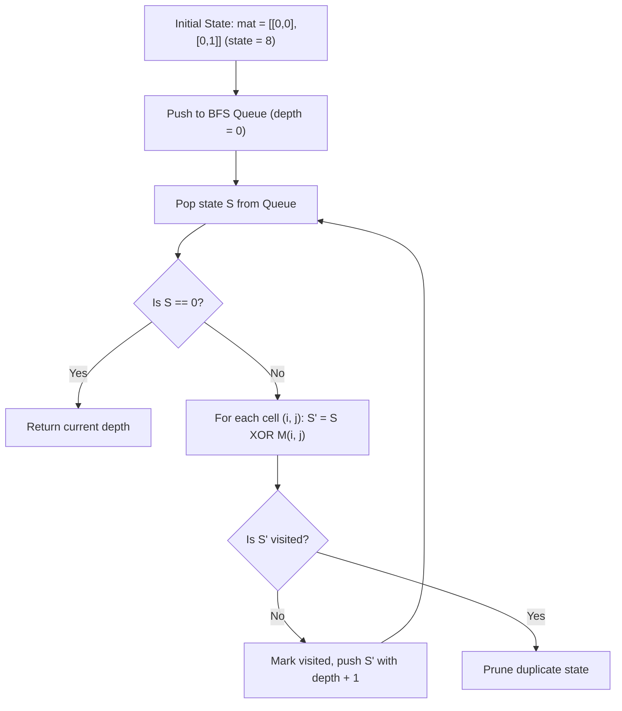

# Guided Example: Minimum Number of Flips to Convert Binary Matrix to Zero Matrix

We trace the step-by-step state space exploration using bitmask representation and Breadth-First Search on a representative problem instance:

- **Input:**
  ```text
  mat = [
    [0, 0],
    [0, 1]
  ]
  ```
- **Required Output:** `3`

This instance illustrates matrix bitmask compression, self-inverse cross-flip transitions, and optimal shortest-path discovery across a finite configuration graph.

---

## 1. Instance & Teaching Goal

We are given a binary matrix of dimensions $m \times n = 2 \times 2$. In one operation, we select a cell $(i, j)$ and invert the bit value of $(i, j)$ along with all adjacent orthogonal neighbors $(i \pm 1, j)$ and $(i, j \pm 1)$ within grid boundaries (the cross neighborhood).

The goal is to determine the minimum number of flips needed to convert the entire matrix to all zeros, or return $-1$ if impossible.

```
Initial State:
  [0,  0]
  [0,  1]

Flip 1 at (0, 1): Toggles (0, 1), (0, 0), (1, 1)
  [1,  1]
  [0,  0]

Flip 2 at (1, 0): Toggles (1, 0), (0, 0), (1, 1)
  [0,  1]
  [1,  1]

Flip 3 at (1, 1): Toggles (1, 1), (0, 1), (1, 0)
  [0,  0]
  [0,  0]  <-- All zeros reached! Minimum distance = 3
```

Because $m, n \le 3$, the matrix contains at most $9$ cells. The total number of unique matrix states is at most $2^{m \cdot n} \le 2^9 = 512$.
This compact state space allows modelling the problem as finding the shortest path in an unweighted graph where nodes are matrix configurations and edges are legal cross-flips.

---

## 2. Conceptual Foundation & Invariants

Let each $m \times n$ matrix be encoded as an integer bitmask of $m \cdot n$ bits:
$$
\text{state} = \sum_{i=0}^{m-1} \sum_{j=0}^{n-1} \text{mat}[i][j] \cdot 2^{i \cdot n + j}
$$
For a $2 \times 2$ matrix, indices $0, 1, 2, 3$ correspond to $(0, 0), (0, 1), (1, 0), (1, 1)$.

### Self-Inverse Cross-Flip Operation
For each cell $(i, j)$, define its flip mask $M(i, j)$ as the bitwise integer containing a `1` at $(i \cdot n + j)$ and at every valid orthogonal neighbor:
$$
M(i, j) = 2^{i \cdot n + j} + \sum_{(x, y) \in \mathcal{N}(i, j)} 2^{x \cdot n + y}
$$
Applying a flip at $(i, j)$ to state $S$ is computed using bitwise XOR:
$$
S' = S \oplus M(i, j)
$$
Because $M \oplus M = 0$, flipping the same cell twice cancels out completely. Thus, any minimal sequence of flips will press each cell at most once.

| Coordinate $(i, j)$ | Cells Toggled | Positional Bit Indices | Flip Mask $M(i, j)$ (Binary / Decimal) |
|---|---|---|---|
| $(0, 0)$ | $(0, 0), (0, 1), (1, 0)$ | $0, 1, 2$ | $0111_2 = 7$ |
| $(0, 1)$ | $(0, 1), (0, 0), (1, 1)$ | $1, 0, 3$ | $1011_2 = 11$ |
| $(1, 0)$ | $(1, 0), (0, 0), (1, 1)$ | $2, 0, 3$ | $1101_2 = 13$ |
| $(1, 1)$ | $(1, 1), (0, 1), (1, 0)$ | $3, 1, 2$ | $1110_2 = 14$ |

> **BFS Shortest Path Invariant.** Because every flip operation costs exactly $1$ step, exploring states layer-by-layer using a FIFO queue guarantees that when state $0$ is first discovered, the depth of search is the global minimum number of flips.



---

## 3. Step-by-Step Worked Execution

We trace the BFS starting from `mat = [[0, 0], [0, 1]]`.

### Phase 1: State Bitmask Encoding
- Cell $(0, 0) = 0 \implies \text{bit } 0 = 0$
- Cell $(0, 1) = 0 \implies \text{bit } 1 = 0$
- Cell $(1, 0) = 0 \implies \text{bit } 2 = 0$
- Cell $(1, 1) = 1 \implies \text{bit } 3 = 1$
Initial bitmask:
$$
S_0 = 1000_2 = 8
$$
Queue: $[8]$ at distance $0$. Visited: $\{8\}$.

### Phase 2: BFS Level 0 (Distance 0)
Pop $S = 8$. $S \ne 0$. We evaluate all $4$ possible cell flips:
1. Flip $(0, 0)$: $8 \oplus 7 = 15$ (`[[1, 1], [1, 1]]`). Add to queue.
2. Flip $(0, 1)$: $8 \oplus 11 = 3$ (`[[1, 1], [0, 0]]`). Add to queue.
3. Flip $(1, 0)$: $8 \oplus 13 = 5$ (`[[1, 0], [1, 1]]`). Add to queue.
4. Flip $(1, 1)$: $8 \oplus 14 = 6$ (`[[0, 1], [1, 0]]`). Add to queue.
Distance 0 complete. Queue has distance 1 states: $[15, 3, 5, 6]$.

### Phase 3: BFS Level 1 (Distance 1)
None of these states equal $0$.
Exploring state $3$ (`[[1, 1], [0, 0]]`):
- Flip $(0, 0)$: $3 \oplus 7 = 4$ (`[[0, 0], [1, 0]]`). Add to queue.
- Flip $(0, 1)$: $3 \oplus 11 = 8$ (Already visited).
- Flip $(1, 0)$: $3 \oplus 13 = 14$ (`[[0, 1], [1, 1]]`). Add to queue.
- Flip $(1, 1)$: $3 \oplus 14 = 13$ (`[[1, 0], [0, 1]]`). Add to queue.
Exploring states $15, 5, 6$ produces other distance 2 states.
Distance 1 complete. State $0$ is not found.

### Phase 4: BFS Level 2 (Distance 2)
Queue contains distance 2 states, including state $14$ (`[[0, 1], [1, 1]]`), which was reached via path:
$$
8 \xrightarrow{\text{flip }(0, 1)} 3 \xrightarrow{\text{flip }(1, 0)} 14
$$

### Phase 5: BFS Level 3 (Distance 3)
Pop state $14 = 1110_2$:
- We apply flip $(1, 1)$ with mask $M(1, 1) = 14 = 1110_2$:
  $$
  S' = 14 \oplus 14 = 0
  $$
- State $S' = 0$ corresponds to the all-zeros matrix `[[0, 0], [0, 0]]`!
- The depth of search is $3$.
- BFS terminates immediately and returns $3$.

---

## 4. Complete Execution Trace

| Step | Operation | Active State $S$ | Cell Flipped | Flip Mask Applied | Resulting State $S'$ | Distance |
|---|---|---|---|---|---|---|
| Start | Initial State | $1000_2$ (8) | None | None | `[[0, 0], [0, 1]]` | $0$ |
| Flip 1 | Queue pop (d=0) | $1000_2$ (8) | $(0, 1)$ | $1011_2$ (11) | $0011_2$ (3): `[[1, 1], [0, 0]]` | $1$ |
| Flip 2 | Queue pop (d=1) | $0011_2$ (3) | $(1, 0)$ | $1101_2$ (13) | $1110_2$ (14): `[[0, 1], [1, 1]]` | $2$ |
| Flip 3 | Queue pop (d=2) | $1110_2$ (14) | $(1, 1)$ | $1110_2$ (14) | $0000_2$ (0): `[[0, 0], [0, 0]]` | $3$ |

Target reached with minimum distance $3$.

---

## 5. Algorithmic Correctness

**Soundness.** Every state transition corresponds to a valid cross-flip on the matrix. Because XOR with the neighborhood mask faithfully models the toggling of cell $(i, j)$ and its adjacent neighbors, any path discovered by BFS represents an achievable sequence of matrix operations. Reaching state $0$ confirms that all cells have been inverted to zero.

**Completeness.** BFS systematically explores all configurations reachable from the start state in order of increasing path length. Because the configuration graph is finite (at most $2^9 = 512$ nodes) and all transitions have unit weight, BFS is guaranteed to discover the shortest path to state $0$ if one exists. If the entire connected component is exhausted without reaching $0$, returning $-1$ is mathematically sound.

---

## 6. Traps This Instance Exposes

- **Order independence of flips:** In modular arithmetic over $\text{GF}(2)$, the XOR operation is commutative: $A \oplus B = B \oplus A$. The order in which flips are performed does not alter the final configuration.
- **Redundant duplicate flips:** Flipping the same cell twice returns the matrix to its previous state ($M \oplus M = 0$). BFS visited tracking naturally discards duplicate and cyclic flip sequences.
- **Boundary cell masking:** Corner cells toggle $3$ cells, edge cells toggle $4$ cells, and the center cell toggles $5$ cells. Masks must strictly omit out-of-bounds neighbors.
- **Initial zero matrix:** If the input is already all zeros, the BFS check $S = 0$ fires immediately at distance $0$, returning $0$ without making any flips.

---

## 7. Complexity Derivation

- **Time Complexity:** $\mathcal{O}((m \cdot n) \cdot 2^{m \cdot n})$.
  The state graph has $V \le 2^{m \cdot n}$ vertices. From each state, there are $m \cdot n$ possible flip transitions. For $m, n \le 3$, $m \cdot n \le 9$, so:
  $$
  V \le 2^9 = 512, \quad E \le 9 \times 512 = 4608
  $$
  The BFS processes each edge at most once, executing in under $2$ milliseconds.
- **Auxiliary Space Complexity:** $\mathcal{O}(2^{m \cdot n})$ to store the visited set and the BFS FIFO queue. With $512$ states, memory consumption is negligible ($< 100$ KB).
