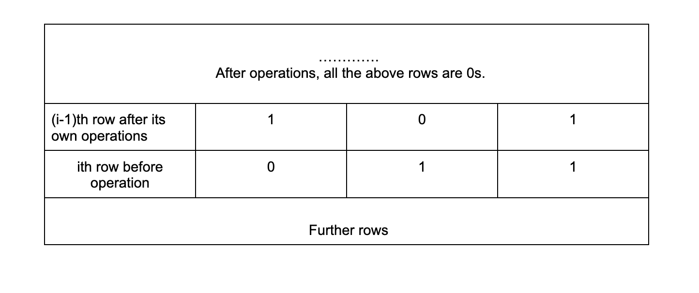
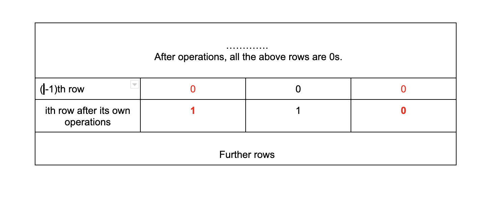

## Solution

---

### Approach 1: Smart Enumeration

#### Intuition

The question asks us to transform a 0-1 matrix into all 0s using the minimum number of flips, and when an element is flipped, all of its 4 neighbors (if they exist) will be flipped too. The problem is also known as the **Lights Out Puzzle**.

You might already realize that for each element, we only need to flip it at most once since flipping the same element twice cancels the previous flip. Because the size of the matrix is not large (at most 3 x 3 according to the constraints), we can just try all combinations of the decisions on each element (whether to flip it or not).

However, there is a better way to do the enumeration. Suppose we make each decision from the top row to the bottom row. When we're making decisions for the $i^{th}$ row, all the rows above the $(i - 1)^{th}$ row should be already be 0s, because flipping the elements in the $i^{th}$ row and below cannot change the elements above the $(i - 1)^{th}$ row. This means when we're working on the $i^{th}$ row, if there are still 1s in the $(i - 1)^{th}$ row, they can only be changed into 0 by flips on the current row. Furthermore, if there's a 0 in the $(i - 1)^{th}$ row, we shouldn't flip its neighbors in the current row. **In other words, when we're working on the $i^{th}$ row, the decisions are uniquely determined by the state of the $(i - 1)^{th}$ row.** The $i^{th}$ row's decisions needs to make the values in the $(i - 1)^{th}$ row into all 0s.

Here is an example:
<center>

</center>
<br>

After applying the decisions for the $i^{th}$ row, it changes into:
<center>

</center>
<br>

So we only need to try all the decisions for the first row (index = 0), for each such decision, the decisions for all the following rows are already determined. For each set of first-row decisions, if after applying all the decisions the values in the last row are all 0s, then it's a feasible solution. We're required to find the minimum number of flips of all feasible solutions.

#### Algorithm

Assume the input matrix is called mat[][] and it has $n$ columns. The algorithm works as follows:

1. Enumerate all the possible decisions for the first row.
2. Suppose List<Integer> `operations` is a decision for the first row. Each element is either 0 or 1, indicating whether the corresponding element in $\text{mat}[0]$ is flipped or not. We also need to maintain two binary arrays of size $n$ for each row. `lastState[]` which has values of the previous row and `changed[]` which represents whether the values in the current row are flipped when working on the previous row.
3. Initialize `lastState` = `operations` (need to transform from List<Integer> to int[]). Initialize `changed` into all 0s since the $0^{th}$ row doesn't have a previous row.
4. For each row in mat, use the next step to calculate the `state` which is initialized to `changed`.
5. For each position `j` in the range [0, n - 1] of the current row, the determined decision is $\text{lastState}[j]$, so change the value of $\text{state}[j]$ accordingly, i.e if $\text{lastState}[j]$ is 1, flip $\text{state}[j]$, $state[j - 1]$ and $state[j + 1]$ if they exist. Also, increase the counter of flips by 1.
6. Because of the current row's decision, the values that are flipped in the next row is exactly `lastState` and the decision for the next row is exactly the `state` array. So set `changed` = `lastState` and `lastState` = `state`, then move onto the next row
7. Once we complete all rows, check whether `lastState` contains all 0s to determine whether it's a feasible solution.
8. Return the minimum number of flips for all the feasible solutions that are proposed by step 1.

#### Implementation

```cpp
class Solution {
    int better(int x, int y) { return x < 0 || (y >= 0 && y < x) ? y : x; }

    int dfs(const vector<vector<int>>& mat, vector<int>& operations) {
        if (operations.size() == mat[0].size()) {
            vector<int> changed = vector<int>(mat[0].size());
            vector<int> last_state = operations;
            int maybe = 0;
            for (const vector<int>& row : mat) {
                vector<int> state = changed;
                for (int j = 0; j < row.size(); ++j) {
                    state[j] ^= row[j];
                    if (last_state[j]) {
                        state[j] ^= 1;
                        if (j) {
                            state[j - 1] ^= 1;
                        }
                        if (j + 1 < row.size()) {
                            state[j + 1] ^= 1;
                        }
                        ++maybe;
                    }
                }
                changed = last_state;
                last_state = state;
            }
            for (int x : last_state) {
                if (x) {
                    return -1;
                }
            }
            return maybe;
        }
        operations.push_back(0);
        const int maybe1 = dfs(mat, operations);
        operations.back() = 1;
        const int maybe2 = dfs(mat, operations);
        operations.pop_back();
        return better(maybe1, maybe2);
    }

public:
    int minFlips(vector<vector<int>>& mat) {
        vector<int> operations;
        return dfs(mat, operations);
    }
};
```

#### Complexity Analysis

Here, $M$ and $N$ are the number of rows and columns of the input matrix.

* Time complexity: $O(M \cdot N \cdot 2 ^ N)$.

It takes $O(2 ^ N)$ time to list all the possible decisions for the first row (index = 0). And for each such decision, it takes $O(M \cdot N)$ to further apply the uniquely determined decision for each element in the matrix. So the total time complexity is $O(M \cdot N \cdot 2 ^ N)$.

* Space complexity: $O(N)$.
We only save/reuse one Integer List of length $N$ to enumerate all possible decisions for the first row (index = 0). And only save 2 int arrays of length $N$ to further apply the uniquely determined decision for each element. So the space complexity is $O(N)$.

> It's possible to transpose the input matrix if M < N to lower the time and space complexities.

---