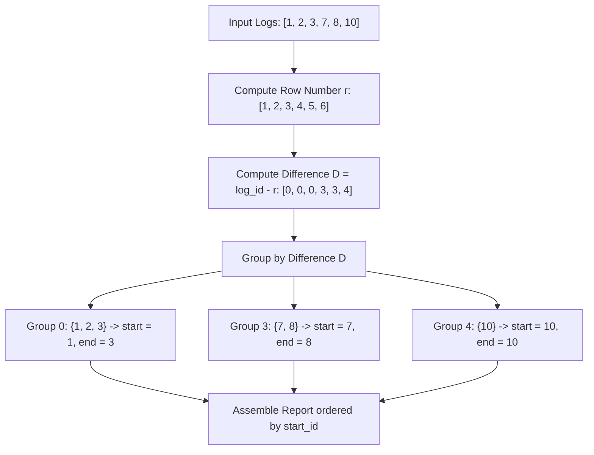

# Guided Example: Find the Start and End Number of Continuous Ranges

We trace the step-by-step resolution of a classic relational Islands-and-Gaps partitioning problem on a representative problem instance:

- **Input:**
  - `Logs` table with entries:
    $$
    \text{log\_id} \in \{1, 2, 3, 7, 8, 10\}
    $$
- **Required Output:**
  ```text
  [
    [1, 3],
    [7, 8],
    [10, 10]
  ]
  ```

This instance illustrates the difference-of-ranks technique for contiguous sequence identification, group anchor invariants, and boundary aggregation.

---

## 1. Instance & Teaching Goal

We are given a database table recording log entries with integer identifiers. While numbers in continuous runs increase strictly by $+1$ between consecutive records, missing logs introduce discontinuous gaps.

For $\text{log\_id} \in \{1, 2, 3, 7, 8, 10\}$:
- Run 1: $1, 2, 3$ forms an uninterrupted range $[1, 3]$.
- Gap: $4, 5, 6$ are missing.
- Run 2: $7, 8$ forms an uninterrupted range $[7, 8]$.
- Gap: $9$ is missing.
- Run 3: $10$ forms a singleton range $[10, 10]$.

```
Ordered Logs:    1     2     3       7     8       10
Dense Rank:      1     2     3       4     5        6
------------------------------------------------------
Difference:      0     0     0       3     3        4
Group ID:       [─── Island 1 ───]  [─ Island 2 ─]  [Island 3]
Boundaries:      min=1, max=3        min=7, max=8    min=10, max=10
```

In procedural programming, a single loop with a tracking pointer easily identifies range boundaries. In declarative relational algebra, rows are processed in parallel without stateful loops.
The teaching goal is to demonstrate the **Rank-Difference Invariant**: subtracting a consecutive rank sequence from the sorted values produces an invariant group key that uniquely clusters contiguous numbers together.

---

## 2. Conceptual Foundation & Invariants

Let the sorted sequence of log identifiers be $x_1 < x_2 < \dots < x_N$, where each $x_r$ has row number $r \in \{1, 2, \dots, N\}$.

### The Difference-of-Ranks Principle
Consider two consecutive records $x_r$ and $x_{r+1}$:
- If $x_{r+1}$ immediately succeeds $x_r$ in a contiguous run:
  $$
  x_{r+1} = x_r + 1
  $$
- The row numbers also increment by $1$:
  $$
  (r + 1) = r + 1
  $$
- Subtracting row number from value:
  $$
  x_{r+1} - (r + 1) = (x_r + 1) - (r + 1) = x_r - r
  $$

The difference $D_r = x_r - r$ remains **strictly constant** across all members of the same continuous run (island).
Conversely, when a gap of size $g \ge 1$ occurs:
$$
x_{r+1} \ge x_r + 2 \implies x_{r+1} - (r + 1) \ge (x_r + 2) - (r + 1) = (x_r - r) + 1 > D_r
$$
The difference $D$ strictly increases at every gap, creating a new unique group identifier.

| Log ID $x_r$ | Dense Row Rank $r$ | Group Key $D_r = x_r - r$ | Island Membership |
|---|---|---|---|
| $1$ | $1$ | $1 - 1 = 0$ | Island A |
| $2$ | $2$ | $2 - 2 = 0$ | Island A |
| $3$ | $3$ | $3 - 3 = 0$ | Island A |
| $7$ | $4$ | $7 - 4 = 3$ | Island B |
| $8$ | $5$ | $8 - 5 = 3$ | Island B |
| $10$ | $6$ | $10 - 6 = 4$ | Island C |

> **Rank Offset Invariant.** Two identifiers $x_a$ and $x_b$ with $a < b$ belong to the same uninterrupted contiguous sequence if and only if $x_b - x_a = b - a$, which is mathematically equivalent to $x_b - b = x_a - a$. Grouping by $(x_r - r)$ partitions the table into maximal contiguous components.



---

## 3. Step-by-Step Worked Execution

We process the dataset `[1, 2, 3, 7, 8, 10]`.

### Phase 1: Assigning Row Numbers
Sort the records by `log_id` ascending and assign 1-based sequential integers:
- Record $1 \implies r = 1$
- Record $2 \implies r = 2$
- Record $3 \implies r = 3$
- Record $7 \implies r = 4$
- Record $8 \implies r = 5$
- Record $10 \implies r = 6$

### Phase 2: Evaluating the Group Key $D = \text{log\_id} - r$
We subtract the rank from each value:
1. Entry $1$: $1 - 1 = 0$
2. Entry $2$: $2 - 2 = 0$
3. Entry $3$: $3 - 3 = 0$
   - All three entries share $D = 0$. They form the first continuous cluster.
4. Entry $7$: $7 - 4 = 3$
5. Entry $8$: $8 - 5 = 3$
   - Both entries share $D = 3$. They form the second continuous cluster.
6. Entry $10$: $10 - 6 = 4$
   - Entry forms the third cluster with $D = 4$.

### Phase 3: Aggregating Range Endpoints
For each distinct group key $D$:
- **Group $D = 0$:** Members $\{1, 2, 3\}$
  - `start_id`: $\min(1, 2, 3) = 1$
  - `end_id`: $\max(1, 2, 3) = 3$
  - Range: $[1, 3]$
- **Group $D = 3$:** Members $\{7, 8\}$
  - `start_id`: $\min(7, 8) = 7$
  - `end_id`: $\max(7, 8) = 8$
  - Range: $[7, 8]$
- **Group $D = 4$:** Member $\{10\}$
  - `start_id`: $\min(10) = 10$
  - `end_id`: $\max(10) = 10$
  - Range: $[10, 10]$

Ordering groups by `start_id` ascending produces the final table.

---

## 4. Complete Execution Trace

| Record `log_id` | Assigned Rank $r$ | Key $D = \text{log\_id} - r$ | Cluster Assignment | Cluster $\min$ (`start_id`) | Cluster $\max$ (`end_id`) |
|---|---|---|---|---|---|
| $1$ | $1$ | $0$ | Cluster A | $1$ | $3$ |
| $2$ | $2$ | $0$ | Cluster A | $1$ | $3$ |
| $3$ | $3$ | $0$ | Cluster A | $1$ | $3$ |
| $7$ | $4$ | $3$ | Cluster B | $7$ | $8$ |
| $8$ | $5$ | $3$ | Cluster B | $7$ | $8$ |
| $10$ | $6$ | $4$ | Cluster C | $10$ | $10$ |

Final Output Rows:
```text
[ [1, 3],
  [7, 8],
  [10, 10] ]
```

---

## 5. Algorithmic Correctness

**Soundness.** Suppose two records $x$ and $y$ share the same group difference $D$. Then $x - r_x = y - r_y \implies y - x = r_y - r_x$. Because the integers between $r_x$ and $r_y$ span exactly $r_y - r_x$ ranks and the table has unique identifiers, every integer between $x$ and $y$ must be present in the table. Hence, the set of numbers sharing difference $D$ forms a contiguous interval without internal holes.

**Completeness.** Suppose there is a gap between $x_r$ and $x_{r+1}$, meaning $x_{r+1} \ge x_r + 2$. Then $x_{r+1} - (r + 1) \ge x_r + 2 - r - 1 = (x_r - r) + 1 > x_r - r$. The difference values strictly separate before and after the gap. Therefore, no two distinct islands can share the same difference key, ensuring all contiguous runs are partitioned accurately.

---

## 6. Traps This Instance Exposes

- **Singleton ranges:** A single isolated number like `10` has no adjacent neighbors. The formula produces $\min = 10$ and $\max = 10$, correctly outputting $[10, 10]$ without error.
- **Duplicate identifiers:** If `log_id` had duplicates, standard row numbering would increment while the value stays the same, breaking the invariant. However, `log_id` is a primary key (unique), ensuring dense consecutive ranks.
- **Sorting order:** The problem specifies returning ranges ordered by `start_id`. Grouping without an explicit sort might return clusters in arbitrary hash order.

---

## 7. Complexity Derivation

- **Time Complexity:** $\mathcal{O}(N \log N)$, where $N$ is the number of rows in `Logs`.
  - Assigning row numbers requires sorting the $N$ records by `log_id`, taking $\mathcal{O}(N \log N)$ time.
  - Computing the difference $D_r$ takes a single linear sweep of $\mathcal{O}(N)$ operations.
  - Grouping by $D_r$ and finding $\min$ and $\max$ takes $\mathcal{O}(N)$ time using hash aggregation.
  - Total time is dominated by the sort: $\mathcal{O}(N \log N)$.
- **Auxiliary Space Complexity:** $\mathcal{O}(N)$ auxiliary memory for window partition buffers and group hash tables.
