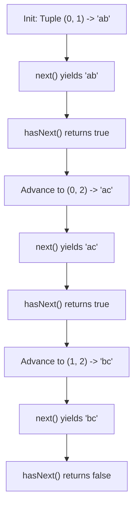

# Guided Example: Iterator for Combination

We trace the step-by-step stateful iteration over lexicographical combinations of characters on a representative problem instance:

- **Input:**
  - `characters = "abc"`
  - `combinationLength = 2`
  - Sequence of operations:
    `next()`, `hasNext()`, `next()`, `hasNext()`, `next()`, `hasNext()`
- **Required Output:**
  `["ab", true, "ac", true, "bc", false]`

This instance illustrates lexicographical combination ordering, stateful cursor progression, binary-choice search trees, and index-pointer transition mechanics.

---

## 1. Instance & Teaching Goal

We are given a string of $N$ distinct characters sorted in ascending alphabetical order and a target combination length $K \le N$. We must design an iterator that yields all distinct combinations of length $K$ in strictly increasing lexicographical order.

For `characters = "abc"` ($N = 3$) and `combinationLength = 2` ($K = 2$):
The total number of combinations is given by the binomial coefficient:
$$
\binom{N}{K} = \binom{3}{2} = 3
$$
The combinations in alphabetical order are:
1. `"ab"`
2. `"ac"`
3. `"bc"`

```
Alphabetical Character Pool: ['a', 'b', 'c'] (N = 3, K = 2)

Search Tree Branches (Left-to-Right Decision: Take or Skip):
              Root
            /      \
        Take 'a'    Skip 'a'
        /     \        │
    Take 'b'  Take 'c' Take 'b'
       │         │        │
     "ab"      "ac"    Take 'c'
                          │
                        "bc"

Chronological Yield Sequence:
  Call 1: next()    --> "ab"
  Call 2: hasNext() --> true  (remaining: "ac", "bc")
  Call 3: next()    --> "ac"
  Call 4: hasNext() --> true  (remaining: "bc")
  Call 5: next()    --> "bc"
  Call 6: hasNext() --> false (exhausted)
```

The teaching goal is to examine both the pre-generation DFS approach and the on-the-fly index odometer transition, establishing the invariants that preserve lexicographical order.

---

## 2. Conceptual Foundation & Invariants

Let $C = [c_0, c_1, \dots, c_{N-1}]$ be the sorted character sequence. Any combination of length $K$ is uniquely identified by a strictly increasing sequence of indices:
$$
0 \le p_0 < p_1 < \dots < p_{K-1} \le N - 1
$$

### Monotone Substring Ordering
Because $C$ is sorted ($c_0 < c_1 < \dots < c_{N-1}$), comparing two combinations $(p_0, \dots, p_{K-1})$ and $(q_0, \dots, q_{K-1})$ lexicographically is equivalent to comparing their index tuples lexicographically.

### Index Odometer Transition
To advance from the current index tuple $P = (p_0, p_1, \dots, p_{K-1})$ to the lexicographically next valid tuple:
1. **Find Pivot:** Locate the rightmost index $j \in [0, K - 1]$ that has not yet reached its maximum allowable position:
   $$
   p_j < N - K + j
   $$
2. **Increment Pivot:** Set $p_j \leftarrow p_j + 1$.
3. **Reset Suffix:** For all subsequent indices $m \in [j + 1, K - 1]$, reset:
   $$
   p_m \leftarrow p_{m-1} + 1
   $$

If no such index $j$ exists (i.e. $p_j = N - K + j$ for all $j$), the iterator is exhausted.

| Combination Rank | Index Tuple $(p_0, p_1)$ | Characters Emitted | Next Pivot Index $j$ | State After Pivot Step |
|---|---|---|---|---|
| $1$ | $(0, 1)$ | `"ab"` | $j = 1$ ($p_1 = 1 < 3 - 2 + 1 = 2$) | $(0, 2)$ |
| $2$ | $(0, 2)$ | `"ac"` | $j = 0$ ($p_0 = 0 < 3 - 2 + 0 = 1$) | $(1, 2)$ |
| $3$ | $(1, 2)$ | `"bc"` | None ($p_0 = 1, p_1 = 2$ at maxima) | Terminal (Exhausted) |

> **Lexicographical Sequence Invariant.** At every step, the index tuple represents the lexicographically smallest strictly increasing sequence of $K$ indices that is strictly greater than the preceding tuple. This guarantees that all $\binom{N}{K}$ combinations are produced in canonical order without omission or repetition.



---

## 3. Step-by-Step Worked Execution

We trace the six requested method invocations on `characters = "abc"`, `combinationLength = 2`.

### Initialization
- Available characters: $c_0 = \text{'a'}, c_1 = \text{'b'}, c_2 = \text{'c'}$.
- $N = 3, K = 2$.
- Maximum upper bounds for index positions:
  - Position $0$: $\text{limit}_0 = N - K + 0 = 3 - 2 + 0 = 1$.
  - Position $1$: $\text{limit}_1 = N - K + 1 = 3 - 2 + 1 = 2$.
- Initial index state: $P = (0, 1)$.

---

### Call 1: `next()`
- Current indices: $(0, 1)$.
- Formed string: $c_0 c_1 = \text{"ab"}$.
- Advance pointer to prepare the next state:
  - Check position $1$: $p_1 = 1 < \text{limit}_1 = 2$.
  - Increment position $1$: $p_1 \leftarrow 1 + 1 = 2$.
  - Updated index tuple: $(0, 2)$.
- Returned result: `"ab"`.

### Call 2: `hasNext()`
- Current index tuple is $(0, 2)$, which is valid and unconsumed.
- Returned result: `true`.

---

### Call 3: `next()`
- Current indices: $(0, 2)$.
- Formed string: $c_0 c_2 = \text{"ac"}$.
- Advance pointer to prepare the next state:
  - Check position $1$: $p_1 = 2 = \text{limit}_1$ (Cannot increment).
  - Move left to position $0$: $p_0 = 0 < \text{limit}_0 = 1$.
  - Increment position $0$: $p_0 \leftarrow 0 + 1 = 1$.
  - Reset position $1$: $p_1 \leftarrow p_0 + 1 = 1 + 1 = 2$.
  - Updated index tuple: $(1, 2)$.
- Returned result: `"ac"`.

### Call 4: `hasNext()`
- Current index tuple is $(1, 2)$, which is valid and unconsumed.
- Returned result: `true`.

---

### Call 5: `next()`
- Current indices: $(1, 2)$.
- Formed string: $c_1 c_2 = \text{"bc"}$.
- Advance pointer to prepare the next state:
  - Check position $1$: $p_1 = 2 = \text{limit}_1$.
  - Check position $0$: $p_0 = 1 = \text{limit}_0$.
  - Both positions are at their theoretical maximum. No further advance is possible.
  - State marked as exhausted.
- Returned result: `"bc"`.

### Call 6: `hasNext()`
- State is exhausted. No remaining combinations.
- Returned result: `false`.

---

## 4. Complete Execution Trace

| Operation Call | Active Tuple $(p_0, p_1)$ | Formed String | Status of HasNext | Output Returned |
|---|---|---|---|---|
| `next()` | $(0, 1)$ | `"ab"` | `true` | `"ab"` |
| `hasNext()` | $(0, 2)$ | - | `true` | `true` |
| `next()` | $(0, 2)$ | `"ac"` | `true` | `"ac"` |
| `hasNext()` | $(1, 2)$ | - | `true` | `true` |
| `next()` | $(1, 2)$ | `"bc"` | `false` | `"bc"` |
| `hasNext()` | Terminal | - | `false` | `false` |

---

## 5. Algorithmic Correctness

**Soundness.** Every returned string is composed of exactly $K$ characters chosen from `characters` with strictly increasing indices $p_0 < p_1 < \dots < p_{K-1}$. Since the input string consists of distinct characters in sorted order, every returned string is a valid combination of length $K$. Because advancing from $P$ to $P'$ changes the rightmost possible index to its next smallest allowable value and resets subsequent indices to their minimum valid configuration, each combination is strictly greater than the previous one and minimal among all greater candidates.

**Completeness.** The total number of valid strictly increasing index sequences of length $K$ drawn from $\{0, \dots, N-1\}$ is $\binom{N}{K}$. The transition rule defines an Eulerian path through the poset of combinations, visiting every state before terminating. Thus, no combination is skipped.

---

## 6. Traps This Instance Exposes

- **Exhaustion check timing:** Checking `hasNext()` after yielding the final combination `"bc"` must accurately return `false`. Transitioning indices during `next()` ensures that the iterator knows in advance whether another valid tuple exists.
- **Lexicographical order violations:** If pre-generating combinations via recursive DFS, the search must explore the "include current character" branch before the "skip current character" branch to preserve alphabetical sequence.
- **Suffix reset rule:** When position $j$ is incremented, all positions to its right must be reset to $p_{m} = p_{m-1} + 1$. Failing to reset positions to the left-aligned minimum would skip combinations (e.g. going from $(0, 2)$ directly to $(1, 3)$ instead of $(1, 2)$).

---

## 7. Complexity Derivation

- **Time Complexity:**
  - **Initialization:** $\mathcal{O}(K)$ to establish the initial index tuple $(0, 1, \dots, K-1)$ (or $\mathcal{O}(\binom{N}{K} \cdot K)$ if pre-generating all combinations).
  - **`next()`:** $\mathcal{O}(K)$ amortized. Finding the pivot index takes at most $K$ steps, and resetting the suffix takes at most $K$ steps. Constructing the output string of length $K$ takes $\mathcal{O}(K)$ time.
  - **`hasNext()`:** $\mathcal{O}(1)$ constant-time flag or index comparison.
- **Auxiliary Space Complexity:** $\mathcal{O}(K)$ auxiliary memory for on-the-fly index maintenance, or $\mathcal{O}(\binom{N}{K} \cdot K)$ if storing the complete list of generated strings. For $N \le 15$, $\binom{15}{7} \le 6435$, fitting comfortably in memory under both implementations.
