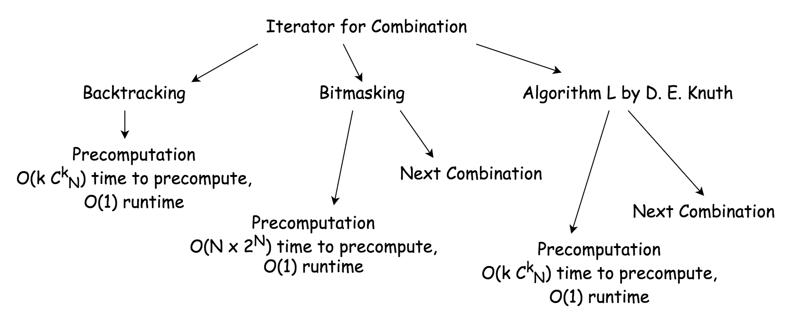
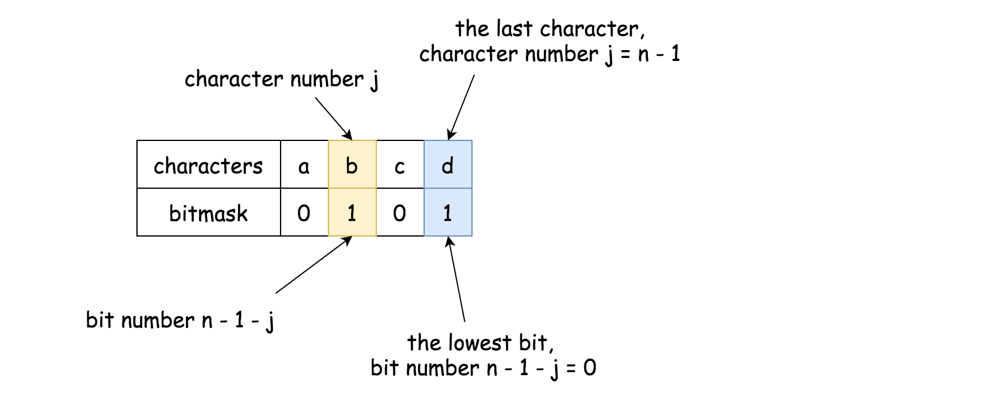
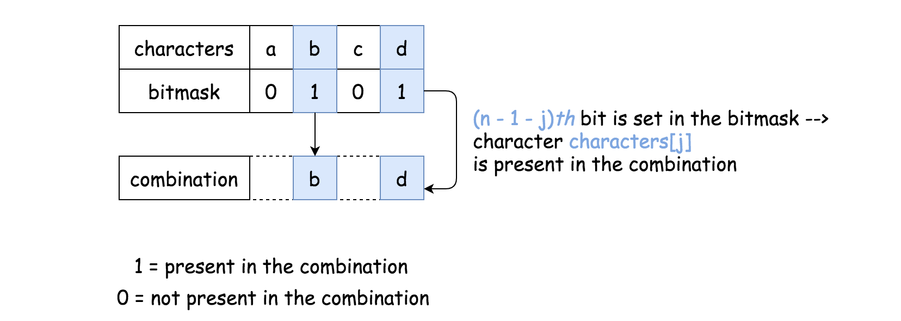
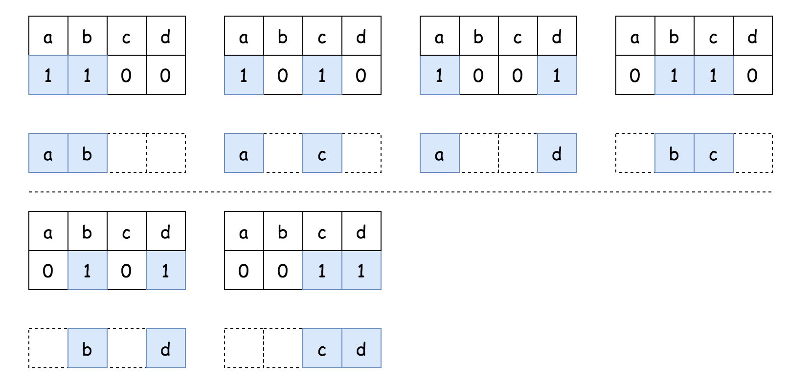
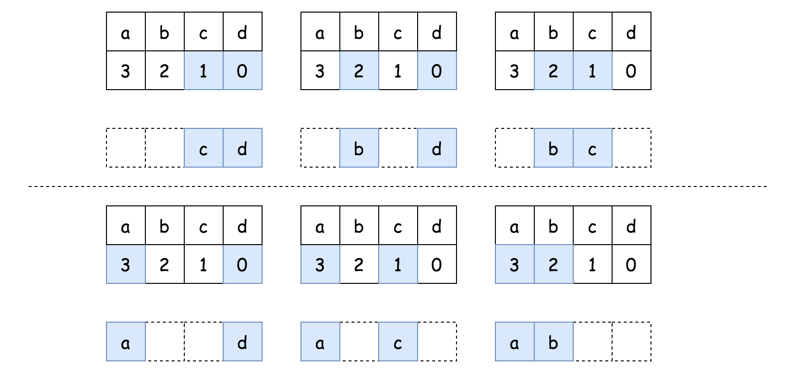
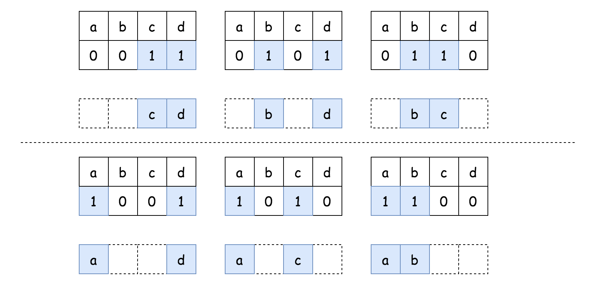
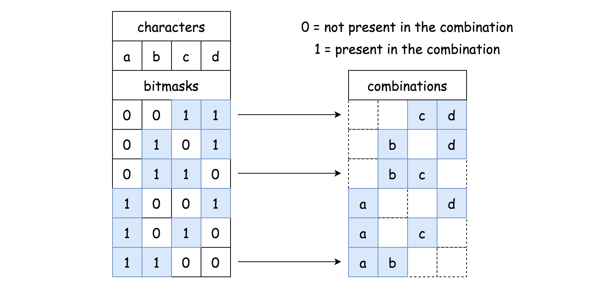
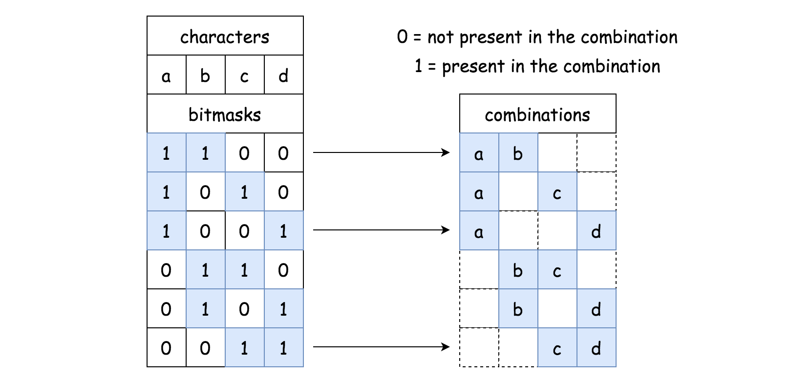
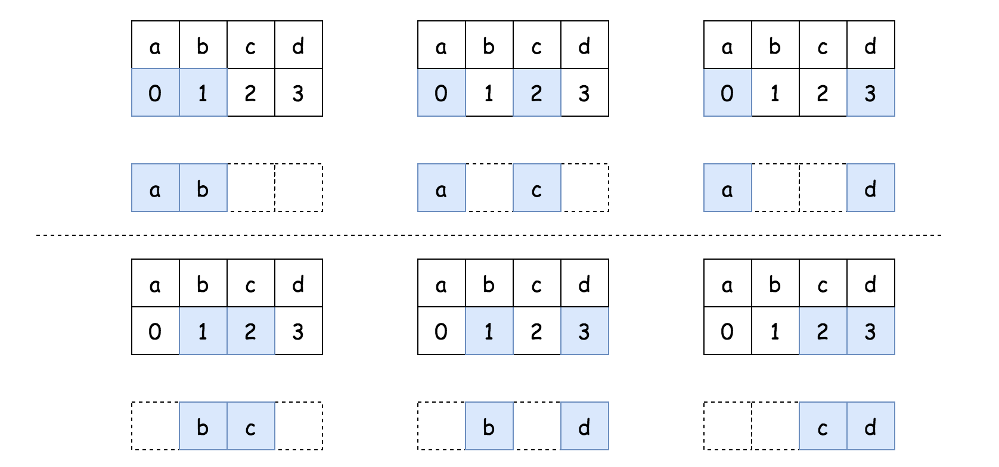

[TOC]

## Solution

---

### Disclaimer

This is a review article, and the goal is to propose 5 different solutions and to discuss a possible interview strategy. If you'd like to read a more detailed explanation of each solution, please check the following articles:

[Combinations](https://leetcode.com/articles/combinations/).

[Subsets](https://leetcode.com/articles/subsets/).

#### Precomputation or Next Combination: Why It's Risky to Use Backtracking

The interpretation of this problem depends on the interviewer. There are three possible scenarios:

- You could be asked to implement $\mathcal{O}(1)$ runtime by precomputing all the combinations.

- Or, you could be asked to save space, use no pre-computation, and implement the `nextCombination` function to generate each new combination from the previous one during the runtime.

- Or, the interviewer could let you choose one of the problems above and then ask you to implement the second one as a follow-up.

That's why it's a risky strategy [to compute combinations using standard backtacking](https://leetcode.com/articles/combinations/).
To precompute all the combinations using backtracking is doable.

```python
class CombinationIterator:
    def __init__(self, characters: str, combinationLength: int):
        self.combinations = []
        n, k = len(characters), combinationLength

        def backtrack(first = 0, curr = []):
            # if the combination is done
            if len(curr) == k:
                self.combinations.append(''.join(curr[:]))
                # speed up by non-constructing combinations
                # with more than k elements
                return
            for i in range(first, n):
                # add i into the current combination
                curr.append(characters[i])
                # use next integers to complete the combination
                backtrack(i + 1, curr)
                # backtrack
                curr.pop()

        backtrack()
        self.combinations.reverse()

    def next(self) -> str:
        return self.combinations.pop()

    def hasNext(self) -> bool:
        return self.combinations
```

As a follow-up, you could be asked to rewrite your algorithm by implementing `nextCombination` function, and that could be quite stressful during the interview if you choose backtracking.

#### Overview: Bitmasking and Algorithm L

In this article, we're going to consider Bitmasking and Algorithm L. These two approaches could be easily used both for the precomputation, and the `nextCombination` function.



**Bitmasking**

It's more simple to generate numbers than combinations. So let us generate numbers, and then use their binary representations, bitmasks.

The idea is that we map each bitmask of length n to a combination. Each bit is mapped to a character, the lowest bit to the last character, the highest bit - to the first character.



The character $\text{characters}[i]$ is present in the combination if bit at the $n - 1 - i$*th* position is set.



$$
(1111)_2 - abcd \\
(0011)_2 - cd \\
(0101)_2 - bd \\
(0110)_2 - bc \\
(1001)_2 - ad \\
(1010)_2 - ac \\
(1100)_2 - ab
$$



In this article, we're going to keep the bitmasking approach as simple as possible, having $\mathcal{O}(2^N \cdot N)$ time complexity for the precomputation case.

**Algorithm L by D. E. Knuth**



Algorithm L is an efficient BFS approach to generate lexicographic (_i.e._ binary sorted) combinations. It works by generating the combinations of indexes.

The advantage of this algorithm is that it "jumps" from one combination to another instead of brute-forcing $2^N$ bitmasks. In total, there are $C^k_N$ combinations of length $k$, and hence one needs $\mathcal{O}(k C_N^k)$ time for the precomputation.

> This approach is better than simple bitmasking: $\mathcal{O}(k C_N^k)$ vs $\mathcal{O}(2^N \cdot N)$.

<br/>
<br/>

---
### Approach 1: Bitmasking: Precomputation



**Algorithm**

- Generate all possible binary bitmasks of length $n$: from $0$ to $2^n - 1$.

- Use bitmasks with $k$ set bits to generate combinations with $k$ elements. If the $n - 1 - j$*th* bit is set in the bitmask, it indicates the presence of the character $\text{characters}[j]$ in the combination, and vice versa.

>Bit manipulation trick.
To test if the `i`*th* bit is set in the bitmask, check the following: $bitmask \& (1 << i) \neq 0$. It shifts the first 1-bit i positions to the left and then uses logical AND operation to eliminate all bits from bitmask but `i`*th*. Hence, the result is nonzero only if `i`*th* bit is set in the bitmask.

- Now you have all combinations precomputed. Pop them out one
by one at each request.



**Implementation**

```python
class CombinationIterator:
    def __init__(self, characters: str, combinationLength: int):
        self.combinations = []
        n, k = len(characters), combinationLength

        # generate bitmasks from 0..00 to 1..11
        for bitmask in range(1 << n):
            # use bitmasks with k 1-bits
            if bin(bitmask).count('1') == k:
                # convert bitmask into combination
                # 111 --> "abc", 000 --> ""
                # 110 --> "ab", 101 --> "ac", 011 --> "bc"
                curr = [characters[j] for j in range(n) if bitmask & (1 << n - j - 1)]
                self.combinations.append(''.join(curr))

    def next(self) -> str:
        return self.combinations.pop()

    def hasNext(self) -> bool:
        return self.combinations
```

**Complexity Analysis**

- Time Complexity:
- $\mathcal{O}(2^N \cdot N)$ to generate $2^N$ bitmasks and then count a number of bits set in each bitmask in $\mathcal{O}(N)$ time.

- $\mathcal{O}(1)$ runtime, _i.e._ for each `next()` call.

- Space Complexity: $\mathcal{O}(k \cdot C_N^k)$ to keep $C_N^k$ combinations of length $k$.

<br/>
<br/>

---
### Approach 2: Bitmasking: Next Combination


During pre-computation, we've generated combinations in the _descending_ order. That was done to pop them out later in the _ascending_ order easily.

> For the runtime generation at each `next()` call, the strategy should be changed: the combinations should be generated directly in _ascending_ order.

**Algorithm**

- Start from the "highest" bitmask:
$1^{(k)}0^{(n - k)} = \underbrace{1...1}_\text{k times} \space \underbrace{0...0}_\text{n-k times}$.

- At each step, generate a combination out of the current bitmask. If the $n - 1 - j$*th* bit is set in the bitmask, that means the presence of the character $\text{characters}[j]$ in the combination, and vice versa.

- Generate the next bitmask. Decrease bitmask gradually till you meet a bitmask with exactly $k$ set bits.



**Implementation**

```python
class CombinationIterator:
    def __init__(self, characters: str, combinationLength: int):
        self.n = n = len(characters)
        self.k = k = combinationLength
        self.chars = characters

        # generate first bitmask 1(k)0(n - k)
        self.b = (1 << n) - (1 << n - k)

    def next(self) -> str:
        # convert bitmasks into combinations
        # 111 --> "abc", 000 --> ""
        # 110 --> "ab", 101 --> "ac", 011 --> "bc"
        curr = [self.chars[j] for j in range(self.n) if self.b & (1 << self.n - j - 1)]

        # generate next bitmask
        self.b -= 1
        while self.b > 0 and bin(self.b).count('1') != self.k:
            self.b -= 1

        return ''.join(curr)

    def hasNext(self) -> bool:
        return self.b > 0
```

**Complexity Analysis**

- Time Complexity: $\mathcal{O}(2^N \cdot N / C_N^k)$ in average.
To generate $C_N^k$ combinations, one has to parse $2^N$ bitmasks and to check the number of bits set in each bitmask, which makes an average computation cost per combination to be equal to $\mathcal{O}(2^N \cdot N / C_N^k)$.

- Space Complexity: $\mathcal{O}(k)$ to keep the current combination of
length $k$.

<br/>
<br/>

---
### Approach 3: Algorithm L by D. E. Knuth: Lexicographic Combinations: Precomputation

Algorithm L is an efficient BFS that generates one by one the _combinations of indexes_. Here is how it works:


$$
3210 - abcd \\
01 - cd \\
02 - bd \\
12 - bc \\
03 - ad \\
13 - ac \\
23 - ab \\
$$

**Algorithm**

The algorithm is quite straightforward:

- Initialize `nums` to be a list of integers from $0$ to $k$. Add $n$ as the last element. It serves as a sentinel. Set the pointer at the beginning of the list $j = 0$.

- While `j < k`:

- Convert the first $k$ elements (_i.e._ all elements but the sentinel) from `nums` into the combination to save.

- Find the first number in `nums` such that $nums[j + 1] \neq \text{nums}[j] + 1$ and increase it by one $\text{nums}[j] += 1$ to move to the next combination.

- Now you have all combinations precomputed. Pop them out one by one at each request.

```python
class CombinationIterator:
    def __init__(self, characters: str, combinationLength: int):
        self.combinations = []
        n, k = len(characters), combinationLength

        # init the first combination
        nums = list(range(k)) + [n]

        j = 0
        while j < k:
            # add current combination
            curr = [characters[n - 1 - nums[i]] for i in range(k - 1, -1, -1)]
            self.combinations.append(''.join(curr))

            # Generate next combination.
            # Find the first j such that nums[j] + 1 != nums[j + 1].
            # Increase nums[j] by one.
            j = 0
            while j < k and nums[j + 1] == nums[j] + 1:
                nums[j] = j
                j += 1
            nums[j] += 1

    def next(self) -> str:
        return self.combinations.pop()

    def hasNext(self) -> bool:
        return self.combinations
```

**Complexity Analysis**

- Time Complexity: $\mathcal{O}(k \times C_N^k)$ for the precomputation and $\mathcal{O}(1)$ during the runtime, i.e. for each `next()` call. The algorithm generates a new combination from the previous one in $\mathcal{O}(k)$ time and then uses $\mathcal{O}(k)$ time to save it for later usage. In total, there are $C_N^k$ combinations, that make precomputation time complexity to be equal to $\mathcal{O}(k \times C_N^k)$. Runtime complexity is $\mathcal{O}(1)$.

- Space Complexity: $\mathcal{O}(k \times C_N^k)$ to keep $C_N^k$ combinations of length $k$.

<br/>
<br/>

---
### Approach 4: Algorithm L by D. E. Knuth: Lexicographic Combinations: Next Combination

> For the runtime generation, the strategy should be changed: the combinations will be generated directly in the _ascending_ order.



**Algorithm**

- Initialize `nums` as a list of integers from $0$ to $k$.

- At each step:

- Convert nums into the combination to save.

- Generate the next combination:

- Set the pointer at the end of the list $j = k - 1$.

- Find the greatest j, where j < k, such that $\text{nums}[j] \neq n - k + j$
        and increase $\text{nums}[j]$ by one $\text{nums}[j] += 1$.

- Set $\text{nums}[i] = \text{nums}[j] + i - j$ for
        every `i` in range $(j + 1, k)$ to move to the next combination.

**Implementation**

```python
class CombinationIterator:
    def __init__(self, characters: str, combinationLength: int):
        self.n = len(characters)
        self.k = k = combinationLength
        self.chars = characters

        # init the first combination
        self.nums = list(range(k))
        self.has_next = True

    def next(self) -> str:
        nums = self.nums
        n, k = self.n, self.k
        curr = [self.chars[j] for j in nums]

        # Generate next combination.
        # Find the first j such that nums[j] != n - k + j.
        # Increase nums[j] by one.
        j = k - 1
        while j >= 0 and nums[j] == n - k + j:
            j -= 1
        nums[j] += 1

        if j >= 0:
            for i in range(j + 1, k):
                nums[i] = nums[j] + i - j
        else:
            self.has_next = False

        return ''.join(curr)

    def hasNext(self) -> bool:
        return self.has_next
```

**Complexity Analysis**

- Time Complexity: $\mathcal{O}(k)$ both for `init()` and `next()` functions. The algorithm generates a new combination from the previous one in $\mathcal{O}(k)$ time.

- Space Complexity: $\mathcal{O}(k)$ to keep the current combination of length $k$.

<br/>
<br/>