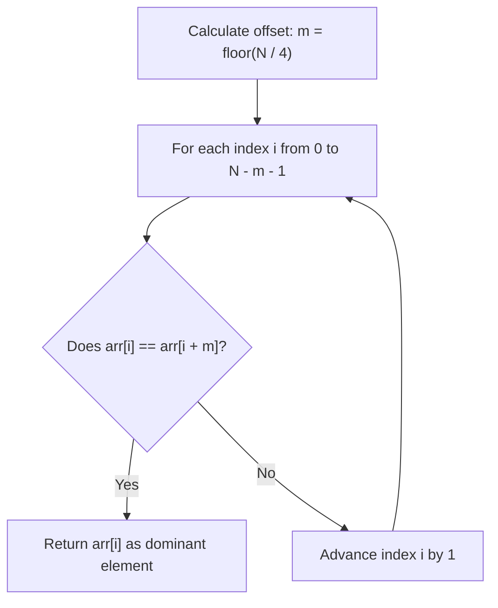

# Guided Example: Element Appearing More Than 25% In Sorted Array

We trace the step-by-step detection of a dominant frequency element in a sorted sequence on a representative problem instance:

- **Input:** `arr = [1, 2, 2, 6, 6, 6, 6, 7, 10]`
- **Required Output:** `6`

This instance illustrates contiguous run clustering in sorted arrays, windowed stride sampling, and the Pigeonhole Principle on quartiles.

---

## 1. Instance & Teaching Goal

We are given an array of $N = 9$ integers sorted in non-decreasing order. Exactly one integer occurs strictly more than $25\%$ of the time:
$$
\text{Threshold} = \frac{N}{4} = \frac{9}{4} = 2.25 \implies \text{Count} \ge 3
$$

Frequency distribution of values:
- Value $1$: $1$ occurrence
- Value $2$: $2$ occurrences
- Value $6$: $4$ occurrences ($4 > 2.25$, valid)
- Value $7$: $1$ occurrence
- Value $10$: $1$ occurrence

```
Index:    0    1    2    3    4    5    6    7    8
Value:  [ 1 ][ 2 ][ 2 ][ 6 ][ 6 ][ 6 ][ 6 ][ 7 ][ 10 ]
                        └───────────────┘
                        Span of 4 entries (>= 3)

Stride Test with offset m = floor(9 / 4) = 2:
  i = 0: arr[0] = 1, arr[2] = 2  -->  1 != 2
  i = 1: arr[1] = 2, arr[3] = 6  -->  2 != 6
  i = 2: arr[2] = 2, arr[4] = 6  -->  2 != 6
  i = 3: arr[3] = 6, arr[5] = 6  -->  6 == 6  ==> Match Found!
```

A generic hash map counting frequencies requires $\mathcal{O}(N)$ additional heap memory and does not exploit the sorted property.
The optimal method exploits the fact that sorted duplicates form a contiguous block: if an element spans more than $N / 4$ elements, its endpoints at offset $m = \lfloor N / 4 \rfloor$ must match.

---

## 2. Conceptual Foundation & Invariants

Let the array length be $N$. Define the offset stride:
$$
m = \lfloor N / 4 \rfloor
$$
Any element appearing strictly more than $N / 4$ times occurs at least $m + 1$ times.

### Contiguous Cluster Span Invariant
Because the array is sorted, all occurrences of any value $x$ are clustered contiguously into an index range $[L, R]$ of length:
$$
\text{length} = R - L + 1 \ge m + 1
$$
This implies that $R - L \ge m$.
Therefore, for the starting index $L$ of the run:
$$
\text{arr}[L] = \text{arr}[L + m] = x
$$

Conversely, if $\text{arr}[i] = \text{arr}[i + m]$ for any index $i$, then by sorted monotonicity:
$$
\text{arr}[i] \le \text{arr}[i+1] \le \dots \le \text{arr}[i+m] = \text{arr}[i]
$$
Every element in between must be identical to $\text{arr}[i]$, proving that the value appears at least $m + 1 > N / 4$ times.

| Index $i$ | Stride Index $i + m$ ($m = 2$) | Value $\text{arr}[i]$ | Value $\text{arr}[i + m]$ | Equality Check: $\text{arr}[i] == \text{arr}[i + m]$ |
|---|---|---|---|---|
| $0$ | $2$ | $1$ | $2$ | False |
| $1$ | $3$ | $2$ | $6$ | False |
| $2$ | $4$ | $2$ | $6$ | False |
| $3$ | $5$ | $6$ | $6$ | True $\implies$ Dominant element identified |

> **Window Stride Invariant.** In a non-decreasing array, checking whether the element at index $i$ equals the element at index $i + \lfloor N / 4 \rfloor$ guarantees that at least $\lfloor N / 4 \rfloor + 1$ identical values occupy that window, proving the $> 25\%$ dominance condition immediately.



---

## 3. Step-by-Step Worked Execution

For `arr = [1, 2, 2, 6, 6, 6, 6, 7, 10]` with $N = 9$:
$$
m = \lfloor 9 / 4 \rfloor = 2
$$
We slide a window of span $m = 2$ starting from $i = 0$.

### Iteration 1 ($i = 0$)
- Compare $\text{arr}[0]$ and $\text{arr}[0 + 2] = \text{arr}[2]$:
  - $\text{arr}[0] = 1$
  - $\text{arr}[2] = 2$
  - $1 \ne 2 \implies$ Not dominant.

### Iteration 2 ($i = 1$)
- Compare $\text{arr}[1]$ and $\text{arr}[1 + 2] = \text{arr}[3]$:
  - $\text{arr}[1] = 2$
  - $\text{arr}[3] = 6$
  - $2 \ne 6 \implies$ Not dominant.

### Iteration 3 ($i = 2$)
- Compare $\text{arr}[2]$ and $\text{arr}[2 + 2] = \text{arr}[4]$:
  - $\text{arr}[2] = 2$
  - $\text{arr}[4] = 6$
  - $2 \ne 6 \implies$ Not dominant.

### Iteration 4 ($i = 3$)
- Compare $\text{arr}[3]$ and $\text{arr}[3 + 2] = \text{arr}[5]$:
  - $\text{arr}[3] = 6$
  - $\text{arr}[5] = 6$
  - $6 = 6 \implies$ Match confirmed!

Since $\text{arr}[3] = \text{arr}[5] = 6$, sorted ordering guarantees $\text{arr}[4] = 6$. The window $[3 \dots 5]$ contains $3$ identical elements, satisfying $3 > 9 / 4 = 2.25$.
Evaluation terminates immediately, returning $6$.

---

## 4. Complete Execution Trace

| Inspection Step | Window Range $[i \dots i + m]$ | Left Value $\text{arr}[i]$ | Right Value $\text{arr}[i + m]$ | Window Equality | Action Taken |
|---|---|---|---|---|---|
| 1 | $[0 \dots 2]$ | $1$ | $2$ | False | Advance $i$ |
| 2 | $[1 \dots 3]$ | $2$ | $6$ | False | Advance $i$ |
| 3 | $[2 \dots 4]$ | $2$ | $6$ | False | Advance $i$ |
| 4 | $[3 \dots 5]$ | $6$ | $6$ | True | Terminate: Return $6$ |

---

## 5. Algorithmic Correctness

**Soundness.** Let $i$ be an index where $\text{arr}[i] = \text{arr}[i + m]$. Because `arr` is non-decreasing, for all $j$ with $i \le j \le i + m$, $\text{arr}[i] \le \text{arr}[j] \le \text{arr}[i + m] = \text{arr}[i]$, forcing $\text{arr}[j] = \text{arr}[i]$. The number of identical elements in this sub-array is $(i + m) - i + 1 = m + 1 = \lfloor N / 4 \rfloor + 1 > N / 4$. Thus, the value occurs strictly more than $25\%$ of the time.

**Completeness.** By problem guarantee, there exists a unique value $x$ whose total occurrences $C$ satisfy $C \ge \lfloor N / 4 \rfloor + 1 = m + 1$. Because all occurrences of $x$ appear as a contiguous block $[L, R]$ with $R - L + 1 \ge m + 1$, setting $i = L$ gives $i + m = L + m \le R$, which guarantees $\text{arr}[i] = \text{arr}[i + m] = x$. The scan will inevitably encounter index $L$ and terminate.

---

## 6. Traps This Instance Exposes

- **Floating-point rounding errors:** Testing $C > 0.25 \times N$ with floating-point arithmetic can introduce rounding precision problems. Using integer arithmetic $\lfloor N / 4 \rfloor$ guarantees exact boundary testing.
- **Array bounds on stride:** The inspection loop must terminate at $i \le N - 1 - m$ to avoid out-of-bounds indexing.
- **Short arrays:** For small arrays like $N = 2$, $m = \lfloor 2 / 4 \rfloor = 0$. The check $\text{arr}[0] == \text{arr}[0]$ triggers immediately, correctly handling minimal arrays.

---

## 7. Complexity Derivation

- **Time Complexity:** $\mathcal{O}(N)$ in the worst-case linear stride scan.
  Because the dominant element occupies more than $25\%$ of the array, the search terminates after at most $\lfloor 3N / 4 \rfloor$ comparisons.
  *(Note: An alternative binary search on the three quartile candidates $N/4, N/2, 3N/4$ achieves $\mathcal{O}(\log N)$ time).*
- **Auxiliary Space Complexity:** $\mathcal{O}(1)$. Memory is limited to a constant number of integer registers holding $N, m$, and loop cursor $i$.
