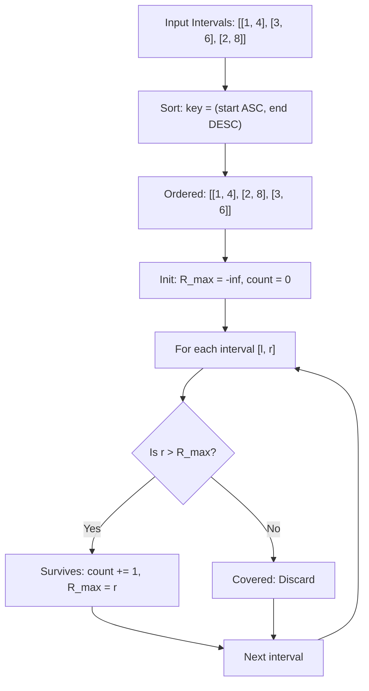

# Guided Example: Remove Covered Intervals

We trace the step-by-step sorting and greedy linear scan eliminating covered intervals on a representative problem instance:

- **Input:** `intervals = [[1, 4], [3, 6], [2, 8]]`
- **Required Output:** `2`

This instance illustrates custom lexicographical sorting by ascending start and descending end coordinates, running boundary tracking, and interval containment elimination.

---

## 1. Instance & Teaching Goal

An interval $[a, b]$ is defined as covered by $[c, d]$ if and only if:
$$
c \le a \quad \land \quad b \le d
$$

In `intervals = [[1, 4], [3, 6], [2, 8]]`:
- Interval $[3, 6]$ satisfies $2 \le 3$ and $6 \le 8$, so it is completely covered by $[2, 8]$.
- Interval $[1, 4]$ is not covered by any other interval ($1 < 2$).
- Interval $[2, 8]$ is not covered by any other interval ($8 > 4$).
After removing the covered interval $[3, 6]$, exactly $2$ intervals remain: $[1, 4]$ and $[2, 8]$.

```
Original Intervals:
  [1 ─────── 4]
       [2 ─────────────────── 8]
             [3 ─────── 6]  <-- Completely inside [2, 8]!

Custom Sorted Order (Start ASC, End DESC):
  1. [1, 4]  --> Sets running right horizon = 4
  2. [2, 8]  --> End 8 > 4 (Uncovered! Horizon becomes 8)
  3. [3, 6]  --> End 6 <= 8 (Covered by [2, 8]! Discarded)

Remaining Count: 2
```

An all-pairs quadratic comparison requires $\mathcal{O}(N^2)$ checks.
The optimal strategy sorts intervals using a specialized tie-breaking rule, reducing containment checks to a single running maximum sweep in $\mathcal{O}(N \log N)$ time.

---

## 2. Conceptual Foundation & Invariants

We sort intervals by two criteria:
1. **Primary Key:** Start point $l_i$ in ascending order.
2. **Secondary Key (Tie-breaker):** End point $r_i$ in **descending** order.

### Why Secondary Descending Order is Crucial
If two intervals share the exact same start point (e.g. $[1, 4]$ and $[1, 2]$), sorting the larger end first places $[1, 4]$ ahead of $[1, 2]$. When $[1, 2]$ is evaluated, its end $2$ is already $\le 4$, correctly identifying $[1, 2]$ as covered by $[1, 4]$.

### Single-Pass Horizon Tracking
After sorting, consider interval $i$ with boundaries $[l_i, r_i]$ and let $R_{\max}$ be the maximum end point among all previously accepted intervals:
- Since start points are sorted ($l_{\text{prev}} \le l_i$), any previously accepted interval already satisfies the left containment condition $l_{\text{prev}} \le l_i$.
- Therefore, interval $i$ is covered by an earlier interval if and only if:
  $$
  r_i \le R_{\max}
  $$
- If $r_i > R_{\max}$, interval $i$ extends strictly further to the right than all preceding intervals. It cannot be covered by any preceding interval (or any subsequent interval, since future intervals start at $l \ge l_i$). Thus, interval $i$ must survive, and we update $R_{\max} \leftarrow r_i$.

| Sorting Rank | Interval $[l_i, r_i]$ | Previous Horizon $R_{\max}$ | Condition $r_i > R_{\max}$ | Decision | Updated $R_{\max}$ | Surviving Count |
|---|---|---|---|---|---|---|
| $1$ | $[1, 4]$ | $-\infty$ | $4 > -\infty$ (True) | Retain (Uncovered) | $4$ | $1$ |
| $2$ | $[2, 8]$ | $4$ | $8 > 4$ (True) | Retain (Uncovered) | $8$ | $2$ |
| $3$ | $[3, 6]$ | $8$ | $6 > 8$ (False) | Discard (Covered) | $8$ | $2$ |

> **Monotone Horizon Invariant.** In the sorted sequence, an interval is covered if and only if its end coordinate is less than or equal to the maximum right endpoint seen so far ($r_i \le R_{\max}$).



---

## 3. Step-by-Step Worked Execution

We process `intervals = [[1, 4], [3, 6], [2, 8]]`.

### Phase 1: Custom Lexicographical Sorting
We sort elements by $(l_i, -r_i)$:
- Interval $[1, 4] \implies \text{key } (1, -4)$
- Interval $[3, 6] \implies \text{key } (3, -6)$
- Interval $[2, 8] \implies \text{key } (2, -8)$

Sorting keys in ascending order:
$$
(1, -4) < (2, -8) < (3, -6)
$$
Resulting ordered list:
$$
\text{intervals} = [[1, 4], [2, 8], [3, 6]]
$$

### Phase 2: Greedy Sweep

#### Step 1: Interval $[1, 4]$
- Current interval: $[l, r] = [1, 4]$
- Compare $r = 4$ against $R_{\max} = -\infty$:
  - $4 > -\infty \implies$ Condition satisfied.
- Action: Retain interval.
- Update state:
  $$
  \text{count} \leftarrow 0 + 1 = 1, \quad R_{\max} \leftarrow 4
  $$

#### Step 2: Interval $[2, 8]$
- Current interval: $[l, r] = [2, 8]$
- Compare $r = 8$ against $R_{\max} = 4$:
  - $8 > 4 \implies$ Condition satisfied.
- Action: Retain interval.
- Update state:
  $$
  \text{count} \leftarrow 1 + 1 = 2, \quad R_{\max} \leftarrow 8
  $$

#### Step 3: Interval $[3, 6]$
- Current interval: $[l, r] = [3, 6]$
- Compare $r = 6$ against $R_{\max} = 8$:
  - $6 \le 8 \implies$ Interval $[3, 6]$ is completely covered by the earlier interval that established $R_{\max} = 8$ (namely $[2, 8]$, since $2 \le 3$ and $6 \le 8$).
- Action: Discard interval.
- State remains:
  $$
  \text{count} = 2, \quad R_{\max} = 8
  $$

All intervals have been evaluated. Final answer: $2$.

---

## 4. Complete Execution Trace

| Processing Index | Interval Evaluated | Start $l_i$ | End $r_i$ | Horizon $R_{\max}$ | Comparison Test | Decision | Surviving Total |
|---|---|---|---|---|---|---|---|
| Init | - | - | - | $-\infty$ | - | - | $0$ |
| 1 | $[1, 4]$ | $1$ | $4$ | $-\infty$ | $4 > -\infty$ | Retained | $1$ |
| 2 | $[2, 8]$ | $2$ | $8$ | $4$ | $8 > 4$ | Retained | $2$ |
| 3 | $[3, 6]$ | $3$ | $6$ | $8$ | $6 \le 8$ | Discarded | $2$ |

---

## 5. Algorithmic Correctness

**Soundness.** Suppose an interval $[l_i, r_i]$ satisfies $r_i \le R_{\max}$. By definition of $R_{\max}$, there exists an earlier processed interval $[l_j, r_j]$ with $j < i$ such that $r_j = R_{\max} \ge r_i$. By sorted order, $l_j \le l_i$. Thus, $[l_j, r_j]$ covers $[l_i, r_i]$ on both ends, proving the discarded interval is indeed covered.

**Completeness.** Suppose an interval satisfies $r_i > R_{\max}$.
1. No earlier interval can cover it, because all earlier intervals have endpoints $\le R_{\max} < r_i$.
2. No later interval can cover it, because all later intervals have start points $l_k \ge l_i$ (and if $l_k = l_i$, descending end order guarantees $r_k \le r_i$).
Therefore, an interval with $r_i > R_{\max}$ cannot be covered by any interval in the entire collection, proving that all surviving intervals are retained.

---

## 6. Traps This Instance Exposes

- **Failing to sort descending on equal starts:** If $[1, 2]$ and $[1, 4]$ were sorted as $[[1, 2], [1, 4]]$, evaluating $[1, 2]$ first would set $R_{\max} = 2$. Then $[1, 4]$ arrives and sets $R_{\max} = 4$. Both would be retained, even though $[1, 4]$ covers $[1, 2]$. Sorting the larger interval first ($[1, 4]$ before $[1, 2]$) ensures that $[1, 2]$ is immediately recognized as covered.
- **Identical intervals:** If duplicate intervals exist (e.g. two copies of $[2, 3]$), the secondary sort order keeps both adjacent. The first copy sets $R_{\max} = 3$, and the second copy has $r = 3 \le 3$, so the duplicate is correctly discarded as covered.
- **Transitive covers:** An interval can be covered by an interval that appeared several steps earlier. Tracking the global maximum $R_{\max}$ ensures that coverage is remembered across any number of intermediate steps.

---

## 7. Complexity Derivation

- **Time Complexity:** $\mathcal{O}(N \log N)$, where $N$ is the number of intervals.
  - Sorting $N$ intervals using a 2-tuple comparison takes $\mathcal{O}(N \log N)$ time.
  - The subsequent linear scan performs a single comparison and assignment for each interval in $\mathcal{O}(N)$ time.
  - Overall time is dominated by the sort: $\mathcal{O}(N \log N)$.
- **Auxiliary Space Complexity:** $\mathcal{O}(1)$ or $\mathcal{O}(\log N)$ depending on the sort implementation (e.g. in-place quicksort vs merge sort), requiring only scalar integer tracking variables.
