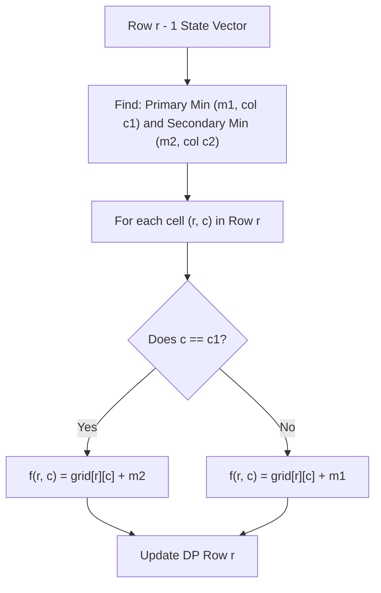

# Guided Example: Minimum Falling Path Sum II

We trace the step-by-step dynamic programming state transitions tracking dual row-minima on a representative problem instance:

- **Input:**
  ```text
  grid = [
    [1, 2, 3],
    [4, 5, 6],
    [7, 8, 9]
  ]
  ```
- **Required Output:** `13`

This instance illustrates row-by-row dynamic programming with non-zero shift constraints, tracking the first and second smallest values of preceding rows, and reducing transition complexity from quadratic to linear time.

---

## 1. Instance & Teaching Goal

We are given an $n \times n$ matrix of numbers ($n = 3$). A falling path with non-zero shifts selects exactly one entry from each row such that no two chosen entries in consecutive rows share the same column:
$$
\text{col}_{r+1} \ne \text{col}_r \quad \text{for all } 0 \le r < n - 1
$$

The target is to minimize the total sum of the selected entries.
For the grid:
```
Row 0: [ 1,   2,   3 ]
Row 1: [ 4,   5,   6 ]
Row 2: [ 7,   8,   9 ]
```

Candidate non-conflicting paths:
- Path 1: $(0, 0) \to (1, 1) \to (2, 0) \implies 1 + 5 + 7 = 13$ (Valid: columns $0 \to 1 \to 0$)
- Path 2: $(0, 1) \to (1, 0) \to (2, 1) \implies 2 + 4 + 8 = 14$
- Path 3: $(0, 0) \to (1, 2) \to (2, 1) \implies 1 + 6 + 8 = 15$

The minimal sum is $13$.

A naive brute-force search explores $n(n - 1)^{n - 1} = 3 \times 2^2 = 12$ paths (or $200 \times 199^{199} \approx 10^{460}$ for $n = 200$).
Standard dynamic programming considers all previous columns $j \ne c$, requiring $\mathcal{O}(n)$ work per cell and $\mathcal{O}(n^3)$ overall.
The optimal method observes that at each step, a cell only needs the **minimum** or the **second minimum** from the previous row, cutting row transitions to $\mathcal{O}(n)$ and overall time to $\mathcal{O}(n^2)$.

---

## 2. Conceptual Foundation & Invariants

Let $f(r, c)$ be the minimum path sum starting from row $0$ and terminating at cell $(r, c)$ in row $r$.

### Base Case (Row 0)
$$
f(0, c) = \text{grid}[0][c] \quad \text{for all } c \in [0, n - 1]
$$

### Transition Relation (Row $r \ge 1$)
To choose column $c$ in row $r$, we must select the minimum cost column $j$ in row $r - 1$ such that $j \ne c$:
$$
f(r, c) = \text{grid}[r][c] + \min_{j \ne c} f(r - 1, j)
$$

### The Dual-Minima Acceleration
Let the absolute minimum value in row $r - 1$ be $m_1$ occurring at column $c_1$, and the second-smallest value be $m_2$ occurring at column $c_2 \ne c_1$:
- For any column $c \ne c_1$, the optimal predecessor is column $c_1$ with cost $m_1$.
- For column $c = c_1$, column $c_1$ is forbidden (same column). The optimal allowed predecessor is column $c_2$ with cost $m_2$.

Thus, for every cell $(r, c)$:
$$
f(r, c) = \text{grid}[r][c] +
\begin{cases}
m_2, & \text{if } c = c_1 \\
m_1, & \text{if } c \ne c_1
\end{cases}
$$

| Row $r - 1$ Summary | Primary Minimum $m_1$ | Primary Column $c_1$ | Secondary Minimum $m_2$ | Secondary Column $c_2$ | Rule for Next Row |
|---|---|---|---|---|---|
| Row 0 | $1$ | $0$ | $2$ | $1$ | If $c = 0$ add $2$; else add $1$ |
| Row 1 | $6$ | $0$ | $6$ | $1$ | If $c = 0$ add $6$; else add $6$ |

> **Two-Candidate Sufficiency Invariant.** Knowing the smallest two elements of a vector and their column indices is strictly sufficient to determine $\min_{j \ne c} f(j)$ for every column $c \in [0, n - 1]$ in constant time $\mathcal{O}(1)$.



---

## 3. Step-by-Step Worked Execution

We process `grid = [[1, 2, 3], [4, 5, 6], [7, 8, 9]]`.

### Step 1: Initializing Row 0
- $f(0, 0) = \text{grid}[0][0] = 1$
- $f(0, 1) = \text{grid}[0][1] = 2$
- $f(0, 2) = \text{grid}[0][2] = 3$
DP Row 0: $[1, 2, 3]$.

We identify the two smallest values in Row 0:
- Smallest: $m_1 = 1$ at column $c_1 = 0$.
- Second smallest: $m_2 = 2$ at column $c_2 = 1$.

---

### Step 2: Evaluating Row 1
Grid values in Row 1: $[4, 5, 6]$.
- **Column 0 ($c = 0$):**
  - Since $c = c_1$ ($0 = 0$), column $0$ cannot be used from Row 0.
  - Take second minimum $m_2 = 2$:
    $$
    f(1, 0) = \text{grid}[1][0] + m_2 = 4 + 2 = 6
    $$
- **Column 1 ($c = 1$):**
  - Since $c \ne c_1$ ($1 \ne 0$), take primary minimum $m_1 = 1$:
    $$
    f(1, 1) = \text{grid}[1][1] + m_1 = 5 + 1 = 6
    $$
- **Column 2 ($c = 2$):**
  - Since $c \ne c_1$ ($2 \ne 0$), take primary minimum $m_1 = 1$:
    $$
    f(1, 2) = \text{grid}[1][2] + m_1 = 6 + 1 = 7
    $$
DP Row 1: $[6, 6, 7]$.

We identify the two smallest values in Row 1:
- Smallest: $m_1 = 6$ at column $c_1 = 0$.
- Second smallest: $m_2 = 6$ at column $c_2 = 1$.

---

### Step 3: Evaluating Row 2
Grid values in Row 2: $[7, 8, 9]$.
- **Column 0 ($c = 0$):**
  - Since $c = c_1$ ($0 = 0$), take second minimum $m_2 = 6$:
    $$
    f(2, 0) = \text{grid}[2][0] + m_2 = 7 + 6 = 13
    $$
- **Column 1 ($c = 1$):**
  - Since $c \ne c_1$ ($1 \ne 0$), take primary minimum $m_1 = 6$ (from $c = 0$):
    $$
    f(2, 1) = \text{grid}[2][1] + m_1 = 8 + 6 = 14
    $$
- **Column 2 ($c = 2$):**
  - Since $c \ne c_1$ ($2 \ne 0$), take primary minimum $m_1 = 6$:
    $$
    f(2, 2) = \text{grid}[2][2] + m_1 = 9 + 6 = 15
    $$
DP Row 2: $[13, 14, 15]$.

---

### Final Global Minimum
The answer is the minimum value across all columns in the final row:
$$
\text{Ans} = \min(f(2, 0), f(2, 1), f(2, 2)) = \min(13, 14, 15) = 13
$$

---

## 4. Complete Execution Trace

| Row $r$ | Grid Values $\text{grid}[r]$ | Preceding Minima $(m_1, c_1), (m_2, c_2)$ | Transitions Computed | DP Row Vector $f[r]$ |
|---|---|---|---|---|
| $0$ | $[1, 2, 3]$ | None (Base layer) | Base assignments | $[1, 2, 3]$ |
| $1$ | $[4, 5, 6]$ | $m_1=1 (c_1=0), \; m_2=2 (c_2=1)$ | $4+2=6, \; 5+1=6, \; 6+1=7$ | $[6, 6, 7]$ |
| $2$ | $[7, 8, 9]$ | $m_1=6 (c_1=0), \; m_2=6 (c_2=1)$ | $7+6=13, \; 8+6=14, \; 9+6=15$ | $[13, 14, 15]$ |

Final minimum path sum: $13$.

---

## 5. Algorithmic Correctness

**Soundness.** Every state $f(r, c)$ represents the sum of an admissible falling path of length $r + 1$ terminating at $(r, c)$. Because $f(r, c)$ chooses either column $c_1$ (if $c \ne c_1$) or column $c_2$ (if $c = c_1$), the chosen predecessor column is never equal to $c$, strictly satisfying the non-zero shift constraint.

**Completeness.** For any column $c$, the best allowed predecessor from the previous row is $\min_{j \ne c} f(r-1, j)$. If $c \ne c_1$, the unconstrained global minimum $c_1$ is available and is mathematically minimal. If $c = c_1$, $c_1$ is disallowed, and the next best option is the second global minimum $c_2$. No other column can achieve a smaller sum, ensuring that all candidate paths are evaluated with complete mathematical optimality.

---

## 6. Traps This Instance Exposes

- **Duplicate minimum values:** In Row 1, both column $0$ and column $1$ have the value $6$. When finding $m_1$ and $m_2$, their column indices must be distinct ($c_1 \ne c_2$), but their numeric values can be equal ($m_1 = m_2 = 6$). Correctly recording distinct columns ensures that when $c = 0$, column $1$ is safely selected without false rejection.
- **Single-cell matrix:** For $n = 1$, there are no other columns in any row. However, with $n = 1$, the matrix has only $1$ row and $1$ column, so the loop for $r \ge 1$ never executes, correctly returning $\text{grid}[0][0]$.
- **In-place vector overwrite:** Calculating $f(r, c)$ must read from the unmutated previous row $f(r-1)$. Updating in-place without a buffer can cause earlier updated columns in row $r$ to be misidentified as row $r-1$ inputs.

---

## 7. Complexity Derivation

- **Time Complexity:** $\mathcal{O}(n^2)$.
  - For each of the $n$ rows, scanning the previous row to identify $m_1, c_1, m_2, c_2$ takes $\mathcal{O}(n)$ time.
  - Computing the $n$ entries of the current row using the two recorded minima takes $\mathcal{O}(1)$ time per entry, totaling $\mathcal{O}(n)$ per row.
  - Across all $n$ rows, total time is strictly $\mathcal{O}(n \cdot n) = \mathcal{O}(n^2)$. For $n = 200$, $n^2 = 40{,}000$ operations, executing in under $2$ milliseconds.
- **Auxiliary Space Complexity:** $\mathcal{O}(n)$ using a 1D rolling array to store the active and previous DP row states.
