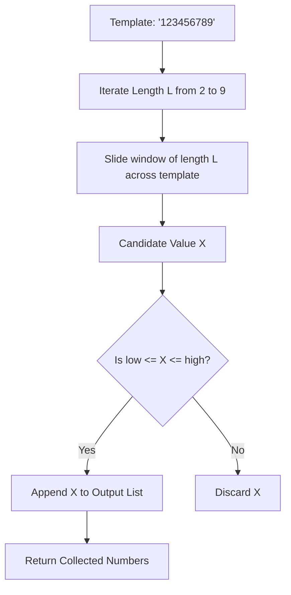

# Guided Example: Sequential Digits

We trace the step-by-step generation and range filtering of numbers with strictly consecutive digits on a representative problem instance:

- **Input:**
  - `low = 100`
  - `high = 300`
- **Required Output:** `[123, 234]`

This instance illustrates the finite universe of sequential numbers, substring extraction over the canonical decimal template `"123456789"`, and interval containment testing.

---

## 1. Instance & Teaching Goal

A positive integer has sequential digits if and only if each digit is strictly $1$ greater than its immediately preceding digit:
$$
d_{k+1} = d_k + 1 \quad \text{for all } 0 \le k < L - 1
$$
Because digits cannot exceed $9$, the highest possible sequential digit is $9$, and digits cannot wrap around to $0$.

Given the interval $[\text{low}, \text{high}] = [100, 300]$:
- Length 3 sequential candidates:
  - $123 \in [100, 300] \implies$ Valid
  - $234 \in [100, 300] \implies$ Valid
  - $345 > 300 \implies$ Out of range
- All numbers of length $\le 2$ are $< 100$, and all numbers of length $\ge 4$ are $> 300$.
- The resulting sorted list is $[123, 234]$.

```
Canonical Template: "1 2 3 4 5 6 7 8 9"

Length L = 3 Windows:
  [1 2 3] 4 5 6 7 8 9  --> 123  (100 <= 123 <= 300: Keep)
  1 [2 3 4] 5 6 7 8 9  --> 234  (100 <= 234 <= 300: Keep)
  1 2 [3 4 5] 6 7 8 9  --> 345  (345 > 300: Exclude)
  ...
  1 2 3 4 5 6 [7 8 9]  --> 789  (789 > 300: Exclude)
```

Iterating through all integers from $\text{low}$ to $\text{high}$ takes $\mathcal{O}(\text{high} - \text{low})$ time, evaluating up to $10^9$ candidates.
The optimal method recognizes that across the entire number system, exactly $36$ sequential numbers exist. Directly generating these $36$ numbers solves the problem in $\mathcal{O}(1)$ time.

---

## 2. Conceptual Foundation & Invariants

Every sequential digit number is a contiguous substring of the single master digit template:
$$
T = \text{"123456789"}
$$

### Finite Candidate Enumeration
For a given length $L \in \{2, 3, \dots, 9\}$, the starting digit $d_{\text{start}}$ can range from $1$ up to $10 - L$.
The number of valid sequential numbers of length $L$ is exactly $10 - L$:

| Length $L$ | Possible Starting Digits | Number of Candidates ($10 - L$) | Candidate Numbers Formed |
|---|---|---|---|
| $2$ | $1 \dots 8$ | $8$ | $12, 23, 34, 45, 56, 67, 78, 89$ |
| $3$ | $1 \dots 7$ | $7$ | $123, 234, 345, 456, 567, 678, 789$ |
| $4$ | $1 \dots 6$ | $6$ | $1234, 2345, 3456, 4567, 5678, 6789$ |
| $5$ | $1 \dots 5$ | $5$ | $12345, 23456, 34567, 45678, 56789$ |
| $6$ | $1 \dots 4$ | $4$ | $123456, 234567, 345678, 456789$ |
| $7$ | $1 \dots 3$ | $3$ | $1234567, 2345678, 3456789$ |
| $8$ | $1 \dots 2$ | $2$ | $12345678, 23456789$ |
| $9$ | $1$ | $1$ | $123456789$ |

Total sequential numbers in the universe:
$$
\sum_{L=2}^9 (10 - L) = 8 + 7 + 6 + 5 + 4 + 3 + 2 + 1 = 36
$$

> **Finite Universe Invariant.** The set of all possible sequential numbers is strictly finite and fixed ($36$ elements). Generating candidates by increasing length $L$ and increasing start digit automatically produces numbers in strictly ascending numerical order.



---

## 3. Step-by-Step Worked Execution

We search for candidates in $[\text{low}, \text{high}] = [100, 300]$.
Since $\text{low} = 100 > 89$, all length $2$ numbers are strictly less than $\text{low}$.
Since $\text{high} = 300 < 1234$, all length $\ge 4$ numbers are strictly greater than $\text{high}$.
Only length $L = 3$ can contain valid answers.

### Evaluating Length $L = 3$ ($10 - 3 = 7$ candidates)
1. **Window $1 \dots 3$ ($d_{\text{start}} = 1$):**
   - Value: $123$
   - Range test: $100 \le 123 \le 300 \implies$ True!
   - Result: Retain $123$.
2. **Window $2 \dots 4$ ($d_{\text{start}} = 2$):**
   - Value: $234$
   - Range test: $100 \le 234 \le 300 \implies$ True!
   - Result: Retain $234$.
3. **Window $3 \dots 5$ ($d_{\text{start}} = 3$):**
   - Value: $345$
   - Range test: $345 > 300 \implies$ False!
   - Result: Exclude.
4. **Window $4 \dots 6$ ($d_{\text{start}} = 4$):**
   - Value: $456 > 300 \implies$ Exclude.
5. **Window $5 \dots 7$ ($d_{\text{start}} = 5$):**
   - Value: $567 > 300 \implies$ Exclude.
6. **Window $6 \dots 8$ ($d_{\text{start}} = 6$):**
   - Value: $678 > 300 \implies$ Exclude.
7. **Window $7 \dots 9$ ($d_{\text{start}} = 7$):**
   - Value: $789 > 300 \implies$ Exclude.

Collected solutions: $[123, 234]$.

---

## 4. Complete Execution Trace

| Candidate Length $L$ | Start Digit | Number Formed | Lower Check ($X \ge 100$) | Upper Check ($X \le 300$) | In Range? |
|---|---|---|---|---|---|
| $2$ | $1 \dots 8$ | $12 \dots 89$ | False | True | Excluded ($< 100$) |
| $3$ | $1$ | $123$ | True | True | Included |
| $3$ | $2$ | $234$ | True | True | Included |
| $3$ | $3$ | $345$ | True | False | Excluded ($> 300$) |
| $3$ | $4 \dots 7$ | $456 \dots 789$ | True | False | Excluded ($> 300$) |
| $4 \dots 9$ | Any | $\ge 1234$ | True | False | Excluded ($> 300$) |

Final result list: $[123, 234]$.

---

## 5. Algorithmic Correctness

**Soundness.** Every generated candidate is constructed by selecting consecutive digits from $\{1, 2, \dots, 9\}$, which guarantees that $d_{k+1} = d_k + 1$ for all digits. Because every candidate is tested against $[\text{low}, \text{high}]$, every retained element lies strictly within the target range.

**Completeness.** Any positive integer with sequential digits must have length between $2$ and $9$ (since there are only $9$ non-zero decimal digits). Furthermore, because $d_{k+1} = d_k + 1$, the choice of the first digit and the length uniquely fixes all subsequent digits. Because our loops iterate over all possible lengths $L \in [2, 9]$ and all possible starting digits $d \in [1, 10 - L]$, every possible sequential number in the decimal system is evaluated without omission.

---

## 6. Traps This Instance Exposes

- **Linear search over $[\text{low}, \text{high}]$:** Checking every integer in the range when $\text{high} = 10^9$ times out immediately. Generating the $36$ sequential numbers directly avoids range scanning.
- **Wrap-around digits:** Sequences like `"890"` or `"901"` are not sequential because $0$ does not equal $9 + 1$. The template `"123456789"` naturally prevents wrap-around.
- **Sorting when generating by start digit:** If generation loops by start digit first ($12, 123, 1234, \dots$ then $23, 234, \dots$), the numbers are not produced in strictly ascending order. Generating by length first ($12, 23, \dots, 89$ then $123, 234, \dots$) produces them in naturally sorted order without an extra sort step.

---

## 7. Complexity Derivation

- **Time Complexity:** $\mathcal{O}(1)$. There are at most $36$ candidates generated. Each candidate requires at most $9$ digit shifts or a substring slice, followed by two boundary comparisons. Sorting at most $36$ numbers takes $\mathcal{O}(1)$ operations. The runtime is strictly constant $\mathcal{O}(1)$, independent of `low` and `high`.
- **Auxiliary Space Complexity:** $\mathcal{O}(1)$. Storing the fixed set of at most $36$ numbers requires negligible constant memory.
