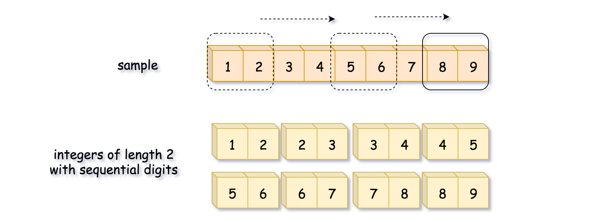

[TOC]

## Solution

---

### Approach 1: Sliding Window

One might notice that all integers that have sequential digits are substrings of the string "123456789". Hence to generate all such integers of a given length, just move the window of that length along the "123456789" string.

The advantage of this method is that it will generate the integers that are already in the sorted order.



**Algorithm**

- Initialize sample string "123456789". This string contains all integers that have sequential digits as substrings. Let's implement a sliding window algorithm to generate them.

- Iterate over all possible string lengths: from the length of `low` to the length of `high`.

- For each length iterate over all possible start indexes: from `0` to $10 - length$.

- Construct the number from digits inside the sliding window of current length.

- Add this number in the output list `nums`, if it's greater than `low` and less than `high`.

- Return `nums`.

**Implementation**

```python
class Solution:
    def sequentialDigits(self, low: int, high: int) -> List[int]:
        sample = "123456789"
        n = 10
        nums = []

        for length in range(len(str(low)), len(str(high)) + 1):
            for start in range(n - length):
                num = int(sample[start: start + length])
                if num >= low and num <= high:
                    nums.append(num)

        return nums
```

**Complexity Analysis**

* Time complexity: $\mathcal{O}(1)$. The length of the sample string is 9, and the lengths of low and high are between 2 and 9. Hence the nested loops are executed no more than $8 \times 8 = 64$ times.

* Space complexity: $\mathcal{O}(1)$ to keep not more than 36 integers with sequential digits.
<br />
<br />

---
### Approach 2: Precomputation

Actually, there are 36 integers with the sequential digits. Here is how we calculate it.

Starting from 9 digits in the sample string, one could construct 9 - 2 + 1 = 8 integers of length 2, 9 - 3 + 1 = 7 integers of length 3, and so on and so forth. In total, it would make 8 + 7 + ... + 1 = 36 integers.

As one can see, we could precompute the results all at once and then select the integers that are less than `high` and greater than `low`.

**Implementation**

```python
class Seqs:
    def __init__(self):
        sample = "123456789"
        n = 10
        self.nums = nums = []

        for length in range(2, n):
            for start in range(n - length):
                nums.append(int(sample[start: start + length]))

class Solution:
    s = Seqs()
    def sequentialDigits(self, low: int, high: int) -> List[int]:
        return [x for x in self.s.nums if x >= low and x <= high]
```

**Complexity Analysis**

* Time complexity: $\mathcal{O}(1)$ both for precomputation and during runtime. Precomputation: The length of the sample string is 9, and the nested loops are executed $8 \times 8 = 64$ times. Runtime: One iterates over an array of 36 integers.

* Space complexity: $\mathcal{O}(1)$ to keep 36 integers that have sequential digits.
<br />
<br />