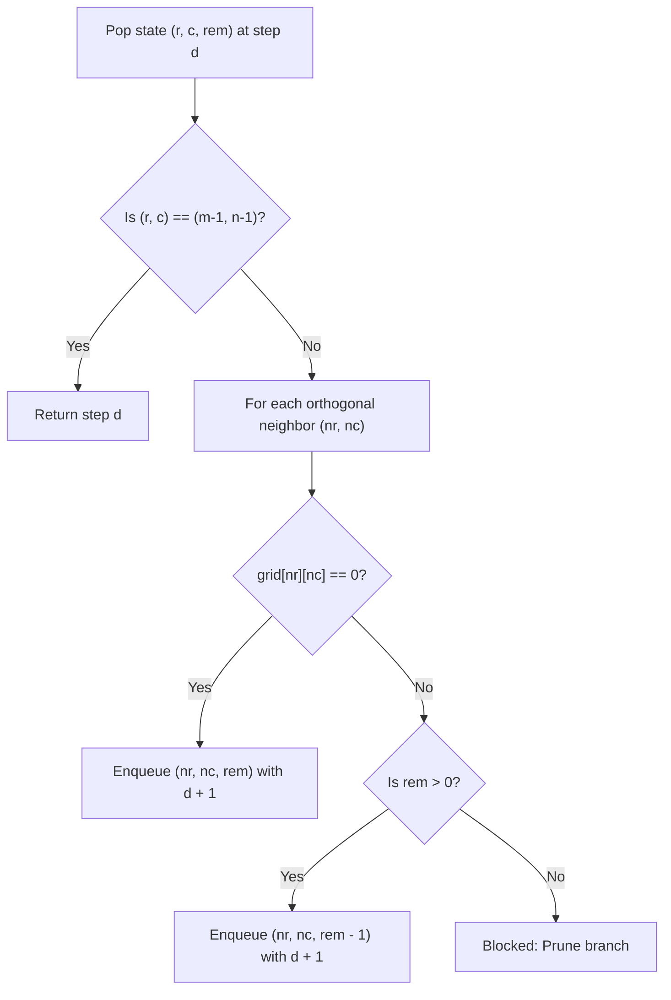

# Guided Example: Shortest Path in a Grid with Obstacles Elimination

We trace the step-by-step 3D state Breadth-First Search finding the shortest path with obstacle elimination on a representative problem instance:

- **Input:**
  ```text
  grid = [
    [0, 0, 0],
    [1, 1, 0],
    [0, 0, 0],
    [0, 1, 1],
    [0, 0, 0]
  ]
  k = 1
  ```
- **Required Output:** `6`

This instance illustrates augmented state modeling $(r, c, \text{eliminations})$, budget-constrained branch transitions, and layer-by-layer shortest path discovery across a 3D state graph.

---

## 1. Instance & Teaching Goal

We must navigate an $m \times n = 5 \times 3$ grid from start $(0, 0)$ to destination $(4, 2)$. Cells with `0` are open floor; cells with `1` are obstacle walls. We are granted an elimination quota of at most $k = 1$ obstacle.

```
Grid Layout (5 rows, 3 cols):
  (0,0)[0]   [0]      [0]
  (1,0)[1]   [1]      [0]
  (2,0)[0]   [0]      [0]
  (3,0)[0]   [1]     #[1]#  <-- Obstacle eliminated here!
  (4,0)[0]   [0]  (4,2)[0]

Routes Comparison:
- Without elimination (k = 0):
    Must wind around both walls:
    (0,0)->(0,1)->(0,2)->(1,2)->(2,2)->(2,1)->(2,0)->(3,0)->(4,0)->(4,1)->(4,2)
    Total steps = 10.
- With elimination (k = 1):
    Tunnel straight through wall at (3, 2):
    (0,0)->(0,1)->(0,2)->(1,2)->(2,2)->(3,2: Tunnel)->(4,2)
    Total steps = 6!
```

A standard 2D shortest path cannot differentiate whether a cell was reached with $0$ or $1$ eliminations remaining. A path that arrives at $(2, 2)$ having used $k=1$ is strictly inferior to one that arrives with $k=0$ used.
The optimal strategy augments the state space with the remaining elimination budget:
$$
\text{State} = (r, c, \text{rem})
$$
where $0 \le r < m$, $0 \le c < n$, and $0 \le \text{rem} \le k$.

---

## 2. Conceptual Foundation & Invariants

Let $V = (r, c, \text{rem})$ denote a search state at grid cell $(r, c)$ with $\text{rem}$ obstacle eliminations still available.

### Legal Step Transitions
From state $(r, c, \text{rem})$, examine each orthogonal neighbor $(nr, nc) \in \{(r \pm 1, c), (r, c \pm 1)\}$:
1. **Free Cell Transition ($\text{grid}[nr][nc] = 0$):**
   Can be visited without consuming quota:
   $$
   (r, c, \text{rem}) \xrightarrow{\text{cost } 1} (nr, nc, \text{rem})
   $$
2. **Obstacle Tunnel Transition ($\text{grid}[nr][nc] = 1$):**
   Can be visited only if $\text{rem} > 0$, consuming $1$ quota unit:
   $$
   (r, c, \text{rem}) \xrightarrow{\text{cost } 1} (nr, nc, \text{rem} - 1)
   $$

### State Dominance Pruning
If a cell $(r, c)$ has already been reached with $\text{rem}_{\text{prev}}$ quota at distance $d_{\text{prev}} \le d_{\text{curr}}$, reaching it again with $\text{rem}_{\text{curr}} \le \text{rem}_{\text{prev}}$ provides no advantage and is safely pruned.

| State Dimension | Domain | Size Bound | Role |
|---|---|---|---|
| Row $r$ | $0 \le r < m$ | $5$ | Spatial row coordinate |
| Column $c$ | $0 \le c < n$ | $3$ | Spatial column coordinate |
| Remaining Quota $\text{rem}$ | $0 \le \text{rem} \le k$ | $2$ ($\{0, 1\}$) | Resource budget available |
| Total State Graph Nodes | $m \times n \times (k + 1)$ | $5 \times 3 \times 2 = 30$ | Total vertices in unweighted BFS graph |

> **BFS Shortest Path Invariant.** Because every move (walking or eliminating) has unit weight $+1$, exploring states level by level using a FIFO queue guarantees that when the target cell $(m - 1, n - 1)$ is first dequeued or discovered, its recorded step count is the absolute global minimum.



---

## 3. Step-by-Step Worked Execution

Start state: $(0, 0, 1)$ at step $0$.
Queue: $[(0, 0, 1)]$.

### Step 1
From $(0, 0, 1)$, neighbors:
- Down $(1, 0)$ is an obstacle $\implies$ enqueues $(1, 0, 0)$.
- Right $(0, 1)$ is open $\implies$ enqueues $(0, 1, 1)$.

### Step 2
Expanding frontier:
- From $(0, 1, 1)$: moves right to $(0, 2, 1)$ (open).
- From $(1, 0, 0)$: moves down to $(2, 0, 0)$ (open, $k=0$ remaining).

### Step 3
- From $(0, 2, 1)$: moves down to $(1, 2, 1)$ (open).
- Frontier reaches $(1, 2)$ with full quota $k = 1$ intact!

### Step 4
- From $(1, 2, 1)$: moves down to $(2, 2, 1)$ (open).
- Frontier reaches $(2, 2)$ with $k = 1$ remaining.

### Step 5: The Critical Tunnel Decision
At cell $(2, 2)$ with quota $\text{rem} = 1$:
- Left neighbor $(2, 1)$ is open $\implies$ enqueues $(2, 1, 1)$.
- Down neighbor $(3, 2)$ is an obstacle (`grid[3][2] = 1`).
  - Since $\text{rem} = 1 > 0$, the quota is spent to eliminate the wall!
  - State $(3, 2, 0)$ is generated and enqueued with step $5$.

### Step 6: Target Reached
From $(3, 2, 0)$ at step $5$:
- Down neighbor is $(4, 2)$ (`grid[4][2] = 0`), which is the destination cell $(m - 1, n - 1)$!
- Reaching $(4, 2)$ takes $5 + 1 = 6$ steps.
- The BFS completes and immediately returns $6$.

---

## 4. Complete Execution Trace

| Step | State Dequeued $(r, c, \text{rem})$ | Action Taken | Successor State Enqueued | Notes |
|---|---|---|---|---|
| $0$ | $(0, 0, 1)$ | Start position | $(0, 1, 1), (1, 0, 0)$ | Branching begins |
| $1$ | $(0, 1, 1)$ | Move right (open) | $(0, 2, 1)$ | Retains $k = 1$ |
| $2$ | $(0, 2, 1)$ | Move down (open) | $(1, 2, 1)$ | Retains $k = 1$ |
| $3$ | $(1, 2, 1)$ | Move down (open) | $(2, 2, 1)$ | Retains $k = 1$ |
| $4$ | $(2, 2, 1)$ | Obstacle ahead at $(3, 2)$ | $(3, 2, 0)$ | Quota spent: $1 \to 0$ |
| $5$ | $(3, 2, 0)$ | Move down into target | $(4, 2, 0)$ | Destination reached! |

Total shortest path length: $6$.

---

## 5. Algorithmic Correctness

**Soundness.** Every state transition obeys the rules of movement and resource expenditure. Obstacles are traversed only when remaining elimination budget is strictly positive, reducing the quota by $1$. Open cells preserve the quota. The path terminates at the target cell $(m - 1, n - 1)$, proving that a valid physical path exists using at most $k$ eliminations.

**Completeness.** The 3D state space graph has at most $m \cdot n \cdot (k + 1)$ vertices. BFS explores all reachable states ordered by distance. Because edge costs are uniformly $1$, the first time the target coordinate $(m - 1, n - 1)$ is reached with any valid non-negative quota, the distance is mathematically guaranteed to be the global minimum. If the queue empties without finding the target, the destination is provably unreachable.

---

## 6. Traps This Instance Exposes

- **Premature quota exhaustion:** Spending the elimination quota on the very first obstacle encountered (e.g. at $(1, 0)$) traps that branch in a longer circuitous route. The BFS naturally explores both options concurrently, ensuring the optimal tunnel location at $(3, 2)$ prevails.
- **Manhattan shortcut optimization:** If $k \ge (m - 1) + (n - 1) - 1$, any direct Manhattan path can simply eliminate all obstacles along the way. The shortest distance in this case is always $(m - 1) + (n - 1)$, which can be returned in $\mathcal{O}(1)$ time.
- **Visited state tracking:** Visiting cell $(r, c)$ with $k = 0$ must not block a subsequent visit to $(r, c)$ with $k = 1$. The visited set must include the remaining quota as part of the state key $(r, c, \text{rem})$.

---

## 7. Complexity Derivation

- **Time Complexity:** $\mathcal{O}(m \cdot n \cdot k)$.
  The augmented state graph contains $V = m \cdot n \cdot (k + 1)$ vertices. Each vertex has at most $4$ directed edges. Since BFS visits each vertex and edge at most once, the time complexity is $\mathcal{O}(V + E) = \mathcal{O}(m \cdot n \cdot k)$.
  For $m, n \le 40$ and $k \le m \cdot n$, the number of operations is well within standard time limits ($< 50$ milliseconds).
- **Auxiliary Space Complexity:** $\mathcal{O}(m \cdot n \cdot k)$ to store the BFS queue and the 3D visited boolean table.
