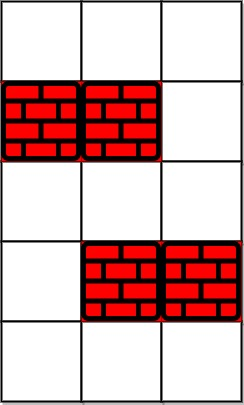
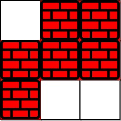

### 1. Description

You are given an `m x n` integer matrix `grid` where each cell is either `0` (empty) or `1` (obstacle). You can move up, down, left, or right from and to an empty cell in **one step**.

Return *the minimum number of **steps** to walk from the upper left corner *`(0, 0)`* to the lower right corner *$(m - 1, n - 1)$* given that you can eliminate **at most** *`k`* obstacles*. If it is not possible to find such walk return `-1`.

### 2. Function Contract

**Inputs**

- `grid`: Input parameter (`List[List[int]]`).
- `k`: Input parameter (`int`).

**Return value**

- Returns `int`.

### 3. Examples

#### Example 1

- **Input:** `grid = [[0,0,0],[1,1,0],[0,0,0],[0,1,1],[0,0,0]], k = 1`
- **Output:** `6`
- **Explanation:** The shortest path without eliminating any obstacle is 10.
The shortest path with one obstacle elimination at position (3,2) is 6. Such path is (0,0) -> (0,1) -> (0,2) -> (1,2) -> (2,2) -> **(3,2)** -> (4,2).

#### Example 2

- **Input:** `grid = [[0,1,1],[1,1,1],[1,0,0]], k = 1`
- **Output:** `-1`
- **Explanation:** We need to eliminate at least two obstacles to find such a walk.

### 4. Constraints

- $m = \text{grid.length}$

- $n = \text{grid}[i].length$

- $1 \le m, n \le 40$

- $1 \le k \le m * n$

- $\text{grid}[i][j]$ is either `0` **or** `1`.

- $\text{grid}[0][0] = grid[m - 1][n - 1] = 0$
