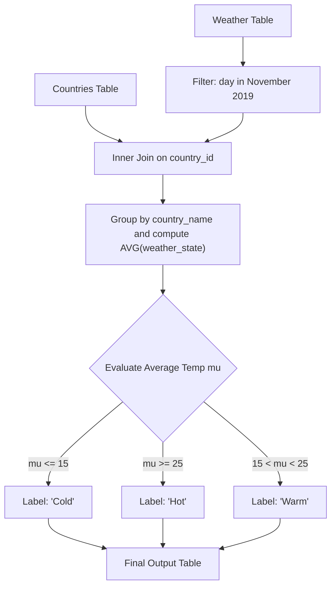

# Guided Example: Weather Type in Each Country

We trace the step-by-step evaluation of a relational query classifying regional climate categories across temporal windows on a representative problem instance:

- **Input Tables:**
  - `Countries` containing `(country_id, country_name)`.
  - `Weather` containing `(country_id, weather_state, day)`.
- **Target Analysis Window:** November 2019 (`day` within `2019-11-01` to `2019-11-30`).
- **Sample Entities:**
  - USA (ID 2): November weather reading: $15$.
  - Australia (ID 3): November readings: $-2, -2, -2$.
  - Peru (ID 7): November reading: $25$.
  - China (ID 5): November readings: $16, 18, 21, 22, 24$.
  - Morocco (ID 8): November readings: $25, 27, 31$.
  - Spain (ID 9): Only October readings recorded.
- **Required Output:**
  ```text
  USA       -> Cold
  Australia -> Cold
  Peru      -> Hot
  China     -> Warm
  Morocco   -> Hot
  ```

This instance illustrates date-range filtering, group-by aggregation over foreign keys, multi-branch conditional classification, and exclusion of unobserved entities.

---

## 1. Instance & Teaching Goal

The objective is to categorize the climate of every observed country for November 2019 into one of three meteorological tiers based on average recorded temperature $\mu$:
1. **Cold:** $\mu \le 15$
2. **Hot:** $\mu \ge 25$
3. **Warm:** $15 < \mu < 25$

Crucially:
- Readings outside November 2019 (such as October dates) must be filtered out prior to averaging.
- Countries with zero recorded weather observations in November 2019 (such as Spain) must be excluded entirely from the output report.

```
Temporal Filter: Keep only dates in [2019-11-01, 2019-11-30]

Country Observations and Averages:
  USA       : [15]                      --> Avg = 15.0  (<= 15)  ==> "Cold"
  Australia : [-2, -2, -2]              --> Avg = -2.0  (<= 15)  ==> "Cold"
  Peru      : [25]                      --> Avg = 25.0  (>= 25)  ==> "Hot"
  China     : [16, 18, 21, 22, 24]      --> Avg = 20.2  (Warm)   ==> "Warm"
  Morocco   : [25, 27, 31]              --> Avg = 27.67 (>= 25)  ==> "Hot"
  Spain     : No November observations  --> Excluded from final report
```

The teaching goal is to structure the relational algebra query: temporal predicate selection, equi-join on `country_id`, grouping by country, computing the arithmetic mean, and mapping the mean into categorical labels.

---

## 2. Conceptual Foundation & Invariants

Let $C$ denote the `Countries` relation and $W$ denote the `Weather` relation.

### Relational Pipeline
1. **Temporal Selection ($\sigma$):**
   Filter the weather observations to strictly retain records where the timestamp falls in the month of November 2019:
   $$
   W_{\text{Nov}} = \sigma_{\text{day} \ge \text{'2019-11-01'} \land \text{day} \le \text{'2019-11-30'}}(W)
   $$
2. **Equi-Join ($\bowtie$):**
   Join $W_{\text{Nov}}$ with $C$ on matching primary/foreign key `country_id`:
   $$
   J = W_{\text{Nov}} \bowtie_{\text{country\_id}} C
   $$
   Since Spain has no entries in $W_{\text{Nov}}$, an inner join naturally excludes Spain without extra filtering.
3. **Group Aggregation ($\gamma$):**
   Partition joined tuples by `country_name` and calculate the average temperature:
   $$
   \mu(\text{country}) = \frac{1}{|K|} \sum_{i \in K} \text{weather\_state}_i
   $$
4. **Conditional Tier Classification:**
   Apply piecewise mapping $\tau(\mu)$:
   $$
   \tau(\mu) =
   \begin{cases}
   \text{"Cold"}, & \text{if } \mu \le 15 \\
   \text{"Hot"}, & \text{if } \mu \ge 25 \\
   \text{"Warm"}, & \text{otherwise}
   \end{cases}
   $$

| Country | November Temperature Readings | Sample Count | Arithmetic Mean $\mu$ | Threshold Test | Assigned Weather Tier |
|---|---|---|---|---|---|
| USA | $[15]$ | $1$ | $15.0$ | $\mu \le 15$ | Cold |
| Australia | $[-2, -2, -2]$ | $3$ | $-2.0$ | $\mu \le 15$ | Cold |
| Peru | $[25]$ | $1$ | $25.0$ | $\mu \ge 25$ | Hot |
| China | $[16, 18, 21, 22, 24]$ | $5$ | $20.2$ | $15 < \mu < 25$ | Warm |
| Morocco | $[25, 27, 31]$ | $3$ | $27.67$ | $\mu \ge 25$ | Hot |
| Spain | None | $0$ | Undefined | Excluded by inner join | None |

> **Temporal Pre-Filter Invariant.** Date filtering must precede aggregation. Including October temperatures would corrupt the arithmetic mean $\mu$, producing invalid weather categorizations for the requested month.



---

## 3. Step-by-Step Worked Execution

### Phase 1: Temporal Filtering
We scan `Weather` and discard dates outside November 2019:
- USA reading $12$ on `2019-10-27`: Discarded.
- USA reading $12$ on `2019-10-28`: Discarded.
- Spain reading on `2019-10-21`: Discarded.
- All November entries are retained.

### Phase 2: Join and Group Evaluation

1. **USA (ID 2):**
   - Retained readings: $[15]$.
   - Mean: $\mu = 15 / 1 = 15.0$.
   - Test $\mu \le 15$: True.
   - Classification: `"Cold"`.

2. **Australia (ID 3):**
   - Retained readings: $[-2, -2, -2]$.
   - Mean: $\mu = (-2 - 2 - 2) / 3 = -6 / 3 = -2.0$.
   - Test $\mu \le 15$: True.
   - Classification: `"Cold"`.

3. **Peru (ID 7):**
   - Retained reading: $[25]$.
   - Mean: $\mu = 25 / 1 = 25.0$.
   - Test $\mu \ge 25$: True.
   - Classification: `"Hot"`.

4. **China (ID 5):**
   - Retained readings: $[16, 18, 21, 22, 24]$.
   - Sum: $16 + 18 + 21 + 22 + 24 = 101$.
   - Mean: $\mu = 101 / 5 = 20.2$.
   - Test: $15 < 20.2 < 25$.
   - Classification: `"Warm"`.

5. **Morocco (ID 8):**
   - Retained readings: $[25, 27, 31]$.
   - Sum: $25 + 27 + 31 = 83$.
   - Mean: $\mu = 83 / 3 \approx 27.67$.
   - Test $\mu \ge 25$: True.
   - Classification: `"Hot"`.

6. **Spain (ID 9):**
   - Has zero November records $\implies$ dropped by inner join.

---

## 4. Complete Execution Trace

| Country Name | November Observations | Sum | Count | Mean Temperature | Classification Decision |
|---|---|---|---|---|---|
| USA | $[15]$ | $15$ | $1$ | $15.0$ | Cold ($\le 15$) |
| Australia | $[-2, -2, -2]$ | $-6$ | $3$ | $-2.0$ | Cold ($\le 15$) |
| Peru | $[25]$ | $25$ | $1$ | $25.0$ | Hot ($\ge 25$) |
| China | $[16, 18, 21, 22, 24]$ | $101$ | $5$ | $20.2$ | Warm ($15 < \mu < 25$) |
| Morocco | $[25, 27, 31]$ | $83$ | $3$ | $27.67$ | Hot ($\ge 25$) |

Final output relation:
```text
[ ["USA", "Cold"],
  ["Australia", "Cold"],
  ["Peru", "Hot"],
  ["China", "Warm"],
  ["Morocco", "Hot"] ]
```

---

## 5. Algorithmic Correctness

**Soundness.** Every country in the output is accompanied by an accurate classification based strictly on its November 2019 observations. Because the conditional logic tests $\mu \le 15$ for Cold and $\mu \ge 25$ for Hot, the boundary values $15.0$ (Cold) and $25.0$ (Hot) are classified correctly according to the problem statement.

**Completeness.** Every country with at least one record in November 2019 is included in the output. Countries with no valid observations in the target window are excluded, satisfying the specification that only observed countries in the target period are reported.

---

## 6. Traps This Instance Exposes

- **Inclusive boundary classifications:** Temperatures exactly equal to $15$ are `"Cold"` ($\le 15$), and temperatures exactly equal to $25$ are `"Hot"` ($\ge 25$). Strict inequalities ($<$ and $>$) would misclassify boundary values $15$ and $25$ as `"Warm"`.
- **Negative temperatures:** Sub-zero temperatures (e.g. $-2^\circ\text{C}$ in Australia) are valid numeric inputs and must not be treated as null or absolute magnitudes.
- **Leaking unobserved countries:** Using a `LEFT JOIN` from `Countries` would retain Spain with an `AVG` of `NULL`, leading to an erroneous classification unless explicitly filtered out. An inner join correctly drops unobserved countries.

---

## 7. Complexity Derivation

- **Time Complexity:** $\mathcal{O}(W + C)$, where $W$ is the number of weather rows and $C$ is the number of countries.
  - Filtering $W$ rows by date takes $\mathcal{O}(W)$ time.
  - Joining the filtered records with $C$ country records on indexed foreign keys takes $\mathcal{O}(W_{\text{Nov}} + C)$ time.
  - Grouping and computing averages takes $\mathcal{O}(W_{\text{Nov}})$ using hash aggregation.
  - Total runtime is linear $\mathcal{O}(W + C)$.
- **Auxiliary Space Complexity:** $\mathcal{O}(C)$ to store the hash aggregation buckets and resulting classification rows.
