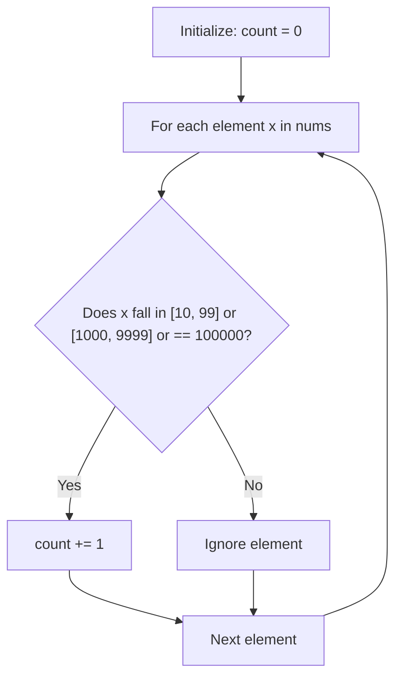

# Guided Example: Find Numbers with Even Number of Digits

We trace the step-by-step arithmetic digit length determination and parity filtering on a representative problem instance:

- **Input:** `nums = [12, 345, 2, 6, 7896]`
- **Required Output:** `2`

This instance illustrates base-10 logarithmic length partitioning, parity classification, and zero-allocation linear counting.

---

## 1. Instance & Teaching Goal

Given an array of positive integers, we must count how many elements contain an even number of decimal digits.
For `nums = [12, 345, 2, 6, 7896]`:
- $12$: Contains $2$ digits (Even) $\implies$ Counted
- $345$: Contains $3$ digits (Odd) $\implies$ Ignored
- $2$: Contains $1$ digit (Odd) $\implies$ Ignored
- $6$: Contains $1$ digit (Odd) $\implies$ Ignored
- $7896$: Contains $4$ digits (Even) $\implies$ Counted

Exactly two integers ($12$ and $7896$) have an even digit count.

```
Element Inspection:
  12   --> Length 2  --> 2 % 2 == 0  --> [Count: 1]
  345  --> Length 3  --> 3 % 2 == 1  --> [Ignored]
  2    --> Length 1  --> 1 % 2 == 1  --> [Ignored]
  6    --> Length 1  --> 1 % 2 == 1  --> [Ignored]
  7896 --> Length 4  --> 4 % 2 == 0  --> [Count: 2]

Total Qualifying Numbers = 2
```

Converting each integer to a string creates unnecessary heap objects.
The optimal mathematical strategy derives digit length via integer logarithms $\lfloor \log_{10} x \rfloor + 1$ or direct numeric interval tests.

---

## 2. Conceptual Foundation & Invariants

For any positive integer $x \ge 1$, its digit count $L(x)$ in base-10 positional notation is:
$$
L(x) = \lfloor \log_{10} x \rfloor + 1
$$
$L(x)$ is even if and only if:
$$
L(x) \equiv 0 \pmod 2
$$

### Discrete Interval Partitioning
Given the problem constraint $1 \le x \le 10^5$, the possible digit lengths are $L \in \{1, 2, 3, 4, 5, 6\}$:
- $L = 1$: $[1, 9]$ (Odd)
- $L = 2$: $[10, 99]$ (Even)
- $L = 3$: $[100, 999]$ (Odd)
- $L = 4$: $[1000, 9999]$ (Even)
- $L = 5$: $[10000, 99999]$ (Odd)
- $L = 6$: $\{100000\}$ (Even)

Therefore, a number $x \le 10^5$ has an even number of digits if and only if:
$$
x \in [10, 99] \quad \lor \quad x \in [1000, 9999] \quad \lor \quad x = 100000
$$

| Element $x$ | Magnitude Range | Digit Length $L(x)$ | Parity Condition ($L \bmod 2 = 0$) | Contributes to Total? |
|---|---|---|---|---|
| $12$ | $[10, 99]$ | $2$ | True | Yes ($+1$) |
| $345$ | $[100, 999]$ | $3$ | False | No |
| $2$ | $[1, 9]$ | $1$ | False | No |
| $6$ | $[1, 9]$ | $1$ | False | No |
| $7896$ | $[1000, 9999]$ | $4$ | True | Yes ($+1$) |

> **Direct Interval Invariant.** Testing set membership in fixed exponent intervals $[10^{2k-1}, 10^{2k} - 1]$ evaluates even-digit parity in $\mathcal{O}(1)$ time without string casting or floating-point division.



---

## 3. Step-by-Step Worked Execution

We inspect `nums = [12, 345, 2, 6, 7896]` sequentially.

### Element 1: $x = 12$
- Division count:
  - $12 / 10 = 1$ (1 division)
  - $1 / 10 = 0$ (2 divisions)
  - Total digits: $2$.
- Parity: $2 \bmod 2 = 0$ (Even).
- Action: Increment counter: $\text{total} = 0 + 1 = 1$.

### Element 2: $x = 345$
- Division count:
  - $345 / 10 = 34$
  - $34 / 10 = 3$
  - $3 / 10 = 0$
  - Total digits: $3$.
- Parity: $3 \bmod 2 = 1$ (Odd).
- Action: Counter remains $\text{total} = 1$.

### Element 3: $x = 2$
- Total digits: $1$.
- Parity: $1 \bmod 2 = 1$ (Odd).
- Action: Counter remains $\text{total} = 1$.

### Element 4: $x = 6$
- Total digits: $1$.
- Parity: $1 \bmod 2 = 1$ (Odd).
- Action: Counter remains $\text{total} = 1$.

### Element 5: $x = 7896$
- Division count:
  - $7896 \to 789 \to 78 \to 7 \to 0$ ($4$ divisions).
  - Total digits: $4$.
- Parity: $4 \bmod 2 = 0$ (Even).
- Action: Increment counter: $\text{total} = 1 + 1 = 2$.

All elements have been evaluated. Final total = $2$.

---

## 4. Complete Execution Trace

| Index $i$ | Value $x$ | Digit Calculation | Length $L(x)$ | Even Predicate | Running Count |
|---|---|---|---|---|---|
| $0$ | $12$ | $\lfloor \log_{10} 12 \rfloor + 1$ | $2$ | True | $1$ |
| $1$ | $345$ | $\lfloor \log_{10} 345 \rfloor + 1$ | $3$ | False | $1$ |
| $2$ | $2$ | $\lfloor \log_{10} 2 \rfloor + 1$ | $1$ | False | $1$ |
| $3$ | $6$ | $\lfloor \log_{10} 6 \rfloor + 1$ | $1$ | False | $1$ |
| $4$ | $7896$ | $\lfloor \log_{10} 7896 \rfloor + 1$ | $4$ | True | $2$ |

---

## 5. Algorithmic Correctness

**Soundness.** For any integer $x$, the mathematical number of digits in standard decimal notation is the unique integer $L$ such that $10^{L-1} \le x < 10^L$. Testing the parity condition $L \bmod 2 = 0$ strictly identifies integers with an even number of decimal digits. Each qualifying number adds exactly $1$ to the counter.

**Completeness.** The linear sweep visits every integer in `nums` exactly once. Because elements are inspected independently without skips or early termination, all qualifying values are accumulated.

---

## 6. Traps This Instance Exposes

- **String conversion memory overhead:** Using `len(str(x))` allocates a new string object on the heap for every element, which creates unnecessary garbage collection overhead when $N = 10^5$. Arithmetic division or direct range bounds executes completely in-register.
- **Logarithmic precision drift:** Evaluating $\log_{10}(1000)$ using standard double-precision floating-point numbers can occasionally produce $2.999999999$, causing $\lfloor 2.999999999 \rfloor + 1 = 3$ instead of $4$. Adding a small epsilon or using integer comparison guards against floating-point inaccuracy.
- **Boundary numbers:** Values like $10, 99, 1000, 9999$ test inclusive inequality limits.

---

## 7. Complexity Derivation

- **Time Complexity:** $\mathcal{O}(N)$, where $N$ is the number of integers in `nums`.
  Each number undergoes at most $\lfloor \log_{10}(10^5) \rfloor + 1 \le 6$ arithmetic divisions (or $3$ range comparison checks taking $\mathcal{O}(1)$ time). Across all $N$ elements, the total time is strictly $\mathcal{O}(N)$.
- **Auxiliary Space Complexity:** $\mathcal{O}(1)$. Memory is limited to a single integer accumulator register.
