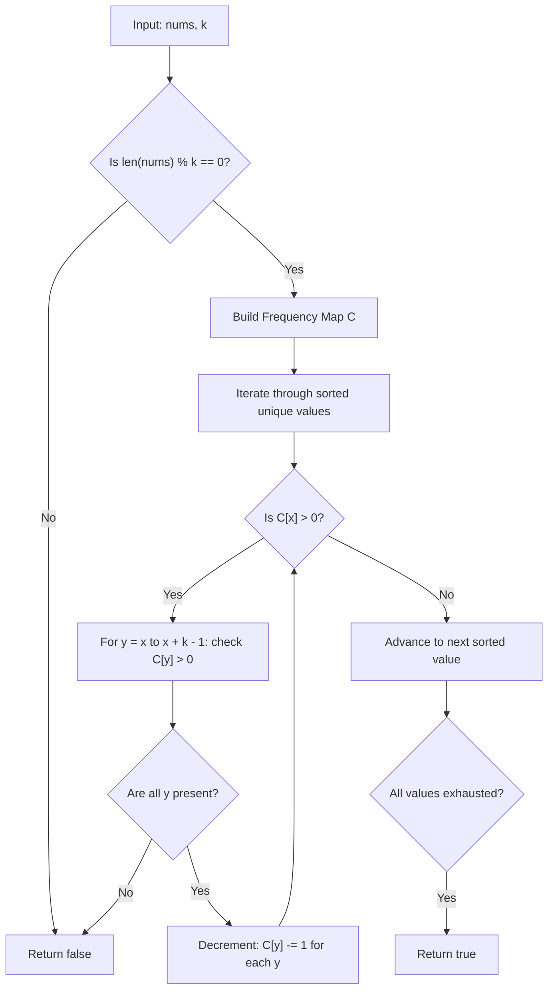

# Guided Example: Divide Array in Sets of K Consecutive Numbers

We trace the step-by-step greedy frequency reduction partitioning an array into sets of consecutive numbers on a representative problem instance:

- **Input:**
  - `nums = [1, 2, 3, 3, 4, 4, 5, 6]`
  - `k = 4`
- **Required Output:** `true`

This instance illustrates the forced-choice property of the current minimum element, frequency histogram tracking, and greedy linear reduction.

---

## 1. Instance & Teaching Goal

We must determine whether the multiset of $N = 8$ integers can be partitioned into $N / k = 8 / 4 = 2$ disjoint subsets, each containing $k = 4$ strictly consecutive integers.

For `nums = [1, 2, 3, 3, 4, 4, 5, 6]` and $k = 4$:
- Group 1: `[1, 2, 3, 4]` (4 consecutive integers)
- Group 2: `[3, 4, 5, 6]` (4 consecutive integers)
- Every number is used exactly once, and all subsets are valid.

```
Frequency Histogram:
  Value:      1    2    3    4    5    6
  Count:     [1]  [1]  [2]  [2]  [1]  [1]

Step 1: Smallest remaining element is 1 (count = 1).
  Must start group of length 4: [1, 2, 3, 4]
  Deduct 1 from each:
  Value:      1    2    3    4    5    6
  Count:     [0]  [0]  [1]  [1]  [1]  [1]

Step 2: Smallest remaining element is 3 (count = 1).
  Must start group of length 4: [3, 4, 5, 6]
  Deduct 1 from each:
  Value:      1    2    3    4    5    6
  Count:     [0]  [0]  [0]  [0]  [0]  [0]  --> All exhausted!
```

An arbitrary search or backtracking algorithm risks exponential complexity.
The optimal strategy exploits the **Forced-Choice Minimum Invariant**: the smallest element remaining in the multiset cannot be in the middle or end of any consecutive sequence. It must serve as the start of a sequence of length $k$.

---

## 2. Conceptual Foundation & Invariants

Let $C(v)$ denote the frequency count of value $v$ in `nums`.

### Initial Divisibility Pruning
A collection of size $N$ cannot be partitioned into sets of size $k$ unless:
$$
N \equiv 0 \pmod k
$$
If $N \bmod k \ne 0$, we immediately conclude `false`.

### Forced-Choice Minimum Invariant
Let $x$ be the smallest value with $C(x) > 0$:
- No element strictly smaller than $x$ remains available.
- Therefore, $x$ cannot be paired with $x - 1, x - 2, \dots$.
- The only way to include $x$ in a consecutive group of length $k$ is to form the exact sequence:
  $$
  [x, \; x + 1, \; x + 2, \; \dots, \; x + k - 1]
  $$
- To consume all $C(x)$ copies of $x$, there must exist at least $C(x)$ copies of each integer in $[x, x + k - 1]$:
  $$
  C(y) \ge C(x) \quad \text{for all } y \in [x, x + k - 1]
  $$
- We subtract $C(x)$ from each frequency $C(y)$ and repeat. If any $C(y) < C(x)$, the partition is impossible.

| Iteration | Smallest Active $x$ | Required Sequence Range $[x \dots x + k - 1]$ | Frequency Available | Frequency Required | State After Deduction |
|---|---|---|---|---|---|
| Step 1 | $1$ | $[1, 2, 3, 4]$ | $C = [1, 1, 2, 2]$ | $1$ each | $C(1..4)$ become $[0, 0, 1, 1]$ |
| Step 2 | $3$ | $[3, 4, 5, 6]$ | $C = [1, 1, 1, 1]$ | $1$ each | $C(3..6)$ become $[0, 0, 0, 0]$ |

> **Greedy Optimality Invariant.** Because the minimum unplaced element has zero alternative group positions, placing it in $[x, x+k-1]$ is a forced decision rather than an arbitrary heuristic. Greedy consumption is both sound and complete.



---

## 3. Step-by-Step Worked Execution

We trace `nums = [1, 2, 3, 3, 4, 4, 5, 6]` and $k = 4$.

### Phase 1: Divisibility Check and Frequency Counting
- Array length $N = 8$.
- Divisibility: $8 \bmod 4 = 0$ (Passes).
- Frequency histogram:
  $$
  C(1) = 1, \quad C(2) = 1, \quad C(3) = 2, \quad C(4) = 2, \quad C(5) = 1, \quad C(6) = 1
  $$
- Sorted distinct elements: $[1, 2, 3, 4, 5, 6]$.

---

### Phase 2: Processing Element $x = 1$
- Current count: $C(1) = 1 > 0$.
- Required consecutive group of length $k = 4$:
  $$
  [1, 2, 3, 4]
  $$
- Verification of required members:
  - $y = 1$: $C(1) = 1 \ge 1 \implies$ Available.
  - $y = 2$: $C(2) = 1 \ge 1 \implies$ Available.
  - $y = 3$: $C(3) = 2 \ge 1 \implies$ Available.
  - $y = 4$: $C(4) = 2 \ge 1 \implies$ Available.
- Deduction of $1$ count across the window:
  - $C(1) \leftarrow 1 - 1 = 0$
  - $C(2) \leftarrow 1 - 1 = 0$
  - $C(3) \leftarrow 2 - 1 = 1$
  - $C(4) \leftarrow 2 - 1 = 1$
- Group 1 formed: `[1, 2, 3, 4]`.

---

### Phase 3: Processing Elements $x = 2$ and $x = 3$
- For $x = 2$: $C(2) = 0 \implies$ Already exhausted, skip.
- For $x = 3$: $C(3) = 1 > 0$.
  - Required consecutive group of length $k = 4$:
    $$
    [3, 4, 5, 6]
    $$
  - Verification of required members:
    - $y = 3$: $C(3) = 1 \ge 1 \implies$ Available.
    - $y = 4$: $C(4) = 1 \ge 1 \implies$ Available.
    - $y = 5$: $C(5) = 1 \ge 1 \implies$ Available.
    - $y = 6$: $C(6) = 1 \ge 1 \implies$ Available.
  - Deduction of $1$ count across the window:
    - $C(3) \leftarrow 1 - 1 = 0$
    - $C(4) \leftarrow 1 - 1 = 0$
    - $C(5) \leftarrow 1 - 1 = 0$
    - $C(6) \leftarrow 1 - 1 = 0$
- Group 2 formed: `[3, 4, 5, 6]`.

---

### Phase 4: Verification of Remaining Elements
- Elements $4, 5, 6$ now all have count $0$.
- All numbers have been cleanly partitioned into groups of size $4$.
- Output: `true`.

---

## 4. Complete Execution Trace

| Step | Smallest Available $x$ | Target Window $[x \dots x + 3]$ | Window Counts Before | Window Counts After | Group Created |
|---|---|---|---|---|---|
| Init | - | - | $C = \{1:1, 2:1, 3:2, 4:2, 5:1, 6:1\}$ | - | None |
| 1 | $1$ | $[1, 2, 3, 4]$ | $C(1..4) = [1, 1, 2, 2]$ | $C(1..4) = [0, 0, 1, 1]$ | `[1, 2, 3, 4]` |
| 2 | $3$ | $[3, 4, 5, 6]$ | $C(3..6) = [1, 1, 1, 1]$ | $C(3..6) = [0, 0, 0, 0]$ | `[3, 4, 5, 6]` |
| End | None | - | All counts are $0$ | - | Return `true` |

---

## 5. Algorithmic Correctness

**Soundness.** Every formed group contains exactly $k$ consecutive integers $[x, x+1, \dots, x+k-1]$. Because each element in a group corresponds to decrementing an active entry in the multiset histogram, the union of all formed groups equals the original input multiset.

**Completeness.** Suppose there exists some valid partition into $k$-consecutive subsets. Consider the globally minimal element $x$ in the multiset. In any valid partition, $x$ must belong to some group. Since no element smaller than $x$ exists, the group containing $x$ can only be $[x, x+1, \dots, x+k-1]$. Therefore, consuming $[x, \dots, x+k-1]$ preserves the existence of a valid partition. By induction, if the greedy deduction fails at any point (due to $C(y) = 0$), no valid partition could have existed.

---

## 6. Traps This Instance Exposes

- **Overlapping identical values:** The value $3$ appears twice. Treating numbers as a set instead of a multiset with frequency counts loses multiplicity information and causes incorrect failures.
- **Divisibility check omission:** If $N$ is not divisible by $k$, running the greedy algorithm does extra work before failing. Checking $N \bmod k \ne 0$ rejects invalid sizes in $\mathcal{O}(1)$ time.
- **Missing intermediate consecutive element:** If `nums = [1, 2, 4, 5]` and $k = 3$, when $x = 1$ is examined, $y = 3$ has count $0$, triggering an immediate and correct return of `false`.

---

## 7. Complexity Derivation

- **Time Complexity:** $\mathcal{O}(N \log M)$, where $N$ is the number of elements and $M$ is the number of unique elements.
  - Constructing the frequency hash map takes $\mathcal{O}(N)$ time.
  - Sorting the $M$ unique keys takes $\mathcal{O}(M \log M)$ time.
  - For each group formed, we perform $k$ hash map lookups and updates. Across all $N / k$ groups, this takes $(N / k) \times k = \mathcal{O}(N)$ operations.
  - Total time is $\mathcal{O}(N + M \log M) \le \mathcal{O}(N \log N)$. For $N \le 10^5$, this executes in under $50$ milliseconds.
- **Auxiliary Space Complexity:** $\mathcal{O}(M) \le \mathcal{O}(N)$ to store the frequency map and unique key lists.
