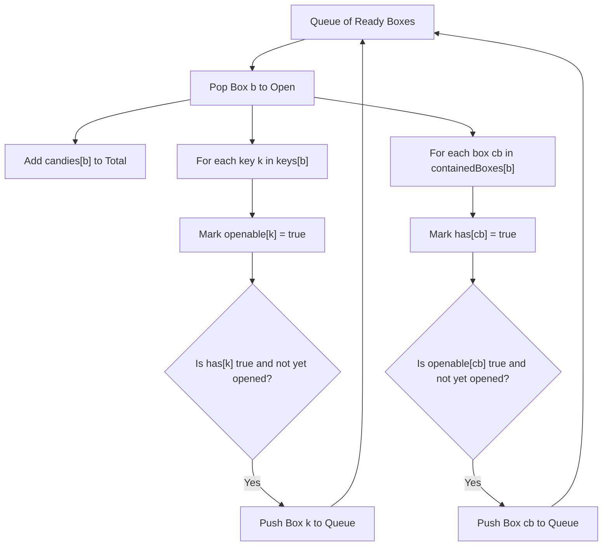

# Guided Example: Maximum Candies You Can Get from Boxes

We trace the step-by-step stateful reachability search unlocking physical containers and collecting items on a representative problem instance:

- **Input:**
  - `status = [1, 0, 1, 0]`
  - `candies = [7, 5, 4, 100]`
  - `keys = [[], [], [1], []]`
  - `containedBoxes = [[1, 2], [3], [], []]`
  - `initialBoxes = [0]`
- **Required Output:** `16`

This instance illustrates asynchronous prerequisite satisfaction (possessing a box before its key vs acquiring a key before its box), dependency-graph traversal, and monotonic reachability expansion.

---

## 1. Instance & Teaching Goal

We are given $4$ boxes indexed $0, 1, 2, 3$. Opening a box $b$ requires satisfying two simultaneous conditions:
1. **Physical Possession:** The box is either in `initialBoxes` or was discovered inside another opened box.
2. **Unlocked Status:** The box is either already open (`status[b] = 1`) or a key for box $b$ was found inside another opened box.

Upon opening box $b$, we:
- Collect its `candies[b]`.
- Add all boxes in `containedBoxes[b]` to our inventory of possessed boxes.
- Add all keys in `keys[b]` to our inventory of keys, unlocking the corresponding boxes.

```
Initial Possession: Box 0 (Open, 7 candies)

Opening Sequence:
  Step 1: Open Box 0
          --> Candies: +7 (Total: 7)
          --> Discovers: Box 1 (Locked) and Box 2 (Open)

  Step 2: Open Box 2 (Possessed & Open)
          --> Candies: +4 (Total: 11)
          --> Discovers: Key for Box 1!
          --> Box 1 is now both Possessed and Unlocked!

  Step 3: Open Box 1 (Now Unlocked)
          --> Candies: +5 (Total: 16)
          --> Discovers: Box 3 (Locked)

  Step 4: Box 3 is possessed, but locked with no key available.
          Search terminates.

Total Candies Collected: 16
```

A naive traversal that checks only currently open boxes risks getting stuck if a key to unlock an existing box is discovered later.
The optimal strategy maintains two independent state predicates for each box: `possessed[b]` and `unlocked[b]`. Whenever both conditions become true for an unvisited box, it enters the processing queue.

---

## 2. Conceptual Foundation & Invariants

Let $n$ be the number of boxes. For each box $b \in [0, n - 1]$, we track three boolean states:
- $\text{has}[b]$: Whether box $b$ has been physically acquired.
- $\text{openable}[b]$: Whether box $b$ is unlocked (`status[b] == 1` initially or unlocked by a key).
- $\text{opened}[b]$: Whether box $b$ has already been processed and its candies collected.

### The Conjunction Invariant
A box $b$ can be queued for opening if and only if:
$$
\text{has}[b] = \text{true} \quad \land \quad \text{openable}[b] = \text{true} \quad \land \quad \text{opened}[b] = \text{false}
$$

Either condition can become true first:
1. **Box First, Key Later:** Box $1$ is acquired in Step 1 ($\text{has}[1] = \text{true}$), but remains locked ($\text{openable}[1] = \text{false}$). In Step 2, key $1$ is found, setting $\text{openable}[1] = \text{true}$. Since $\text{has}[1]$ is already true, Box $1$ immediately triggers and enters the queue.
2. **Key First, Box Later:** If a key is discovered before the box itself is found, the box is marked $\text{openable}[b] = \text{true}$. When the box is eventually acquired, it triggers immediately.

| Box ID | Initial Status | Initial Possession | Candies | Contained Boxes | Contained Keys |
|---|---|---|---|---|---|
| $0$ | Open ($1$) | Yes (Start) | $7$ | $[1, 2]$ | None |
| $1$ | Locked ($0$) | No | $5$ | $[3]$ | None |
| $2$ | Open ($1$) | No | $4$ | None | $[1]$ (Key to Box 1) |
| $3$ | Locked ($0$) | No | $100$ | None | None |

> **Monotonic Discovery Invariant.** Possession and unlocked status are strictly monotonic (once acquired or unlocked, they are never lost). Every box is opened at most once, guaranteeing linear traversal without cycles.



---

## 3. Step-by-Step Worked Execution

### Initialization
- $\text{has} = \{0\}$, $\text{opened} = \emptyset$.
- $\text{openable}$ from initial `status`: Box $0$ is open, Box $2$ is open.
- Ready to open: Box $0$ is both possessed and open.
- Queue: $[0]$. Running candies: $0$.

---

### Round 1: Processing Box 0
- Pop Box $0$ from queue. Mark $\text{opened}[0] = \text{true}$.
- Collect candies: $\text{candies} \leftarrow 0 + 7 = 7$.
- Inspect contained keys: `keys[0] = []` (no keys).
- Inspect contained boxes: `containedBoxes[0] = [1, 2]`.
  - **Box 1:**
    - Mark $\text{has}[1] = \text{true}$.
    - Status check: $\text{openable}[1] = \text{false}$ (Locked).
    - Cannot open yet. Box 1 waits in inventory.
  - **Box 2:**
    - Mark $\text{has}[2] = \text{true}$.
    - Status check: $\text{openable}[2] = \text{true}$ (Open).
    - Condition satisfied: Push Box $2$ to queue.
- State at end of round:
  - Queue: $[2]$
  - Total candies: $7$
  - Possessed: $\{0, 1, 2\}$
  - Unlocked: $\{0, 2\}$

---

### Round 2: Processing Box 2
- Pop Box $2$ from queue. Mark $\text{opened}[2] = \text{true}$.
- Collect candies: $\text{candies} \leftarrow 7 + 4 = 11$.
- Inspect contained boxes: `containedBoxes[2] = []`.
- Inspect contained keys: `keys[2] = [1]`.
  - **Key 1:**
    - Unlocks Box 1: Mark $\text{openable}[1] = \text{true}$.
    - Check inventory: Box 1 is already possessed ($\text{has}[1] = \text{true}$) and not yet opened!
    - Condition satisfied: Push Box $1$ to queue!
- State at end of round:
  - Queue: $[1]$
  - Total candies: $11$
  - Possessed: $\{0, 1, 2\}$
  - Unlocked: $\{0, 1, 2\}$

---

### Round 3: Processing Box 1
- Pop Box $1$ from queue. Mark $\text{opened}[1] = \text{true}$.
- Collect candies: $\text{candies} \leftarrow 11 + 5 = 16$.
- Inspect contained keys: `keys[1] = []`.
- Inspect contained boxes: `containedBoxes[1] = [3]`.
  - **Box 3:**
    - Mark $\text{has}[3] = \text{true}$.
    - Status check: $\text{openable}[3] = \text{false}$ (Locked, no key).
    - Cannot open. Box 3 waits in inventory.
- State at end of round:
  - Queue: $\emptyset$ (Empty).
  - Total candies: $16$

---

### Termination
The queue is empty. Box $3$ is possessed but locked, and no further keys exist.
Evaluation terminates with total candies $16$.

---

## 4. Complete Execution Trace

| Step | Action Taken | Possessed Set | Unlocked Set | Queue State | Candies Added | Cumulative Candies |
|---|---|---|---|---|---|---|
| Init | Initial setup | $\{0\}$ | $\{0, 2\}$ | $[0]$ | $0$ | $0$ |
| 1 | Open Box 0 | $\{0, 1, 2\}$ | $\{0, 2\}$ | $[2]$ | $+7$ | $7$ |
| 2 | Open Box 2 (Found Key 1) | $\{0, 1, 2\}$ | $\{0, 1, 2\}$ | $[1]$ | $+4$ | $11$ |
| 3 | Open Box 1 (Found Box 3) | $\{0, 1, 2, 3\}$ | $\{0, 1, 2\}$ | $\emptyset$ | $+5$ | $16$ |
| End | Queue exhausted | $\{0, 1, 2, 3\}$ | $\{0, 1, 2\}$ | $\emptyset$ | $0$ | $16$ |

---

## 5. Algorithmic Correctness

**Soundness.** A box is opened only when both $\text{has}[b] = \text{true}$ (it was present initially or found inside an already opened box) and $\text{openable}[b] = \text{true}$ (it was initially unlocked or its key was retrieved from an already opened box). This strictly adheres to the physical rules of the system. Each box is processed at most once, ensuring candies are never duplicated.

**Completeness.** Whenever a new key is obtained or a new box is acquired, the algorithm immediately tests whether the companion requirement is already met. Since dependencies are evaluated on every discovery and possession is monotonic, no box that is both physically reachable and unlockable can remain unqueued.

---

## 6. Traps This Instance Exposes

- **Missing delayed unlocking:** Storing Box 1 as locked and failing to recheck it when Key 1 is discovered would prematurely terminate the search, missing the $5$ candies in Box 1.
- **Unpossessed keys:** Finding a key for a box that is never acquired must not crash or increment candy counts. Only boxes that are both possessed and unlocked can be opened.
- **Cycles in box containment:** If Box $A$ contains Box $B$ and Box $B$ contains Box $A$, tracking $\text{opened}$ prevents infinite loops.

---

## 7. Complexity Derivation

- **Time Complexity:** $\mathcal{O}(N)$, where $N$ is the total number of boxes.
  Each box enters the queue at most once. When opened, its contained boxes and keys are traversed once. The total work is proportional to the total number of boxes plus the sum of lengths of `keys` and `containedBoxes`, which is bounded by $\mathcal{O}(N)$.
- **Auxiliary Space Complexity:** $\mathcal{O}(N)$ to maintain the queue, the possession set, and the opened boolean markers.
