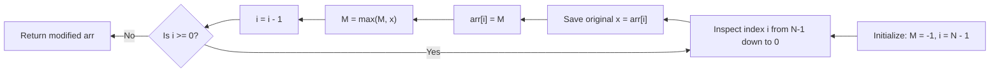

# Guided Example: Replace Elements with Greatest Element on Right Side

We trace the step-by-step reverse traversal computing suffix maxima on a representative problem instance:

- **Input:** `arr = [17, 18, 5, 4, 6, 1]`
- **Required Output:** `[18, 6, 6, 6, 1, -1]`

This instance illustrates reverse linear scanning, maintaining a running suffix maximum accumulator, and in-place array mutation without auxiliary buffers.

---

## 1. Instance & Teaching Goal

We must replace each element $\text{arr}[i]$ in an array of $N = 6$ integers with the maximum value among all elements strictly to its right:
$$
\text{target}[i] = \max_{j > i} \text{arr}[j]
$$
The last element $\text{arr}[N - 1]$ has no elements to its right, so its value is replaced with $-1$.

For `arr = [17, 18, 5, 4, 6, 1]`:
- Elements to the right of index $0$: $\{18, 5, 4, 6, 1\} \implies \max = 18$
- Elements to the right of index $1$: $\{5, 4, 6, 1\} \implies \max = 6$
- Elements to the right of index $2$: $\{4, 6, 1\} \implies \max = 6$
- Elements to the right of index $3$: $\{6, 1\} \implies \max = 6$
- Elements to the right of index $4$: $\{1\} \implies \max = 1$
- Elements to the right of index $5$: $\emptyset \implies -1$

```
Index:         0     1     2     3     4     5
Original:    [17]  [18]   [5]   [4]   [6]   [1]
Suffix Max:   18     6     6     6     1    -1

Reverse Execution (Right to Left):
  Step 1: i = 5 (value 1)  --> Assigned -1, Horizon becomes max(-1, 1) = 1
  Step 2: i = 4 (value 6)  --> Assigned  1, Horizon becomes max(1, 6)  = 6
  Step 3: i = 3 (value 4)  --> Assigned  6, Horizon remains 6
  Step 4: i = 2 (value 5)  --> Assigned  6, Horizon remains 6
  Step 5: i = 1 (value 18) --> Assigned  6, Horizon becomes max(6, 18) = 18
  Step 6: i = 0 (value 17) --> Assigned 18, Horizon remains 18
```

A forward scan requires $\mathcal{O}(N - 1 - i)$ comparisons for each index $i$, leading to $\mathcal{O}(N^2)$ quadratic time.
Traversing in reverse (from $N - 1$ down to $0$) allows each position to reuse the suffix maximum of the preceding elements in $\mathcal{O}(1)$ time, yielding an optimal $\mathcal{O}(N)$ in-place algorithm.

---

## 2. Conceptual Foundation & Invariants

Let $M_i = \max_{j > i} \text{arr}[j]$ denote the suffix maximum for index $i$.

### Recurrence Relation
Between consecutive suffix maxima:
$$
M_{i-1} = \max(M_i, \; \text{arr}[i])
$$
with base condition:
$$
M_{N-1} = -1
$$

### In-Place Replacement Protocol
To update the array in-place without overwriting an original value before it can contribute to $M$:
1. Read and temporarily save the current value: $x \leftarrow \text{arr}[i]$.
2. Overwrite $\text{arr}[i]$ with the current running maximum: $\text{arr}[i] \leftarrow M$.
3. Update the running maximum for earlier elements: $M \leftarrow \max(M, x)$.

| Reverse Step | Index $i$ | Original Value $x$ | Incoming Horizon $M$ | New Cell Value $\text{arr}[i]$ | Outgoing Horizon $M \leftarrow \max(M, x)$ |
|---|---|---|---|---|---|
| 1 | $5$ | $1$ | $-1$ | $-1$ | $\max(-1, 1) = 1$ |
| 2 | $4$ | $6$ | $1$ | $1$ | $\max(1, 6) = 6$ |
| 3 | $3$ | $4$ | $6$ | $6$ | $\max(6, 4) = 6$ |
| 4 | $2$ | $5$ | $6$ | $6$ | $\max(6, 5) = 6$ |
| 5 | $1$ | $18$ | $6$ | $6$ | $\max(6, 18) = 18$ |
| 6 | $0$ | $17$ | $18$ | $18$ | $\max(18, 17) = 18$ |

> **Suffix Horizon Invariant.** When processing index $i$, accumulator $M$ contains the exact maximum value among all elements originally located at indices $j \in [i + 1, N - 1]$. Updating $\text{arr}[i]$ and then refreshing $M$ preserves this invariant for index $i - 1$.



---

## 3. Step-by-Step Worked Execution

We trace `arr = [17, 18, 5, 4, 6, 1]` with $N = 6$. Initial state: $M = -1$.

### Step 1 ($i = 5$, Last Element)
- Original value: $x = \text{arr}[5] = 1$.
- Overwrite $\text{arr}[5]$ with current $M = -1$:
  $$
  \text{arr}[5] \leftarrow -1
  $$
- Update horizon:
  $$
  M \leftarrow \max(-1, 1) = 1
  $$
- Array state: `[17, 18, 5, 4, 6, -1]`.

### Step 2 ($i = 4$)
- Original value: $x = \text{arr}[4] = 6$.
- Overwrite $\text{arr}[4]$ with current $M = 1$:
  $$
  \text{arr}[4] \leftarrow 1
  $$
- Update horizon:
  $$
  M \leftarrow \max(1, 6) = 6
  $$
- Array state: `[17, 18, 5, 4, 1, -1]`.

### Step 3 ($i = 3$)
- Original value: $x = \text{arr}[3] = 4$.
- Overwrite $\text{arr}[3]$ with current $M = 6$:
  $$
  \text{arr}[3] \leftarrow 6
  $$
- Update horizon:
  $$
  M \leftarrow \max(6, 4) = 6
  $$
- Array state: `[17, 18, 5, 6, 1, -1]`.

### Step 4 ($i = 2$)
- Original value: $x = \text{arr}[2] = 5$.
- Overwrite $\text{arr}[2]$ with current $M = 6$:
  $$
  \text{arr}[2] \leftarrow 6
  $$
- Update horizon:
  $$
  M \leftarrow \max(6, 5) = 6
  $$
- Array state: `[17, 18, 6, 6, 1, -1]`.

### Step 5 ($i = 1$)
- Original value: $x = \text{arr}[1] = 18$.
- Overwrite $\text{arr}[1]$ with current $M = 6$:
  $$
  \text{arr}[1] \leftarrow 6
  $$
- Update horizon:
  $$
  M \leftarrow \max(6, 18) = 18
  $$
- Array state: `[17, 6, 6, 6, 1, -1]`.

### Step 6 ($i = 0$, First Element)
- Original value: $x = \text{arr}[0] = 17$.
- Overwrite $\text{arr}[0]$ with current $M = 18$:
  $$
  \text{arr}[0] \leftarrow 18
  $$
- Update horizon:
  $$
  M \leftarrow \max(18, 17) = 18
  $$
- Final array state: `[18, 6, 6, 6, 1, -1]`.

---

## 4. Complete Execution Trace

| Pass Order | Array Index $i$ | Preserved $x$ | Applied Replacement $M$ | New Horizon $\max(M, x)$ | In-Progress Array |
|---|---|---|---|---|---|
| Init | - | - | - | $-1$ | `[17, 18, 5, 4, 6, 1]` |
| 1 | $5$ | $1$ | $-1$ | $1$ | `[17, 18, 5, 4, 6, -1]` |
| 2 | $4$ | $6$ | $1$ | $6$ | `[17, 18, 5, 4, 1, -1]` |
| 3 | $3$ | $4$ | $6$ | $6$ | `[17, 18, 5, 6, 1, -1]` |
| 4 | $2$ | $5$ | $6$ | $6$ | `[17, 18, 6, 6, 1, -1]` |
| 5 | $1$ | $18$ | $6$ | $18$ | `[17, 6, 6, 6, 1, -1]` |
| 6 | $0$ | $17$ | $18$ | $18$ | `[18, 6, 6, 6, 1, -1]` |

---

## 5. Algorithmic Correctness

**Soundness.** For any index $i$, the value written into $\text{arr}[i]$ is $M$. By induction on the reverse loop, $M$ is the maximum of all values originally at indices $j \in [i + 1, N - 1]$. For $i = N - 1$, $M = -1$ by definition. Thus, every element is correctly assigned the strict maximum of its right-hand suffix.

**Completeness.** Every index from $N - 1$ down to $0$ is visited exactly once. Because the current cell's original value is cached in register $x$ before $\text{arr}[i]$ is overwritten, no input value is lost before it can be folded into $M$, guaranteeing correct outputs for all positions.

---

## 6. Traps This Instance Exposes

- **Overwriting before caching:** Writing $\text{arr}[i] \leftarrow M$ before reading $\text{arr}[i]$ into a temporary variable destroys the original value, causing the running maximum to incorrectly absorb $M$ instead of the true element.
- **Single-element array:** If $N = 1$ (e.g. `[400]`), the loop executes once for $i = 0$, assigning $-1$ and immediately returning `[-1]`, which is correct.
- **Strictly decreasing array:** If `arr = [5, 4, 3, 2, 1]`, each element is replaced by its immediate right neighbor, producing `[4, 3, 2, 1, -1]`. The running maximum naturally tracks this without special handling.

---

## 7. Complexity Derivation

- **Time Complexity:** $\mathcal{O}(N)$, where $N$ is the length of `arr`. The algorithm makes a single reverse pass over the array, performing $\mathcal{O}(1)$ operations (assignment, comparison, maximum) per element.
- **Auxiliary Space Complexity:** $\mathcal{O}(1)$. The algorithm modifies the input array in-place, requiring only two scalar variables ($M$ and $x$).
