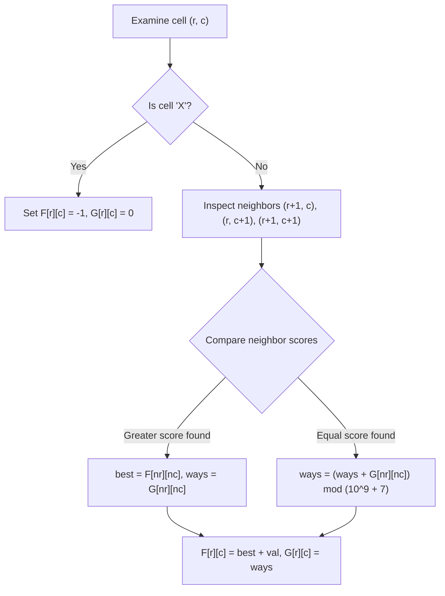

# Guided Example: Number of Paths with Max Score

We trace the dynamic programming recurrence on a representative grid instance, tracking both the maximum collected numeric score and the total number of distinct maximal paths:

- **Input:** `board = ["E23", "2X2", "12S"]`
- **Required Output:** `[7, 1]`

This instance demonstrates handling grid obstacles (`'X'`), multi-directional path propagation (up, left, and diagonal up-left), tracking tie-breaking path multiplicities, and modular arithmetic.

---

## 1. Instance & Teaching Goal

We are given an $N \times N$ square grid where:
- `'S'` is at the bottom-right corner $(N-1, N-1)$, representing the start with score $0$.
- `'E'` is at the top-left corner $(0, 0)$, representing the destination with score $0$.
- Digits `'1'` through `'9'` represent walkable cells contributing their integer values.
- `'X'` represents an obstacle that cannot be entered.

From any cell $(r, c)$, valid moves proceed towards `'E'`:
1. Up: $(r - 1, c)$
2. Left: $(r, c - 1)$
3. Diagonal Up-Left: $(r - 1, c - 1)$

Equivalently, traversing backwards from `'S'` at $(N-1, N-1)$ to `'E'` at $(0, 0)$, a cell $(r, c)$ receives transitions from its three forward neighbors in reverse direction:
$$
\text{Neighbors of } (r, c) \in \{(r+1, c), \; (r, c+1), \; (r+1, c+1)\}
$$

```
Grid Coordinates & Values:
  c=0    c=1    c=2
r=0 [ 'E' ]  [ '2' ]  [ '3' ]
r=1 [ '2' ]  [ 'X' ]  [ '2' ]
r=2 [ '1' ]  [ '2' ]  [ 'S' ]

Permitted reverse movements towards top-left:
  (r, c) <-- (r+1, c)       [from bottom]
  (r, c) <-- (r, c+1)       [from right]
  (r, c) <-- (r+1, c+1)     [from bottom-right diagonal]
```

A naive depth-first search explores $3^{2N}$ paths, causing exponential blowup. By computing optimal subproblems in reverse topological order (from row $N-1$ down to $0$, and column $N-1$ down to $0$), dynamic programming evaluates each cell in $\mathcal{O}(1)$ time.

---

## 2. Conceptual Foundation & Invariants

Let $(r, c)$ denote a cell index. We maintain two matrices:
- $F[r][c]$: The maximum score achievable on any valid path from $(r, c)$ to the start `'S'`. If $(r, c)$ is unreachable, $F[r][c] = -1$.
- $G[r][c]$: The number of distinct paths from $(r, c)$ to `'S'` that achieve exactly $F[r][c]$, computed modulo $10^9 + 7$.

### Dual State Recurrence
For each reachable neighbor $(nr, nc) \in \{(r+1, c), (r, c+1), (r+1, c+1)\}$ where $F[nr][nc] \ge 0$:
1. If $F[nr][nc] > \text{best\_score}$:
   $$
   \text{best\_score} \leftarrow F[nr][nc], \quad \text{ways} \leftarrow G[nr][nc]
   $$
2. If $F[nr][nc] == \text{best\_score}$:
   $$
   \text{ways} \leftarrow (\text{ways} + G[nr][nc]) \pmod{10^9 + 7}
   $$

If at least one neighbor is reachable and $(r, c)$ is not an obstacle:
$$
F[r][c] = \text{best\_score} + \text{value}(board[r][c])
$$
where $\text{value}('E') = 0$, $\text{value}('S') = 0$, and $\text{value}(d) = d - '0'$ for digit characters.

| Cell Type | Reachability Rule | Score Contribution |
|---|---|---|
| Start `'S'` | Base seed at $(N-1, N-1)$ | $F = 0, \; G = 1$ |
| Digit `'1'..'9'` | Requires $\ge 1$ reachable neighbor | $F = \max(F_{\text{nbr}}) + \text{digit}$ |
| Obstacle `'X'` | Strictly blocked | $F = -1, \; G = 0$ |
| Destination `'E'` | Target terminal at $(0, 0)$ | $F = \max(F_{\text{nbr}}) + 0$ |

> **Score and Multiplicity Invariant.** Upon completing row $r$ and column $c$, $F[r][c]$ holds the exact maximum path sum from $(r, c)$ to $(N-1, N-1)$, and $G[r][c]$ holds the total number of paths attaining that maximum sum modulo $10^9+7$.



---

## 3. Step-by-Step Worked Execution

We trace `board = ["E23", "2X2", "12S"]` of dimension $N = 3$.

### Bottom Row: $r = 2$
- **Cell $(2, 2) = 'S'$:**
  Base initialization: $F[2][2] = 0, \; G[2][2] = 1$.
- **Cell $(2, 1) = '2'$:**
  Only right neighbor $(2, 2)$ exists in the grid: $F[2][2] = 0, G[2][2] = 1$.
  $$
  F[2][1] = 0 + 2 = 2, \quad G[2][1] = 1
  $$
- **Cell $(2, 0) = '1'$:**
  Only right neighbor $(2, 1)$ exists: $F[2][1] = 2, G[2][1] = 1$.
  $$
  F[2][0] = 2 + 1 = 3, \quad G[2][0] = 1
  $$

### Middle Row: $r = 1$
- **Cell $(1, 2) = '2'$:**
  Only bottom neighbor $(2, 2)$ exists: $F[2][2] = 0, G[2][2] = 1$.
  $$
  F[1][2] = 0 + 2 = 2, \quad G[1][2] = 1
  $$
- **Cell $(1, 1) = 'X'$:**
  Obstacle cell:
  $$
  F[1][1] = -1, \quad G[1][1] = 0
  $$
- **Cell $(1, 0) = '2'$:**
  Available neighbors:
  - Bottom $(2, 0)$: $F[2][0] = 3, G[2][0] = 1$.
  - Bottom-right diagonal $(2, 1)$: $F[2][1] = 2, G[2][1] = 1$.
  - Right $(1, 1)$: $F[1][1] = -1$ (blocked).
  Maximum score comes strictly from bottom neighbor $(2, 0)$ with score $3$:
  $$
  F[1][0] = 3 + 2 = 5, \quad G[1][0] = 1
  $$

### Top Row: $r = 0$
- **Cell $(0, 2) = '3'$:**
  Only bottom neighbor $(1, 2)$ exists: $F[1][2] = 2, G[1][2] = 1$.
  $$
  F[0][2] = 2 + 3 = 5, \quad G[0][2] = 1
  $$
- **Cell $(0, 1) = '2'$:**
  Available neighbors:
  - Bottom $(1, 1)$: $F[1][1] = -1$ (obstacle).
  - Right $(0, 2)$: $F[0][2] = 5, G[0][2] = 1$.
  - Bottom-right $(1, 2)$: $F[1][2] = 2, G[1][2] = 1$.
  Maximum score among neighbors is $5$ from $(0, 2)$:
  $$
  F[0][1] = 5 + 2 = 7, \quad G[0][1] = 1
  $$
- **Cell $(0, 0) = 'E'$:**
  Available neighbors:
  - Bottom $(1, 0)$: $F[1][0] = 5, G[1][0] = 1$.
  - Right $(0, 1)$: $F[0][1] = 7, G[0][1] = 1$.
  - Diagonal $(1, 1)$: $F[1][1] = -1$ (obstacle).
  Maximum score among neighbors is $7$ from $(0, 1)$ with path count $1$.
  $$
  F[0][0] = 7 + 0 = 7, \quad G[0][0] = 1
  $$

---

## 4. Complete Execution Trace

| Step | Cell $(r, c)$ | Char | Evaluated Neighbors | Best Neighbor $(F^*, G^*)$ | Computed $(F[r][c], G[r][c])$ |
|---|---|---|---|---|---|
| 1 | $(2, 2)$ | `'S'` | Initial state | - | $(0, 1)$ |
| 2 | $(2, 1)$ | `'2'` | $(2, 2): (0, 1)$ | $(0, 1)$ | $(2, 1)$ |
| 3 | $(2, 0)$ | `'1'` | $(2, 1): (2, 1)$ | $(2, 1)$ | $(3, 1)$ |
| 4 | $(1, 2)$ | `'2'` | $(2, 2): (0, 1)$ | $(0, 1)$ | $(2, 1)$ |
| 5 | $(1, 1)$ | `'X'` | Obstacle | - | $(-1, 0)$ |
| 6 | $(1, 0)$ | `'2'` | $(2, 0):(3, 1), (2, 1):(2, 1)$ | $(3, 1)$ | $(5, 1)$ |
| 7 | $(0, 2)$ | `'3'` | $(1, 2): (2, 1)$ | $(2, 1)$ | $(5, 1)$ |
| 8 | $(0, 1)$ | `'2'` | $(0, 2):(5, 1), (1, 2):(2, 1)$ | $(5, 1)$ | $(7, 1)$ |
| 9 | $(0, 0)$ | `'E'` | $(0, 1):(7, 1), (1, 0):(5, 1)$ | $(7, 1)$ | $(7, 1)$ |

---

## 5. Algorithmic Correctness

**Soundness.** Since the directed graph of moves is a directed acyclic graph (each move decreases $r$, $c$, or both), processing in reverse coordinate order guarantees that whenever cell $(r, c)$ is considered, all potential transitions have already attained their true optimal values. Maintaining $G[r][c]$ by summing $G$ over all tied optimal predecessors correctly counts all distinct maximal paths.

**Completeness.** If destination `'E'` is disconnected from `'S'` by a barrier of obstacles, $F[0][0]$ remains $-1$, triggering the fallback output `[0, 0]`. Otherwise, $F[0][0] \ge 0$, and the pair $[F[0][0], \; G[0][0] \bmod (10^9 + 7)]$ accurately reports the maximum sum and total paths.

---

## 6. Traps This Instance Exposes

- **Ignoring tie paths:** When two different neighbor directions yield the identical maximum score $F^*$, failing to sum their path counts loses distinct optimal trajectories.
- **Stepping on obstacles:** An obstacle cell `'X'` must never propagate paths ($G = 0$) nor valid scores ($F = -1$).
- **Destination score addition:** Cell `'E'` is a label, not a numeric digit. Adding the ASCII value of `'E'` corrupts the final score; its numeric contribution is strictly $0$.
- **Modular overflow:** When grid sizes reach $100 \times 100$, total maximal paths can grow exponentially. Multiplicities must be reduced modulo $10^9 + 7$ at each addition.

---

## 7. Complexity Derivation

- **Time Complexity:** $\mathcal{O}(N^2)$. An $N \times N$ matrix contains $N^2$ cells. Each cell inspects at most $3$ adjacent neighbors, performing a constant number of arithmetic operations and comparisons.
- **Auxiliary Space Complexity:** $\mathcal{O}(N^2)$ for the dynamic programming score and count tables (or $\mathcal{O}(N)$ if compressed to two rows given row-by-row dependency).