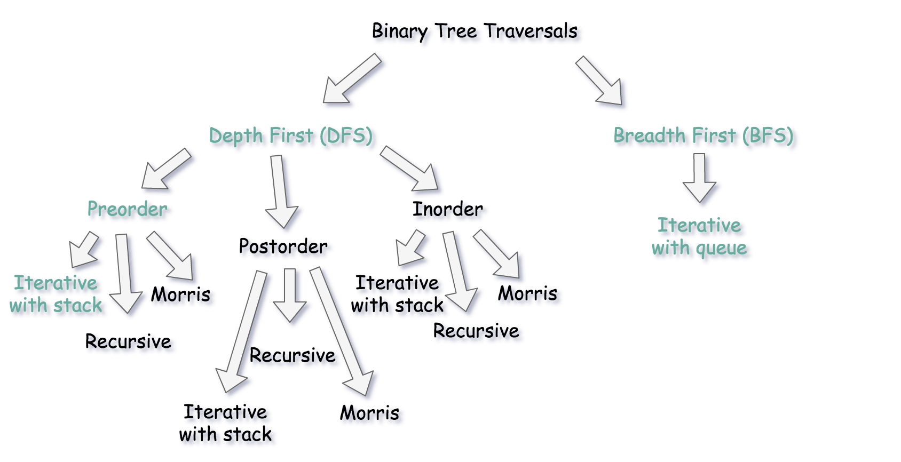
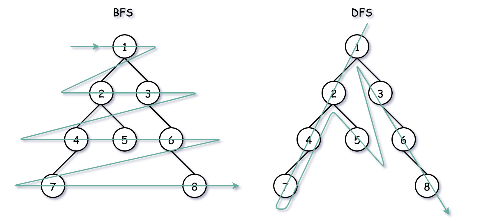
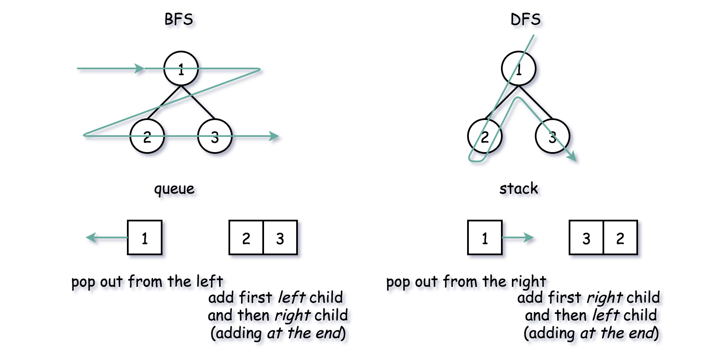
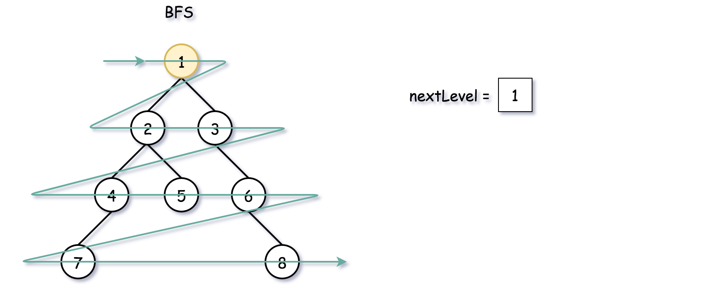
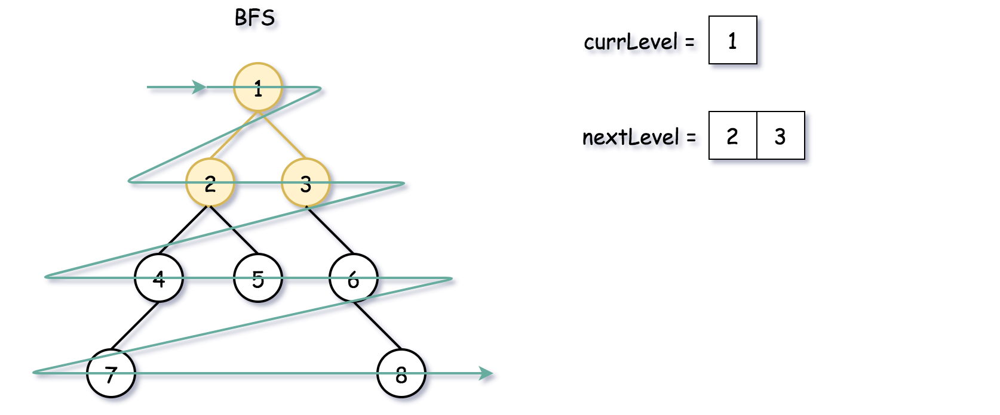
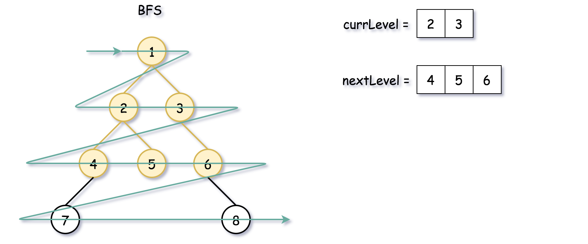
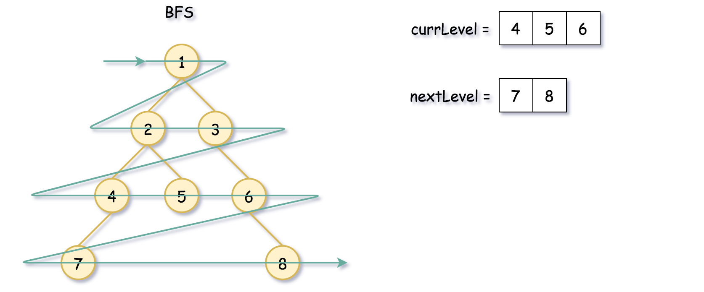
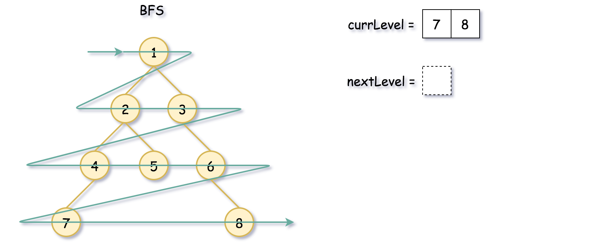
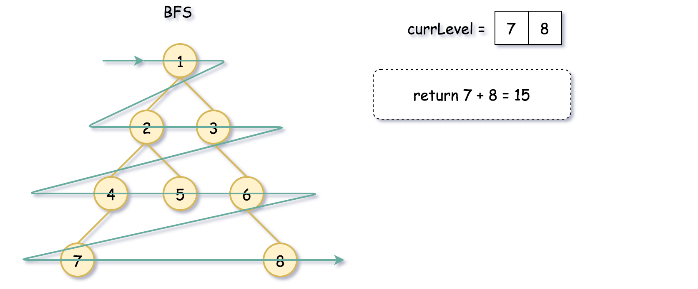

[TOC]

## Solution

---

### Overview

**DFS vs BFS**

There are two ways to traverse the tree: DFS _depth first search_ and BFS _breadth first search_. Here is a small summary



> Let's use this problem to discuss the difference between _iterative BFS traversal with the queue_ and _iterative DFS preorder traversal with the stack_.

Both start from the root and go down, both use additional structures, what's the difference?

Here is how it looks at the big scale: BFS traverses level by level, and DFS first goes to the leaves.



Now let's go down to the implementation. The idea is similar:

- Push root into queue (BFS) or stack (DFS).

- At each step pop out one node, and push its children into stack/queue.

For BFS: pop out from the _left_, first push the _left_ child, and then the _right_ one.

For DFS: pop out from the _right_, first push the _right_ child, and then the _left_ one.



<br />
<br />

---
### Approach 1: Iterative DFS Preorder Traversal.

**Intuition**

Here we implement standard iterative preorder traversal with the stack:

- Push root into the stack.

- While the stack is not empty:

- Pop out a node from the stack and update the current number.

- If the node is a leaf

- Update the deepest leaves sum $\text{deepest}_{sum}$.

- Push right and left child nodes into the stack.

- Return $\text{deepest}_{sum}$.

**Implementation**

Note, that
[Javadocs recommends to use ArrayDeque, and not Stack as a stack implementation](https://docs.oracle.com/javase/8/docs/api/java/util/ArrayDeque.html).

```python
class Solution:
    def deepestLeavesSum(self, root: TreeNode) -> int:
        deepest_sum = depth = 0
        stack = [(root, 0) ]

        while stack:
            node, curr_depth = stack.pop()
            if node.left is None and node.right is None:
                # if this leaf is the deepest one seen so far
                if depth < curr_depth:
                    deepest_sum = node.val      # start new sum
                    depth = curr_depth          # note new depth
                # if there were already leaves at this depth
                elif depth == curr_depth:
                    deepest_sum += node.val     # update existing sum

            else:
                if node.right:
                    stack.append((node.right, curr_depth + 1))
                if node.left:
                    stack.append((node.left, curr_depth + 1))

        return deepest_sum
```

**Complexity Analysis**

* Time complexity: $\mathcal{O}(N)$ since one has to visit each node.

* Space complexity: up to $\mathcal{O}(H)$ to keep the stack, where $H$ is a tree height.
<br />
<br />

---
### Approach 2: Iterative BFS Traversal.

**Intuition**

Here we implement standard traversal using a queue:

- Add root into queue.

- While queue is not empty:

- Pop out a node from queue and update the current number.

- If the node is a leaf:

- Update the deepest leaves sum $\text{deepest}_{sum}$.

- Add first _left_ and then _right_ child node into queue.

- Return $\text{deepest}_{sum}$.

**Implementation**

```python
class Solution:
    def deepestLeavesSum(self, root: TreeNode) -> int:
        deepest_sum = depth = 0
        queue = deque([(root, 0),])

        while queue:
            node, curr_depth = queue.popleft()
            if node.left is None and node.right is None:
                # if this leaf is the deepest one seen so far
                if depth < curr_depth:
                    deepest_sum = node.val      # start new sum
                    depth = curr_depth          # note new depth
                # if there were already leaves at this depth
                elif depth == curr_depth:
                    deepest_sum += node.val     # update existing sum
            else:
                if node.left:
                    queue.append((node.left, curr_depth + 1))
                if node.right:
                    queue.append((node.right, curr_depth + 1))

        return deepest_sum
```

**Complexity Analysis**

* Time complexity: $\mathcal{O}(N)$ since one has to visit each node.

* Space complexity: up to $\mathcal{O}(N)$ to keep the queue. Let's use the last level to estimate the queue size. This level could contain up to $N/2$ tree nodes in the case of [complete binary tree](https://leetcode.com/problems/count-complete-tree-nodes/).
<br />
<br />

---
### Approach 3: Optimized Iterative BFS Traversal.

**Intuition**

The code in Approach 2 is not the optimal one. It's done this way to simplify DFS vs BFS comparison but now let's move further. Since we traverse level by level, it's enough just to check if this level is the last one. If it's the case, return the sum of all nodes' values.













**Implementation**

```python
class Solution:
    def deepestLeavesSum(self, root: TreeNode) -> int:
        next_level = deque([root,])

        while next_level:
            # prepare for the next level
            curr_level = next_level
            next_level = deque()

            for node in curr_level:
                # add child nodes of the current level
                # in the queue for the next level
                if node.left:
                    next_level.append(node.left)
                if node.right:
                    next_level.append(node.right)

        return sum([node.val for node in curr_level])
```

**Complexity Analysis**

* Time complexity: $\mathcal{O}(N)$ since one has to visit each node.

* Space complexity: up to $\mathcal{O}(N)$ to keep the queues. Let's use the last level to estimate the queue size. This level could contain up to $N/2$ tree nodes in the case of [complete binary tree](https://leetcode.com/problems/count-complete-tree-nodes/).
<br />
<br />

___