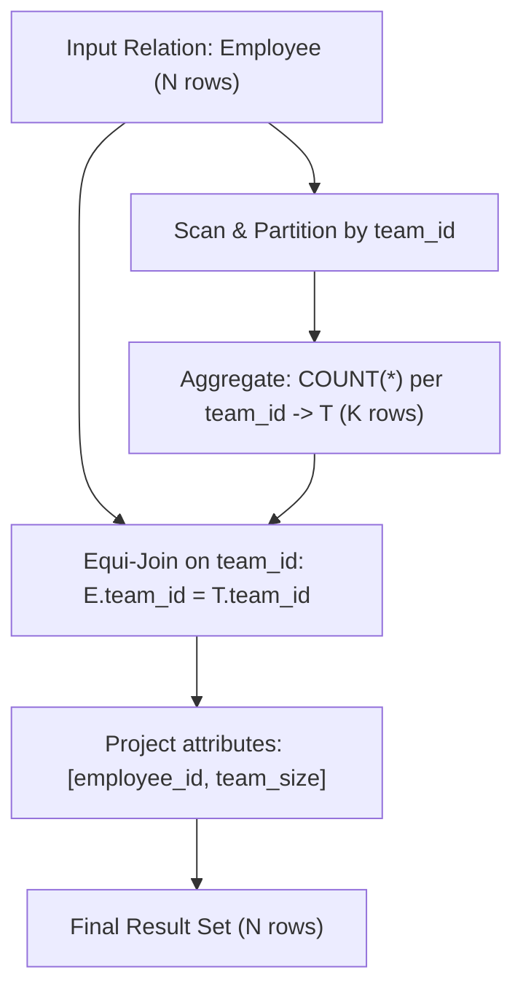

# Guided Example: Find the Team Size

We trace the step-by-step relational evaluation computing each employee's team size on a representative database instance:

- **Input:** `Employee` relation with tuples:
  $$\{(1, 8), \; (2, 8), \; (3, 8), \; (4, 7), \; (5, 9), \; (6, 9)\}$$
- **Required Output:** Relation with attributes `[employee_id, team_size]`:
  $$\{(1, 3), \; (2, 3), \; (3, 3), \; (4, 1), \; (5, 2), \; (6, 2)\}$$

This instance demonstrates partitioning relational tuples by team attribute, computing group cardinalities, and broadcasting group sizes back to individual member rows without loss of granular employee identities.

---

## 1. Instance & Teaching Goal

The `Employee` table associates each unique `employee_id` with a `team_id`. We must report each employee alongside the total count of members on their assigned team.

```
Input Employee Relation:
+-------------+---------+
| employee_id | team_id |
+-------------+---------+
|      1      |    8    |
|      2      |    8    |
|      3      |    8    |
|      4      |    7    |
|      5      |    9    |
|      6      |    9    |
+-------------+---------+

Conceptual Execution:
  1. Partition tuples by team_id:
     - Team 8 -> {1, 2, 3} (Size: 3)
     - Team 7 -> {4}       (Size: 1)
     - Team 9 -> {5, 6}    (Size: 2)
  2. Join group cardinalities back to each employee row.
```

A direct grouping aggregation collapses each team into a single tuple, discarding individual employee identifiers. To preserve one output row per employee while incorporating the aggregate group cardinality, the query engine can either:
1. Aggregate group cardinalities into an intermediate relation and equi-join back to the base table on `team_id`.
2. Evaluate an analytic window partition over `team_id`, computing group cardinality in-line.

Both formulations compute identical relational algebra results in linear time with respect to the input size.

---

## 2. Conceptual Foundation & Invariants

Let $E$ denote the input relation with attributes $(e, t)$ where $e = \text{employee\_id}$ and $t = \text{team\_id}$.

### Relational Algebra Formulation
1. **Aggregation Step:** Group $E$ by attribute $t$ and compute group size:
   $$
   T = \gamma_{t, \; \text{COUNT}(*) \to s}(E)
   $$
2. **Equi-Join Step:** Join the summary relation $T$ with the original relation $E$ on matching team identifier $t$:
   $$
   J = E \bowtie_{E.t = T.t} T
   $$
3. **Projection Step:** Retain only the target attributes:
   $$
   \Pi_{e, s}(J)
   $$

| Relational Operator | Input Cardinality | Primary Key Guarantee | Output Attributes |
|---|---|---|---|
| Base Scan ($E$) | $N = 6$ | `employee_id` | $[e, t]$ |
| Grouping ($\gamma$) | $K = 3$ | `team_id` | $[t, s]$ |
| Equi-Join ($\bowtie$) | $N = 6$ | `employee_id` | $[e, t, s]$ |
| Projection ($\Pi$) | $N = 6$ | `employee_id` | $[e, s]$ |

> **Relational Preservation Invariant.** The equi-join between $E$ and $T$ is an exact one-to-one match on the right relation (since $t$ is unique in $T$). Therefore, the output preserves exactly $N$ tuples, matching the original employee cardinality.



---

## 3. Step-by-Step Worked Execution

We trace the relational operators on our sample dataset:

### Step 1: Tuple Partitioning by `team_id`
The engine scans the $6$ input tuples and sorts or hashes them into distinct buckets based on `team_id`:
- Bucket $t = 8$: Tuples with `employee_id` $\in \{1, 2, 3\}$.
- Bucket $t = 7$: Tuples with `employee_id` $\in \{4\}$.
- Bucket $t = 9$: Tuples with `employee_id` $\in \{5, 6\}$.

### Step 2: Cardinality Aggregation
For each bucket, the aggregation operator counts the occurrences of rows:
$$
\text{size}(8) = 3, \quad \text{size}(7) = 1, \quad \text{size}(9) = 2
$$
Intermediate summary relation $T$:
- Tuple $1$: $(8, 3)$
- Tuple $2$: $(7, 1)$
- Tuple $3$: $(9, 2)$

### Step 3: Equi-Join and Projection
Each base row from $E$ looks up its corresponding team size in $T$:
- Employee $1$ ($t = 8$): Matches $(8, 3) \implies (1, 3)$
- Employee $2$ ($t = 8$): Matches $(8, 3) \implies (2, 3)$
- Employee $3$ ($t = 8$): Matches $(8, 3) \implies (3, 3)$
- Employee $4$ ($t = 7$): Matches $(7, 1) \implies (4, 1)$
- Employee $5$ ($t = 9$): Matches $(9, 2) \implies (5, 2)$
- Employee $6$ ($t = 9$): Matches $(9, 2) \implies (6, 2)$

---

## 4. Complete Execution Trace

| `employee_id` | `team_id` | Group Partition | Matched `team_size` | Emitted Result Tuple |
|---|---|---|---|---|
| $1$ | $8$ | $\{1, 2, 3\}$ | $3$ | $(1, 3)$ |
| $2$ | $8$ | $\{1, 2, 3\}$ | $3$ | $(2, 3)$ |
| $3$ | $8$ | $\{1, 2, 3\}$ | $3$ | $(3, 3)$ |
| $4$ | $7$ | $\{4\}$ | $1$ | $(4, 1)$ |
| $5$ | $9$ | $\{5, 6\}$ | $2$ | $(5, 2)$ |
| $6$ | $9$ | $\{5, 6\}$ | $2$ | $(6, 2)$ |

---

## 5. Algorithmic Correctness

**Soundness.** Every employee tuple has an associated `team_id`. By grouping over `team_id`, the aggregate operator computes the true mathematical cardinality $|\{e \mid (e, t) \in E\}|$ for each team $t$. Joining back on $t$ pairs each employee with the exact count of all colleagues sharing that same identifier.

**Completeness.** Since every employee belongs to a team and every team in $E$ is represented in $T$, the join predicate $E.t = T.t$ is satisfied for all $N$ employees without producing null matches or dropping rows.

---

## 6. Traps This Instance Exposes

- **Collapsing output rows:** Using a simple group-by query without joining or windowing yields $K$ rows (one per team), losing individual employee associations.
- **Null handling:** If teams could be optional, an inner join would omit unassigned employees. Here, every employee is guaranteed a valid team.
- **Counting distinct vs total:** Using `COUNT(DISTINCT team_id)` instead of `COUNT(*)` would yield $1$ for all teams, mistakenly counting the single team identifier rather than the team's employees.

---

## 7. Complexity Derivation

- **Time Complexity:** $\mathcal{O}(N)$, where $N$ is the number of rows in `Employee`. A single-pass hash partition computes group sizes in $\mathcal{O}(N)$ expected time, and the subsequent hash join back to the $N$ employee rows takes $\mathcal{O}(N)$ time.
- **Auxiliary Space Complexity:** $\mathcal{O}(K)$, where $K \le N$ is the number of distinct teams, to store the hash map of group sizes during evaluation.
