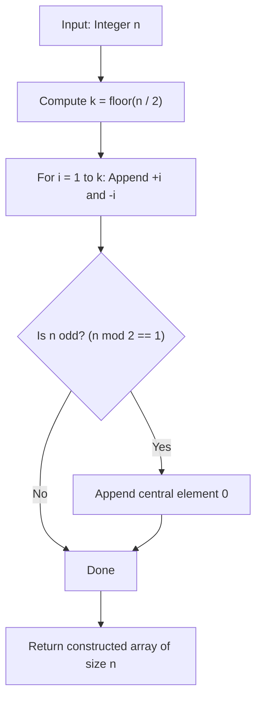

# Guided Example: Find N Unique Integers Sum up to Zero

We trace the symmetric pairing algorithm for constructing an array of distinct integers summing to zero on a representative instance:

- **Input:** $n = 5$
- **Required Output:** `[1, -1, 2, -2, 0]`

This instance demonstrates constructive algebraic cancellation, handling odd parity with a central zero element, and guaranteeing uniqueness across all emitted values.

---

## 1. Instance & Teaching Goal

We are required to construct an array containing $n$ pairwise distinct integers such that their total sum equals zero:
$$
\sum_{j=1}^n A[j] = 0, \quad \forall j \ne k: A[j] \ne A[k]
$$

For $n = 5$, an odd integer:
- We can form $k = \lfloor 5/2 \rfloor = 2$ symmetric pairs: $(+1, -1)$ and $(+2, -2)$.
- Each pair sums to $i + (-i) = 0$.
- Because $n$ is odd, one slot remains unfilled ($5 - 2 \times 2 = 1$). Adding the neutral identity $0$ preserves both the zero sum and the uniqueness of all elements.

```
Target size: n = 5
Symmetric pairs needed: floor(5 / 2) = 2

Pair 1 (i = 1):  [ +1, -1 ]  --> Partial sum: 0
Pair 2 (i = 2):  [ +2, -2 ]  --> Partial sum: 0
Center element:  [  0     ]  --> Adds 0 to preserve sum

Combined collection: { +1, -1, +2, -2, 0 }
Distinct elements: 5
Total sum: 1 + (-1) + 2 + (-2) + 0 = 0
```

Brute-force randomized search or arbitrary subset generation risks duplicate values or non-zero sums. The symmetric pairing construction guarantees both correctness and $\mathcal{O}(n)$ deterministic synthesis without search overhead.

---

## 2. Conceptual Foundation & Invariants

Let $n$ be partitioned into even and odd components via integer division:
$$
k = \lfloor n / 2 \rfloor, \quad r = n \pmod 2
$$

### Constructive Pairwise Synthesis
For each index $i \in \{1, 2, \dots, k\}$:
$$
\text{Pair}(i) = \{+i, \; -i\}
$$
If $r = 1$ (odd $n$), we include the singleton set $\{0\}$.

The full emitted sequence is:
$$
A = \bigcup_{i=1}^k \{+i, \; -i\} \cup \begin{cases} \{0\} & \text{if } n \text{ is odd} \\ \emptyset & \text{if } n \text{ is even} \end{cases}
$$

| Structural Component | Value Set | Cardinality | Sum Contribution |
|---|---|---|---|
| Positive Half | $\{1, 2, \dots, k\}$ | $k$ | $+\frac{k(k+1)}{2}$ |
| Negative Half | $\{-1, -2, \dots, -k\}$ | $k$ | $-\frac{k(k+1)}{2}$ |
| Center Element (odd $n$) | $\{0\}$ | $r \in \{0, 1\}$ | $0$ |
| Combined Result | Disjoint Union | $2k + r = n$ | $0$ |

> **Algebraic Annihilation Invariant.** For every added positive integer $+i$, there exists an exact matching additive inverse $-i$. Consequently, the partial sum of the array is invariant at $0$ after every pair insertion, and appending $0$ leaves the sum unchanged.



---

## 3. Step-by-Step Worked Execution

We trace the generation for $n = 5$:
- Number of symmetric pairs: $k = \lfloor 5 / 2 \rfloor = 2$.
- Parity remainder: $r = 5 \bmod 2 = 1$.

### Step 1: First Symmetric Pair ($i = 1$)
- Emit $+1$ and $-1$.
- Array state: `[1, -1]`.
- Pair sum: $1 + (-1) = 0$.
- Cumulative array sum: $0$.
- Current size: $2$.

### Step 2: Second Symmetric Pair ($i = 2$)
- Emit $+2$ and $-2$.
- Array state: `[1, -1, 2, -2]`.
- Pair sum: $2 + (-2) = 0$.
- Cumulative array sum: $0 + 0 = 0$.
- Current size: $4$.

### Step 3: Parity Adjustment ($r = 1$)
- Because $n = 5$ is odd, exactly one element is needed to reach length $5$.
- Emit the neutral identity $0$.
- Array state: `[1, -1, 2, -2, 0]`.
- Cumulative sum: $0 + 0 = 0$.
- Final size: $5$.

---

## 4. Complete Execution Trace

| Step Order | Element Generated | Role | Array State | Cumulative Sum | Remaining Slots |
|---|---|---|---|---|---|
| Init | - | Initial Empty State | `[]` | $0$ | $5$ |
| 1 | $+1$ | Positive counterpart ($i=1$) | `[1]` | $1$ | $4$ |
| 2 | $-1$ | Negative counterpart ($i=1$) | `[1, -1]` | $0$ | $3$ |
| 3 | $+2$ | Positive counterpart ($i=2$) | `[1, -1, 2]` | $2$ | $2$ |
| 4 | $-2$ | Negative counterpart ($i=2$) | `[1, -1, 2, -2]` | $0$ | $1$ |
| 5 | $0$ | Odd parity filler | `[1, -1, 2, -2, 0]` | $0$ | $0$ |

---

## 5. Algorithmic Correctness

**Soundness.**
1. *Zero Sum:* The sum of elements is:
   $$
   \sum_{x \in A} x = \sum_{i=1}^k (i + (-i)) + (0 \text{ if odd}) = \sum_{i=1}^k 0 + 0 = 0
   $$
2. *Uniqueness:* Since $i \in \{1, 2, \dots, k\}$, all positive values are distinct. Their negatives $\{-1, -2, \dots, -k\}$ are all strictly negative and distinct. The value $0$ is neither positive nor negative. Thus, the three sets $\{1..k\}$, $\{-k..-1\}$, and $\{0\}$ are mutually disjoint, guaranteeing all $n$ values are unique.

**Completeness.**
The total number of elements produced is $2k + r = 2\lfloor n/2 \rfloor + (n \bmod 2) = n$ for any integer $n \ge 1$.

---

## 6. Traps This Instance Exposes

- **Zero duplication on even $n$:** If $0$ were appended when $n$ is even, the array would contain $n + 1$ elements or require replacing a pair, breaking symmetry. The zero must only be appended when $n \bmod 2 = 1$.
- **Duplicate zero insertion:** If $i = 0$ were included in the loop, $+0$ and $-0$ would create duplicate zeros, violating the uniqueness constraint. The index $i$ must start strictly at $1$.
- **Integer overflow with large arithmetic progressions:** Choosing small consecutive values $i \in \{1..n/2\}$ keeps each element bounded by $\pm \lfloor n/2 \rfloor \le \pm 500$, well within standard integer limits.

---

## 7. Complexity Derivation

- **Time Complexity:** $\mathcal{O}(n)$. The algorithm iterates $k = \lfloor n/2 \rfloor$ times, emitting two numbers per iteration, followed by at most one final insertion. Each insertion takes $\mathcal{O}(1)$ time.
- **Auxiliary Space Complexity:** $\mathcal{O}(1)$ additional memory beyond the storage allocated for the output array.
