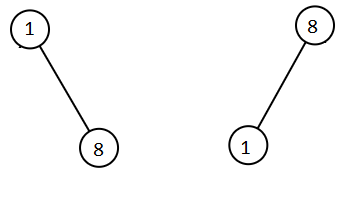

## Description

Given two binary search trees `root1` and `root2`, return *a list containing all the integers from both trees sorted in **ascending** order*.
### Function Contract

- `n`: Input parameter.
- Returns expected result.

### Examples

#### Example 1

- **Input:** $root1 = [2,1,4], root2 = [1,0,3]$
- **Output:** `[0,1,1,2,3,4]`
#### Example 2

- **Input:** $root1 = [1,null,8], root2 = [8,1]$
- **Output:** `[1,1,8,8]`
### Constraints

- The number of nodes in each tree is in the range `[0, 5000]`.

- $-10^{5} \le \text{Node.val} \le 10^{5}$