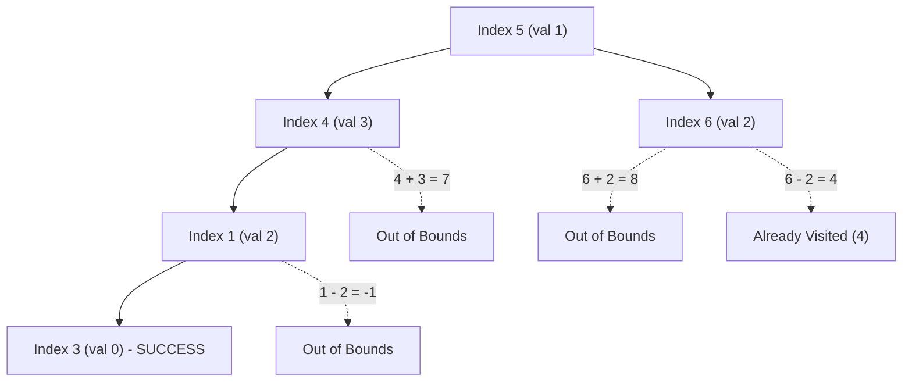

# Guided Example: Jump Game III

We trace the breadth-first graph traversal searching for a zero-valued cell on a representative array instance:

- **Input:** `arr = [4, 2, 3, 0, 3, 1, 2]`, `start = 5`
- **Required Output:** `true`

This instance demonstrates modeling array jumps as a directed graph, managing a FIFO exploration frontier, pruning out-of-bounds branches, and preventing infinite cycles using a visited set.

---

## 1. Instance & Teaching Goal

We are given an array of $N = 7$ non-negative integers. From any current index $i$, two moves are possible:
1. Forward jump to $i + \text{arr}[i]$ (valid if $i + \text{arr}[i] < N$).
2. Backward jump to $i - \text{arr}[i]$ (valid if $i - \text{arr}[i] \ge 0$).

The goal is to determine whether any index $t$ with $\text{arr}[t] = 0$ is reachable starting from $i = 5$.

```
Index:       0    1    2    3    4    5    6
Value:      [4]  [2]  [3]  [0]  [3]  [1]  [2]
                                      ^
                                    start

Target: Find a path from index 5 to index 3 (where value is 0).

Forward/Backward Transition Graph:
  From 5 (val 1): -> 5 + 1 = 6,  5 - 1 = 4
  From 4 (val 3): -> 4 + 3 = 7 (invalid), 4 - 3 = 1
  From 6 (val 2): -> 6 + 2 = 8 (invalid), 6 - 2 = 4 (visited)
  From 1 (val 2): -> 1 + 2 = 3 (target 0!), 1 - 2 = -1 (invalid)
```

Because each index has at most two outgoing edges, the problem is an unweighted reachability query on a directed graph $G = (V, E)$ with $|V| = N$ and $|E| \le 2N$. Uninformed recursion without cycle detection can loop infinitely between mutually referencing indices (such as between indices $4$ and $6$). Breadth-first search guarantees linear $\mathcal{O}(N)$ termination.

---

## 2. Conceptual Foundation & Invariants

Let $V = \{0, 1, \dots, N-1\}$. For each index $u \in V$, the set of directed outgoing edges is:
$$
\text{Adj}(u) = \{v \in \{u + \text{arr}[u], \; u - \text{arr}[u]\} \mid 0 \le v < N\}
$$

We maintain:
- A FIFO queue $Q$ holding discovered but unexpanded indices.
- A visited set $S \subseteq V$ tracking all indices placed into $Q$.

| Component | Invariant Definition | Role in Search |
|---|---|---|
| Queue Frontier $Q$ | Set of reached, pending candidate nodes | Expands in non-decreasing jump distance order |
| Visited Registry $S$ | $\{v \in V \mid v \text{ has entered } Q\}$ | Prevents cycle re-entry and duplicate queueing |
| Boundary Filter | $0 \le v < N$ | Discards transitions leaving the array |

> **Frontier Soundness Invariant.** Every index in $Q$ is reachable from `start` via a finite sequence of legal forward and backward jumps within array bounds. No index is enqueued more than once.



---

## 3. Step-by-Step Worked Execution

We trace `arr = [4, 2, 3, 0, 3, 1, 2]` starting at index $5$. Initial state: $Q = [5]$, $S = \{5\}$.

### Step 1: Expand Start Node $i = 5$
- Dequeue $i = 5$.
- Check value: $\text{arr}[5] = 1 \ne 0$.
- Candidate neighbors:
  - Forward: $5 + 1 = 6$. Check: $0 \le 6 < 7$ (valid), $6 \notin S$. Add to $Q$ and $S$.
  - Backward: $5 - 1 = 4$. Check: $0 \le 4 < 7$ (valid), $4 \notin S$. Add to $Q$ and $S$.
- Updated state: $Q = [6, 4]$, $S = \{5, 6, 4\}$.

### Step 2: Expand Node $i = 6$
- Dequeue $i = 6$.
- Check value: $\text{arr}[6] = 2 \ne 0$.
- Candidate neighbors:
  - Forward: $6 + 2 = 8$. Check: $8 \ge 7$ (discard, out of bounds).
  - Backward: $6 - 2 = 4$. Check: $4 \in S$ (discard, already visited).
- Updated state: $Q = [4]$, $S = \{5, 6, 4\}$.

### Step 3: Expand Node $i = 4$
- Dequeue $i = 4$.
- Check value: $\text{arr}[4] = 3 \ne 0$.
- Candidate neighbors:
  - Forward: $4 + 3 = 7$. Check: $7 \ge 7$ (discard, out of bounds).
  - Backward: $4 - 3 = 1$. Check: $0 \le 1 < 7$ (valid), $1 \notin S$. Add to $Q$ and $S$.
- Updated state: $Q = [1]$, $S = \{5, 6, 4, 1\}$.

### Step 4: Expand Node $i = 1$
- Dequeue $i = 1$.
- Check value: $\text{arr}[1] = 2 \ne 0$.
- Candidate neighbors:
  - Forward: $1 + 2 = 3$. Check: $0 \le 3 < 7$ (valid), $3 \notin S$. Add to $Q$ and $S$.
  - Backward: $1 - 2 = -1$. Check: $-1 < 0$ (discard, out of bounds).
- Updated state: $Q = [3]$, $S = \{5, 6, 4, 1, 3\}$.

### Step 5: Target Evaluation at Node $i = 3$
- Dequeue $i = 3$.
- Check value: $\text{arr}[3] = 0$.
- Target condition $\text{arr}[i] == 0$ is satisfied.
- Terminate search and return `true`.

---

## 4. Complete Execution Trace

| Iteration | Current Node $u$ | Value $\text{arr}[u]$ | Forward Neighbor | Backward Neighbor | Action Taken | Queue After Step |
|---|---|---|---|---|---|---|
| Init | - | - | - | - | Enqueue `start = 5` | `[5]` |
| 1 | $5$ | $1$ | $6$ (valid) | $4$ (valid) | Enqueue $6, 4$ | `[6, 4]` |
| 2 | $6$ | $2$ | $8$ (out of bounds) | $4$ (visited) | No enqueue | `[4]` |
| 3 | $4$ | $3$ | $7$ (out of bounds) | $1$ (valid) | Enqueue $1$ | `[1]` |
| 4 | $1$ | $2$ | $3$ (valid) | $-1$ (out of bounds) | Enqueue $3$ | `[3]` |
| 5 | $3$ | $0$ | - | - | **Match: Value is 0** | Return `true` |

---

## 5. Algorithmic Correctness

**Soundness.** Every index placed into queue $Q$ is reached through a valid sequence of edge transitions from `start`. When an index $t$ with $\text{arr}[t] = 0$ is dequeued, a verified directed path exists from `start` to $t$, making the return value `true` sound.

**Completeness.** Since every state is visited at most once and the graph has a finite number of vertices ($N \le 5 \times 10^4$), the traversal exhausts the entire reachable connected component in finite steps. If the queue becomes empty without finding any node with value $0$, no valid path exists, correctly returning `false`.

---

## 6. Traps This Instance Exposes

- **Infinite cycles from mutual jumps:** Indices like $4$ and $6$ can jump back and forth ($4 + 2 = 6, 6 - 2 = 4$). Without a visited set, recursion would overflow the call stack.
- **Array bounds violation:** Jumps can easily evaluate to negative indices or indices $\ge N$. Boundaries must be validated before attempting to access array memory.
- **Start node already zero:** If $\text{arr}[\text{start}] = 0$, the algorithm must immediately succeed in $0$ transitions without needing an expansion step.

---

## 7. Complexity Derivation

- **Time Complexity:** $\mathcal{O}(N)$. There are $N$ total indices. Each index is enqueued and expanded at most once, and each index generates at most $2$ candidate edges, resulting in $\mathcal{O}(N)$ total edge evaluations.
- **Auxiliary Space Complexity:** $\mathcal{O}(N)$ to store the visited set and the FIFO queue frontier across the exploration.
