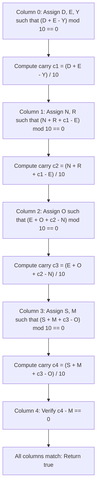

# Guided Example: Verbal Arithmetic Puzzle

We trace the column-by-column constraint propagation backtracking algorithm for solving a verbal arithmetic equation on the classic cryptarithmetic puzzle:

- **Input:** `words = ["SEND", "MORE"]`, `result = "MONEY"`
- **Required Output:** `true`

This instance demonstrates column-wise positional balance tracking from least to most significant digit, leading-zero exclusion, dynamic pruning of inconsistent partial assignments, and establishing an injective character-to-digit bijection.

---

## 1. Instance & Teaching Goal

We must determine if there exists a one-to-one mapping $\phi : \Sigma \to \{0, 1, \dots, 9\}$ from the set of characters $\Sigma = \{\text{'S', 'E', 'N', 'D', 'M', 'O', 'R', 'Y'}\}$ to decimal digits such that:
$$
\text{val}(\text{"SEND"}) + \text{val}(\text{"MORE"}) = \text{val}(\text{"MONEY"})
$$
subject to:
1. **Injectivity:** $\phi(c_1) \ne \phi(c_2)$ for all distinct letters $c_1 \ne c_2$.
2. **Leading Zero Prohibition:** $\phi(\text{'S'}) \ne 0$ and $\phi(\text{'M'}) \ne 0$ because neither `"SEND"`, `"MORE"`, nor `"MONEY"` can have a leading zero.

```
Positional alignment (columns 4 down to 0):
Column:    4     3     2     1     0
           -     S     E     N     D
   +       -     M     O     R     E
   ---------------------------------
   =       M     O     N     E     Y

Column 0 (Units):       D + E = Y + 10 * c_1
Column 1 (Tens):    N + R + c_1 = E + 10 * c_2
Column 2 (Hundreds):E + O + c_2 = N + 10 * c_3
Column 3 (Thousands):S + M + c_3 = O + 10 * c_4
Column 4 (Ten-Thousands):   c_4 = M
```

Testing all permutations of $10$ digits chosen $8$ at a time requires $10! / (10 - 8)! = 1,814,400$ evaluations. Evaluating column by column from right to left (least significant to most significant) allows pruning invalid partial assignments immediately when a column's arithmetic balance fails to divide by $10$, cutting the search space by several orders of magnitude.

---

## 2. Conceptual Foundation & Invariants

Let $C$ denote the zero-indexed column offset measured from the right ($C = 0$ is units, $C = 1$ is tens, etc.).

### Column Balance Formulation
Treat each addend letter as $+1$ and each result letter as $-1$. For column $C$ and row $R$, we accumulate a signed balance:
$$
\text{balance} \leftarrow \text{incoming\_carry} + \sum_{w \in \text{words}} \phi(w[C]) - \phi(\text{result}[C])
$$
A column $C$ is valid if and only if:
$$
\text{balance} \equiv 0 \pmod{10}
$$
The carry propagated to column $C + 1$ is then:
$$
\text{carry}_{C+1} = \lfloor \text{balance} / 10 \rfloor
$$

| Letter | Word Role | Allowed Digits | Leading Zero Forbidden? |
|---|---|---|---|
| `'S'` | Addend 1 MSD | $\{1, 2, \dots, 9\}$ | Yes (`len("SEND") > 1`) |
| `'E'` | Addend / Result | $\{0, 1, \dots, 9\}$ | No |
| `'N'` | Addend / Result | $\{0, 1, \dots, 9\}$ | No |
| `'D'` | Addend 1 LSD | $\{0, 1, \dots, 9\}$ | No |
| `'M'` | Addend 2 / Result MSD | $\{1, 2, \dots, 9\}$ | Yes (`len("MORE") > 1`) |
| `'O'` | Addend 2 / Result | $\{0, 1, \dots, 9\}$ | No |
| `'R'` | Addend 2 | $\{0, 1, \dots, 9\}$ | No |
| `'Y'` | Result LSD | $\{0, 1, \dots, 9\}$ | No |

> **Column Balance Invariant.** Upon completing column $C$, the net algebraic equation $\sum \text{words}[0..C] \equiv \text{result}[0..C] \pmod{10^{C+1}}$ holds exactly. The quotient $\lfloor \text{balance} / 10 \rfloor$ correctly carries into column $C+1$.



---

## 3. Step-by-Step Worked Execution

We trace the assignment satisfying all column constraints:
$$
\phi = \{\text{'S'}: 9, \; \text{'E'}: 5, \; \text{'N'}: 6, \; \text{'D'}: 7, \; \text{'M'}: 1, \; \text{'O'}: 0, \; \text{'R'}: 8, \; \text{'Y'}: 2\}
$$

### Step 1: Column $0$ (Units Column, $C = 0$)
- Letters present: `'D'` from `"SEND"`, `'E'` from `"MORE"`, `'Y'` from `"MONEY"`.
- Incoming carry: $c_0 = 0$.
- Assigned values: $\phi(\text{'D'}) = 7$, $\phi(\text{'E'}) = 5$, $\phi(\text{'Y'}) = 2$.
- Algebraic balance:
  $$
  \text{balance}_0 = \phi(\text{'D'}) + \phi(\text{'E'}) - \phi(\text{'Y'}) = 7 + 5 - 2 = 10
  $$
- Verification: $10 \bmod 10 = 0$ (valid).
- Carry to next column: $c_1 = 10 / 10 = 1$.

### Step 2: Column $1$ (Tens Column, $C = 1$)
- Letters present: `'N'` from `"SEND"`, `'R'` from `"MORE"`, `'E'` from `"MONEY"`.
- Incoming carry: $c_1 = 1$.
- Prior assignment: $\phi(\text{'E'}) = 5$.
- Assigned values: $\phi(\text{'N'}) = 6$, $\phi(\text{'R'}) = 8$.
- Algebraic balance:
  $$
  \text{balance}_1 = c_1 + \phi(\text{'N'}) + \phi(\text{'R'}) - \phi(\text{'E'}) = 1 + 6 + 8 - 5 = 10
  $$
- Verification: $10 \bmod 10 = 0$ (valid).
- Carry to next column: $c_2 = 10 / 10 = 1$.

### Step 3: Column $2$ (Hundreds Column, $C = 2$)
- Letters present: `'E'` from `"SEND"`, `'O'` from `"MORE"`, `'N'` from `"MONEY"`.
- Incoming carry: $c_2 = 1$.
- Prior assignments: $\phi(\text{'E'}) = 5$, $\phi(\text{'N'}) = 6$.
- Assigned value: $\phi(\text{'O'}) = 0$ (permitted since `'O'` is not a leading letter).
- Algebraic balance:
  $$
  \text{balance}_2 = c_2 + \phi(\text{'E'}) + \phi(\text{'O'}) - \phi(\text{'N'}) = 1 + 5 + 0 - 6 = 0
  $$
- Verification: $0 \bmod 10 = 0$ (valid).
- Carry to next column: $c_3 = 0 / 10 = 0$.

### Step 4: Column $3$ (Thousands Column, $C = 3$)
- Letters present: `'S'` from `"SEND"`, `'M'` from `"MORE"`, `'O'` from `"MONEY"`.
- Incoming carry: $c_3 = 0$.
- Prior assignment: $\phi(\text{'O'}) = 0$.
- Assigned values: $\phi(\text{'S'}) = 9$, $\phi(\text{'M'}) = 1$ (neither is zero).
- Algebraic balance:
  $$
  \text{balance}_3 = c_3 + \phi(\text{'S'}) + \phi(\text{'M'}) - \phi(\text{'O'}) = 0 + 9 + 1 - 0 = 10
  $$
- Verification: $10 \bmod 10 = 0$ (valid).
- Carry to next column: $c_4 = 10 / 10 = 1$.

### Step 5: Column $4$ (Ten-Thousands Column, $C = 4$)
- Only `"MONEY"` has a fifth letter: `'M'`. Addends have no character in column $4$.
- Incoming carry: $c_4 = 1$.
- Prior assignment: $\phi(\text{'M'}) = 1$.
- Algebraic balance:
  $$
  \text{balance}_4 = c_4 - \phi(\text{'M'}) = 1 - 1 = 0
  $$
- Verification: $0 \bmod 10 = 0$ and all columns have been processed with final carry $0$.
- Conclusion: A valid assignment exists; return `true`.

---

## 4. Complete Execution Trace

| Column $C$ | Contributing Terms | Substituted Arithmetic | Net Balance | Carry Produced | Valid? |
|---|---|---|---|---|---|
| $0$ | $D + E - Y$ | $7 + 5 - 2$ | $10$ | $c_1 = 1$ | Yes |
| $1$ | $c_1 + N + R - E$ | $1 + 6 + 8 - 5$ | $10$ | $c_2 = 1$ | Yes |
| $2$ | $c_2 + E + O - N$ | $1 + 5 + 0 - 6$ | $0$ | $c_3 = 0$ | Yes |
| $3$ | $c_3 + S + M - O$ | $0 + 9 + 1 - 0$ | $10$ | $c_4 = 1$ | Yes |
| $4$ | $c_4 - M$ | $1 - 1$ | $0$ | $c_5 = 0$ | Yes |

Numeric check:
$$
9567 + 1085 = 10652
$$

---

## 5. Algorithmic Correctness

**Soundness.** Every step guarantees that assigned digits are mutually distinct ($\le 10$ unique letters mapped to digits $0..9$). At each column $C$, the condition $\text{balance} \equiv 0 \pmod{10}$ ensures base-$10$ positional arithmetic holds. When all columns complete with balance zero and no leading zero violation, the decoded integers rigorously satisfy the equation.

**Completeness.** Backtracking systematically explores every viable digit assignment. Early rejection at the end of each column prunes branches that cannot possibly satisfy modular divisibility, ensuring all valid solutions are discovered without missing solutions.

---

## 6. Traps This Instance Exposes

- **Leading Zero Assignment:** Assigning $\phi(\text{'S'}) = 0$ or $\phi(\text{'M'}) = 0$ immediately invalidates the numbers, even if arithmetic would otherwise match.
- **Unassigned Suffix Characters:** Words have varying lengths. When an addend has fewer characters than the current column, its contribution must be treated as $0$ without forcing a character lookup.
- **Bijective Collision:** Assigning the same digit to two different letters (e.g. $\phi(\text{'E'}) = \phi(\text{'O'}) = 0$) violates injectivity. A used-digit bitmask or set must prevent reusing assigned digits.

---

## 7. Complexity Derivation

- **Time Complexity:** $\mathcal{O}(10^{|\Sigma|})$ worst-case, bounded by $10! / (10 - |\Sigma|)! \le 3.6 \times 10^6$ for $|\Sigma| \le 10$. In practice, column-by-column modular pruning cuts over $99.9\%$ of search paths, executing in milliseconds.
- **Auxiliary Space Complexity:** $\mathcal{O}(|\Sigma| + L)$ where $|\Sigma| \le 10$ is the unique character count and $L$ is the maximum word length, storing mapping dictionaries and the recursion call stack.
