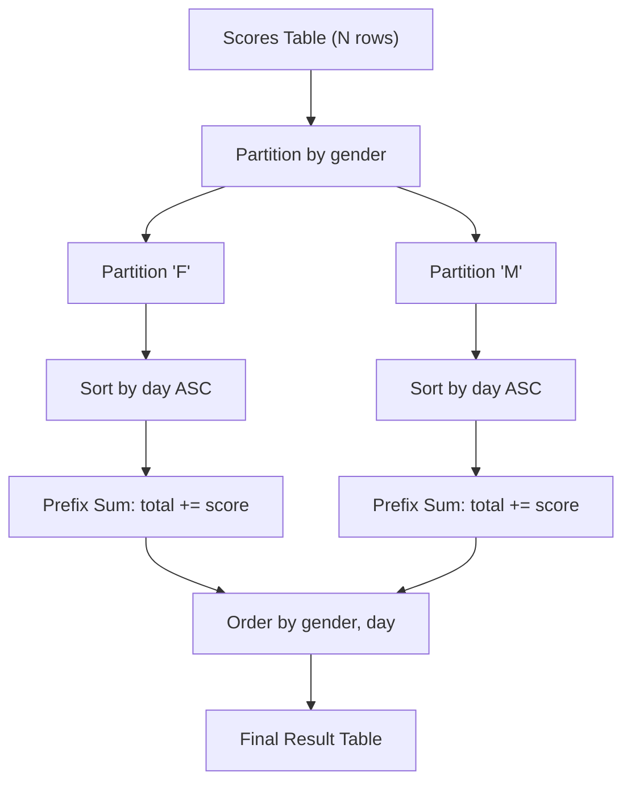

# Guided Example: Running Total for Different Genders

We trace the step-by-step relational window aggregation computing gender-partitioned cumulative score progressions on a representative match history:

- **Input:** `Scores` table with tuples:
  $$\begin{aligned}
  \text{Scores} = \{ &(\text{"Jose"}, \text{'M'}, \text{"2019-12-18"}, 2), \; (\text{"Khali"}, \text{'M'}, \text{"2019-12-25"}, 11), \\
  &(\text{"Priyanka"}, \text{'F'}, \text{"2019-12-30"}, 17), \; (\text{"Slaman"}, \text{'M'}, \text{"2019-12-30"}, 13), \\
  &(\text{"Priya"}, \text{'F'}, \text{"2019-12-31"}, 23), \; (\text{"Joe"}, \text{'M'}, \text{"2019-12-31"}, 3), \\
  &(\text{"Aron"}, \text{'F'}, \text{"2020-01-01"}, 17), \; (\text{"Alice"}, \text{'F'}, \text{"2020-01-07"}, 23), \\
  &(\text{"Bajrang"}, \text{'M'}, \text{"2020-01-07"}, 7) \}
  \end{aligned}$$
- **Required Output:** Cumulative series sorted by `gender` ascending and `day` ascending:
  $$\begin{aligned}
  \text{Result} = \{ &(\text{'F'}, \text{"2019-12-30"}, 17), \; (\text{'F'}, \text{"2019-12-31"}, 40), \\
  &(\text{'F'}, \text{"2020-01-01"}, 57), \; (\text{'F'}, \text{"2020-01-07"}, 80), \\
  &(\text{'M'}, \text{"2019-12-18"}, 2), \; (\text{'M'}, \text{"2019-12-25"}, 13), \\
  &(\text{'M'}, \text{"2019-12-30"}, 26), \; (\text{'M'}, \text{"2019-12-31"}, 29), \\
  &(\text{'M'}, \text{"2020-01-07"}, 36) \}
  \end{aligned}$$

This instance demonstrates relational window partitioning, chronologically ordering rows within each partition, and maintaining prefix sums over unbounded preceding frames.

---

## 1. Instance & Teaching Goal

The `Scores` table records daily match scores where the pair `(gender, day)` is guaranteed to be unique. We must output the cumulative total points scored by players of each gender up to and including each day.

```
Input Tuple Distribution:
  Female ('F') Records (Chronological):
    2019-12-30: 17
    2019-12-31: 23
    2020-01-01: 17
    2020-01-07: 23

  Male ('M') Records (Chronological):
    2019-12-18: 2
    2019-12-25: 11
    2019-12-30: 13
    2019-12-31: 3
    2020-01-07: 7
```

A standard relational grouping collapses all dates for a gender into a single aggregated scalar sum. To preserve each daily timestamp alongside its running cumulative progress, the relational engine utilizes an analytic window partition:
$$
\text{total}(g, d) = \sum_{t \le d, \; \text{gender}=g} \text{score\_points}(t)
$$

---

## 2. Conceptual Foundation & Invariants

Let $S$ denote the input relation with attributes $(p, g, d, s)$.

### Relational Window Partitioning
1. **Partitioning:** Divide $S$ into disjoint subsets based on gender:
   $$
   S = S_F \cup S_M, \quad \text{where } S_g = \{t \in S \mid t.g = g\}
   $$
2. **Ordering:** Sort each partition $S_g$ chronologically by date $d$:
   $$
   (t_1, t_2, \dots, t_{k_g}) \quad \text{such that } t_1.d < t_2.d < \dots < t_{k_g}.d
   $$
3. **Cumulative Frame Aggregation:** For the $i$-th row in partition $S_g$:
   $$
   \text{total}_i = \sum_{j=1}^i t_j.s = \text{total}_{i-1} + t_i.s
   $$
4. **Ordering & Projection:** Emit tuples $(g, d, \text{total})$ ordered by $g$ ascending, then $d$ ascending.

| Partition Attribute | Window Frame | Aggregation Function | Reset Condition |
|---|---|---|---|
| `gender` | Unbounded Preceding to Current Row | Summation of `score_points` | Value change in `gender` |
| `day` (ordering) | Monotonically increasing dates | - | New partition boundary |

> **Cumulative Prefix Invariant.** Within any partition $S_g$, the running total associated with row index $i$ is identically equal to the sum of all points scored on or before day $t_i.d$ for that gender. Partition changes reset the running accumulator to zero.



---

## 3. Step-by-Step Worked Execution

We trace the cumulative summation across both partitions.

### Partition: Female (`gender = 'F'`)
- **Row 1 (`day = "2019-12-30"`, points = $17$):**
  $$
  \text{total} = 17
  $$
- **Row 2 (`day = "2019-12-31"`, points = $23$):**
  $$
  \text{total} = 17 + 23 = 40
  $$
- **Row 3 (`day = "2020-01-01"`, points = $17$):**
  $$
  \text{total} = 40 + 17 = 57
  $$
- **Row 4 (`day = "2020-01-07"`, points = $23$):**
  $$
  \text{total} = 57 + 23 = 80
  $$

### Partition: Male (`gender = 'M'`)
- Accumulator resets to $0$ on partition boundary.
- **Row 1 (`day = "2019-12-18"`, points = $2$):**
  $$
  \text{total} = 2
  $$
- **Row 2 (`day = "2019-12-25"`, points = $11$):**
  $$
  \text{total} = 2 + 11 = 13
  $$
- **Row 3 (`day = "2019-12-30"`, points = $13$):**
  $$
  \text{total} = 13 + 13 = 26
  $$
- **Row 4 (`day = "2019-12-31"`, points = $3$):**
  $$
  \text{total} = 26 + 3 = 29
  $$
- **Row 5 (`day = "2020-01-07"`, points = $7$):**
  $$
  \text{total} = 29 + 7 = 36
  $$

---

## 4. Complete Execution Trace

| Partition | Sequence # | Date (`day`) | Daily Points | Incremental Sum Calculation | Emitted Output Tuple |
|---|---|---|---|---|---|
| `'F'` | 1 | `2019-12-30` | $17$ | $0 + 17 = 17$ | `('F', '2019-12-30', 17)` |
| `'F'` | 2 | `2019-12-31` | $23$ | $17 + 23 = 40$ | `('F', '2019-12-31', 40)` |
| `'F'` | 3 | `2020-01-01` | $17$ | $40 + 17 = 57$ | `('F', '2020-01-01', 57)` |
| `'F'` | 4 | `2020-01-07` | $23$ | $57 + 23 = 80$ | `('F', '2020-01-07', 80)` |
| `'M'` | 1 | `2019-12-18` | $2$ | $0 + 2 = 2$ | `('M', '2019-12-18', 2)` |
| `'M'` | 2 | `2019-12-25` | $11$ | $2 + 11 = 13$ | `('M', '2019-12-25', 13)` |
| `'M'` | 3 | `2019-12-30` | $13$ | $13 + 13 = 26$ | `('M', '2019-12-30', 26)` |
| `'M'` | 4 | `2019-12-31` | $3$ | $26 + 3 = 29$ | `('M', '2019-12-31', 29)` |
| `'M'` | 5 | `2020-01-07` | $7$ | $29 + 7 = 36$ | `('M', '2020-01-07', 36)` |

---

## 5. Algorithmic Correctness

**Soundness.** Since the problem specification establishes that `(gender, day)` forms the primary key, no two rows within the same partition share the same date. Chronological ordering creates a strict, well-defined total order. Summing from the start of the partition up to the current row computes the exact running total without ambiguity or ties.

**Completeness.** Every input row belongs to a gender partition and is assigned a unique rank based on `day`. The window function processes all $N$ tuples, emitting exactly $N$ rows in the final result set.

---

## 6. Traps This Instance Exposes

- **Cross-partition accumulation:** Failing to partition by gender causes scores to accumulate across female and male players indiscriminately.
- **Date ties handling:** If `(gender, day)` were not unique, standard SQL window ordering with duplicate dates would produce identical range totals for ties. Here, the unique primary key constraint guarantees distinct sequential frame bounds.
- **Output ordering requirement:** The problem requires rows ordered by `gender` ascending, then `day` ascending. Relying on partition ordering without an explicit final ordering clause can result in unspecified relational tuple order.

---

## 7. Complexity Derivation

- **Time Complexity:** $\mathcal{O}(N \log N)$ where $N$ is the number of rows in `Scores`. Sorting the tuples by `(gender, day)` takes $\mathcal{O}(N \log N)$, and the subsequent linear scan computing running totals takes $\mathcal{O}(N)$ time.
- **Auxiliary Space Complexity:** $\mathcal{O}(N)$ to store the sorted partitions and output buffer during query execution.
