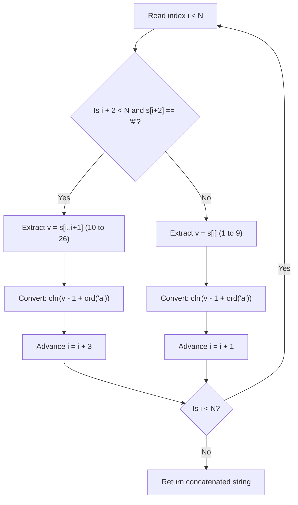

# Guided Example: Decrypt String from Alphabet to Integer Mapping

We trace the token parsing and decoding algorithm on a representative numeric string containing both delimited two-digit tokens and single-digit tokens:

- **Input:** `s = "10#11#12"`
- **Required Output:** `"jkab"`

This instance demonstrates lookahead parsing, disambiguating two-digit encoded characters (`'j'` through `'z'`) from single-digit encoded characters (`'a'` through `'i'`) using the delimiter `'#'`, and deterministically consuming variable-length tokens.

---

## 1. Instance & Teaching Goal

The alphabet is encoded according to the following mapping rule:
- Digits `'1'` through `'9'` represent lowercase letters `'a'` through `'i'` ($1 \mapsto \text{'a'}, \dots, 9 \mapsto \text{'i'}$).
- Two-digit numbers `'10#'` through `'26#'` followed by `'#'` represent lowercase letters `'j'` through `'z'` ($10\# \mapsto \text{'j'}, \dots, 26\# \mapsto \text{'z'}$).

For `s = "10#11#12"` of length $N = 8$:
- The prefix `"10#"` corresponds to value $10$, which maps to `'j'`.
- The middle substring `"11#"` corresponds to value $11$, which maps to `'k'`.
- The trailing substring `"12"` lacks a trailing `'#'`; hence `'1'` maps to `'a'` and `'2'` maps to `'b'`.

```
String:      1   0   #   1   1   #   1   2
Index:       0   1   2   3   4   5   6   7

Token 1:   [ 1   0   # ]                 --> '10#' -> Letter 10 -> 'j'
Token 2:               [ 1   1   # ]     --> '11#' -> Letter 11 -> 'k'
Token 3:                           [ 1 ] --> '1'   -> Letter 1  -> 'a'
Token 4:                               [ 2 ] --> '2'   -> Letter 2  -> 'b'

Decoded Stream: "jkab"
```

Without checking whether a `'#'` appears two positions ahead, the substring `"10#"` could be mistakenly parsed as `'1'` followed by `'0'`, which is invalid because there is no mapping for digit `'0'` alone. Lookahead disambiguation ensures each character sequence is parsed into its unique valid representation.

---

## 2. Conceptual Foundation & Invariants

Let $i$ be the current read cursor in string $s$ of length $N$.

### Lookahead Disambiguation Rule
At index $i$:
1. If $i + 2 < N$ and $s[i + 2] == \text{'\#'}$:
   - Extract the two-digit integer:
     $$
     v = 10 \cdot (s[i] - \text{'0'}) + (s[i+1] - \text{'0'})
     $$
   - Map $v \in [10, 26]$ to character $\text{chr}(v - 1 + \text{code}('a'))$.
   - Advance cursor by $3$: $i \leftarrow i + 3$.
2. Otherwise:
   - Extract the single-digit integer:
     $$
     v = s[i] - \text{'0'}
     $$
   - Map $v \in [1, 9]$ to character $\text{chr}(v - 1 + \text{code}('a'))$.
   - Advance cursor by $1$: $i \leftarrow i + 1$.

| Token Pattern | Lookahead Check | Mapped Value Range | Alphabet Output | Cursor Advance |
|---|---|---|---|---|
| Single Digit | $s[i+2] \ne \text{'\#'}$ or $i+2 \ge N$ | $v \in [1, 9]$ | `'a'` to `'i'` | $+1$ |
| Delimited Double Digit | $s[i+2] == \text{'\#'}$ | $v \in [10, 26]$ | `'j'` to `'z'` | $+3$ |

> **Prefix Partition Invariant.** At cursor $i$, the prefix $s[0..i-1]$ has been uniquely decoded into the valid corresponding lowercase character sequence, and the remaining suffix $s[i..N-1]$ forms a valid, self-contained encoded sequence.



---

## 3. Step-by-Step Worked Execution

We trace `s = "10#11#12"` with $N = 8$:

### Step 1 (Cursor $i = 0$)
- Check lookahead: $i + 2 = 2 < 8$, and $s[2] == \text{'\#'}$.
- Delimited token detected: substring $s[0..1] = \text{"10"}$.
- Numeric value: $v = 10$.
- Alphabetic conversion:
  $$
  10 - 1 + \text{ord}('a') = 9 + 97 = 106 \implies \text{'j'}
  $$
- Advance cursor: $i \leftarrow 0 + 3 = 3$.
- Emitted output: `"j"`.

### Step 2 (Cursor $i = 3$)
- Check lookahead: $i + 2 = 5 < 8$, and $s[5] == \text{'\#'}$.
- Delimited token detected: substring $s[3..4] = \text{"11"}$.
- Numeric value: $v = 11$.
- Alphabetic conversion:
  $$
  11 - 1 + \text{ord}('a') = 10 + 97 = 107 \implies \text{'k'}
  $$
- Advance cursor: $i \leftarrow 3 + 3 = 6$.
- Emitted output: `"jk"`.

### Step 3 (Cursor $i = 6$)
- Check lookahead: $i + 2 = 8$, which is not strictly less than $N = 8$ (boundary reached).
- Condition fails; treat as single digit: $s[6] = \text{'1'}$.
- Numeric value: $v = 1$.
- Alphabetic conversion:
  $$
  1 - 1 + \text{ord}('a') = 0 + 97 = 97 \implies \text{'a'}
  $$
- Advance cursor: $i \leftarrow 6 + 1 = 7$.
- Emitted output: `"jka"`.

### Step 4 (Cursor $i = 7$)
- Check lookahead: $i + 2 = 9 \ge 8$.
- Condition fails; treat as single digit: $s[7] = \text{'2'}$.
- Numeric value: $v = 2$.
- Alphabetic conversion:
  $$
  2 - 1 + \text{ord}('a') = 1 + 97 = 98 \implies \text{'b'}
  $$
- Advance cursor: $i \leftarrow 7 + 1 = 8$.
- Emitted output: `"jkab"`.

### Termination ($i = 8 \ge N$)
- Cursor has reached string end.
- Emitted result string: `"jkab"`.

---

## 4. Complete Execution Trace

| Step | Cursor $i$ | Remaining Suffix | Lookahead $s[i+2]$ | Token Chosen | Decoded Value | Decoded Letter | Accumulated Output |
|---|---|---|---|---|---|---|---|
| 1 | $0$ | `"10#11#12"` | `'#'` (valid) | `"10#"` | $10$ | `'j'` | `"j"` |
| 2 | $3$ | `"11#12"` | `'#'` (valid) | `"11#"` | $11$ | `'k'` | `"jk"` |
| 3 | $6$ | `"12"` | Out of bounds | `"1"` | $1$ | `'a'` | `"jka"` |
| 4 | $7$ | `"2"` | Out of bounds | `"2"` | $2$ | `'b'` | `"jkab"` |

---

## 5. Algorithmic Correctness

**Soundness.** Because numbers from $10$ to $26$ are always followed by the special marker `'#'`, and numbers from $1$ to $9$ are never followed by `'#'` at offset $+2$, checking $s[i+2] == \text{'\#'}$ forms an unambiguous prefix-free parsing code. Each token decodes to its unique specified letter in the English alphabet.

**Completeness.** Since every step advances the cursor by either $1$ or $3$ positions, the loop is guaranteed to make strictly positive progress and terminate at $i = N$. Every character in $s$ is consumed as part of exactly one valid token.

---

## 6. Traps This Instance Exposes

- **Out-of-bounds indexing:** Evaluating $s[i+2]$ without first verifying $i + 2 < N$ causes an index error when scanning near the tail of the string (e.g. at indices $6$ and $7$).
- **Misinterpreting leading digits of two-digit numbers:** If `"10#"` is greedily parsed one character at a time, the `'1'` becomes `'a'`, leaving an orphaned `'0#'` which has no valid mapping. Lookahead check takes precedence over single-digit consumption.
- **Reverse parsing vs forward lookahead:** The string can also be parsed from right to left by checking if the current character is `'#'`. Both approaches yield identical tokens; however, forward parsing with lookahead avoids string reversals.

---

## 7. Complexity Derivation

- **Time Complexity:** $\mathcal{O}(N)$, where $N$ is the length of string $s$. The cursor traverses the string from left to right, advancing by at least $1$ index per iteration. Each step takes $\mathcal{O}(1)$ time.
- **Auxiliary Space Complexity:** $\mathcal{O}(N)$ to store the decoded characters in the output sequence buffer.
