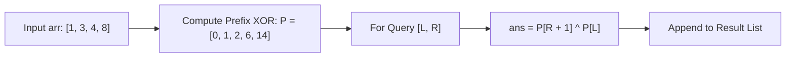

# Guided Example: XOR Queries of a Subarray

We trace the prefix XOR precomputation and constant-time range query algorithm on a representative array instance:

- **Input:** `arr = [1, 3, 4, 8]`, `queries = [[0, 1], [1, 2], [0, 3], [3, 3]]`
- **Required Output:** `[2, 7, 14, 8]`

This instance demonstrates exploiting the self-inverse and associative algebraic properties of the bitwise XOR operator, building a cumulative prefix XOR table, and evaluating arbitrary interval XOR queries in $\mathcal{O}(1)$ time.

---

## 1. Instance & Teaching Goal

We are given an array of $N = 4$ integers and $Q = 4$ range queries of the form $[L_i, R_i]$. For each query, we must compute:
$$
\text{ans}[i] = \bigoplus_{j = L_i}^{R_i} \text{arr}[j] = \text{arr}[L_i] \oplus \text{arr}[L_i + 1] \oplus \dots \oplus \text{arr}[R_i]
$$

```
Array:              Index 0    Index 1    Index 2    Index 3
                      [1]        [3]        [4]        [8]

Prefix XOR Array P:
P[0] = 0
P[1] = 0 ^ 1 = 1
P[2] = 1 ^ 3 = 2
P[3] = 2 ^ 4 = 6
P[4] = 6 ^ 8 = 14

Interval Queries:
  Query [0, 1]:  P[2] ^ P[0] =  2 ^ 0  = 2
  Query [1, 2]:  P[3] ^ P[1] =  6 ^ 1  = 7
  Query [0, 3]:  P[4] ^ P[0] = 14 ^ 0  = 14
  Query [3, 3]:  P[4] ^ P[3] = 14 ^ 6  = 8
```

Evaluating each query by linearly scanning elements from $L_i$ to $R_i$ requires $\mathcal{O}(N)$ operations per query, yielding $\mathcal{O}(Q \cdot N)$ total time. With $N, Q \le 3 \times 10^4$, this naive method incurs up to $9 \times 10^8$ operations, causing a time limit failure. Precomputing a prefix XOR array reduces each query response to a single bitwise operation in $\mathcal{O}(1)$ time.

---

## 2. Conceptual Foundation & Invariants

The bitwise XOR operator ($\oplus$) forms an abelian group over non-negative integers with the following properties:
1. **Associativity & Commutativity:** $a \oplus b = b \oplus a$, and $(a \oplus b) \oplus c = a \oplus (b \oplus c)$.
2. **Identity Element:** $a \oplus 0 = a$.
3. **Self-Inverse (Involution):** $a \oplus a = 0$.

### Prefix XOR Definition
Define prefix array $P$ of length $N + 1$:
$$
P[0] = 0, \quad P[k] = \bigoplus_{j=0}^{k-1} \text{arr}[j] = P[k-1] \oplus \text{arr}[k-1] \quad (1 \le k \le N)
$$

### Range Subtraction by XOR Cancellation
For any subsegment $[L, R]$ with $0 \le L \le R < N$:
$$
\begin{aligned}
P[R + 1] \oplus P[L] &= \left( \bigoplus_{j=0}^R \text{arr}[j] \right) \oplus \left( \bigoplus_{j=0}^{L-1} \text{arr}[j] \right) \\
&= \left( \bigoplus_{j=0}^{L-1} \text{arr}[j] \oplus \bigoplus_{j=0}^{L-1} \text{arr}[j] \right) \oplus \left( \bigoplus_{j=L}^R \text{arr}[j] \right) \\
&= 0 \oplus \left( \bigoplus_{j=L}^R \text{arr}[j] \right) = \bigoplus_{j=L}^R \text{arr}[j]
\end{aligned}
$$

| Prefix Index $k$ | Sliced Subarray | Recurrence Formulation | Cumulative XOR Value |
|---|---|---|---|
| $0$ | $\emptyset$ | Base value $0$ | $0$ |
| $1$ | $\text{arr}[0..0]$ | $P[0] \oplus \text{arr}[0] = 0 \oplus 1$ | $1$ |
| $2$ | $\text{arr}[0..1]$ | $P[1] \oplus \text{arr}[1] = 1 \oplus 3$ | $2$ |
| $3$ | $\text{arr}[0..2]$ | $P[2] \oplus \text{arr}[2] = 2 \oplus 4$ | $6$ |
| $4$ | $\text{arr}[0..3]$ | $P[3] \oplus \text{arr}[3] = 6 \oplus 8$ | $14$ |

> **Prefix Invariant.** For every $k \in [0, N]$, $P[k]$ holds the cumulative bitwise XOR sum of all array elements strictly before index $k$.



---

## 3. Step-by-Step Worked Execution

We trace the precomputation on `arr = [1, 3, 4, 8]` followed by the $4$ queries:

### Stage 1: Constructing the Prefix XOR Array
- **$k = 0$:** $P[0] = 0$.
- **$k = 1$:** $P[1] = P[0] \oplus \text{arr}[0] = 0 \oplus 1 = 1$.
- **$k = 2$:** $P[2] = P[1] \oplus \text{arr}[1] = 1 \oplus 3 = (01_2 \oplus 11_2) = 10_2 = 2$.
- **$k = 3$:** $P[3] = P[2] \oplus \text{arr}[2] = 2 \oplus 4 = (010_2 \oplus 100_2) = 110_2 = 6$.
- **$k = 4$:** $P[4] = P[3] \oplus \text{arr}[3] = 6 \oplus 8 = (0110_2 \oplus 1000_2) = 1110_2 = 14$.

Final table: $P = [0, 1, 2, 6, 14]$.

### Stage 2: Query Resolutions
- **Query 1: $[L = 0, R = 1]$**
  $$
  \text{ans}_0 = P[1 + 1] \oplus P[0] = P[2] \oplus P[0] = 2 \oplus 0 = 2
  $$
  Verification: $\text{arr}[0] \oplus \text{arr}[1] = 1 \oplus 3 = 2$.
- **Query 2: $[L = 1, R = 2]$**
  $$
  \text{ans}_1 = P[2 + 1] \oplus P[1] = P[3] \oplus P[1] = 6 \oplus 1 = 7
  $$
  Verification: $\text{arr}[1] \oplus \text{arr}[2] = 3 \oplus 4 = 7$.
- **Query 3: $[L = 0, R = 3]$**
  $$
  \text{ans}_2 = P[3 + 1] \oplus P[0] = P[4] \oplus P[0] = 14 \oplus 0 = 14
  $$
  Verification: $1 \oplus 3 \oplus 4 \oplus 8 = 2 \oplus 4 \oplus 8 = 6 \oplus 8 = 14$.
- **Query 4: $[L = 3, R = 3]$**
  $$
  \text{ans}_3 = P[3 + 1] \oplus P[3] = P[4] \oplus P[3] = 14 \oplus 6 = 8
  $$
  Verification: $\text{arr}[3] = 8$.

Combined output: `[2, 7, 14, 8]`.

---

## 4. Complete Execution Trace

| Query # | Range $[L, R]$ | Right Endpoint $P[R+1]$ | Left Endpoint $P[L]$ | XOR Expression | Decoded Answer |
|---|---|---|---|---|---|
| 1 | $[0, 1]$ | $P[2] = 2$ | $P[0] = 0$ | $2 \oplus 0$ | $2$ |
| 2 | $[1, 2]$ | $P[3] = 6$ | $P[1] = 1$ | $6 \oplus 1$ | $7$ |
| 3 | $[0, 3]$ | $P[4] = 14$ | $P[0] = 0$ | $14 \oplus 0$ | $14$ |
| 4 | $[3, 3]$ | $P[4] = 14$ | $P[3] = 6$ | $14 \oplus 6$ | $8$ |

---

## 5. Algorithmic Correctness

**Soundness.** Since bitwise XOR satisfies $x \oplus x = 0$ and $x \oplus 0 = x$, any elements appearing before index $L$ cancel identically when XOR-ing $P[R+1]$ with $P[L]$. The remaining bits correspond exactly to the interval $[L, R]$.

**Completeness.** Precomputation covers all indices from $0$ to $N$. Since queries satisfy $0 \le L \le R < N$, both $P[R+1]$ and $P[L]$ are valid table lookups, correctly resolving every valid range query.

---

## 6. Traps This Instance Exposes

- **Off-by-one in prefix indexing:** Looking up $P[R]$ instead of $P[R + 1]$ omits the last element $\text{arr}[R]$. The right bound must be offset by $+1$ to include the $R$-th item.
- **Single-element range queries:** When $L = R$, the query interval contains exactly one element. The formula evaluates $P[L + 1] \oplus P[L] = (P[L] \oplus \text{arr}[L]) \oplus P[L] = \text{arr}[L]$, correctly yielding the single value.
- **Zero-length prefix:** If $P[0]$ is omitted and the table only has length $N$, handling queries starting at $L = 0$ requires conditional branches. Padding with $P[0] = 0$ unifies all query calculations.

---

## 7. Complexity Derivation

- **Time Complexity:** $\mathcal{O}(N + Q)$. Building the prefix XOR array takes $\mathcal{O}(N)$ time in a single linear pass. Answering each of the $Q$ queries takes $\mathcal{O}(1)$ time.
- **Auxiliary Space Complexity:** $\mathcal{O}(N)$ to store the prefix XOR table of length $N + 1$.
