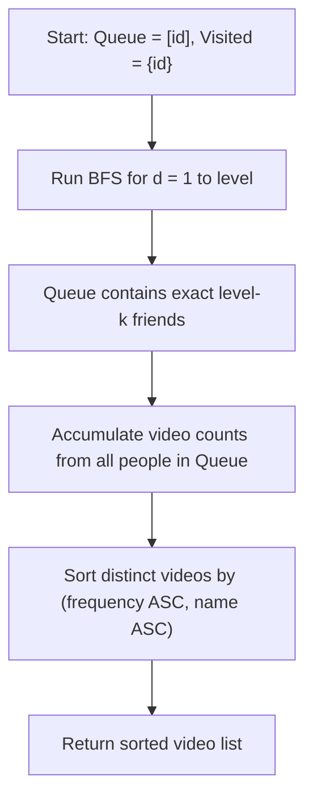

# Guided Example: Get Watched Videos by Your Friends

We trace the breadth-first graph search and frequency aggregation algorithm on a representative social network:

- **Input:** `watchedVideos = [["A", "B"], ["C"], ["B", "C"], ["D"]]`, `friends = [[1, 2], [0, 3], [0, 3], [1, 2]]`, `id = 0`, `level = 1`
- **Required Output:** `["B", "C"]`

This instance demonstrates level-synchronized breadth-first frontier expansion, isolating nodes at exact geodesic distance $k$, aggregating item frequencies, and applying dual-key lexicographic sorting.

---

## 1. Instance & Teaching Goal

We are given $N = 4$ people in an undirected social network. Each person $i$ has a list of friends and a list of watched videos. Given a starting person $id = 0$ and target distance $level = 1$, we must:
1. Identify all people whose shortest-path distance to $id$ in the friendship graph is strictly equal to $level$.
2. Collect and count the frequencies of all videos watched by this exact group of level-$k$ friends.
3. Order the distinct videos by frequency in ascending order; in case of ties, order alphabetically.

```
Social Graph:
    (0) ----- (1)
     |         |
     |         |
    (2) ----- (3)

Level 0: Node 0 (Start)
Level 1: Nodes 1 and 2 (Direct friends of 0)
Level 2: Node 3 (Distance 2 from 0)

Watched Videos:
  Person 1: ["C"]
  Person 2: ["B", "C"]

Aggregated Frequencies:
  "B": count 1
  "C": count 2

Ordered Output: ["B", "C"]  (count 1 before count 2)
```

Naive depth-first search without shortest-path tracking can reach nodes via longer paths, mistakenly assigning a level-$1$ friend to level $2$ or vice versa. Level-synchronized breadth-first search guarantees finding exact geodesic distances in $\mathcal{O}(V + E)$ time.

---

## 2. Conceptual Foundation & Invariants

Let $G = (V, E)$ be the undirected graph defined by the adjacency list `friends`.

### Level-Synchronized BFS
We initialize a queue $Q = [id]$ and a visited set $S = \{id\}$. We repeat the following for exactly $level$ rounds:
1. Record the current layer size $m = |Q|$.
2. For each of the $m$ nodes in the current layer:
   - Dequeue person $u$.
   - For each neighbor $v \in \text{friends}[u]$:
     - If $v \notin S$, insert $v$ into $S$ and enqueue $v$.

After exactly $level$ rounds, the elements remaining in $Q$ comprise the exact set:
$$
V_{level} = \{v \in V \mid \text{dist}(id, v) = level\}
$$

### Dual-Key Frequency Sort
Compute video frequency histogram $H$:
$$
H[w] = \sum_{u \in V_{level}} [w \in \text{watchedVideos}[u]]
$$
Sort unique videos by tuple $(H[w], \; w)$ in ascending order.

| Pipeline Phase | Invariant Guarantee | Role in Method |
|---|---|---|
| BFS Level 0 | $Q = \{id\}, \; S = \{id\}$ | Initial anchor at distance $0$ |
| BFS Iteration $d \le level$ | $Q$ contains all nodes at distance $d$ | Explores layer by layer without skipping |
| Terminal Queue $Q$ | $\forall v \in Q: \text{dist}(id, v) = level$ | Exact target cohort isolated |
| Frequency & Sort | $H[w_1] < H[w_2]$ or ($H[w_1] == H[w_2]$ and $w_1 < w_2$) | Stable deterministic ranking |

> **Exact Distance Invariant.** Because edge weights are uniform ($1$), when BFS finishes round $k$, all nodes remaining in $Q$ have geodesic distance strictly equal to $k$. No node at distance $< k$ remains, and no node at distance $> k$ has yet been entered.



---

## 3. Step-by-Step Worked Execution

We trace `watchedVideos = [["A", "B"], ["C"], ["B", "C"], ["D"]]`, `friends = [[1, 2], [0, 3], [0, 3], [1, 2]]`, `id = 0`, `level = 1`.

### Stage 1: BFS Traversal ($level = 1$)
- **Initialization:**
  - $Q = [0]$.
  - $S = \{0\}$.
- **Round $d = 1$:**
  - Current layer size: $|Q| = 1$.
  - Dequeue $u = 0$.
  - Examine neighbors of node $0$: $\text{friends}[0] = [1, 2]$.
    - Neighbor $1$: $1 \notin S \implies$ add $1$ to $S$, append $1$ to $Q$.
    - Neighbor $2$: $2 \notin S \implies$ add $2$ to $S$, append $2$ to $Q$.
  - Queue after round $1$: $Q = [1, 2]$.
  - Visited set: $S = \{0, 1, 2\}$.
- Loop terminates because $d = level = 1$.
- Target friend cohort: $\{1, 2\}$.

### Stage 2: Video Frequency Counting
- **Person 1:**
  - Videos: `["C"]`.
  - Update: $H[\text{"C"}] \leftarrow 1$.
- **Person 2:**
  - Videos: `["B", "C"]`.
  - Update: $H[\text{"B"}] \leftarrow 1$.
  - Update: $H[\text{"C"}] \leftarrow 1 + 1 = 2$.
- Final frequency table:
  - `"B"`: $1$
  - `"C"`: $2$

### Stage 3: Dual-Key Sorting
- Distinct video candidates: `["B", "C"]`.
- Compare keys:
  - Key for `"B"`: $(1, \text{"B"})$
  - Key for `"C"`: $(2, \text{"C"})$
- Since $1 < 2$, `"B"` precedes `"C"`.
- Final sorted order: `["B", "C"]`.

---

## 4. Complete Execution Trace

| Phase | Current Person | Action / Event | State of Queue $Q$ | Frequency Map $H$ |
|---|---|---|---|---|
| Init | - | Seed start node $0$ | `[0]` | $\emptyset$ |
| BFS Round 1 | $0$ | Expand friends $1$ and $2$ | `[1, 2]` | $\emptyset$ |
| Video Count | $1$ | Tally `["C"]` | `[1, 2]` | `{"C": 1}` |
| Video Count | $2$ | Tally `["B", "C"]` | `[1, 2]` | `{"B": 1, "C": 2}` |
| Final Sort | - | Sort by `(count, name)` | - | Ordered: `["B", "C"]` |

---

## 5. Algorithmic Correctness

**Soundness.** Breadth-first search on an unweighted graph explores vertices in non-decreasing order of distance. By performing exactly `level` layer-by-layer rounds, every node in $Q$ has shortest-path distance `level` from `id`. Tallying their videos and sorting by `(frequency, name)` precisely matches the problem contract.

**Completeness.** Marking nodes upon addition to $Q$ guarantees each friend is processed at most once. All videos watched by any person at the target level are aggregated without omission.

---

## 6. Traps This Instance Exposes

- **Counting videos from intermediate levels:** Tallying videos of friends at level $0$ (the start person) or level $2$ corrupts the histogram. Only nodes remaining in $Q$ at the exact end of round `level` must be tallied.
- **Cycle re-entry:** In an undirected network, node $1$ has node $0$ as a friend. Failing to maintain a visited set causes back-and-forth oscillation ($0 \to 1 \to 0$).
- **Tie-breaking order:** When two videos share identical frequencies, secondary alphabetical ordering must be enforced.

---

## 7. Complexity Derivation

- **Time Complexity:** $\mathcal{O}(V + E + M \log M)$, where $V$ is the number of people, $E$ is the total friendship edges, and $M$ is the total number of distinct videos watched by level-$k$ friends. The BFS explores at most $V$ vertices and $E$ edges. Counting takes $\mathcal{O}(M)$ time, and sorting $M$ videos takes $\mathcal{O}(M \log M)$ time.
- **Auxiliary Space Complexity:** $\mathcal{O}(V + M)$ to maintain the BFS queue, visited set, and frequency hash map.
