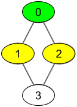
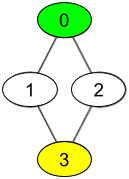

## Description

There are `n` people, each person has a unique *id* between `0` and `n-1`. Given the arrays `watchedVideos` and `friends`, where $\text{watchedVideos}[i]$ and $\text{friends}[i]$ contain the list of watched videos and the list of friends respectively for the person with $id = i$.

Level **1** of videos are all watched videos by your friends, level **2** of videos are all watched videos by the friends of your friends and so on. In general, the level `k` of videos are all watched videos by people with the shortest path **exactly** equal to `k` with you. Given your `id` and the `level` of videos, return the list of videos ordered by their frequencies (increasing). For videos with the same frequency order them alphabetically from least to greatest.
### Function Contract

- `n`: Input parameter.
- Returns expected result.

### Examples
#### Example 1

**

**

- **Input:** $watchedVideos = [["A","B"],["C"],["B","C"],["D"]], friends = [[1,2],[0,3],[0,3],[1,2]], id = 0, level = 1$
- **Output:** `["B","C"]`
- **Explanation:**
You have id = 0 (green color in the figure) and your friends are (yellow color in the figure):
Person with id = 1 -> watchedVideos = ["C"]
Person with id = 2 -> watchedVideos = ["B","C"]
The frequencies of watchedVideos by your friends are:
B -> 1
C -> 2
#### Example 2

**

**

- **Input:** $watchedVideos = [["A","B"],["C"],["B","C"],["D"]], friends = [[1,2],[0,3],[0,3],[1,2]], id = 0, level = 2$
- **Output:** `["D"]`
- **Explanation:**
You have id = 0 (green color in the figure) and the only friend of your friends is the person with id = 3 (yellow color in the figure).
### Constraints

- $n = \text{watchedVideos.length} = \text{friends.length}$

- $2 \le n \le 100$

- $1 \le \text{watchedVideos}[i].length \le 100$

- $1 \le \text{watchedVideos}[i][j].length \le 8$

- $0 \le \text{friends}[i].length < n$

- $0 \le \text{friends}[i][j] < n$

- $0 \le id < n$

- $1 \le level < n$

- if $\text{friends}[i]$ contains `j`, then $\text{friends}[j]$ contains `i`