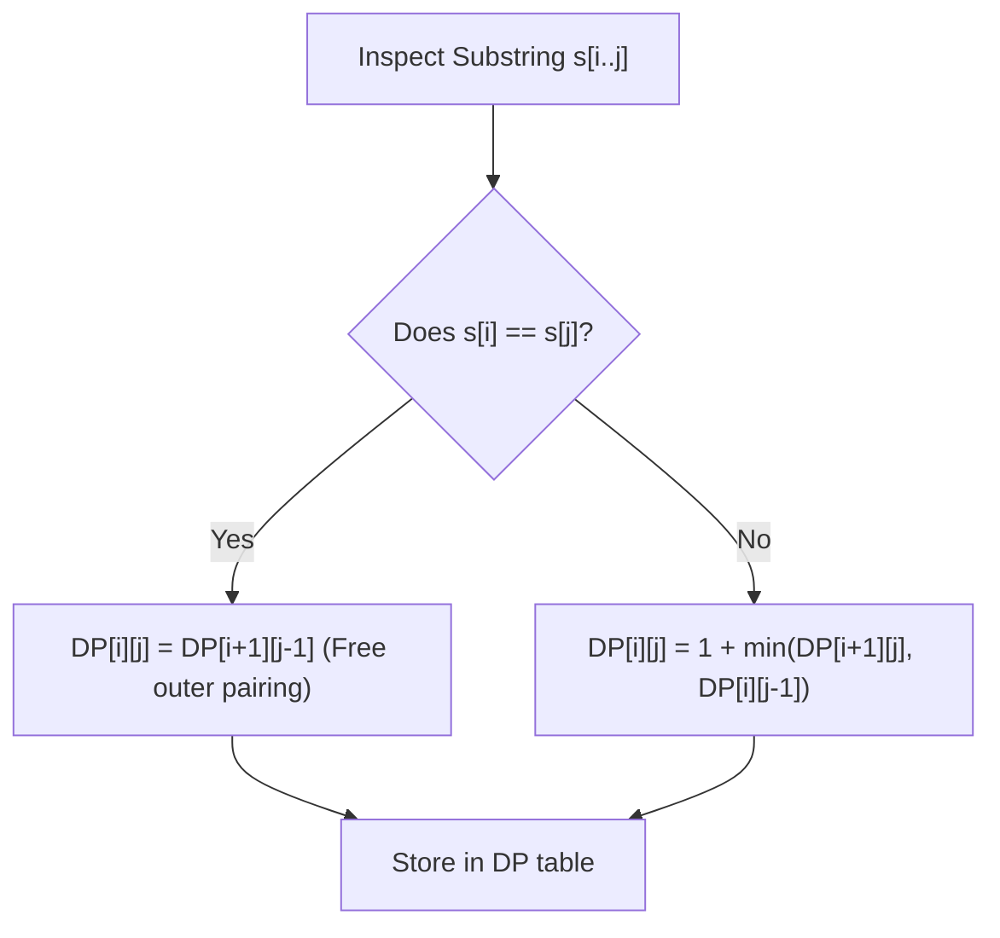

# Guided Example: Minimum Insertion Steps to Make a String Palindrome

We trace the interval dynamic programming recurrence on a representative string instance:

- **Input:** `s = "mbadm"`
- **Required Output:** `2`

This instance demonstrates interval dynamic programming, expanding from single characters to longer substrings, handling character matching vs mismatch branches, and relating minimum insertions to the longest palindromic subsequence.

---

## 1. Instance & Teaching Goal

Given a string $s$ of length $N = 5$, we want to find the minimum number of character insertions needed at any positions to transform $s$ into a palindrome.

For `s = "mbadm"`:
- Characters at the outer boundaries are equal: $s[0] = \text{'m'}$ and $s[4] = \text{'m'}$. They naturally pair without requiring any insertions.
- The interior substring is $s[1..3] = \text{"bad"}$.
- To make `"bad"` a palindrome, we can insert `'d'` after `'b'` and `'b'` after `'d'` to form `"bdadb"`, or insert `'b'` and `'a'` to form `"dabhad"`. The minimal cost is $2$ insertions.
- Embedding this back into the outer `'m'` boundaries yields `"mbdadbm"`, a valid palindrome of length $7$ using exactly $2$ insertions.

```
Index:         0     1     2     3     4
Original:     [m]   [b]   [a]   [d]   [m]
               ^                       ^
               +------ Match ('m') ----+

Interior Substring: "bad" (indices 1 to 3)
  Insert 'd' before 'a': "b d a d"
  Insert 'b' at end:     "b d a d b"
Completed Palindrome:    "m b d a d b m" (2 insertions)
```

A brute-force search trying all insertion locations creates an unbounded search tree. By defining subproblems over contiguous intervals $[i, j]$, interval dynamic programming guarantees evaluating all $\mathcal{O}(N^2)$ distinct substrings systematically from shortest to longest.

---

## 2. Conceptual Foundation & Invariants

Let $DP[i][j]$ denote the minimum number of character insertions required to make substring $s[i..j]$ a palindrome.

### Interval Recurrence
1. **Base Cases (Length $\le 1$):**
   - For any $i \ge j$: $DP[i][j] = 0$, because an empty string or a single character is trivially a palindrome.
2. **Matching Endpoints ($s[i] == s[j]$):**
   - The outer characters already match symmetrically; no insertions are spent on them:
     $$
     DP[i][j] = DP[i+1][j-1]
     $$
3. **Mismatched Endpoints ($s[i] \ne s[j]$):**
   - We must either insert a character matching $s[j]$ to the left of index $i$ (reducing to subproblem $[i, j-1]$) or insert a character matching $s[i]$ to the right of index $j$ (reducing to subproblem $[i+1, j]$):
     $$
     DP[i][j] = 1 + \min(DP[i+1][j], \; DP[i][j-1])
     $$

| Substring Length | State Subproblem | Transition Rule | Insertion Penalty |
|---|---|---|---|
| $L = 1$ | $DP[i][i]$ | Base single character | $0$ |
| $L \ge 2$ ($s[i] == s[j]$) | $DP[i][j]$ | Shrink both endpoints: $DP[i+1][j-1]$ | $0$ |
| $L \ge 2$ ($s[i] \ne s[j]$) | $DP[i][j]$ | $1 + \min(DP[i+1][j], DP[i][j-1])$ | $+1$ |

> **Interval Optimal Substructure Invariant.** For any interval $[i, j]$, $DP[i][j]$ is the exact minimum insertions needed to palindromize $s[i..j]$. Computing in increasing order of interval length $L = j - i + 1$ guarantees that all dependent subproblems are fully resolved before evaluation.



---

## 3. Step-by-Step Worked Execution

We trace `s = "mbadm"` with $N = 5$.

### Length $L = 1$ (Single Characters)
- $DP[0][0] = DP[1][1] = DP[2][2] = DP[3][3] = DP[4][4] = 0$.

### Length $L = 2$ (Pairs)
- **$[0, 1]$ (`"mb"`):** $s[0] \ne s[1] \implies 1 + \min(DP[1][1], DP[0][0]) = 1 + 0 = 1$.
- **$[1, 2]$ (`"ba"`):** $s[1] \ne s[2] \implies 1 + \min(DP[2][2], DP[1][1]) = 1 + 0 = 1$.
- **$[2, 3]$ (`"ad"`):** $s[2] \ne s[3] \implies 1 + \min(DP[3][3], DP[2][2]) = 1 + 0 = 1$.
- **$[3, 4]$ (`"dm"`):** $s[3] \ne s[4] \implies 1 + \min(DP[4][4], DP[3][3]) = 1 + 0 = 1$.

### Length $L = 3$ (Triplets)
- **$[0, 2]$ (`"mba"`):** $s[0] \ne s[2] \implies 1 + \min(DP[1][2], DP[0][1]) = 1 + \min(1, 1) = 2$.
- **$[1, 3]$ (`"bad"`):** $s[1] \ne s[3] \implies 1 + \min(DP[2][3], DP[1][2]) = 1 + \min(1, 1) = 2$.
- **$[2, 4]$ (`"adm"`):** $s[2] \ne s[4] \implies 1 + \min(DP[3][4], DP[2][3]) = 1 + \min(1, 1) = 2$.

### Length $L = 4$ (Quadruplets)
- **$[0, 3]$ (`"mbad"`):** $s[0] \ne s[3] \implies 1 + \min(DP[1][3], DP[0][2]) = 1 + \min(2, 2) = 3$.
- **$[1, 4]$ (`"badm"`):** $s[1] \ne s[4] \implies 1 + \min(DP[2][4], DP[1][3]) = 1 + \min(2, 2) = 3$.

### Length $L = 5$ (Full String `"mbadm"`)
- Inspect endpoints: $s[0] = \text{'m'}$ and $s[4] = \text{'m'}$.
- Since $s[0] == s[4]$, the endpoints match:
  $$
  DP[0][4] = DP[1][3]
  $$
- From the length $3$ calculation, $DP[1][3] = 2$.
- Therefore:
  $$
  DP[0][4] = 2
  $$

---

## 4. Complete Execution Trace

| Length $L$ | Interval $[i, j]$ | Substring | Condition | Evaluation Formula | Result |
|---|---|---|---|---|---|
| 1 | All $[i, i]$ | `"m"`, `"b"`, `"a"`, `"d"`, `"m"` | Base single character | Trivially $0$ | $0$ |
| 2 | $[0, 1]$ | `"mb"` | Mismatch | $1 + \min(DP[1][1], DP[0][0])$ | $1$ |
| 2 | $[1, 2]$ | `"ba"` | Mismatch | $1 + \min(DP[2][2], DP[1][1])$ | $1$ |
| 2 | $[2, 3]$ | `"ad"` | Mismatch | $1 + \min(DP[3][3], DP[2][2])$ | $1$ |
| 2 | $[3, 4]$ | `"dm"` | Mismatch | $1 + \min(DP[4][4], DP[3][3])$ | $1$ |
| 3 | $[0, 2]$ | `"mba"` | Mismatch | $1 + \min(DP[1][2], DP[0][1])$ | $2$ |
| 3 | $[1, 3]$ | `"bad"` | Mismatch | $1 + \min(DP[2][3], DP[1][2])$ | $2$ |
| 3 | $[2, 4]$ | `"adm"` | Mismatch | $1 + \min(DP[3][4], DP[2][3])$ | $2$ |
| 4 | $[0, 3]$ | `"mbad"` | Mismatch | $1 + \min(DP[1][3], DP[0][2])$ | $3$ |
| 4 | $[1, 4]$ | `"badm"` | Mismatch | $1 + \min(DP[2][4], DP[1][3])$ | $3$ |
| 5 | $[0, 4]$ | `"mbadm"` | **Endpoint Match: 'm' == 'm'** | $DP[1][3]$ | **2** |

---

## 5. Algorithmic Correctness

**Soundness.** A palindrome is symmetric about its center. For any substring $s[i..j]$, if the characters at $i$ and $j$ match, they can serve as the outer symmetrical bookends of the resulting palindrome, leaving the subproblem $s[i+1..j-1]$. If they mismatch, at least one character must be inserted to pair with either $s[i]$ or $s[j]$. Choosing the minimum of the two options guarantees optimal insertion count at every step.

**Completeness.** Interval lengths strictly increase ($L = 1, 2, \dots, N$). Because $DP[i][j]$ depends only on intervals of strictly smaller length ($L-1$ or $L-2$), no circular dependency exists, and the final state $DP[0][N-1]$ rigorously captures the global optimum.

---

## 6. Traps This Instance Exposes

- **Overcounting matching boundaries:** When $s[i] == s[j]$, no insertion is required. Adding $+1$ on a match overcounts the required insertions.
- **Topological order inversion:** Attempting to iterate row-by-row $i$ and column-by-column $j$ without respecting interval length or reverse-$i$ order reads uninitialized subproblems.
- **Relation to Longest Palindromic Subsequence (LPS):** The minimum insertions needed is mathematically equivalent to $N - \text{LPS}(s)$. Finding the longest palindromic subsequence and subtracting its length from $N$ provides an identical optimal result.

---

## 7. Complexity Derivation

- **Time Complexity:** $\mathcal{O}(N^2)$, where $N$ is the length of string $s$. There are $\mathcal{O}(N^2)$ intervals $[i, j]$ with $0 \le i \le j < N$. Each interval computes its state in $\mathcal{O}(1)$ time.
- **Auxiliary Space Complexity:** $\mathcal{O}(N^2)$ to store the DP memoization matrix (or $\mathcal{O}(N)$ using row-rolling optimization).
