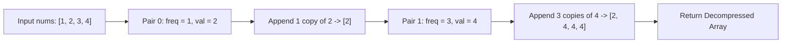

# Guided Example: Decompress Run-Length Encoded List

We trace the pairwise run-length expansion algorithm on a representative compressed array instance:

- **Input:** `nums = [1, 2, 3, 4]`
- **Required Output:** `[2, 4, 4, 4]`

This instance demonstrates unpacking adjacent `[frequency, value]` pairs, pre-allocating or incrementally expanding output buffers, and preserving sequence order across variable-length runs.

---

## 1. Instance & Teaching Goal

We are given an even-length array `nums` of size $2k = 4$, where adjacent pairs represent run-length encoded data:
$$
\text{Pair } i = [\text{freq}_i, \; \text{val}_i] = [\text{nums}[2i], \; \text{nums}[2i + 1]] \quad (0 \le i < k)
$$
Each pair instructs us to generate exactly $\text{freq}_i$ copies of the integer $\text{val}_i$.

For `nums = [1, 2, 3, 4]`:
- Pair $0$ ($i = 0$): $\text{freq}_0 = 1$, $\text{val}_0 = 2 \implies$ emit one copy of $2$: `[2]`.
- Pair $1$ ($i = 1$): $\text{freq}_1 = 3$, $\text{val}_1 = 4 \implies$ emit three copies of $4$: `[4, 4, 4]`.
- Concatenated result: `[2, 4, 4, 4]`.

```
Index:         0      1      2      3
Input:        [1]    [2]    [3]    [4]
              ---    ---    ---    ---
Meaning:     freq0  val0   freq1  val1

Unpacking:
  Pair 0: freq = 1, val = 2  -->  [ 2 ]
  Pair 1: freq = 3, val = 4  -->  [ 4, 4, 4 ]

Assembled Array: [ 2, 4, 4, 4 ]
Total Elements Produced: 1 + 3 = 4
```

Because the array is already cleanly structured into consecutive pairs, decompression requires no complex grammar parsing. A single linear sweep through pair boundaries reconstructs the uncompressed array in optimal linear time proportional to the output length.

---

## 2. Conceptual Foundation & Invariants

Let $N = \text{len}(\text{nums})$. Because $N$ is guaranteed to be even, there are exactly $k = N / 2$ pairs.

### Mathematical Definition of Decompression
The decompressed sequence $A$ is the ordered concatenation:
$$
A = \bigoplus_{i=0}^{k-1} \underbrace{[\text{val}_i, \; \text{val}_i, \; \dots, \; \text{val}_i]}_{\text{freq}_i \text{ times}}
$$
where $\text{val}_i = \text{nums}[2i + 1]$ and $\text{freq}_i = \text{nums}[2i]$.

The total length $M$ of the decompressed sequence is:
$$
M = \sum_{i=0}^{k-1} \text{freq}_i = \sum_{i=0}^{k-1} \text{nums}[2i]
$$

| Pair Index $i$ | Frequency Location ($2i$) | Value Location ($2i+1$) | Emitted Run | Cumulative Size |
|---|---|---|---|---|
| $0$ | $\text{nums}[0] = 1$ | $\text{nums}[1] = 2$ | `[2]` | $1$ |
| $1$ | $\text{nums}[2] = 3$ | $\text{nums}[3] = 4$ | `[4, 4, 4]` | $1 + 3 = 4$ |

> **Sequential Reconstruction Invariant.** After processing pair $i$, the prefix $A[0..\sum_{j=0}^i \text{freq}_j - 1]$ contains the exact sequence corresponding to all compressed runs up to index $i$, strictly preserving run boundaries and original sequence order.



---

## 3. Step-by-Step Worked Execution

We trace `nums = [1, 2, 3, 4]` with $N = 4$ and $k = 2$:

### Step 1: Initialize Accumulator
- Initialize empty output sequence: $A = []$.

### Step 2: Process Pair $0$ (Index $2i = 0$)
- Read frequency: $\text{freq}_0 = \text{nums}[0] = 1$.
- Read value: $\text{val}_0 = \text{nums}[1] = 2$.
- Expansion loop:
  - Repetition $1$ of $1$: append $2$.
- Intermediate array state: $A = [2]$.
- Length of $A$: $1$.

### Step 3: Process Pair $1$ (Index $2i = 2$)
- Read frequency: $\text{freq}_1 = \text{nums}[2] = 3$.
- Read value: $\text{val}_1 = \text{nums}[3] = 4$.
- Expansion loop:
  - Repetition $1$ of $3$: append $4$. Array becomes `[2, 4]`.
  - Repetition $2$ of $3$: append $4$. Array becomes `[2, 4, 4]`.
  - Repetition $3$ of $3$: append $4$. Array becomes `[2, 4, 4, 4]`.
- Intermediate array state: $A = [2, 4, 4, 4]$.
- Length of $A$: $4$.

### Step 4: Termination
- Index $2i = 4 \ge N$; all pairs have been exhausted.
- Return final decompressed array: `[2, 4, 4, 4]`.

---

## 4. Complete Execution Trace

| Pass | Pointer Index | Raw Tuple | Extracted $(\text{freq}, \text{val})$ | Generated Segment | Output State After Step |
|---|---|---|---|---|---|
| Init | - | - | - | - | `[]` |
| 1 | $0$ | $(\text{nums}[0], \text{nums}[1])$ | $(1, 2)$ | `[2]` | `[2]` |
| 2 | $2$ | $(\text{nums}[2], \text{nums}[3])$ | $(3, 4)$ | `[4, 4, 4]` | `[2, 4, 4, 4]` |

---

## 5. Algorithmic Correctness

**Soundness.** Each pair $[\text{nums}[2i], \text{nums}[2i+1]]$ uniquely specifies that $\text{val}_i$ appeared $\text{freq}_i$ times contiguously in the original uncompressed sequence. Emitting $\text{freq}_i$ copies of $\text{val}_i$ directly reverses the run-length compression transform.

**Completeness.** Stepping through even offsets $0, 2, \dots, N-2$ covers all elements of the input array without overlap or omission. The total count of generated elements matches $\sum \text{nums}[2i]$ exactly.

---

## 6. Traps This Instance Exposes

- **Inverting frequency and value:** Swapping the roles (e.g. treating `nums[0]` as value and `nums[1]` as frequency) yields `[1, 1, 3, 3, 3, 3]`, which produces incorrect values and wrong array dimensions. The problem contract strictly defines `[freq, val]`.
- **Zero frequency edge cases:** The problem constraints guarantee $\text{freq}_i \ge 1$. If a frequency were $0$, the repetition loop would execute $0$ times, correctly emitting no elements for that pair without error.
- **Buffer reallocation overhead:** Repeated dynamic resizing can lead to repeated memory reallocations. In performance-critical environments, precomputing the sum of frequencies $M = \sum \text{nums}[2i]$ allows pre-allocating the output array in a single operation.

---

## 7. Complexity Derivation

- **Time Complexity:** $\mathcal{O}(N + M)$, where $N$ is the length of `nums` and $M = \sum \text{freq}_i$ is the total number of elements in the decompressed array. The algorithm reads all $N$ elements and writes each of the $M$ output elements once.
- **Auxiliary Space Complexity:** $\mathcal{O}(1)$ beyond the memory required to store the decompressed result array.
