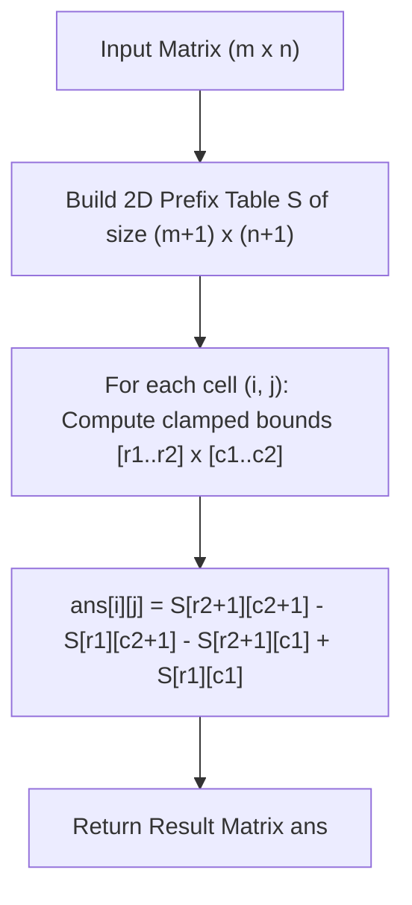

# Guided Example: Matrix Block Sum

We trace the 2D prefix sum precomputation and 2D range sum query algorithm on a representative matrix instance:

- **Input:** `mat = [[1, 2, 3], [4, 5, 6], [7, 8, 9]]`, `k = 1`
- **Required Output:** `[[12, 21, 16], [27, 45, 33], [24, 39, 28]]`

This instance demonstrates 2D inclusion-exclusion prefix sum accumulation, clamping bounding boxes to grid boundaries, and evaluating arbitrary rectangular subgrid sums in constant $\mathcal{O}(1)$ time.

---

## 1. Instance & Teaching Goal

Given an $m \times n$ matrix `mat` and integer $k$, we must compute an answer matrix of equal dimensions where each cell $(i, j)$ contains the sum of all elements `mat[r][c]` satisfying:
$$
i - k \le r \le i + k, \quad j - k \le c \le j + k, \quad 0 \le r < m, \quad 0 \le c < n
$$

For `mat` of size $3 \times 3$ with $k = 1$:
- The bounding box centered at $(1, 1)$ covers all indices $r \in [0, 2]$ and $c \in [0, 2]$ (the full $3 \times 3$ grid), summing to $1 + 2 + \dots + 9 = 45$.
- A corner cell such as $(0, 0)$ clamps to $r \in [0, 1]$ and $c \in [0, 1]$ (a $2 \times 2$ window: $\{1, 2, 4, 5\}$), summing to $12$.

```
Input Matrix (3 x 3):
[ 1,  2,  3 ]
[ 4,  5,  6 ]
[ 7,  8,  9 ]

Window Clamping Examples (k = 1):
  Corner (0, 0):  r in [0, 1], c in [0, 1]  --> 1 + 2 + 4 + 5 = 12
  Center (1, 1):  r in [0, 2], c in [0, 2]  --> Sum of all 9 elements = 45
  Corner (2, 2):  r in [1, 2], c in [1, 2]  --> 5 + 6 + 8 + 9 = 28
```

Individually iterating over each cell's $(2k+1) \times (2k+1)$ neighborhood requires $\mathcal{O}(m \cdot n \cdot k^2)$ time. Constructing a 2D prefix sum table reduces each query to exactly $4$ table lookups and $3$ arithmetic operations, reducing runtime to optimal $\mathcal{O}(m \cdot n)$ time.

---

## 2. Conceptual Foundation & Invariants

Let $S$ be an $(m + 1) \times (n + 1)$ prefix sum matrix where $S[r][c]$ holds the sum of all elements in the rectangle $[0..r-1] \times [0..c-1]$ of the original matrix.

### 2D Prefix Sum Construction
Using the principle of inclusion-exclusion:
$$
S[r][c] = S[r - 1][c] + S[r][c - 1] - S[r - 1][c - 1] + \text{mat}[r - 1][c - 1]
$$
for $1 \le r \le m$ and $1 \le c \le n$, with row $0$ and column $0$ initialized to $0$.

### Rectangular Query Evaluation
For any cell $(i, j)$, define the clamped window boundaries:
$$
r_1 = \max(0, i - k), \quad c_1 = \max(0, j - k)
$$
$$
r_2 = \min(m - 1, i + k), \quad c_2 = \min(n - 1, j + k)
$$
The sum over the clamped rectangle $[r_1, r_2] \times [c_1, c_2]$ is:
$$
\text{Sum} = S[r_2 + 1][c_2 + 1] - S[r_1][c_2 + 1] - S[r_2 + 1][c_1] + S[r_1][c_1]
$$

| Term | Region Represented | Inclusion-Exclusion Role |
|---|---|---|
| $+ S[r_2 + 1][c_2 + 1]$ | Rectangle $[0..r_2] \times [0..c_2]$ | Total bounding area |
| $- S[r_1][c_2 + 1]$ | Rectangle $[0..r_1 - 1] \times [0..c_2]$ | Subtract upper region |
| $- S[r_2 + 1][c_1]$ | Rectangle $[0..r_2] \times [0..c_1 - 1]$ | Subtract left region |
| $+ S[r_1][c_1]$ | Rectangle $[0..r_1 - 1] \times [0..c_1 - 1]$ | Add back double-subtracted intersection |

> **2D Region Invariant.** For all $1 \le r \le m$ and $1 \le c \le n$, $S[r][c]$ is identically the sum of all matrix elements strictly within row indices $< r$ and column indices $< c$. Boundary padding with zeroes allows direct formula application without negative index branches.



---

## 3. Step-by-Step Worked Execution

We trace `mat = [[1, 2, 3], [4, 5, 6], [7, 8, 9]]` with $m = 3, n = 3, k = 1$.

### Stage 1: Build 2D Prefix Sum Array $S$ of Size $4 \times 4$
- Row $0$ and Column $0$ are entirely $0$.
- **Row 1:**
  - $S[1][1] = 0 + 0 - 0 + 1 = 1$
  - $S[1][2] = 0 + 1 - 0 + 2 = 3$
  - $S[1][3] = 0 + 3 - 0 + 3 = 6$
- **Row 2:**
  - $S[2][1] = 1 + 0 - 0 + 4 = 5$
  - $S[2][2] = 3 + 5 - 1 + 5 = 12$
  - $S[2][3] = 6 + 12 - 3 + 6 = 21$
- **Row 3:**
  - $S[3][1] = 5 + 0 - 0 + 7 = 12$
  - $S[3][2] = 12 + 12 - 5 + 8 = 27$
  - $S[3][3] = 21 + 27 - 12 + 9 = 45$

The resulting prefix sum array $S$:
$$
S = \begin{bmatrix}
0 & 0 & 0 & 0 \\
0 & 1 & 3 & 6 \\
0 & 5 & 12 & 21 \\
0 & 12 & 27 & 45
\end{bmatrix}
$$

### Stage 2: Evaluate Block Sums for Each Cell $(i, j)$
- **Cell $(0, 0)$:** $r \in [0, 1], c \in [0, 1]$.
  $$
  S[2][2] - S[0][2] - S[2][0] + S[0][0] = 12 - 0 - 0 + 0 = 12
  $$
- **Cell $(0, 1)$:** $r \in [0, 1], c \in [0, 2]$.
  $$
  S[2][3] - S[0][3] - S[2][0] + S[0][0] = 21 - 0 - 0 + 0 = 21
  $$
- **Cell $(0, 2)$:** $r \in [0, 1], c \in [1, 2]$.
  $$
  S[2][3] - S[0][3] - S[2][1] + S[0][1] = 21 - 0 - 5 + 0 = 16
  $$
- **Cell $(1, 0)$:** $r \in [0, 2], c \in [0, 1]$.
  $$
  S[3][2] - S[0][2] - S[3][0] + S[0][0] = 27 - 0 - 0 + 0 = 27
  $$
- **Cell $(1, 1)$:** $r \in [0, 2], c \in [0, 2]$.
  $$
  S[3][3] - S[0][3] - S[3][0] + S[0][0] = 45 - 0 - 0 + 0 = 45
  $$
- **Cell $(1, 2)$:** $r \in [0, 2], c \in [1, 2]$.
  $$
  S[3][3] - S[0][3] - S[3][1] + S[0][1] = 45 - 0 - 12 + 0 = 33
  $$
- **Cell $(2, 0)$:** $r \in [1, 2], c \in [0, 1]$.
  $$
  S[3][2] - S[1][2] - S[3][0] + S[1][0] = 27 - 3 - 0 + 0 = 24
  $$
- **Cell $(2, 1)$:** $r \in [1, 2], c \in [0, 2]$.
  $$
  S[3][3] - S[1][3] - S[3][0] + S[1][0] = 45 - 6 - 0 + 0 = 39
  $$
- **Cell $(2, 2)$:** $r \in [1, 2], c \in [1, 2]$.
  $$
  S[3][3] - S[1][3] - S[3][1] + S[1][1] = 45 - 6 - 12 + 1 = 28
  $$

---

## 4. Complete Execution Trace

| Cell $(i, j)$ | Row Range $[r_1, r_2]$ | Col Range $[c_1, c_2]$ | 2D Prefix Sum Formula | Computed Value |
|---|---|---|---|---|
| $(0, 0)$ | $[0, 1]$ | $[0, 1]$ | $S[2][2] - S[0][2] - S[2][0] + S[0][0] = 12 - 0 - 0 + 0$ | $12$ |
| $(0, 1)$ | $[0, 1]$ | $[0, 2]$ | $S[2][3] - S[0][3] - S[2][0] + S[0][0] = 21 - 0 - 0 + 0$ | $21$ |
| $(0, 2)$ | $[0, 1]$ | $[1, 2]$ | $S[2][3] - S[0][3] - S[2][1] + S[0][1] = 21 - 0 - 5 + 0$ | $16$ |
| $(1, 0)$ | $[0, 2]$ | $[0, 1]$ | $S[3][2] - S[0][2] - S[3][0] + S[0][0] = 27 - 0 - 0 + 0$ | $27$ |
| $(1, 1)$ | $[0, 2]$ | $[0, 2]$ | $S[3][3] - S[0][3] - S[3][0] + S[0][0] = 45 - 0 - 0 + 0$ | $45$ |
| $(1, 2)$ | $[0, 2]$ | $[1, 2]$ | $S[3][3] - S[0][3] - S[3][1] + S[0][1] = 45 - 0 - 12 + 0$ | $33$ |
| $(2, 0)$ | $[1, 2]$ | $[0, 1]$ | $S[3][2] - S[1][2] - S[3][0] + S[1][0] = 27 - 3 - 0 + 0$ | $24$ |
| $(2, 1)$ | $[1, 2]$ | $[0, 2]$ | $S[3][3] - S[1][3] - S[3][0] + S[1][0] = 45 - 6 - 0 + 0$ | $39$ |
| $(2, 2)$ | $[1, 2]$ | $[1, 2]$ | $S[3][3] - S[1][3] - S[3][1] + S[1][1] = 45 - 6 - 12 + 1$ | $28$ |

---

## 5. Algorithmic Correctness

**Soundness.** The prefix sum identity decomposes any 2D axis-aligned bounding box into the geometric union and difference of four top-left-anchored rectangles. Because $S[r_2+1][c_2+1]$ covers the entire region from $(0, 0)$ to $(r_2, c_2)$, subtracting the non-overlapping top and left components and adding back their double-subtracted intersection rigorously isolates the exact elements in $[r_1..r_2] \times [c_1..c_2]$.

**Completeness.** Every cell $(i, j)$ in the $m \times n$ matrix is assigned clamped boundaries $[r_1, r_2]$ and $[c_1, c_2]$ that respect grid boundaries. The calculation is executed for all $m \times n$ cells without exception.

---

## 6. Traps This Instance Exposes

- **Failing to clamp indices:** If $i - k < 0$ or $i + k \ge m$, accessing raw indices without `max(0, ...)` and `min(m-1, ...)` causes out-of-bounds access or negative index wrapping.
- **Double subtraction of the intersection:** Neglecting to add back $S[r_1][c_1]$ under-counts the sum by subtracting the top-left overlapping subregion twice.
- **Off-by-one with inclusive bounds:** Because $r_2$ and $c_2$ are inclusive indices, their prefix sum lookups must use index $r_2 + 1$ and $c_2 + 1$. Conversely, $r_1$ and $c_1$ are preserved as $r_1$ and $c_1$ to subtract everything strictly before the region.

---

## 7. Complexity Derivation

- **Time Complexity:** $\mathcal{O}(m \cdot n)$. Precomputing the 2D prefix sum array takes $\mathcal{O}(m \cdot n)$ time. Answering each of the $m \cdot n$ block sum queries takes $\mathcal{O}(1)$ time, yielding total linear time with respect to matrix size.
- **Auxiliary Space Complexity:** $\mathcal{O}(m \cdot n)$ to store the $(m + 1) \times (n + 1)$ prefix sum array.
