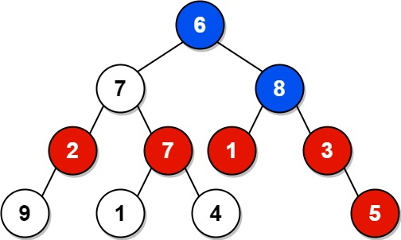

### 1. Description

Given the `root` of a binary tree, return *the sum of values of nodes with an **even-valued grandparent***. If there are no nodes with an **even-valued grandparent**, return `0`.

A **grandparent** of a node is the parent of its parent if it exists.

### 2. Function Contract

- `n`: Input parameter.
- Returns expected result.

### 3. Examples

#### Example 1

- **Input:** `root = [6,7,8,2,7,1,3,9,null,1,4,null,null,null,5]`
- **Output:** `18`
- **Explanation:** The red nodes are the nodes with even-value grandparent while the blue nodes are the even-value grandparents.
#### Example 2

- **Input:** `root = [1]`
- **Output:** `0`

### 4. Constraints

- The number of nodes in the tree is in the range $[1, 10^{4}]$.

- $1 \le \text{Node.val} \le 100$