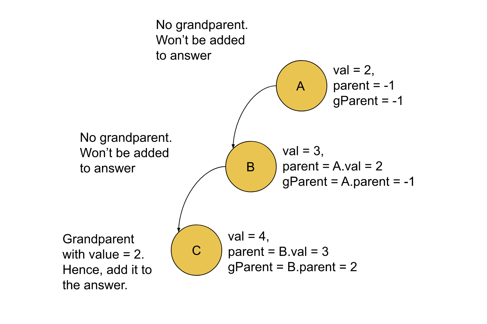
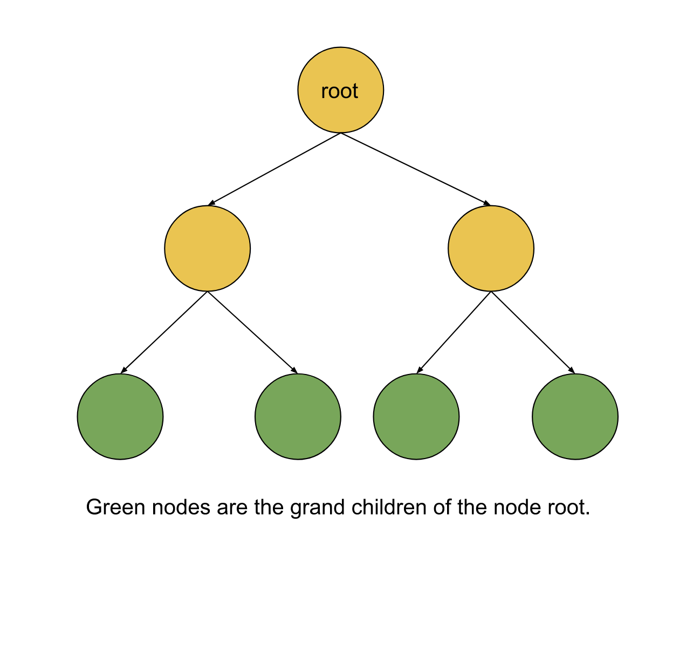

[TOC]

## Solution

---

### Approach 1: Depth-First Search (DFS)

**Intuition**

We are given a binary tree, and we need to return the sum of nodes that has even values grandparent. The grandparent of a node is the parent of its immediate parent.

We need to iterate over the nodes in the binary tree in a way that we can find the value of its grandparent. We can then check if the value of its grandparent is even, and if so, add the value of that node to the answer. One way to iterate a tree is Depth-First Search, i.e., DFS. We can recursively iterate over the nodes in the tree in depth wise manner, but keeping two extra pieces of information: the value of its immediate parent, and the value of its grandparent. This enables us to decide whether the value of the current node should be added to the answer.

How will we find the value of parent and grandparent for each node? We can start with the root node and which has neither the parent nor the grandparent node. We can use arbitrary odd values to represent their values so that we don't add the root value to the answer. The value of the parent node for the child node and the value of the grandparent node can be obtained as the current node's value and the parent node's value of the current node, respectively.



**Algorithm**

1. Define the method `solve()` that takes the TreeNode `root`, the parent value `parent` and the grandparent value `gParent`. This method returns the number of nodes with even-valued grandparent under the subtree of node `root.`
2. Call the recursive function `solve()` with the root node and `-1` as the parent value  `parent` and grandparent value `gParent`
3. If the `root` is null, then we can return `0` as the sum.
4. Recursively iterate over the left and right child with parent value as `root` and grandparent value as `parent`.
5. If the value of `gParent` is even, then add the value of `root` to the answer.
6. Return the sum for the left and right child and the value for the current node.

**Implementation**

```cpp
class Solution {
public:
    int solve(TreeNode* root, int parent, int gParent) {
        if (!root) {
            return 0;
        }

        // Iterate over the child with updated values of parent and grandparent.
        return solve(root->left, root->val, parent)
                + solve(root->right, root->val, parent)
                + (gParent % 2 ? 0 : root->val);
    }

    int sumEvenGrandparent(TreeNode* root) {
        return solve(root, -1, -1);
    }
};
```

**Complexity Analysis**

Here, $N$ is the number of nodes in the binary tree.

* Time complexity: $O(N)$

  We need to iterate over every node only once with parent and grandparent values in the recursive function. Hence the total time complexity is equal to $O(N)$.

* Space complexity: $O(N)$

  The only space required is the stack recursion calls, the maximum number of active stack calls would be equal to $O(N)$ when the tree is skewed and there is one function call for each of the nodes in the recursive stack. Hence the total space complexity is equal to $O(N)$.

 <br/>

---
### Approach 2:  Breadth-First Search (BFS)

**Intuition**

The other way to iterate over the nodes in a binary tree is using Breadth-First Search. We will iterate over the nodes in a breadth-wise manner, and for each node, we need to find a way to determine if it has a grandparent with an even value.

Since we will iterate over the nodes in an iterative manner using BFS, we have to use a different method to find the grandparent. What if, instead of checking the ancestor nodes of each node, we look for the grandchildren nodes of each node? This way, we don't have to keep the parent and grandparent values as we did before.

As shown below we will check the four grandchildren for each node which has an even value, we will add the value of all these grandchildren to the answer.



**Algorithm**

1. Initialize an empty queue `q`, and a variable `sum` to `0`.
2. Iterate over the queue while it's not empty and for each node:

1. Pop the node from the queue as `curr`.
2. If the value of `curr` is even, then check the grandchildren of this node and add the values to the variable `sum`.
3. Add the left and right child of the node `curr` if they are not null.
3. Return `sum`.

**Implementation**

```cpp
class Solution {
public:
    int findVal(TreeNode* root) {
        return root ? root->val : 0;
    }

    int sumEvenGrandparent(TreeNode* root) {
        if (root == NULL) {
            return 0;
        }

        queue<TreeNode*> q;
        q.push(root);

        int sum = 0;
        while (!q.empty()) {
            TreeNode* curr = q.front();
            q.pop();

            // If the node value is even, then Check the four grandchildren
            // And add the value.
            if (curr->val % 2 == 0) {
                if (curr->left) {
                    sum += findVal(curr->left->left) + findVal(curr->left->right);
                }
                if (curr->right) {
                    sum += findVal(curr->right->left) + findVal(curr->right->right);
                }
            }

            // Add the non-null child of the current node.
            if (curr->left)
                q.push(curr->left);
            if (curr->right)
                q.push(curr->right);
        }

        return sum;
    }
};
```

**Complexity Analysis**

Here, $N$ is the number of nodes in the binary tree.

* Time complexity: $O(N)$

  The outer while loop continues if there are nodes in the queue. Each node will be added to the queue and popped from the queue only once. If its value is even, we will keep popping the node and check its four grandchildren. All these operations are constant in terms of time complexity. Hence the total time complexity is equal to $O(N)$.

* Space complexity: $O(N)$

  We need a queue to store the nodes at a particular level of the binary tree. The number of nodes in different levels of a full binary tree will be $${1, 2, 4, 8......2^{N - 1}}$$, with total nodes equal to$2^N$, therefore, the maximum number of nodes at a time in the queue will be of the order$O(N)$. Hence the total space complexity is equal to$O(N)$.
  <br/>

---