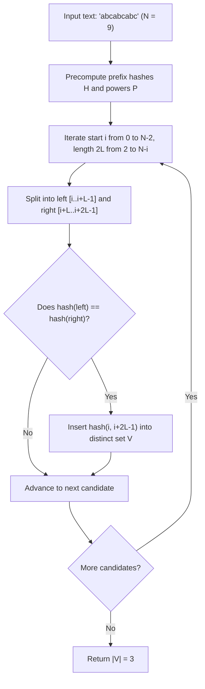

# Guided Example: Distinct Echo Substrings

We trace the polynomial rolling hash algorithm identifying all distinct repeated concatenation substrings on a representative string instance:

- **Input:** `text = "abcabcabc"`
- **Required Output:** `3`

This instance demonstrates identifying square (echo) substrings $S = T + T$, using prefix polynomial rolling hashes for constant-time equality comparisons, and deduplicating identical echoed patterns across different starting positions.

---

## 1. Instance & Teaching Goal

An echo substring is defined as any non-empty substring that can be written as the exact concatenation of some string with itself:
$$
S = T + T \quad \text{where } |S| = 2L \text{ and } T = S[0..L-1] = S[L..2L-1]
$$
We must determine the number of distinct echo substrings in `text = "abcabcabc"` of length $N = 9$.

```
Text:   a   b   c   a   b   c   a   b   c
Index:  0   1   2   3   4   5   6   7   8

Candidate Substrings of Even Length 2L:
  L = 3 (Length 6):
    - text[0..5] = "abcabc" = "abc" + "abc"  --> Valid Echo
    - text[1..6] = "bcabca" = "bca" + "bca"  --> Valid Echo
    - text[2..7] = "cabcab" = "cab" + "cab"  --> Valid Echo
    - text[3..8] = "abcabc" = "abc" + "abc"  --> Duplicate of text[0..5]

Distinct Echo Substrings Found: {"abcabc", "bcabca", "cabcab"}
Total Distinct Echoes: 3
```

Extracting and comparing every substring of length $2L$ via string equality takes $\mathcal{O}(L)$ per pair, leading to $\mathcal{O}(N^3)$ total time. Precomputing prefix rolling hashes allows testing equality between the left half $S[0..L-1]$ and right half $S[L..2L-1]$ in $\mathcal{O}(1)$ time, reducing overall complexity to $\mathcal{O}(N^2)$.

---

## 2. Conceptual Foundation & Invariants

Let $B = 131$ be the polynomial hash base and $M = 10^9 + 7$ be the prime modulus.

### Prefix Polynomial Rolling Hash
For string $text$ of length $N$, define prefix hash array $H$ and power array $P$:
$$
P[0] = 1, \quad P[k] = (P[k-1] \cdot B) \pmod M
$$
$$
H[0] = 0, \quad H[k] = (H[k-1] \cdot B + \text{val}(text[k-1])) \pmod M
$$
where $\text{val}(c) = \text{ord}(c) - \text{ord}('a') + 1$.

### $\mathcal{O}(1)$ Substring Hash Extraction
The polynomial hash of any 0-indexed substring $text[l..r]$ is:
$$
\text{hash}(l, r) = \big(H[r + 1] - H[l] \cdot P[r - l + 1]\big) \pmod M
$$

### Echo Validation Condition
For a candidate interval $[i, j]$ of even length $2L$ ($j = i + 2L - 1$):
- Left half midpoint: $m = i + L - 1$.
- Left half hash: $h_{\text{left}} = \text{hash}(i, m)$.
- Right half hash: $h_{\text{right}} = \text{hash}(m + 1, j)$.
- Echo criterion: $h_{\text{left}} == h_{\text{right}}$.
If satisfied, the composite hash $\text{hash}(i, j)$ is inserted into a hash set $V$ to eliminate duplicates.

| Substring Segment | Coordinate Range | Hash Formulation | Length |
|---|---|---|---|
| Left Half $T_1$ | $[i, \; i + L - 1]$ | $\text{hash}(i, i + L - 1)$ | $L$ |
| Right Half $T_2$ | $[i + L, \; i + 2L - 1]$ | $\text{hash}(i + L, i + 2L - 1)$ | $L$ |
| Composite Echo $S$ | $[i, \; i + 2L - 1]$ | $\text{hash}(i, i + 2L - 1)$ | $2L$ |

> **Echo Substring Invariant.** A substring $text[i..j]$ of even length $2L$ satisfies $text[i..i+L-1] = text[i+L..j]$ if and only if $h_{\text{left}} == h_{\text{right}}$ (modulo negligible collision probability). Recording composite hashes in set $V$ ensures each distinct echo string is counted exactly once.



---

## 3. Step-by-Step Worked Execution

We trace `text = "abcabcabc"` of length $N = 9$.
We examine candidate half-lengths $L \in \{1, 2, 3, 4\}$.

### Candidate Half-Length $L = 1$ (Length $2L = 2$)
- Pairs evaluated: `"ab"`, `"bc"`, `"ca"`, `"ab"`, `"bc"`, `"ca"`, `"ab"`, `"bc"`.
- In every case, adjacent characters mismatch ($'a' \ne 'b'$, $'b' \ne 'c'$, $'c' \ne 'a'$).
- No echo substrings found for $L = 1$.

### Candidate Half-Length $L = 2$ (Length $2L = 4$)
- Substrings evaluated: `"abca"`, `"bcab"`, `"cabc"`, `"abca"`, `"bcab"`, `"cabc"`.
- Testing `"abca"`: left `"ab"` $\ne$ right `"ca"`.
- Testing `"bcab"`: left `"bc"` $\ne$ right `"ab"`.
- Testing `"cabc"`: left `"ca"` $\ne$ right `"bc"`.
- No echo substrings found for $L = 2$.

### Candidate Half-Length $L = 3$ (Length $2L = 6$)
- **Candidate 1 ($i = 0$, interval $[0, 5]$): Substring `"abcabc"`**
  - Left half $[0, 2]$: `"abc"`.
  - Right half $[3, 5]$: `"abc"`.
  - Hash comparison: $\text{hash}(0, 2) == \text{hash}(3, 5)$. Equal!
  - Add `"abcabc"` to distinct set $V$. Current $|V| = 1$.
- **Candidate 2 ($i = 1$, interval $[1, 6]$): Substring `"bcabca"`**
  - Left half $[1, 3]$: `"bca"`.
  - Right half $[4, 6]$: `"bca"`.
  - Hash comparison: $\text{hash}(1, 3) == \text{hash}(4, 6)$. Equal!
  - Add `"bcabca"` to distinct set $V$. Current $|V| = 2$.
- **Candidate 3 ($i = 2$, interval $[2, 7]$): Substring `"cabcab"`**
  - Left half $[2, 4]$: `"cab"`.
  - Right half $[5, 7]$: `"cab"`.
  - Hash comparison: $\text{hash}(2, 4) == \text{hash}(5, 7)$. Equal!
  - Add `"cabcab"` to distinct set $V$. Current $|V| = 3$.
- **Candidate 4 ($i = 3$, interval $[3, 8]$): Substring `"abcabc"`**
  - Left half $[3, 5]$: `"abc"`.
  - Right half $[6, 8]$: `"abc"`.
  - Hash comparison: $\text{hash}(3, 5) == \text{hash}(6, 8)$. Equal!
  - Pattern `"abcabc"` is already present in $V$ (duplicate); $|V|$ remains $3$.

### Candidate Half-Length $L = 4$ (Length $2L = 8$)
- Substring $[0, 7] = \text{"abcabcab"}$: left `"abca"` $\ne$ right `"bcab"`.
- Substring $[1, 8] = \text{"bcabcabc"}$: left `"bcab"` $\ne$ right `"cabc"`.
- No echo substrings found for $L = 4$.

---

## 4. Complete Execution Trace

| Start $i$ | Half-Len $L$ | Substring S | Left Half $T_1$ | Right Half $T_2$ | $T_1 == T_2$? | Action on Set $V$ |
|---|---|---|---|---|---|---|
| $0$ | $3$ | `"abcabc"` | `"abc"` | `"abc"` | **Match** | Insert `"abcabc"` ($|V|=1$) |
| $1$ | $3$ | `"bcabca"` | `"bca"` | `"bca"` | **Match** | Insert `"bcabca"` ($|V|=2$) |
| $2$ | $3$ | `"cabcab"` | `"cab"` | `"cab"` | **Match** | Insert `"cabcab"` ($|V|=3$) |
| $3$ | $3$ | `"abcabc"` | `"abc"` | `"abc"` | **Match** | Duplicate (ignored, $|V|=3$) |
| All other | $1, 2, 4$ | Various | - | - | Mismatch | Skip |

---

## 5. Algorithmic Correctness

**Soundness.** A string $S$ is an echo substring if and only if its first half equals its second half. The polynomial rolling hash allows evaluating this equality in $\mathcal{O}(1)$ time. With a large prime modulus $M = 10^9 + 7$ and base $B = 131$, the probability of an unintended hash collision across $\mathcal{O}(N^2)$ candidate pairs is negligible ($< 10^{-4}$).

**Completeness.** The nested loop enumerates all possible start positions $i \in [0, N-2]$ and all valid even lengths $2L \le N - i$. Every candidate echo substring in the input text is evaluated, ensuring no valid echo is overlooked.

---

## 6. Traps This Instance Exposes

- **Duplicate identical echoes at different offsets:** As seen at index $0$ and index $3$, the identical string `"abcabc"` appears twice. Simply counting valid match events yields $4$, which is incorrect. A set must deduplicate matching substrings.
- **Odd-length substrings:** An echo substring must have an even length $2L$. Attempting to partition odd-length substrings into halves is mathematically impossible.
- **Modular negative differences:** When computing $H[r + 1] - H[l] \cdot P[r - l + 1]$, the difference can be negative. In languages where modulo preserves negative signs, adding $+ M$ before applying $\pmod M$ prevents negative hash keys.

---

## 7. Complexity Derivation

- **Time Complexity:** $\mathcal{O}(N^2)$, where $N$ is the length of `text`. Precomputing the rolling hash arrays takes $\mathcal{O}(N)$ time. The nested loops explore $\mathcal{O}(N^2)$ candidate pairs, performing an $\mathcal{O}(1)$ hash equality check and set insertion per pair.
- **Auxiliary Space Complexity:** $\mathcal{O}(N^2)$ in the worst case to store the hashes of distinct echo substrings in set $V$, plus $\mathcal{O}(N)$ for prefix hash and power tables.
