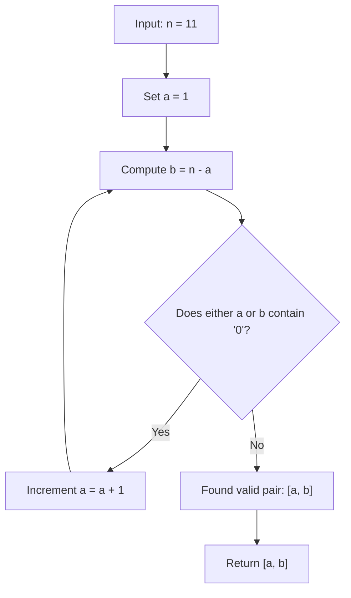

# Guided Example: Convert Integer to the Sum of Two No-Zero Integers

We trace the linear search and digit-validation algorithm for partitioning an integer into two non-zero-digit summands on a representative instance:

- **Input:** $n = 11$
- **Required Output:** `[2, 9]`

This instance demonstrates decimal radix digit testing, identifying and discarding candidate partitions containing the digit zero, and terminating at the first valid non-zero pair.

---

## 1. Instance & Teaching Goal

A positive integer is defined as a *No-Zero integer* if its base-10 decimal representation contains no occurrences of the digit `'0'`. Given integer $n = 11$, we must find two positive integers $a$ and $b$ such that:
$$
a + b = 11, \quad a \text{ is No-Zero}, \quad b \text{ is No-Zero}
$$

For $n = 11$:
- Trial $1$: $a = 1 \implies b = 11 - 1 = 10$.
  The decimal digits of $10$ are $\{1, 0\}$, containing `'0'`. Hence $b$ is invalid.
- Trial $2$: $a = 2 \implies b = 11 - 2 = 9$.
  The decimal digits of $2$ are $\{2\}$, and the digits of $9$ are $\{9\}$. Neither contains `'0'`.
  The pair $[2, 9]$ satisfies all constraints.

```
Testing Candidates a + b = 11:
  Trial 1: a = 1, b = 10  -->  10 contains digit '0' (Rejected)
  Trial 2: a = 2, b = 9   -->  2 and 9 contain no '0' (Accepted!)

Solution: [2, 9]
Sum: 2 + 9 = 11
```

Testing all possible pairs up to $n$ requires at most $n$ iterations. Since No-Zero numbers are dense across the positive integers, a valid partition is found almost immediately (typically within the first few increments of $a$), leading to $\mathcal{O}(1)$ average runtime.

---

## 2. Conceptual Foundation & Invariants

Let $a \in \{1, 2, \dots, n-1\}$ and let $b = n - a$.

### No-Zero Predicate Definition
An integer $x$ satisfies the No-Zero property $\text{NoZero}(x)$ if and only if every digit in its base-$10$ expansion is non-zero:
$$
\text{NoZero}(x) \iff \forall k \ge 0: \left(\left\lfloor \frac{x}{10^k} \right\rfloor \bmod 10 \ne 0 \text{ while } 10^k \le x\right)
$$

### Joint Validity Condition
A candidate integer $a$ is accepted if:
$$
\text{NoZero}(a) \land \text{NoZero}(n - a)
$$

| Trial Index $a$ | Complement $b = n - a$ | Digit Decomposition of $a$ | Digit Decomposition of $b$ | Contains '0'? | Accept? |
|---|---|---|---|---|---|
| $1$ | $10$ | $\{1\}$ | $\{1, 0\}$ | Yes ($b$ has '0') | Reject |
| $2$ | $9$ | $\{2\}$ | $\{9\}$ | No | **Accept** |

> **Conservation Invariant.** For every evaluated candidate $a$, the sum $a + b$ is algebraically guaranteed to equal $n$ by setting $b = n - a$. The algorithm only needs to verify the No-Zero digit property on $a$ and $b$.



---

## 3. Step-by-Step Worked Execution

We trace the evaluation for $n = 11$:

### Step 1: Candidate $a = 1$
- Set $a = 1$.
- Compute complement: $b = 11 - 1 = 10$.
- Test digits of $a = 1$:
  - Digits: $\{1\}$. Contains no zero.
- Test digits of $b = 10$:
  - Divmod extraction: $10 \bmod 10 = 0$.
  - Digit zero encountered! $\text{NoZero}(10) = \text{false}$.
- Result: Reject candidate pair $[1, 10]$.

### Step 2: Candidate $a = 2$
- Increment $a \leftarrow 2$.
- Compute complement: $b = 11 - 2 = 9$.
- Test digits of $a = 2$:
  - Digits: $\{2\}$. Contains no zero.
- Test digits of $b = 9$:
  - Digits: $\{9\}$. Contains no zero.
- Joint condition: Both $\text{NoZero}(2)$ and $\text{NoZero}(9)$ are true.
- Result: Accept pair $[2, 9]$ and terminate.

---

## 4. Complete Execution Trace

| Iteration | Candidate $a$ | Complement $b$ | Digits of $a$ | Digits of $b$ | Validation Status | Action |
|---|---|---|---|---|---|---|
| 1 | $1$ | $10$ | `['1']` | `['1', '0']` | Invalid ($10$ has zero) | Increment $a$ |
| 2 | $2$ | $9$ | `['2']` | `['9']` | **Valid (both non-zero)** | Terminate and return `[2, 9]` |

---

## 5. Algorithmic Correctness

**Soundness.** The returned pair $[a, b]$ satisfies $a + b = a + (n - a) = n$ by construction. Both $a$ and $b$ are verified to contain exclusively non-zero digits and are strictly positive ($a \ge 1$, $b \ge 1$). Thus, any accepted pair is guaranteed to be a sound No-Zero partition.

**Completeness.** The problem constraints guarantee that at least one valid No-Zero pair exists for any integer $n \in [2, 10^4]$. Incrementing $a$ from $1$ upward systematically visits all possible positive summands, guaranteeing that a valid solution is encountered and returned.

---

## 6. Traps This Instance Exposes

- **Failing to check both numbers:** Checking only whether $a$ contains no zeros while ignoring $b$ accepts $[1, 10]$, which violates the problem requirements.
- **Negative or zero values:** Candidate $a$ must start at $1$ and remain strictly less than $n$ to prevent $a = 0$ or $b = 0$, as $0$ is not a positive integer.
- **Modulo 10 edge cases:** When extracting digits mathematically via $x \bmod 10$, a trailing zero (as in $10 \bmod 10 = 0$) must immediately trigger failure.

---

## 7. Complexity Derivation

- **Time Complexity:** $\mathcal{O}(n \log_{10} n)$ in the worst case, but $\mathcal{O}(\log_{10} n)$ on average. Digits are tested in $\mathcal{O}(\log_{10} n)$ operations. Because non-zero numbers comprise a large majority of integers, the loop terminates within a few iterations.
- **Auxiliary Space Complexity:** $\mathcal{O}(1)$ beyond minimal scalar loop variables.
