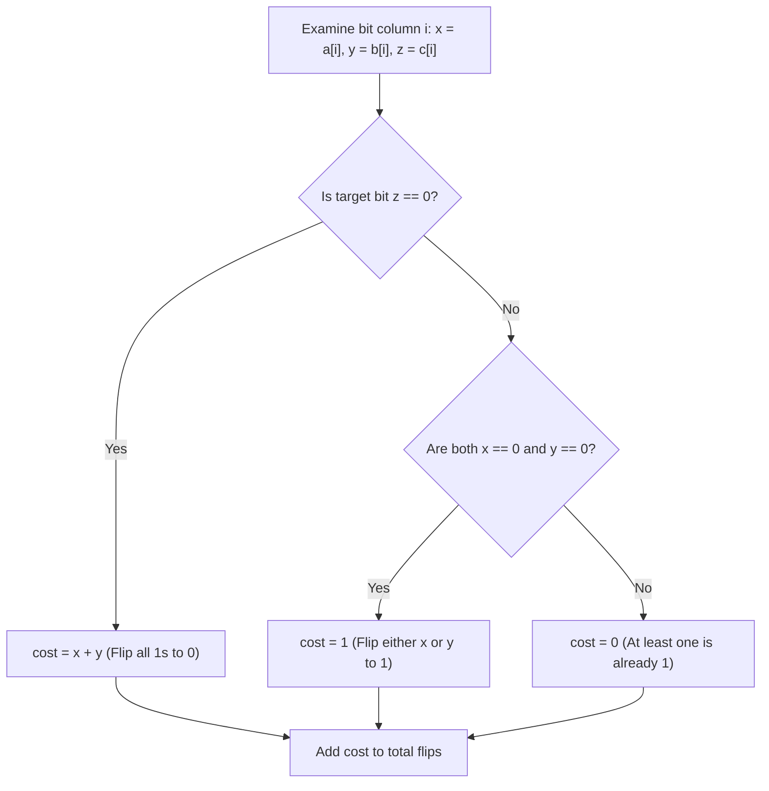

# Guided Example: Minimum Flips to Make a OR b Equal to c

We trace the bitwise decomposition and bit-flip cost evaluation algorithm on a representative integer triple:

- **Input:** $a = 2$, $b = 6$, $c = 5$
- **Required Output:** `3`

This instance demonstrates bitwise independence across binary columns, analyzing OR truth-table constraints for target bits $0$ and $1$, and determining optimal bit modifications without side effects.

---

## 1. Instance & Teaching Goal

Given three positive integers $a$, $b$, and $c$, we wish to determine the minimum number of single-bit flips in $a$ and/or $b$ such that:
$$
(a \mid b) = c
$$
A flip consists of changing a bit from $0$ to $1$ or from $1$ to $0$.

For $a = 2$, $b = 6$, and $c = 5$:
- $a = 2 = 0010_2$
- $b = 6 = 0110_2$
- $c = 5 = 0101_2$

```
Bit Column:     3     2     1     0
a (val 2):      0     0     1     0
b (val 6):      0     1     1     0
-----------------------------------
a | b:          0     1     1     0
Target c:       0     1     0     1
Difference:                 ^     ^
                    (bit 1) (bit 0)

Bit Analysis:
  - Bit 0: a=0, b=0, target=1  --> Need one '1', flip either a or b (1 flip)
  - Bit 1: a=1, b=1, target=0  --> Both must become '0' (2 flips)
  - Bit 2: a=0, b=1, target=1  --> Already 0 | 1 = 1 (0 flips)
  - Bit 3: a=0, b=0, target=0  --> Already 0 | 0 = 0 (0 flips)

Total Flips Required: 1 + 2 + 0 + 0 = 3
```

Because the bitwise OR operator distributes independently over each binary column with zero carry propagation, each bit position $i \in [0, 31]$ can be evaluated in isolation. A single pass across all bit positions yields the minimum global flips in constant $\mathcal{O}(1)$ time.

---

## 2. Conceptual Foundation & Invariants

Let $x_i = (a \gg i) \ \& \ 1$, $y_i = (b \gg i) \ \& \ 1$, and $z_i = (c \gg i) \ \& \ 1$ represent the $i$-th bits of $a$, $b$, and $c$ respectively.

### Per-Bit Cost Function
For each bit column $i$:
1. **Target $z_i = 0$:**
   - We require $x_i \mid y_i = 0$, which holds if and only if $x_i = 0$ and $y_i = 0$.
   - Any $1$ present must be cleared to $0$:
     $$
     \text{cost}_i = x_i + y_i
     $$
2. **Target $z_i = 1$:**
   - We require $x_i \mid y_i = 1$, which holds if at least one of $x_i$ or $y_i$ is $1$.
   - If both are $0$, flipping either one to $1$ satisfies the condition:
     $$
     \text{cost}_i = \begin{cases} 1 & \text{if } x_i = 0 \text{ and } y_i = 0 \\ 0 & \text{otherwise} \end{cases}
     $$

The total minimum flip count is the uncoupled sum:
$$
\text{Total Flips} = \sum_{i=0}^{31} \text{cost}_i
$$

| Target Bit $z_i$ | Operand Bits $(x_i, y_i)$ | Current $x_i \mid y_i$ | Action Needed | Flips Required |
|---|---|---|---|---|
| $0$ | $(0, 0)$ | $0$ | None | $0$ |
| $0$ | $(1, 0)$ or $(0, 1)$ | $1$ | Flip the single $1$ to $0$ | $1$ |
| $0$ | $(1, 1)$ | $1$ | Flip both $1$s to $0$ | $2$ |
| $1$ | $(0, 0)$ | $0$ | Flip either operand bit to $1$ | $1$ |
| $1$ | $(1, 0)$, $(0, 1)$, or $(1, 1)$ | $1$ | None | $0$ |

> **Column Orthogonality Invariant.** The bitwise OR operation does not generate carries. A flip in bit position $i$ modifies only the $i$-th bit of $(a \mid b)$ and has no effect on any bit $j \ne i$. Hence, minimizing flips column-by-column achieves the exact global minimum.



---

## 3. Step-by-Step Worked Execution

We trace $a = 2$, $b = 6$, $c = 5$ for all active bit positions:

### Bit Position $i = 0$ (Weight $2^0 = 1$)
- Extract bits:
  - $x_0 = (2 \gg 0) \ \& \ 1 = 0$
  - $y_0 = (6 \gg 0) \ \& \ 1 = 0$
  - $z_0 = (5 \gg 0) \ \& \ 1 = 1$
- Target is $z_0 = 1$.
- Operands are $(0, 0)$. Neither operand has a $1$.
- Flipping either bit of $a$ or $b$ from $0$ to $1$ satisfies the target.
- Flip cost: $\text{cost}_0 = 1$.

### Bit Position $i = 1$ (Weight $2^1 = 2$)
- Extract bits:
  - $x_1 = (2 \gg 1) \ \& \ 1 = 1$
  - $y_1 = (6 \gg 1) \ \& \ 1 = 1$
  - $z_1 = (5 \gg 1) \ \& \ 1 = 0$
- Target is $z_1 = 0$.
- Operands are $(1, 1)$. For $x_1 \mid y_1$ to equal $0$, both bits must be turned to $0$.
- Flip cost: $\text{cost}_1 = x_1 + y_1 = 1 + 1 = 2$.

### Bit Position $i = 2$ (Weight $2^2 = 4$)
- Extract bits:
  - $x_2 = (2 \gg 2) \ \& \ 1 = 0$
  - $y_2 = (6 \gg 2) \ \& \ 1 = 1$
  - $z_2 = (5 \gg 2) \ \& \ 1 = 1$
- Target is $z_2 = 1$.
- Operands are $(0, 1)$. Since $y_2 = 1$, $x_2 \mid y_2 = 0 \mid 1 = 1$, which already matches $z_2$.
- Flip cost: $\text{cost}_2 = 0$.

### Bit Positions $i \ge 3$
- For all $i \ge 3$, $a$, $b$, and $c$ have $0$ in these columns: $x_i = 0, y_i = 0, z_i = 0$.
- Current OR is $0 \mid 0 = 0$, which matches $z_i = 0$.
- Flip cost: $0$.

### Total Result Calculation
$$
\text{Total} = \text{cost}_0 + \text{cost}_1 + \text{cost}_2 = 1 + 2 + 0 = 3
$$

---

## 4. Complete Execution Trace

| Bit $i$ | $2^i$ Weight | $x_i = a[i]$ | $y_i = b[i]$ | $z_i = c[i]$ | Current $x_i \mid y_i$ | Cost Rule Applied | Flips Added | Running Total |
|---|---|---|---|---|---|---|---|---|
| $0$ | $1$ | $0$ | $0$ | $1$ | $0$ | $z=1$ and $x=y=0 \implies 1$ flip | $1$ | $1$ |
| $1$ | $2$ | $1$ | $1$ | $0$ | $1$ | $z=0 \implies x + y = 2$ flips | $2$ | $3$ |
| $2$ | $4$ | $0$ | $1$ | $1$ | $1$ | $z=1$ and $y=1 \implies 0$ flips | $0$ | $3$ |
| $3..31$ | $\ge 8$ | $0$ | $0$ | $0$ | $0$ | $z=0$ and $x=y=0 \implies 0$ flips | $0$ | $3$ |

---

## 5. Algorithmic Correctness

**Soundness.** Because each bit position in bitwise OR depends strictly on the corresponding bits of the operands with zero bit borrowing or carries, the minimum flips for the entire integer equals the sum of the minimum flips for each bit position. The cost function directly implements the minimal edits necessary to satisfy the truth table of the OR gate.

**Completeness.** Iterating from $i = 0$ to $31$ covers the full representation of 32-bit positive integers ($a, b, c \le 10^9 < 2^{30}$). Every bit position is verified, guaranteeing no mismatch remains.

---

## 6. Traps This Instance Exposes

- **Asymmetry of Target Zero vs Target One:** Setting a target bit to $1$ requires at most $1$ flip (either operand suffice). Setting a target bit to $0$ may require $2$ flips if both operands currently have $1$. Failing to penalize both $1$ bits when $z = 0$ undercounts flips.
- **Unnecessary flips when target is already satisfied:** When $z = 1$ and both $x = 1, y = 1$, no flip is needed. Flipping one of them to $0$ is redundant and wasteful.
- **Sign bit extension:** Using logical right shifts or masking with `& 1` prevents unexpected behavior with signed integers.

---

## 7. Complexity Derivation

- **Time Complexity:** $\mathcal{O}(1)$. The algorithm examines exactly $32$ bit positions (or $\approx \lfloor \log_2(\max(a, b, c)) \rfloor + 1$ iterations), performing a constant number of bit shifts, masks, and additions per step.
- **Auxiliary Space Complexity:** $\mathcal{O}(1)$. All state is maintained in scalar integer variables.
