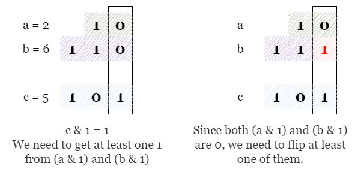
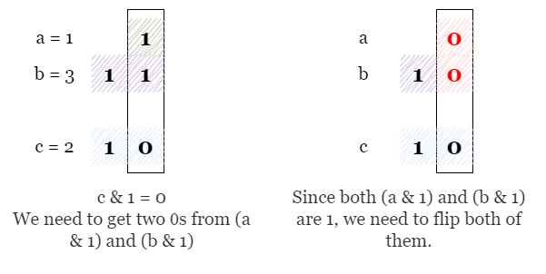
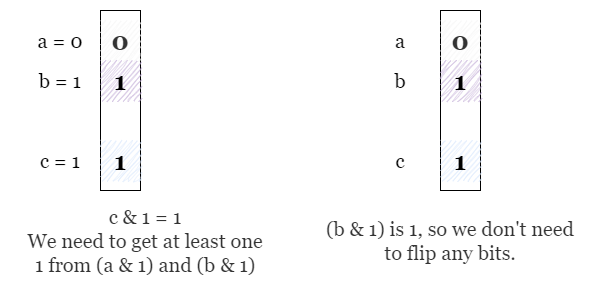
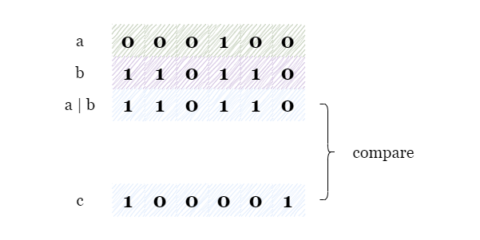
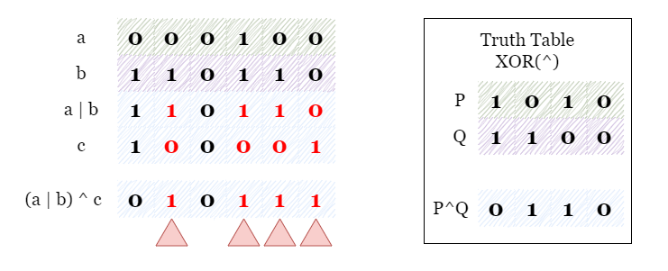
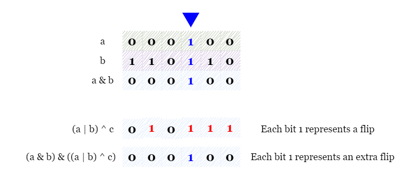

[TOC]

## Solution

---

### Overview

<details>
    <summary>
        <b>   If you are not aware of bit manipulation first, let's get a brief idea about it and look at some basic bitwise operators. (click to expand) </b>
    </summary>

<br />

Bit manipulation is the act of manipulating bits, like changing bits of an integer.
At the heart of bit manipulation are the bit-wise operators:

**NOT (~):** Bitwise NOT is a unary operator that flips the bits of the number i.e., if the current bit is $0$, it will change it to $1$ and vice versa.
```text
N = 5 = 101 (in binary)
~N = ~(101) = 010 = 2 (in decimal)
```

**AND (&):** In bitwise AND if both bits in the compared position of the bit patterns are $1$, the bit in the resulting bit pattern is $1$, otherwise $0$.
```text
A = 5 = 101 (in binary)
B = 1 = 001 (in binary)
A & B = 101 & 001 = 001 = 1 (in decimal)
```

**OR ( | ):** Bitwise OR is also similar to bitwise AND. If both bits in the compared position of the bit patterns are $0$, the bit in the resulting bit pattern is $0$, otherwise $1$.
```text
A = 5 = 101 (in binary)
B = 1 = 001 (in binary)
A | B = 101 | 001 = 101 = 5 (in decimal)
```

**XOR (^):** In bitwise XOR if both bits are $0$ or $1$, the result will be $0$, otherwise $1$.
```text
A = 5 = 101 (in binary)
B = 1 = 001 (in binary)
A ^ B = 101 ^ 001 = 100 = 4 (in decimal)
```

**Left Shift (<<):** Left shift operator is a binary operator which shifts some number of bits to the left and appends $0$ at the end. One left shift is equivalent to multiplying the bit pattern with $2$.
```text
A = 1 = 001 (in binary)
A << 1 = 001 << 1 = 010 = 2 (in decimal)
A << 2 = 001 << 2 = 100 = 4 (in decimal)

B = 5 = 00101 (in binary)
B << 1 = 00101 << 1 = 01010 = 10 (in decimal)
B << 2 = 00101 << 2 = 10100 = 20 (in decimal)
```

**Right Shift (>>):** Right shift operator is a binary operator which shifts some number of bits to the right and appends $0$ at the left side. One right shift is equivalent to dividing the bit pattern with $2$.
```text
A = 4 = 100 (in binary)
A >> 1 = 100 >> 1 = 010 = 2 (in decimal)
A >> 2 = 100 >> 2 = 001 = 1 (in decimal)
A >> 3 = 100 >> 3 = 000 = 0 (in decimal)

B = 5 = 00101 (in binary)
B >> 1 = 00101 >> 1 = 00010 = 2 (in decimal)
```
</details>

---

### Approach 1: Bit Manipulation

#### Intuition

To determine the minimum number of bit flips required in `a` and `b` to achieve their bitwise OR equal to `c`, we can manipulate each bit of `a` and `b`. This can be implemented by iterating over the bits of the numbers from the least significant (the rightmost) bit to the most significant (the leftmost) bit.

> To obtain the least significant bit of `P`, we can use bitwise AND operator `P & 1`

During the iteration, we will keep track of `answer`, the number of bit flips required in `a` and `b`. For each bit position, we need to consider two cases:

- Case 1: $(c \& 1) = 1$: In this case, we need at least one bit of `1` in either `a & 1` or `b & 1`. If either `a & 1` or `b & 1` is `1`, we can move on to the next bit, otherwise, we need to flip a bit in either `a` or `b`.

- Case 2: $(c \& 1) = 0$: In this case, both `a & 1` and `b & 1` should be equal to `0`, if either `a & 1` or `b & 1` is equal to `1`, we need one flip to make it equal to `0`. Therefore, the number of flips equals the sum of `a & 1` and `b & 1`.

After each bit position, we update `answer` with the number of bit flips required in `a` and `b`. We then shift the bits of `a`, `b` and `c` to the right to check the next bit.

> After shifting `a` to the right ($a >\ge 1$), `a & 1` will represent the second least significant bit.

We repeat the above process until all numbers are equal to `0`, and return `answer`.

<br>

Please refer to the following example, where the least significant bits are shown in the box.

Start with initializing $answer = 0$ and examining the least significant bits, we find that $(a \& 1) = 0$, $(b \& 1) = 0$, and $(c \& 1) = 1$, which correspond to case 1 previously mentioned. Thus we need one flip on the least significant bit in either `a` or `b`.



We then shift all numbers to the right and examine the second least significant bits. We observe that $(a \& 1) = 1$, $(b \& 1) = 1$, and $(c \& 1) = 0$, which is consistent with case 2, we need to flip both the least significant bits of `a` and `b`, requiring a total of two flips.



We then shift all numbers to the right and examine the next bits, which are $(a \& 1) = 0$, $(b \& 1) = 1$ and $(c \& 1) = 1$. However, since $(b \& 1) = 1$, we do not need to flip any bits this time.



All numbers are equal to `0` after shifting them to the right, so we can return $answer = 3$.

<br>

#### Algorithm

1) Initialize a variable `answer` as 0, which will be used to keep track of the minimum number of flips needed.

2) Iterate over each bit of the binary representation of `a`, `b`, and `c` simultaneously:

3) If $(c \& 1) = 0$, update answer as $answer += (a \& 1) + (b \& 1)$.

4) If $(c \& 1) = 1$, if both `a & 1` and `b & 1` equal `0`, increment `answer` by 1.

5) Shift all numbers to the right by $a >\ge 1$, $b >\ge 1$, $c >\ge 1$. If all numbers are equal to `0`, return `answer`, otherwise, repeat steps 3 and 4.

#### Implementation

```python
class Solution:
    def minFlips(self, a: int, b: int, c: int) -> int:
        answer = 0
        while a or b or c:
            if c & 1:
                answer += 0 if ((a & 1) or (b & 1)) else 1
            else:
                answer += (a & 1) + (b & 1)
            a >>= 1
            b >>= 1
            c >>= 1
        return answer
```

#### Complexity Analysis

Let $n$ be the maximum length in the binary representation of `a`, `b` or `c`.

* Time complexity: $O(n)$

- We need to iterate over the bits of the numbers. Note that we have $n$ as the number of bits, which is logarithmic with the actual values.

* Space complexity: $O(1)$

- We only need to update `answer` and modify `a`, `b` and `c`.

<br/>

---

### Approach 2: Count the Number of Set Bits Using Built-in Function

#### Intuition

The `XOR` operation returns a bit with the value of `1` only if the corresponding bits of its operands are **different**. In other words, if two bits are the same, the XOR operation returns `0`, otherwise, it returns `1`. We can take advantage of this property to solve the problem without iterating over each bit.



The problem is asking us to have `a | b` equal to `c`. If we do $(a | b) ^ c$, then every bit that is different (and thus we need to flip) will have a value of `1`. Therefore we can just do $(a | b) ^ c$ and count the bits that are set.



> However, there is one exception, which is when $(c \& 1) = 0$ and both `a & 1` and `b & 1` equal `1`. In this case, we need an additional flip.

To find all these cases, we need to identify all the bits where both `a` and `b` are equal to `1`.

To achieve this, we can use the bitwise `&` operator. The `&` operator only returns `1` when operands are both equal to `1`. As shown in the picture below, only the third least significant bit of `a` and `b` is `1` at the same time. Therefore, we can find all the bits that "need an extra flip" from $(a \& b) \& ((a | b) ^ c)$, where each bit with value `1` stands for an extra flip.



The final step is to count the number of digits `1` in the binary representation of the two numbers $(a | b) ^ c$ and $(a \& b) \& ((a | b) ^ c)$.

> The population count, also known as *popcount*, of a specific value is the number of set bits (bits with value `1`) in that value.
> Many programming languages have a built-in function to count the *popcount* of a binary number, including C++, Java, Python, and many others.

<br>

#### Implementation

```python
# In 3.9 or earlier
class Solution:
    # In 3.9 or earlier
    def minFlips(self, a: int, b: int, c: int) -> int:
        return bin((a | b) ^ c).count("1") + bin(a & b & ((a | b) ^ c)).count("1")

    # In 3.10 or later
    def minFlips(self, a: int, b: int, c: int) -> int:
        return ((a | b) ^ c).bit_count() + (a & b & ((a | b) ^ c)).bit_count()
```

#### Complexity Analysis

Let $n$ be the maximum length in the binary representation of `a`, `b` or `c`.

* Time complexity: $O(n)$ or $O(1)$.

    The time complexity of popcount depends on the specific language.
- In C++, `__builtin_popcount()` is a built-in function in GCC (and other compliers) which uses a precomputed lookup table to perform the operation in $O(1)$ time.
- In Java, `Integer.bitCount()` also uses a precomputed table of bit counts for every possible 16-bit integer value, and the bit count of a 32-bit integer can be computed by summing the bit counts of the two 16-bit halves of the integer, which takes $O(1)$ time.
- In Python (3.9 or earlier), we use `bin(a).count("1")` to count the number of set bits in the binary representation of `a`, which is equivalent to $int.\text{bit}_{count}(a)$ in 3.10 or later. Both take $O(n)$ time.

* Space complexity: $O(n)$ or $O(1)$

- In C++ or Java, the space complexity is constant.
- In Python, we use `bin(a).count("1")` to convert `a` into its binary representation, which is a string of length $n$.

<br/>