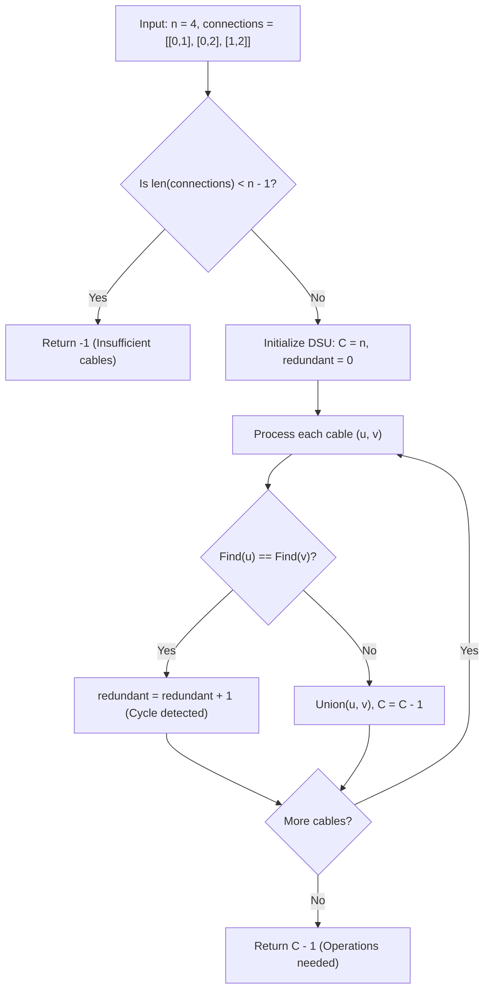

# Guided Example: Number of Operations to Make Network Connected

We trace the Disjoint Set Union (Union-Find) algorithm for counting graph connected components and tracking redundant edges on a representative network:

- **Input:** $n = 4$, `connections = [[0, 1], [0, 2], [1, 2]]`
- **Required Output:** `1`

This instance demonstrates spanning tree requirements, identifying redundant cycle-forming cables via union-find, counting disconnected components, and determining the minimum operations needed to connect the entire network.

---

## 1. Instance & Teaching Goal

We are given $n = 4$ computers labeled $0$ to $3$ and $M = 3$ network cables. We may disconnect existing cables and reconnect them between any two unconnected computers. We must find the minimum number of times we need to move a cable to make all computers connected. If it is impossible, return $-1$.

For $n = 4$ and `connections = [[0, 1], [0, 2], [1, 2]]`:
- To connect $4$ computers into a single network, we require at least $n - 1 = 3$ cables. We have $M = 3 \ge 3$, so connectivity is feasible.
- Cables $(0, 1)$ and $(0, 2)$ connect computers $\{0, 1, 2\}$ into a single component.
- Cable $(1, 2)$ connects two computers that are already connected through $0$, creating a cycle. This cable is redundant and can be extracted.
- Computer $3$ is isolated in its own separate component $\{3\}$.
- There are $C = 2$ connected components. Connecting $C$ components requires moving $C - 1 = 2 - 1 = 1$ cable.

```
Initial Network State:
    (0) ----- (1)
      \       /
       \     /  <-- Redundant cable between 1 and 2
        \   /
         (2)            (3)  <-- Isolated

Components: C = 2  -->  {0, 1, 2} and {3}
Redundant Cables: 1  (between 1 and 2)

Operation: Disconnect cable (1, 2) and reconnect between 2 and 3:
    (0) ----- (1)
      \
       \
        \
         (2) ----- (3)

Result: All 4 computers in a single component using 1 operation.
```

A naive approach might try simulating all possible cable reassignments, leading to exponential search. Using a Disjoint Set Union (DSU) data structure identifies redundant edges and counts connected components in nearly linear time $\mathcal{O}(V + E \cdot \alpha(V))$.

---

## 2. Conceptual Foundation & Invariants

Let $G = (V, E)$ with $|V| = n$ and $|E| = M$.

### Fundamental Spanning Forest Invariants
1. **Cable Sufficiency Condition:** Any connected graph on $n$ vertices must contain at least $n - 1$ edges. If $M < n - 1$, it is mathematically impossible to span all vertices, so the algorithm immediately returns $-1$.
2. **Component Reduction:** Connecting $C$ disjoint components into a single connected component requires adding exactly $C - 1$ bridging edges.
3. **Surplus Conservation:** If $M \ge n - 1$, the number of redundant edges $M - (n - C)$ is always at least $C - 1$. Therefore, whenever $M \ge n - 1$, moving $C - 1$ redundant cables is always sufficient.

### Disjoint Set Operations
We maintain a parent array $P$ where each computer is initially its own parent: $P[i] = i$.
- $\text{Find}(x)$: Finds the canonical root representative of the set containing $x$ with path compression.
- $\text{Union}(a, b)$:
  - Find roots $r_a = \text{Find}(a)$ and $r_b = \text{Find}(b)$.
  - If $r_a == r_b$: a cycle is detected; increment redundant cable counter $\text{redundant} \leftarrow \text{redundant} + 1$.
  - If $r_a \ne r_b$: merge trees $P[r_a] \leftarrow r_b$ and decrement component count $C \leftarrow C - 1$.

| Connection $(u, v)$ | Root of $u$ | Root of $v$ | Action Taken | Net Components $C$ | Redundant Cables |
|---|---|---|---|---|---|
| Initial | - | - | Initialize $n$ singletons | $4$ | $0$ |
| $(0, 1)$ | $0$ | $1$ | Merge sets: $P[0] \leftarrow 1$ | $3$ | $0$ |
| $(0, 2)$ | $1$ | $2$ | Merge sets: $P[1] \leftarrow 2$ | $2$ | $0$ |
| $(1, 2)$ | $2$ | $2$ | Cycle detected (roots equal) | $2$ | $1$ |

> **Cycle and Component Invariant.** An edge between vertices with distinct roots reduces the total number of connected components $C$ by $1$. An edge between vertices with identical roots constitutes a surplus cable available for relocation.



---

## 3. Step-by-Step Worked Execution

We trace $n = 4$ and `connections = [[0, 1], [0, 2], [1, 2]]`:

### Step 1: Pre-Condition Check
- Number of computers: $n = 4$.
- Number of cables: $M = 3$.
- Minimum required: $n - 1 = 3$.
- Check: $M \ge n - 1$ ($3 \ge 3$) holds. Feasible.

### Step 2: Initialize DSU
- $P = [0, 1, 2, 3]$.
- Initial component count: $C = 4$.
- Redundant cables: $\text{redundant} = 0$.

### Step 3: Process Cable $(0, 1)$
- $\text{Find}(0) = 0$.
- $\text{Find}(1) = 1$.
- Since $\text{Find}(0) \ne \text{Find}(1)$, merge: $P[0] \leftarrow 1$.
- Component count decreases: $C \leftarrow 4 - 1 = 3$.
- State: $P = [1, 1, 2, 3]$, components are $\{0, 1\}, \{2\}, \{3\}$.

### Step 4: Process Cable $(0, 2)$
- $\text{Find}(0) = \text{Find}(1) = 1$.
- $\text{Find}(2) = 2$.
- Since roots differ ($1 \ne 2$), merge: $P[1] \leftarrow 2$.
- Component count decreases: $C \leftarrow 3 - 1 = 2$.
- State: $P = [1, 2, 2, 3]$, components are $\{0, 1, 2\}, \{3\}$.

### Step 5: Process Cable $(1, 2)$
- $\text{Find}(1) = 2$.
- $\text{Find}(2) = 2$.
- Roots are identical ($2 == 2$). Computers $1$ and $2$ are already in the same component.
- Cycle detected: increment $\text{redundant} \leftarrow 0 + 1 = 1$.
- Component count remains $C = 2$.

### Step 6: Final Answer Resolution
- Number of distinct connected components remaining: $C = 2$.
- Bridges required to unify $C$ components: $C - 1 = 2 - 1 = 1$.
- Available redundant cables: $1 \ge 1$.
- Return: $1$.

---

## 4. Complete Execution Trace

| Step | Edge $(u, v)$ | $\text{Find}(u)$ | $\text{Find}(v)$ | Action / Status | Parent Array $P$ | Remaining $C$ |
|---|---|---|---|---|---|---|
| Init | - | - | - | Seed $4$ disjoint sets | `[0, 1, 2, 3]` | $4$ |
| 1 | $(0, 1)$ | $0$ | $1$ | Merge components | `[1, 1, 2, 3]` | $3$ |
| 2 | $(0, 2)$ | $1$ | $2$ | Merge components | `[1, 2, 2, 3]` | $2$ |
| 3 | $(1, 2)$ | $2$ | $2$ | **Redundant cable** | `[1, 2, 2, 3]` | $2$ |
| End | - | - | - | Compute $C - 1$ | - | **Answer: 1** |

---

## 5. Algorithmic Correctness

**Soundness.** Disjoint Set Union with path compression maintains exact equivalence classes of connected vertices. Each non-redundant edge merges two disjoint components, strictly decreasing the component count by $1$. When all edges are processed, $C$ represents the exact number of isolated connected components. Unifying $C$ components into a single tree mathematically requires exactly $C - 1$ edges.

**Completeness.** Since the initial check guarantees $M \ge n - 1$, the pigeonhole principle ensures the total redundant edges $M - (n - C)$ is at least $(n - 1) - (n - C) = C - 1$. Hence, there are always sufficient cables to bridge all components.

---

## 6. Traps This Instance Exposes

- **Insufficient cables upfront:** If $M < n - 1$, returning early with $-1$ is mandatory. Without this check, the algorithm might return $C - 1$ even when there are zero spare cables to relocate.
- **Overestimating needed moves:** Counting each redundant edge as a required move is wrong. The number of moves needed is determined by the number of components to bridge ($C - 1$), not by how many redundant cables exist.
- **Deep trees without path compression:** In large networks ($n \le 10^5$), failing to implement path compression can degrade Find operations from $\mathcal{O}(\alpha(n))$ to $\mathcal{O}(n)$, causing time limit errors.

---

## 7. Complexity Derivation

- **Time Complexity:** $\mathcal{O}(V + E \cdot \alpha(V))$, where $V = n$ and $E = \text{len}(\text{connections})$, and $\alpha$ is the inverse Ackermann function ($\alpha(V) < 5$ for all practical input sizes). Initializing the parent array takes $\mathcal{O}(V)$ time, and each cable processing step takes amortized $\mathcal{O}(\alpha(V))$ time.
- **Auxiliary Space Complexity:** $\mathcal{O}(V)$ to maintain the parent pointer array for the $n$ computers.
