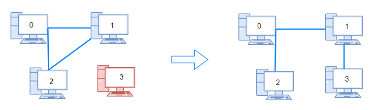
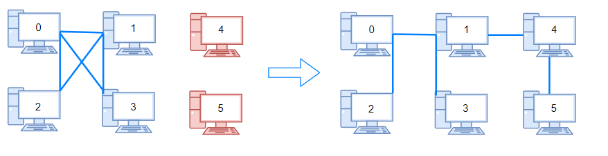

## Description

There are `n` computers numbered from `0` to $n - 1$ connected by ethernet cables `connections` forming a network where $\text{connections}[i] = [a_{i}, b_{i}]$ represents a connection between computers $a_{i}$ and $b_{i}$. Any computer can reach any other computer directly or indirectly through the network.

You are given an initial computer network `connections`. You can extract certain cables between two directly connected computers, and place them between any pair of disconnected computers to make them directly connected.

Return *the minimum number of times you need to do this in order to make all the computers connected*. If it is not possible, return `-1`.
### Function Contract

- `n`: Input parameter.
- Returns expected result.

### Examples

#### Example 1

- **Input:** $n = 4, connections = [[0,1],[0,2],[1,2]]$
- **Output:** `1`
- **Explanation:** Remove cable between computer 1 and 2 and place between computers 1 and 3.
#### Example 2

- **Input:** $n = 6, connections = [[0,1],[0,2],[0,3],[1,2],[1,3]]$
- **Output:** `2`
#### Example 3

- **Input:** $n = 6, connections = [[0,1],[0,2],[0,3],[1,2]]$
- **Output:** `-1`
- **Explanation:** There are not enough cables.
### Constraints

- $1 \le n \le 10^{5}$

- $1 \le \text{connections.length} \le min(n * (n - 1) / 2, 10^{5})$

- $\text{connections}[i].length = 2$

- $0 \le a_{i}, b_{i} < n$

- $a_{i} \neq b_{i}$

- There are no repeated connections.

- No two computers are connected by more than one cable.