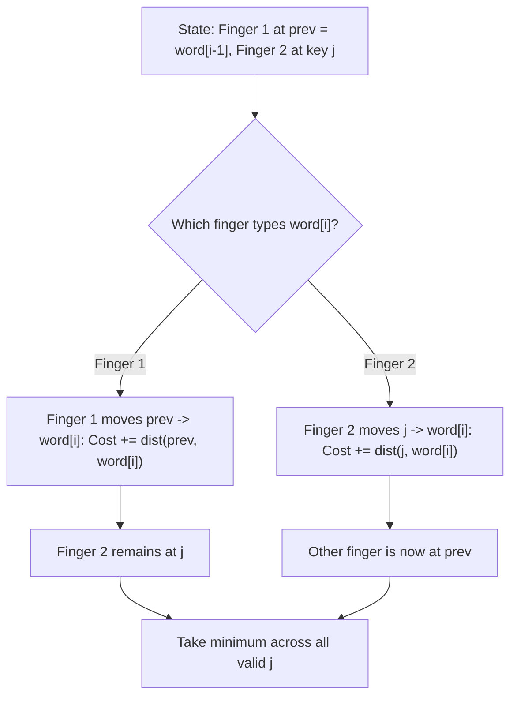

# Guided Example: Minimum Distance to Type a Word Using Two Fingers

We trace the dynamic programming algorithm for optimizing two-finger typing trajectory on a representative word:

- **Input:** `word = "CAKE"`
- **Required Output:** `3`

This instance demonstrates 2D keyboard coordinates, Manhattan distance calculation, modeling two independent typing agents with free initial placements, and state-space pruning using dynamic programming.

---

## 1. Instance & Teaching Goal

The keyboard consists of $26$ uppercase English letters arranged in $6$ columns:
$$
\text{row}(c) = \lfloor c / 6 \rfloor, \quad \text{col}(c) = c \bmod 6 \quad (c \in [0, 25])
$$
The distance to move a finger from key $c_1$ to key $c_2$ is the Manhattan distance:
$$
\text{dist}(c_1, c_2) = |\text{row}(c_1) - \text{row}(c_2)| + |\text{col}(c_1) - \text{col}(c_2)|
$$
Initial finger placements anywhere on the keyboard cost $0$. We must find the minimum total distance to type `word = "CAKE"` using two fingers.

```
6-Column Keyboard Layout:
Row 0:  A (0,0)  B (0,1)  C (0,2)  D (0,3)  E (0,4)  F (0,5)
Row 1:  G (1,0)  H (1,1)  I (1,2)  J (1,3)  K (1,4)  L (1,5)
Row 2:  M (2,0)  N (2,1)  O (2,2)  P (2,3)  Q (2,4)  R (2,5)
Row 3:  S (3,0)  T (3,1)  U (3,2)  V (3,3)  W (3,4)  X (3,5)
Row 4:  Y (4,0)  Z (4,1)

Word "CAKE" Character Coordinates:
  'C': row 0, col 2
  'A': row 0, col 0
  'K': row 1, col 4
  'E': row 0, col 4

Optimal Finger Allocation:
  Finger 1: Starts at 'C' (cost 0) --> moves to 'A' (dist = |0-0| + |2-0| = 2)
  Finger 2: Starts at 'K' (cost 0) --> moves to 'E' (dist = |1-0| + |4-4| = 1)
Total Travel Cost: 2 + 1 = 3
```

A greedy choice might assign each incoming character to whichever finger is currently closest, but that can strand fingers far away from subsequent clusters. Dynamic programming evaluates all optimal finger partitions across the string in polynomial time.

---

## 2. Conceptual Foundation & Invariants

At step $i$, one of the two fingers must be positioned on the current character $word[i]$. Therefore, the state only needs to track the position of the *other* finger:
- Let $dp[j]$ denote the minimum cost after typing the prefix up to character $word[i-1]$ (which finger 1 is resting on), with finger 2 resting on character $j \in \{0, 1, \dots, 25, \text{Unset}\}$.

### State Transitions Typing $word[i]$
Let $curr = word[i]$ and $prev = word[i-1]$. To type $curr$, we have two choices:
1. **Move the same finger (Finger 1):**
   Finger 1 moves from $prev$ to $curr$, while Finger 2 remains at key $j$:
   $$
   dp_{\text{new}}[j] = \min\big(dp_{\text{new}}[j], \; dp[j] + \text{dist}(prev, curr)\big)
   $$
2. **Move the other finger (Finger 2):**
   Finger 2 moves from key $j$ to $curr$, leaving Finger 1 at $prev$ (which becomes the "other" finger for the next step):
   $$
   dp_{\text{new}}[prev] = \min\big(dp_{\text{new}}[prev], \; dp[j] + \text{dist}(j, curr)\big)
   $$
   where $\text{dist}(\text{Unset}, curr) = 0$.

| Key Character | Matrix Coordinates $(r, c)$ | Movement From | Cost Calculation |
|---|---|---|---|
| `'C'` | $(0, 2)$ | Initial placement | $0$ (Free) |
| `'A'` | $(0, 0)$ | From `'C'` $(0, 2)$ | $|0 - 0| + |2 - 0| = 2$ |
| `'K'` | $(1, 4)$ | Initial placement | $0$ (Free) |
| `'E'` | $(0, 4)$ | From `'K'` $(1, 4)$ | $|1 - 0| + |4 - 4| = 1$ |

> **Finger Locality Invariant.** At every stage $i$, one finger is guaranteed to be on $word[i]$. Recording only the position of the second finger reduces the dynamic programming state space from $\mathcal{O}(26^2)$ to $\mathcal{O}(26)$ per character.



---

## 3. Step-by-Step Worked Execution

We trace `word = "CAKE"`:
Character sequence: $c_0 = \text{'C'}, c_1 = \text{'A'}, c_2 = \text{'K'}, c_3 = \text{'E'}$.

### Step 1: Character `'C'` (Index $i = 0$)
- Finger 1 placed at `'C'`.
- Finger 2 is $\text{Unset}$.
- Cost: $0$.
- Active state: Finger 1 at `'C'`, Finger 2 at $\text{Unset}$ with cost $0$.

### Step 2: Character `'A'` (Index $i = 1$)
- Previous character: $prev = \text{'C'}$.
- Incoming state: Finger 2 is $\text{Unset}$ (cost $0$).
- Option 1 (Finger 1 moves `'C'` $\to$ `'A'`):
  $$
  \text{cost} = 0 + \text{dist}(\text{'C'}, \text{'A'}) = 0 + (|0 - 0| + |2 - 0|) = 2
  $$
  New state: Finger 1 at `'A'`, Finger 2 at $\text{Unset}$ (cost $2$).
- Option 2 (Finger 2 places at `'A'`):
  $$
  \text{cost} = 0 + \text{dist}(\text{Unset}, \text{'A'}) = 0 + 0 = 0
  $$
  New state: Finger 1 at `'A'`, Finger 2 at `'C'` (cost $0$).
- Minimum cost to type up to `'A'`: $0$ (with fingers at `'A'` and `'C'`), or $2$ (with finger 2 still unset).

### Step 3: Character `'K'` (Index $i = 2$)
- We evaluate the transition from both states:
  - From state (Finger 1 at `'A'`, Finger 2 at $\text{Unset}$, cost $2$):
    - Option: Move Finger 2 from $\text{Unset}$ to `'K'`:
      $$
      \text{cost} = 2 + 0 = 2
      $$
      New state: Finger 1 at `'K'`, Finger 2 at `'A'` with cost $2$.
  - From state (Finger 1 at `'A'`, Finger 2 at `'C'`, cost $0$):
    - Move Finger 1 from `'A'` to `'K'`:
      $$
      \text{cost} = 0 + \text{dist}(\text{'A'}, \text{'K'}) = 0 + (|0 - 1| + |0 - 4|) = 5
      $$
    - Move Finger 2 from `'C'` to `'K'`:
      $$
      \text{cost} = 0 + \text{dist}(\text{'C'}, \text{'K'}) = 0 + (|0 - 1| + |2 - 4|) = 3
      $$
- Best state: Finger 1 at `'K'`, Finger 2 at `'A'` with cost $2$.

### Step 4: Character `'E'` (Index $i = 3$)
- From optimal state (Finger 1 at `'K'` $(1, 4)$, Finger 2 at `'A'` $(0, 0)$, cost $2$):
  - Option 1 (Move Finger 1 from `'K'` to `'E'`):
    $$
    \text{dist}(\text{'K'}, \text{'E'}) = |1 - 0| + |4 - 4| = 1
    $$
    Total cost: $2 + 1 = 3$. Finger 1 at `'E'`, Finger 2 at `'A'`.
  - Option 2 (Move Finger 2 from `'A'` to `'E'`):
    $$
    \text{dist}(\text{'A'}, \text{'E'}) = |0 - 0| + |0 - 4| = 4
    $$
    Total cost: $2 + 4 = 6$. Finger 1 at `'E'`, Finger 2 at `'K'`.
- Minimum overall cost: $\min(3, 6) = 3$.

---

## 4. Complete Execution Trace

| Step $i$ | Target Letter | Action Taken | Active Fingers $(F_1, F_2)$ | Move Cost | Cumulative Cost |
|---|---|---|---|---|---|
| $0$ | `'C'` | Free placement of $F_1$ | $(\text{'C'}, \text{Unset})$ | $0$ | $0$ |
| $1$ | `'A'` | Move $F_1$ from `'C'` to `'A'` | $(\text{'A'}, \text{Unset})$ | $2$ | $2$ |
| $2$ | `'K'` | Free placement of $F_2$ at `'K'` | $(\text{'K'}, \text{'A'})$ | $0$ | $2$ |
| $3$ | `'E'` | Move $F_1$ from `'K'` to `'E'` | $(\text{'E'}, \text{'A'})$ | $1$ | **3** |

---

## 5. Algorithmic Correctness

**Soundness.** Because physical typing requires one finger on the active letter, every sequence of moves corresponds to a valid partition of the string between two fingers. The transition rules rigorously cover the choice of which finger executes each keypress and accurately sum the true Manhattan distances on the 6-column keyboard.

**Completeness.** Dynamic programming over the other finger's 26 possible positions explores all non-dominated assignments. By taking the minimum over all 26 possible end states after processing the final character, the global minimum typing distance is guaranteed.

---

## 6. Traps This Instance Exposes

- **Greedy local choice trap:** Placing Finger 2 on `'A'` at step 1 gives cost $0$, but later forces Finger 2 to move from `'C'` to `'K'` (cost $3$), leading to total cost $4$. Deferring the free placement of Finger 2 until `'K'` yields total cost $3$. Dynamic programming naturally discovers this superior global schedule.
- **Keyboard coordinates layout:** The keyboard has $6$ columns, not $5$ or $26$. Using $\lfloor c / 6 \rfloor$ and $c \bmod 6$ correctly maps the letters to a 2D grid.
- **Unset initial state:** Each finger's initial position is free (distance $0$). Initializing fingers at key 'A' artificially inflates the cost of words not starting with 'A'.

---

## 7. Complexity Derivation

- **Time Complexity:** $\mathcal{O}(26 \cdot N)$, where $N$ is the length of `word`. For each character, we iterate over the $26$ possible locations of the other finger and perform $\mathcal{O}(1)$ transitions.
- **Auxiliary Space Complexity:** $\mathcal{O}(26)$ auxiliary memory to store the DP table across iterations.