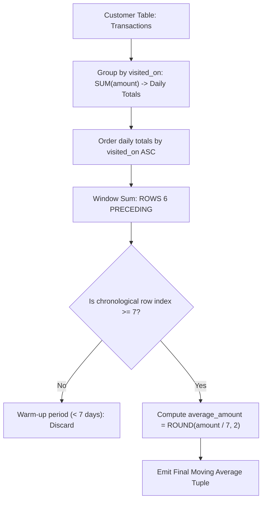

# Guided Example: Restaurant Growth

We trace the relational grouping, window aggregation, and 7-day moving average calculation on a representative restaurant customer payment history:

- **Input:** `Customer` relation with daily payment logs:
  $$\begin{aligned}
  \text{Customer} = \{
  &(1, \text{"J"}, \text{"2019-01-01"}, 100), \; (2, \text{"D"}, \text{"2019-01-02"}, 110), \\
  &(3, \text{"M"}, \text{"2019-01-03"}, 120), \; (4, \text{"K"}, \text{"2019-01-04"}, 130), \\
  &(5, \text{"W"}, \text{"2019-01-05"}, 110), \; (6, \text{"M"}, \text{"2019-01-06"}, 140), \\
  &(7, \text{"S"}, \text{"2019-01-07"}, 150), \; (8, \text{"J"}, \text{"2019-01-08"}, 80) \}
  \end{aligned}$$
- **Required Output:** Moving 7-day totals and averages starting from the 7th day:
  $$\begin{aligned}
  \text{Result} = \{
  &(\text{"2019-01-07"}, 860, 122.86), \\
  &(\text{"2019-01-08"}, 840, 120.00) \}
  \end{aligned}$$

This instance demonstrates aggregating multi-transaction days into daily subtotals, applying a sliding window frame over 6 preceding rows, filtering out incomplete warm-up periods, and rounding moving averages to two decimal places.

---

## 1. Instance & Teaching Goal

We must calculate the moving 7-day total spending and moving 7-day average spending for each valid date. Multiple customers can visit on the same day; therefore:
1. All transactions occurring on the same `visited_on` date must first be summed into a single daily revenue total.
2. For each day, compute the sum of daily revenues across the 7-day window spanning $[\text{visited\_on} - 6 \text{ days}, \; \text{visited\_on}]$.
3. The first 6 calendar days lack a complete 7-day lookback window and must be excluded. Only days with at least 6 preceding chronological records appear in the output.

```
Daily Revenue Aggregation:
  2019-01-01: 100
  2019-01-02: 110
  2019-01-03: 120
  2019-01-04: 130
  2019-01-05: 110
  2019-01-06: 140
  2019-01-07: 150  --> Window [Day 1..7]: Sum = 860, Avg = 860 / 7 = 122.86
  2019-01-08:  80  --> Window [Day 2..8]: Sum = 840, Avg = 840 / 7 = 120.00
```

Applying a window function directly across raw customer transactions would mistakenly treat individual customer visits as days, counting 7 customers rather than 7 calendar dates. The two-stage aggregation (daily consolidation followed by sliding window) guarantees temporal accuracy.

---

## 2. Conceptual Foundation & Invariants

Let $C$ denote the customer transaction relation.

### Two-Stage Relational Pipeline
1. **Daily Consolidation ($\gamma$):** Group $C$ by `visited_on` and sum daily amounts:
   $$
   D = \gamma_{\text{visited\_on}, \; \text{SUM}(\text{amount}) \to \text{daily\_amount}}(C)
   $$
2. **Window Framing:** Order relation $D$ chronologically by `visited_on`: $(d_1, d_2, \dots, d_m)$.
   For row index $i$:
   - Window range: from row $i - 6$ to row $i$ (a span of $7$ consecutive daily records).
   - Moving 7-day sum:
     $$
     W_i = \sum_{k = i - 6}^i \text{daily\_amount}(d_k)
     $$
   - Moving average:
     $$
     \overline{W}_i = \text{ROUND}(W_i / 7.0, \; 2)
     $$
3. **Selection ($\sigma$):** Filter out the prefix warm-up period where $i < 7$.
4. **Projection ($\Pi$):** Emit tuples $[\text{visited\_on}, W_i, \overline{W}_i]$ ordered by `visited_on` ascending.

| Pipeline Stage | Operator | Input | Output Attributes |
|---|---|---|---|
| Stage 1 | Grouping Aggregation | Raw transactions | `[visited_on, daily_amount]` |
| Stage 2 | Analytic Window | Ordered daily records | `[visited_on, window_sum, rank]` |
| Stage 3 | Selection Filter | Rank $\ge 7$ | Filtered 7-day complete windows |
| Stage 4 | Projection & Rounding | Filtered tuples | `[visited_on, amount, average_amount]` |

> **Window Sufficiency Invariant.** A row is emitted if and only if there are at least $6$ chronological daily entries preceding it, guaranteeing every reported average represents an exact full $7$-day period.



---

## 3. Step-by-Step Worked Execution

We trace the pipeline across the $8$ distinct days in our dataset:

### Stage 1: Daily Consolidation
The transactions are grouped by date:
- `2019-01-01`: $100$
- `2019-01-02`: $110$
- `2019-01-03`: $120$
- `2019-01-04`: $130$
- `2019-01-05`: $110$
- `2019-01-06`: $140$
- `2019-01-07`: $150$
- `2019-01-08`: $80$

### Stage 2: Moving Window Calculation
- **Row 1 to 6 (`2019-01-01` to `2019-01-06`):**
  Each of these rows has fewer than $7$ days in its preceding history. They are classified as warm-up days and discarded.
- **Row 7 (`2019-01-07`):**
  - First date with a complete $7$-day history (Rows $1$ through $7$).
  - 7-day sum:
    $$
    100 + 110 + 120 + 130 + 110 + 140 + 150 = 860
    $$
  - 7-day average:
    $$
    860 / 7.0 \approx 122.8571 \implies 122.86
    $$
  - Emitted tuple: `("2019-01-07", 860, 122.86)`.
- **Row 8 (`2019-01-08`):**
  - Window slides forward by one day, dropping `2019-01-01` ($100$) and adding `2019-01-08` ($80$):
  - 7-day sum:
    $$
    860 - 100 + 80 = 840
    $$
  - 7-day average:
    $$
    840 / 7.0 = 120.00
    $$
  - Emitted tuple: `("2019-01-08", 840, 120.00)`.

---

## 4. Complete Execution Trace

| Row $i$ | Date (`visited_on`) | Daily Total | Window Range Evaluated | 7-Day Sum | Average (Round 2) | Emitted? |
|---|---|---|---|---|---|---|
| 1 | `2019-01-01` | $100$ | $1$ day | $100$ | - | No (Warm-up) |
| 2 | `2019-01-02` | $110$ | $2$ days | $210$ | - | No (Warm-up) |
| 3 | `2019-01-03` | $120$ | $3$ days | $330$ | - | No (Warm-up) |
| 4 | `2019-01-04` | $130$ | $4$ days | $460$ | - | No (Warm-up) |
| 5 | `2019-01-05` | $110$ | $5$ days | $570$ | - | No (Warm-up) |
| 6 | `2019-01-06` | $140$ | $6$ days | $710$ | - | No (Warm-up) |
| 7 | `2019-01-07` | $150$ | $7$ days (Rows 1..7) | $860$ | $122.86$ | **Yes** |
| 8 | `2019-01-08` | $80$ | $7$ days (Rows 2..8) | $840$ | $120.00$ | **Yes** |

---

## 5. Algorithmic Correctness

**Soundness.** Pre-aggregating by `visited_on` ensures that every day maps to exactly one total expenditure. The window frame spanning $6$ preceding rows captures exactly $7$ daily entries. Dividing by $7.0$ and rounding to two decimal places produces the precise mathematical moving average.

**Completeness.** Chronological ordering guarantees that dates are processed sequentially. Filtering with index $\ge 7$ removes all partial windows while preserving all eligible 7-day windows in strict ascending order.

---

## 6. Traps This Instance Exposes

- **Windowing over individual customer rows:** If multiple customers visit on the same day, calculating `ROWS 6 PRECEDING` without first consolidating transactions by date pools 7 visits instead of 7 calendar days.
- **Warm-up window leakage:** Emitting averages for days 1 through 6 where fewer than 7 days exist produces inaccurate partial averages.
- **Rounding precision:** Division in SQL must use floating-point arithmetic ($7.0$) to avoid integer division truncation, and must round to two decimal places (`ROUND(..., 2)`).

---

## 7. Complexity Derivation

- **Time Complexity:** $\mathcal{O}(N \log D)$, where $N$ is the number of transaction rows and $D$ is the number of distinct dates. Grouping by date takes $\mathcal{O}(N)$, sorting the $D$ unique dates takes $\mathcal{O}(D \log D)$, and the sliding window pass takes $\mathcal{O}(D)$ time.
- **Auxiliary Space Complexity:** $\mathcal{O}(D)$ to store the daily consolidated table and sliding window buffer.
