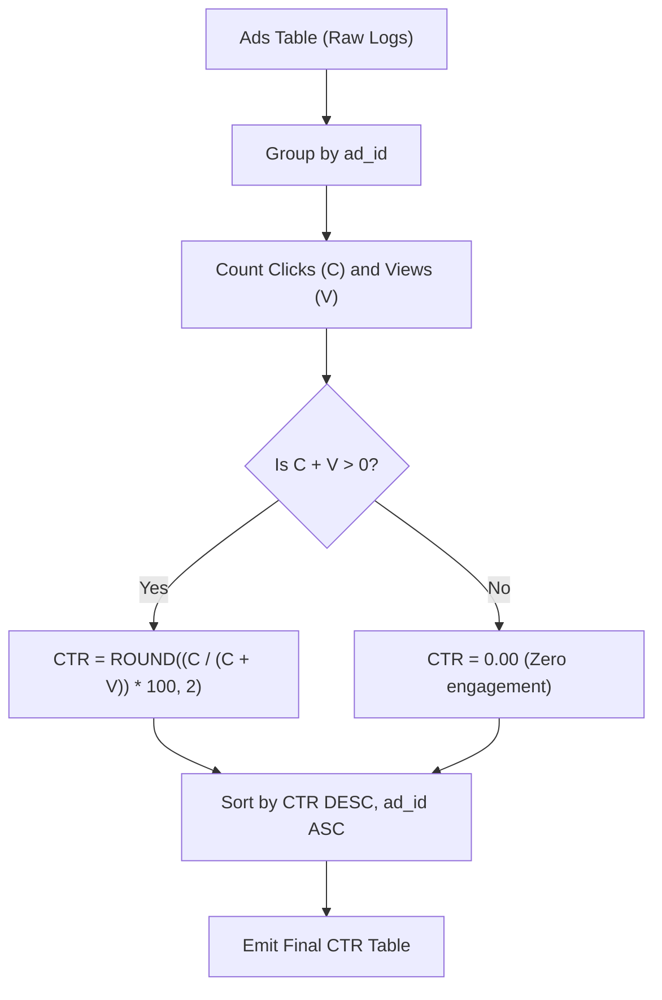

# Guided Example: Ads Performance

We trace the relational conditional aggregation, Click-Through Rate (CTR) computation, and zero-division protection on a representative advertising log:

- **Input:** `Ads` table containing interaction logs:
  $$\begin{aligned}
  \text{Ads} = \{ &(1, 1, \text{"Clicked"}), \; (2, 2, \text{"Clicked"}), \; (3, 3, \text{"Viewed"}), \\
  &(5, 5, \text{"Ignored"}), \; (1, 7, \text{"Ignored"}), \; (2, 7, \text{"Viewed"}), \\
  &(3, 5, \text{"Clicked"}), \; (1, 4, \text{"Viewed"}), \; (2, 11, \text{"Viewed"}), \; (1, 2, \text{"Clicked"}) \}
  \end{aligned}$$
- **Required Output:** Click-Through Rate per advertisement:
  $$\begin{aligned}
  \text{Result} = \{
  &(1, 66.67), \; (2, 33.33), \; (3, 50.00), \; (5, 0.00) \}
  \end{aligned}$$
  ordered by `ctr` descending, then `ad_id` ascending: `[(1, 66.67), (3, 50.00), (2, 33.33), (5, 0.00)]`.

This instance demonstrates filtering interaction categories (`"Clicked"`, `"Viewed"`, `"Ignored"`), handling zero-denominator boundary conditions using null coalescing, and executing dual-tier sorting.

---

## 1. Instance & Teaching Goal

Each row in `Ads` records an action taken by a user on an ad (`"Clicked"`, `"Viewed"`, or `"Ignored"`). The Click-Through Rate (CTR) of an advertisement is defined as:
$$
\text{CTR} = \begin{cases}
0 & \text{if } \text{Clicks} + \text{Views} = 0 \\
\text{ROUND}\left(\frac{\text{Clicks}}{\text{Clicks} + \text{Views}} \times 100, \; 2\right) & \text{otherwise}
\end{cases}
$$
Ignored actions represent non-engagement and are omitted from both the numerator and denominator.

```
Summary of Interactions:
  Ad 1: Clicked=2, Viewed=1, Ignored=1  --> CTR = (2 / 3) * 100 = 66.67%
  Ad 3: Clicked=1, Viewed=1, Ignored=0  --> CTR = (1 / 2) * 100 = 50.00%
  Ad 2: Clicked=1, Viewed=2, Ignored=0  --> CTR = (1 / 3) * 100 = 33.33%
  Ad 5: Clicked=0, Viewed=0, Ignored=1  --> Clicks + Views = 0  --> CTR = 0.00%

Final Sorted Output:
  1. Ad 1: 66.67
  2. Ad 3: 50.00
  3. Ad 2: 33.33
  4. Ad 5:  0.00
```

Without handling the zero-denominator case, an ad that only received `"Ignored"` actions (such as Ad 5) would trigger a division-by-zero database error. A robust query engine replaces null division results with $0.00$.

---

## 2. Conceptual Foundation & Invariants

Let $A$ denote the relation `Ads` with attributes $(ad, user, action)$.

### Relational Conditional Aggregation
1. **Grouping by Advertisement:** Partition tuples by attribute $ad$:
   $$
   A = \bigcup_{k} A_k \quad \text{where } A_k = \{t \in A \mid t.ad = k\}
   $$
2. **Conditional Indicators:**
   $$
   C_k = \sum_{t \in A_k} [t.action = \text{"Clicked"}]
   $$
   $$
   V_k = \sum_{t \in A_k} [t.action = \text{"Viewed"}]
   $$
   $$
   T_k = C_k + V_k
   $$
3. **Safe Division and Coalescing:**
   $$
   \text{CTR}_k = \begin{cases}
   \text{ROUND}((C_k / T_k) \times 100, \; 2) & \text{if } T_k > 0 \\
   0.00 & \text{if } T_k = 0
   \end{cases}
   $$
4. **Ordering:** Sort output tuples $(ad, \text{CTR})$ by $\text{CTR}$ descending; in case of ties, by $ad$ ascending.

| Action Type | Included in Numerator (Clicks)? | Included in Denominator (Total)? |
|---|---|---|
| `"Clicked"` | Yes ($+1$) | Yes ($+1$) |
| `"Viewed"` | No ($0$) | Yes ($+1$) |
| `"Ignored"` | No ($0$) | No ($0$) |

> **Denominator Soundness Invariant.** The denominator $T_k$ counts only positive impressions ($\text{Clicks} + \text{Views}$). Any ad with $T_k = 0$ is guaranteed to map safely to $0.00$ without generating division faults.



---

## 3. Step-by-Step Worked Execution

We trace the aggregation for each distinct `ad_id` in our dataset:

### Ad 1
- Rows present: $(1, 1, \text{"Clicked"}), (1, 7, \text{"Ignored"}), (1, 4, \text{"Viewed"}), (1, 2, \text{"Clicked"})$.
- Clicks: $C_1 = 2$.
- Views: $V_1 = 1$.
- Total engagement: $T_1 = 2 + 1 = 3 > 0$.
- CTR calculation:
  $$
  \text{CTR}_1 = \text{ROUND}\left(\frac{2}{3} \times 100, \; 2\right) = \text{ROUND}(66.6667, \; 2) = 66.67
  $$

### Ad 2
- Rows present: $(2, 2, \text{"Clicked"}), (2, 7, \text{"Viewed"}), (2, 11, \text{"Viewed"})$.
- Clicks: $C_2 = 1$.
- Views: $V_2 = 2$.
- Total engagement: $T_2 = 1 + 2 = 3 > 0$.
- CTR calculation:
  $$
  \text{CTR}_2 = \text{ROUND}\left(\frac{1}{3} \times 100, \; 2\right) = \text{ROUND}(33.3333, \; 2) = 33.33
  $$

### Ad 3
- Rows present: $(3, 3, \text{"Viewed"}), (3, 5, \text{"Clicked"})$.
- Clicks: $C_3 = 1$.
- Views: $V_3 = 1$.
- Total engagement: $T_3 = 1 + 1 = 2 > 0$.
- CTR calculation:
  $$
  \text{CTR}_3 = \text{ROUND}\left(\frac{1}{2} \times 100, \; 2\right) = 50.00
  $$

### Ad 5
- Rows present: $(5, 5, \text{"Ignored"})$.
- Clicks: $C_5 = 0$.
- Views: $V_5 = 0$.
- Total engagement: $T_5 = 0 + 0 = 0$.
- Fallback condition triggered ($T_5 = 0$):
  $$
  \text{CTR}_5 = 0.00
  $$

### Sorting the Aggregate Set
Ranking tuples by $\text{CTR}$ DESC, then `ad_id` ASC:
1. Ad 1: $66.67$
2. Ad 3: $50.00$
3. Ad 2: $33.33$
4. Ad 5: $0.00$

---

## 4. Complete Execution Trace

| `ad_id` | Click Count $C$ | View Count $V$ | Total Active $C + V$ | Raw Ratio $(C / \text{Total}) \times 100$ | Computed `ctr` | Final Rank |
|---|---|---|---|---|---|---|
| $1$ | $2$ | $1$ | $3$ | $66.6667\%$ | $66.67$ | 1 |
| $3$ | $1$ | $1$ | $2$ | $50.0000\%$ | $50.00$ | 2 |
| $2$ | $1$ | $2$ | $3$ | $33.3333\%$ | $33.33$ | 3 |
| $5$ | $0$ | $0$ | $0$ | Undefined ($0/0$) | $0.00$ | 4 |

---

## 5. Algorithmic Correctness

**Soundness.** Conditional summation precisely classifies actions into click, view, and ignore counts. The safe division guard ensures mathematical soundness when no active user clicks or views occur. Rounding to two decimal places fulfills the display precision requirement.

**Completeness.** Grouping covers all distinct `ad_id` values appearing in the input relation. The sorting order strictly arranges rows by descending CTR, resolving ties deterministically using the unique `ad_id`.

---

## 6. Traps This Instance Exposes

- **Counting "Ignored" in the denominator:** Including `"Ignored"` actions in the denominator distorts CTR by penalizing ads for non-actions rather than measuring click conversions per active view.
- **Integer division truncation:** In many SQL dialects, dividing integer counts directly truncates to an integer (e.g. $1 / 3 = 0$). Casts to floating-point or multiplying by $100.0$ before division are required.
- **Null return on zero total:** If an ad has only `"Ignored"` rows, $C + V = 0$. Without `COALESCE` or a conditional check, the result is `NULL` instead of $0.00$.

---

## 7. Complexity Derivation

- **Time Complexity:** $\mathcal{O}(N \log K)$, where $N$ is the total number of action logs and $K$ is the number of distinct advertisements. Grouping and conditional counting take $\mathcal{O}(N)$ time, and sorting $K$ advertisement summaries takes $\mathcal{O}(K \log K)$ time.
- **Auxiliary Space Complexity:** $\mathcal{O}(K)$ to maintain aggregate buckets and intermediate statistics for the $K$ distinct ads.
