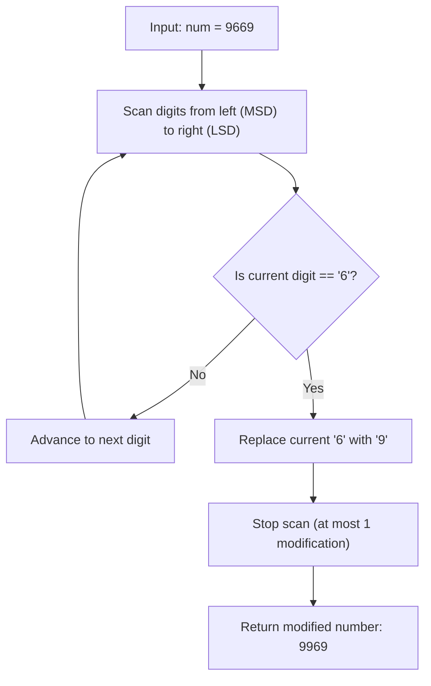

# Guided Example: Maximum 69 Number

We trace the greedy positional replacement algorithm for maximizing a two-digit integer on a representative instance:

- **Input:** `num = 9669`
- **Required Output:** `9969`

This instance demonstrates decimal place-value weighting, comparing potential digit flip gains, and establishing the greedy choice of modifying the most significant occurrence of digit `'6'`.

---

## 1. Instance & Teaching Goal

We are given a positive integer `num` composed exclusively of digits `'6'` and `'9'`. We are permitted to change at most one digit (either turning a `'6'` into a `'9'` or a `'9'` into a `'6'`). We must return the maximum possible integer achievable.

For `num = 9669`:
- Changing any `'9'` to `'6'` decreases the number by $3 \times 10^k$, which is strictly suboptimal.
- Changing a `'6'` to `'9'` at positional power $10^k$ increases the value by:
  $$
  \Delta = (9 - 6) \times 10^k = 3 \times 10^k
  $$
- The available `'6'` digits in $9669$ reside at:
  - Hundreds place ($k = 2$): Gain $\Delta = 3 \times 10^2 = +300 \implies 9969$.
  - Tens place ($k = 1$): Gain $\Delta = 3 \times 10^1 = +30 \implies 9699$.
- To maximize the final integer, we choose the maximum gain $+300$, yielding $9969$.

```
Decimal Alignment:
  Index from Left:   0       1       2       3
  Place Value:     10^3    10^2    10^1    10^0
  Original Digits:   9       6       6       9
                             ^
                   Leftmost '6' (k = 2)

Candidate Alterations:
  - Flip index 1 (k = 2): 9669 + 300 = 9969  <-- Maximum Value
  - Flip index 2 (k = 1): 9669 +  30 = 9699
  - No flips:             9669
```

Testing all candidate single-digit flips requires $\mathcal{O}(D)$ evaluations where $D \le 4$ is the number of decimal digits. Finding the first (leftmost) occurrence of digit `'6'` and replacing it with `'9'` directly computes the optimal answer in a single greedy scan.

---

## 2. Conceptual Foundation & Invariants

Let the decimal representation of `num` be $d_{m-1} d_{m-2} \dots d_0$ where each $d_j \in \{6, 9\}$ and:
$$
\text{num} = \sum_{j=0}^{m-1} d_j \cdot 10^j
$$

### Positional Gain Function
If digit $d_k$ is flipped from $6$ to $9$:
$$
\text{Gain}(k) = 3 \cdot 10^k
$$
Because $3 \cdot 10^k > \sum_{j=0}^{k-1} 3 \cdot 10^j = \frac{10^k - 1}{3} \cdot 3 = 10^k - 1$, any flip at position $k$ strictly dominates all possible flips at lower positions $j < k$.

Therefore, the greedy choice rule is:
$$
k^* = \max \{j \mid d_j = 6\}
$$
If no digit equals $6$, no flip can increase the value, and the original number is retained.

| Positional Exponent $k$ | Original Digit $d_k$ | Flipped Digit | Numerical Value Difference $\Delta$ | Greedy Priority |
|---|---|---|---|---|
| $3$ ($1000$s) | $9$ | $6$ | $-3000$ (Loss) | Never chosen |
| $2$ ($100$s) | $6$ | $9$ | $+300$ (Gain) | **Highest Positive Gain** |
| $1$ ($10$s) | $6$ | $9$ | $+30$ (Gain) | Lower Priority |
| $0$ ($1$s) | $9$ | $6$ | $-3$ (Loss) | Never chosen |

> **Monotonic Place-Value Invariant.** The decimal base $10$ ensures that the gain at position $k$ strictly exceeds any combination of modifications at strictly lower positions ($j < k$). The first `'6'` encountered when scanning from most to least significant digit uniquely maximizes the value.



---

## 3. Step-by-Step Worked Execution

We trace the digit scan on `num = 9669`:
- Digits from left to right: $D = [9, 6, 6, 9]$.

### Inspection Step 0 (Thousands Place, $k = 3$)
- Current digit: $9$.
- Because the digit is already maximum ($9$), changing it would decrease the value to $6$.
- Move forward.

### Inspection Step 1 (Hundreds Place, $k = 2$)
- Current digit: $6$.
- This is the first `'6'` encountered from the left.
- Apply the single permitted modification:
  $$
  d_2 \leftarrow 9
  $$
- Numerical update:
  $$
  9669 + 3 \times 10^2 = 9669 + 300 = 9969
  $$
- Terminate scan immediately because only at most one change is allowed.

### Output Verification
- Final digit sequence: $[9, 9, 6, 9]$.
- Decimal value: $9969$.

---

## 4. Complete Execution Trace

| Step | Index $j$ (from left) | Place Value $10^k$ | Current Digit | Action Taken | Current Number State |
|---|---|---|---|---|---|
| 0 | $0$ | $10^3 = 1000$ | $9$ | Leave unchanged (already 9) | $9669$ |
| 1 | $1$ | $10^2 = 100$ | $6$ | **Flip 6 to 9 (Leftmost 6)** | $9969$ |
| 2 | $2$ | $10^1 = 10$ | $6$ | Skip (Budget exhausted) | $9969$ |
| 3 | $3$ | $10^0 = 1$ | $9$ | Skip (Budget exhausted) | $9969$ |

---

## 5. Algorithmic Correctness

**Soundness.** Flipping a single digit from $6$ to $9$ produces a valid number composed of digits $\{6, 9\}$. The value increases by exactly $3 \times 10^k$, which is strictly positive.

**Completeness.** Since $3 \times 10^a > 3 \times 10^b$ for all $a > b$, maximizing the increase requires maximizing the exponent $k$. The leftmost `'6'` in the decimal representation possesses the highest possible exponent $k^*$. Modifying this digit achieves the global maximum. If all digits are already $9$, no replacement can yield a larger value, and returning the original number is optimal.

---

## 6. Traps This Instance Exposes

- **Flipping all occurrences of 6:** The problem limits the budget to *at most one* change. Replacing all 6s yields $9999$, which violates the single-operation constraint.
- **Scanning from right to left:** Scanning from least significant to most significant digit would flip the tens digit first ($9699$), producing a suboptimal increase of $+30$ instead of $+300$.
- **Flipping 9 to 6:** Since $9 > 6$, flipping $9 \to 6$ strictly reduces the number and must never be performed.

---

## 7. Complexity Derivation

- **Time Complexity:** $\mathcal{O}(D)$, where $D = \lfloor \log_{10}(\text{num}) \rfloor + 1$ is the number of digits in `num`. Because $\text{num} \le 10^4$, $D \le 4$, making execution virtually instantaneous ($\mathcal{O}(1)$ operations).
- **Auxiliary Space Complexity:** $\mathcal{O}(D)$ to store the string or digit representation during modification.
