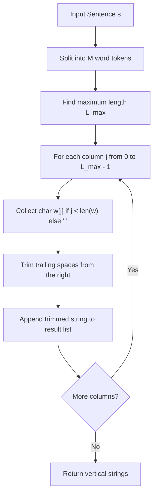

# Guided Example: Print Words Vertically

We trace the matrix transposition, columnar character extraction, and trailing space trimming algorithm on a representative multi-word string:

- **Input:** `s = "TO BE OR NOT TO BE"`
- **Required Output:** `["TBONTB", "OEROOE", "   T"]`

This instance demonstrates word tokenization, transposition from row-major words to column-major vertical strings, space padding for shorter tokens, and stripping trailing whitespace while preserving essential interior spaces.

---

## 1. Instance & Teaching Goal

Given a sentence `s` containing space-separated words, we must return a list of strings representing the characters read vertically from top to bottom, column by column. The rules specify:
1. The $j$-th character of the $i$-th word forms the $i$-th character of the $j$-th vertical string.
2. If a word has length $< j + 1$, it is padded with a space character `' '`.
3. Trailing spaces at the end of any vertical string are strictly forbidden and must be trimmed.

For `s = "TO BE OR NOT TO BE"`:
- Word tokens: $W = [\text{"TO"}, \text{"BE"}, \text{"OR"}, \text{"NOT"}, \text{"TO"}, \text{"BE"}]$.
- Number of words: $M = 6$.
- Maximum word length: $L_{\max} = \max(2, 2, 2, 3, 2, 2) = 3$.
- Result contains exactly $L_{\max} = 3$ vertical lines.

```
Token Grid Alignment:
  Index i:       0    1    2    3    4    5
  Word:         TO   BE   OR  NOT   TO   BE

Vertical Columns (Rows of Output):
  j = 0:         T    B    O    N    T    B   --> "TBONTB"
  j = 1:         O    E    R    O    O    E   --> "OEROOE"
  j = 2:                        T             --> "   T"  (trailing spaces stripped)
```

A direct matrix transposition without space padding misaligns characters when words have variable lengths. Padding shorter words with spaces maintains column correspondence, and a right-trim removes illegal trailing whitespace.

---

## 2. Conceptual Foundation & Invariants

Let $W = [w_0, w_1, \dots, w_{M-1}]$ be the list of $M$ words split by spaces.
Let $L_{\max} = \max_{0 \le i < M} |w_i|$ be the length of the longest word.

### Columnar Character Formulation
For each vertical column index $j \in [0, L_{\max} - 1]$:
1. Construct the raw padded string $R_j$ of length $M$:
   $$
   R_j[i] = \begin{cases} w_i[j] & \text{if } j < |w_i| \\ \text{' '} & \text{otherwise} \end{cases} \quad (0 \le i < M)
   $$
2. Right-trim trailing whitespace from $R_j$:
   $$
   V_j = \text{rstrip}(R_j)
   $$
   Interior spaces (spaces with at least one non-space character to their right in $R_j$) are strictly retained.

| Column Index $j$ | Extracted Character Vector $(w_0[j] \dots w_5[j])$ | Raw String $R_j$ | Trailing Spaces Removed | Final Trimmed String $V_j$ |
|---|---|---|---|---|
| $0$ | `['T', 'B', 'O', 'N', 'T', 'B']` | `"TBONTB"` | $0$ | `"TBONTB"` |
| $1$ | `['O', 'E', 'R', 'O', 'O', 'E']` | `"OEROOE"` | $0$ | `"OEROOE"` |
| $2$ | `[' ', ' ', ' ', 'T', ' ', ' ']` | `"   T  "` | $2$ spaces | `"   T"` |

> **Positional Correspondence Invariant.** In each vertical string $V_j$, the character at index $i$ corresponds directly to the $j$-th letter of word $w_i$. Padding ensures that word $w_{i+1}$ does not shift leftward to occupy missing letter positions of word $w_i$.



---

## 3. Step-by-Step Worked Execution

We trace `s = "TO BE OR NOT TO BE"`:
- Tokenized words: $w_0 = \text{"TO"}, w_1 = \text{"BE"}, w_2 = \text{"OR"}, w_3 = \text{"NOT"}, w_4 = \text{"TO"}, w_5 = \text{"BE"}$.
- Word lengths: $[2, 2, 2, 3, 2, 2]$.
- $L_{\max} = 3$.

### Column $j = 0$ (First Letters)
- $w_0[0] = \text{'T'}$
- $w_1[0] = \text{'B'}$
- $w_2[0] = \text{'O'}$
- $w_3[0] = \text{'N'}$
- $w_4[0] = \text{'T'}$
- $w_5[0] = \text{'B'}$
- Raw string: `"TBONTB"`.
- Check trailing spaces: Tail character is `'B'` (no trailing spaces).
- Formatted output: `"TBONTB"`.

### Column $j = 1$ (Second Letters)
- $w_0[1] = \text{'O'}$
- $w_1[1] = \text{'E'}$
- $w_2[1] = \text{'R'}$
- $w_3[1] = \text{'O'}$
- $w_4[1] = \text{'O'}$
- $w_5[1] = \text{'E'}$
- Raw string: `"OEROOE"`.
- Check trailing spaces: Tail character is `'E'` (no trailing spaces).
- Formatted output: `"OEROOE"`.

### Column $j = 2$ (Third Letters)
- $w_0[2]$: length $2 \le 2 \implies \text{' '}$
- $w_1[2]$: length $2 \le 2 \implies \text{' '}$
- $w_2[2]$: length $2 \le 2 \implies \text{' '}$
- $w_3[2] = \text{'T'}$
- $w_4[2]$: length $2 \le 2 \implies \text{' '}$
- $w_5[2]$: length $2 \le 2 \implies \text{' '}$
- Raw string: `"   T  "` (three leading spaces, `'T'`, and two trailing spaces).
- Right-trim operation:
  - Strip trailing spaces at indices $4$ and $5$.
  - Leading spaces at indices $0, 1, 2$ are preserved because they align `'T'` with the 4th word ($w_3$).
- Formatted output: `"   T"`.

### Combined Result
- Assembled list: `["TBONTB", "OEROOE", "   T"]`.

---

## 4. Complete Execution Trace

| Column $j$ | Word 0 (`"TO"`) | Word 1 (`"BE"`) | Word 2 (`"OR"`) | Word 3 (`"NOT"`) | Word 4 (`"TO"`) | Word 5 (`"BE"`) | Raw Concatenation | Post-Trim Result |
|---|---|---|---|---|---|---|---|---|
| $0$ | `'T'` | `'B'` | `'O'` | `'N'` | `'T'` | `'B'` | `"TBONTB"` | `"TBONTB"` |
| $1$ | `'O'` | `'E'` | `'R'` | `'O'` | `'O'` | `'E'` | `"OEROOE"` | `"OEROOE"` |
| $2$ | `' '` | `' '` | `' '` | `'T'` | `' '` | `' '` | `"   T  "` | `"   T"` |

---

## 5. Algorithmic Correctness

**Soundness.** For any column index $j$, character $i$ is taken from word $w_i$ if $j < |w_i|$; otherwise, a space placeholder maintains the column coordinate $i$. Right-trimming pops only trailing spaces without altering prefix or interior spaces, strictly adhering to the constraint that trailing spaces are disallowed while vertical alignments are preserved.

**Completeness.** Iterating $j$ from $0$ to $L_{\max} - 1$ ensures that every letter of every word is emitted into its corresponding vertical string. The resulting list length matches the length of the longest word.

---

## 6. Traps This Instance Exposes

- **Stripping leading or interior spaces:** In column 2, the spaces before `'T'` (`"   T"`) are essential to denote that words 0, 1, and 2 do not possess a 3rd character. Stripping all spaces would reduce it to `"T"`, misattributing the letter to word 0.
- **Variable length index out-of-bounds:** Directly referencing `w[j]` without guarding with $j < |w|$ causes string index out-of-range errors.
- **Trailing space requirement:** Failing to remove trailing spaces (emitting `"   T  "` instead of `"   T"`) causes output format rejections.

---

## 7. Complexity Derivation

- **Time Complexity:** $\mathcal{O}(M \cdot L_{\max})$, where $M$ is the number of words and $L_{\max}$ is the length of the longest word ($M \cdot L_{\max} \le \text{len}(s) \le 200$). Each matrix cell $(j, i)$ is visited and written once, with a single right-trim per row.
- **Auxiliary Space Complexity:** $\mathcal{O}(M \cdot L_{\max})$ to store the tokenized words and generated vertical strings.
