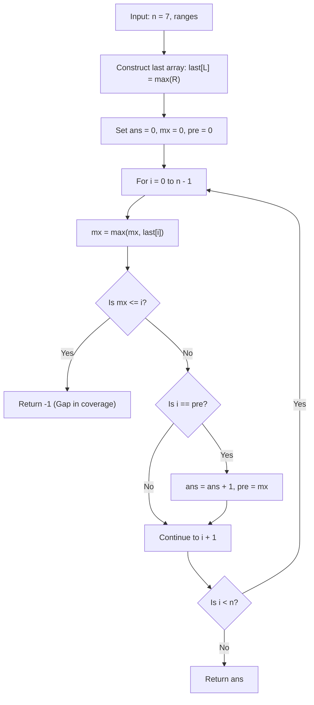

# Guided Example: Minimum Number of Taps to Open to Water a Garden

We trace the greedy interval scheduling algorithm for covering a one-dimensional garden with the minimum number of overlapping taps:

- **Input:** $n = 7$, `ranges = [1, 2, 1, 0, 2, 1, 0, 1]`
- **Required Output:** `3`

This instance demonstrates converting localized tap radii into coverage intervals, building a maximum reach array, managing greedy coverage frontiers, and identifying the minimum tap subset covering the entire continuum $[0, n]$.

---

## 1. Instance & Teaching Goal

We have a garden along the number line from $0$ to $n = 7$. There are $n + 1 = 8$ taps located at integer positions $0, 1, \dots, 7$. If tap $i$ is opened, it waters the closed interval:
$$
[\max(0, i - \text{ranges}[i]), \; \min(n, i + \text{ranges}[i])]
$$
We wish to find the minimum number of taps to open such that every point in $[0, 7]$ is watered, or return $-1$ if complete coverage is impossible.

For $n = 7$ and `ranges = [1, 2, 1, 0, 2, 1, 0, 1]`:
- Tap $1$ at position $1$ with radius $2$ waters $[\max(0, 1-2), 1+2] = [0, 3]$.
- Tap $4$ at position $4$ with radius $2$ waters $[\max(0, 4-2), 4+2] = [2, 6]$.
- Tap $7$ at position $7$ with radius $1$ waters $[\max(0, 7-1), 7+1] = [6, 8]$ (clamped to $[6, 7]$).
- Taps $1, 4$, and $7$ together cover $[0, 3] \cup [2, 6] \cup [6, 7] = [0, 7]$ with valid overlaps at $x \in [2, 3]$ and $x = 6$.

```
Garden Continuum [0, 7]:
0       1       2       3       4       5       6       7
|-------|-------|-------|-------|-------|-------|-------|

Selected Overlapping Tap Covers:
Tap 1 (r=2): [0 ================= 3]
Tap 4 (r=2):         [2 ================= 6]
Tap 7 (r=1):                                 [6 ======== 7]

Total Taps Opened: 3 (Minimum subset covering [0, 7])
```

Testing all $2^{n+1}$ subsets of taps creates exponential complexity. By transforming the problem into a greedy interval jump model (analogous to Jump Game II), we can determine the optimal coverage in linear time $\mathcal{O}(n)$.

---

## 2. Conceptual Foundation & Invariants

Each tap $i$ provides an interval $[L_i, R_i]$ where $L_i = \max(0, i - \text{ranges}[i])$ and $R_i = i + \text{ranges}[i]$.

### Rightmost Horizon Array
We construct an array $last$ of length $n + 1$, where $last[k]$ stores the farthest right endpoint achievable by any tap whose left boundary begins at or before $k$:
$$
last[L_i] = \max(last[L_i], \; R_i)
$$

### Greedy Jump Parameters
We scan the continuum $i$ from $0$ up to $n - 1$, maintaining:
- $mx$: The maximum right endpoint accessible from any tap with left boundary $\le i$.
- $pre$: The boundary reached by the currently committed tap selection.
- $ans$: The number of taps opened.

At each position $i$:
1. Refresh the reachable horizon: $mx \leftarrow \max(mx, last[i])$.
2. If $mx \le i$, no available tap can cover the point immediately beyond $i$; the garden cannot be fully watered, so return $-1$.
3. If $i == pre$, we have reached the limit of our current tap's coverage. We must open another tap to advance our frontier to $mx$:
   $$
   ans \leftarrow ans + 1, \quad pre \leftarrow mx
   $$

| Tap $i$ | Radius | Coverage Interval $[L_i, R_i]$ | Contribution to $last[L_i]$ |
|---|---|---|---|
| $0$ | $1$ | $[0, 1]$ | $last[0] \ge 1$ |
| $1$ | $2$ | $[0, 3]$ | $last[0] \leftarrow \max(1, 3) = 3$ |
| $2$ | $1$ | $[1, 3]$ | $last[1] = 3$ |
| $3$ | $0$ | $[3, 3]$ | $last[3] = 3$ |
| $4$ | $2$ | $[2, 6]$ | $last[2] = 6$ |
| $5$ | $1$ | $[4, 6]$ | $last[4] = 6$ |
| $6$ | $0$ | $[6, 6]$ | $last[6] \ge 6$ |
| $7$ | $1$ | $[6, 8]$ | $last[6] \leftarrow \max(6, 8) = 8$ |

> **Greedy Horizon Invariant.** At any stage where $i == pre$, selecting the tap that achieves the maximum rightward reach $mx$ among all candidates originating on or before $i$ strictly maximizes future coverage without skipping any uncovered subsegment.



---

## 3. Step-by-Step Worked Execution

We trace $n = 7$ and `ranges = [1, 2, 1, 0, 2, 1, 0, 1]`:
Constructed $last$ array:
- $last[0] = 3$ (from Tap 1)
- $last[1] = 3$ (from Tap 2)
- $last[2] = 6$ (from Tap 4)
- $last[3] = 3$ (from Tap 3)
- $last[4] = 6$ (from Tap 5)
- $last[5] = 0$
- $last[6] = 8$ (from Tap 7)

Initial state: $ans = 0, \; mx = 0, \; pre = 0$.

### Position $i = 0$
- Update reach: $mx = \max(0, last[0]) = \max(0, 3) = 3$.
- Gap check: $mx = 3 > 0$ (no gap).
- Boundary hit ($i == pre$, $0 == 0$):
  - Must commit a tap to cover beyond $0$. Open Tap 1.
  - $ans \leftarrow 0 + 1 = 1$.
  - $pre \leftarrow mx = 3$.

### Position $i = 1$
- Update reach: $mx = \max(3, last[1]) = \max(3, 3) = 3$.
- Boundary check: $i = 1 \ne pre = 3$. Continue.

### Position $i = 2$
- Update reach: $mx = \max(3, last[2]) = \max(3, 6) = 6$.
- Boundary check: $i = 2 \ne pre = 3$. Continue.

### Position $i = 3$
- Update reach: $mx = \max(6, last[3]) = \max(6, 3) = 6$.
- Boundary hit ($i == pre$, $3 == 3$):
  - Coverage of the first tap has ended. Open Tap 4 (which reaches to $6$).
  - $ans \leftarrow 1 + 1 = 2$.
  - $pre \leftarrow mx = 6$.

### Position $i = 4$
- Update reach: $mx = \max(6, last[4]) = \max(6, 6) = 6$.
- Boundary check: $i = 4 \ne pre = 6$. Continue.

### Position $i = 5$
- Update reach: $mx = \max(6, last[5]) = \max(6, 0) = 6$.
- Boundary check: $i = 5 \ne pre = 6$. Continue.

### Position $i = 6$
- Update reach: $mx = \max(6, last[6]) = \max(6, 8) = 8$.
- Boundary hit ($i == pre$, $6 == 6$):
  - Coverage of the second tap has ended. Open Tap 7 (which reaches to $8$).
  - $ans \leftarrow 2 + 1 = 3$.
  - $pre \leftarrow mx = 8$.

### Loop Completion ($i = 7 = n$)
- The loop terminates. $pre = 8 \ge 7$, so the entire garden $[0, 7]$ is covered.
- Total taps opened: $3$.

---

## 4. Complete Execution Trace

| Point $i$ | $last[i]$ | Current $mx$ | Condition Checked | Action Taken | Current $ans$ | Frontier $pre$ |
|---|---|---|---|---|---|---|
| $0$ | $3$ | $3$ | $i == pre$ ($0 == 0$) | **Open 1st tap** | $1$ | $3$ |
| $1$ | $3$ | $3$ | $i < pre$ ($1 < 3$) | Advance within window | $1$ | $3$ |
| $2$ | $6$ | $6$ | $i < pre$ ($2 < 3$) | Advance within window | $1$ | $3$ |
| $3$ | $3$ | $6$ | $i == pre$ ($3 == 3$) | **Open 2nd tap** | $2$ | $6$ |
| $4$ | $6$ | $6$ | $i < pre$ ($4 < 6$) | Advance within window | $2$ | $6$ |
| $5$ | $0$ | $6$ | $i < pre$ ($5 < 6$) | Advance within window | $2$ | $6$ |
| $6$ | $8$ | $8$ | $i == pre$ ($6 == 6$) | **Open 3rd tap** | $3$ | $8$ |
| End | - | - | Complete $[0, 7]$ | Final Return | **3** | $8$ |

---

## 5. Algorithmic Correctness

**Soundness.** Every time $i == pre$, the algorithm selects the maximum reach $mx$ from all taps whose left boundaries $\le pre$. By induction, this tap maintains continuity (no unwatered gap between $pre$ and $mx$) and extends the coverage as far rightward as possible.

**Completeness.** If at any position $i$ the maximum achievable reach $mx \le i$, then no tap can cross position $i$, making complete coverage mathematically impossible; returning $-1$ is correct. Otherwise, scanning $i$ through $n - 1$ ensures that every subsegment of $[0, n]$ is covered with the minimum number of tap activations.

---

## 6. Traps This Instance Exposes

- **Discontinuous gaps:** If ranges are all zero (e.g. $ranges = [0, 0, 0, 0]$ for $n = 3$), $mx = 0 \le 0$ at $i = 0$, triggering an immediate and correct return of $-1$.
- **Redundant interior taps:** Taps like Tap 2 (covers $[1, 3]$) and Tap 3 (covers $[3, 3]$) are completely subsumed by Tap 1 ($[0, 3]$). The greedy choice ignores them naturally without extraneous checks.
- **Off-by-one in loop bound:** The loop must run for $i \in [0, n-1]$. Running up to $n$ would check whether coverage extends beyond $n$, potentially triggering an unnecessary tap opening at $i = n$.

---

## 7. Complexity Derivation

- **Time Complexity:** $\mathcal{O}(n)$. Populating the $last$ array takes $\mathcal{O}(n)$ time over the $n + 1$ taps. The greedy scan traverses from $i = 0$ to $n - 1$ in a single pass, performing $\mathcal{O}(1)$ operations per step.
- **Auxiliary Space Complexity:** $\mathcal{O}(n)$ to store the $last$ reachability array of size $n + 1$.