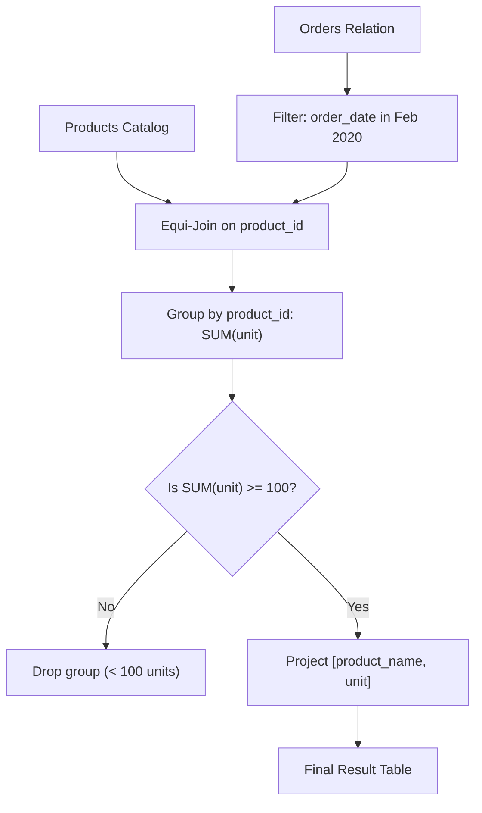

# Guided Example: List the Products Ordered in a Period

We trace the relational temporal filtering, equi-join, group summation, and post-aggregation threshold filtering on a representative e-commerce dataset:

- **Input:** `Products` and `Orders` relations:
  $$\begin{aligned}
  \text{Products} = \{
  &(1, \text{"LeetCode Solutions"}, \text{"Book"}), \; (2, \text{"LeetCode Kit"}, \text{"Book"}), \\
  &(3, \text{"Spinning Gear"}, \text{"T-shirt"}), \; (4, \text{"LeetCode Octopod"}, \text{"Book"}), \\
  &(5, \text{"Leather Pillow"}, \text{"Home"}) \}
  \end{aligned}$$
  $$\begin{aligned}
  \text{Orders} = \{
  &(1, \text{"2020-02-10"}, 60), \; (1, \text{"2020-02-17"}, 70), \\
  &(2, \text{"2020-01-18"}, 30), \; (2, \text{"2020-02-11"}, 80), \\
  &(3, \text{"2020-02-24"}, 2), \; (3, \text{"2020-02-24"}, 3), \\
  &(4, \text{"2020-03-01"}, 20), \; (4, \text{"2020-03-04"}, 30), \; (4, \text{"2020-03-04"}, 60), \\
  &(5, \text{"2020-02-25"}, 50), \; (5, \text{"2020-02-27"}, 50), \; (5, \text{"2020-03-01"}, 50) \}
  \end{aligned}$$
- **Required Output:** Products with at least $100$ units ordered in February 2020:
  $$\begin{aligned}
  \text{Result} = \{
  &(\text{"LeetCode Solutions"}, 130), \\
  &(\text{"Leather Pillow"}, 100) \}
  \end{aligned}$$

This instance demonstrates calendar date range boundary filtering, joining orders against product catalog metadata, evaluating group cardinalities, and applying post-aggregation minimum threshold filters.

---

## 1. Instance & Teaching Goal

We must identify all products that accumulated at least $100$ ordered units during February 2020 (the calendar interval $[2020\text{-}02\text{-}01, \; 2020\text{-}02\text{-}29]$). Orders placed outside this window (such as in January or March) must be excluded before evaluating the sum.

```
Orders Filtered to February 2020:
  Product 1 ("LeetCode Solutions"):
    Feb 10: 60 units
    Feb 17: 70 units  --> Total = 60 + 70 = 130  (>= 100: Qualifies)

  Product 2 ("LeetCode Kit"):
    Jan 18: 30 units (Excluded: January)
    Feb 11: 80 units  --> Total = 80  (< 100: Disqualified)

  Product 3 ("Spinning Gear"):
    Feb 24: 2 units
    Feb 24: 3 units   --> Total = 2 + 3 = 5  (< 100: Disqualified)

  Product 4 ("LeetCode Octopod"):
    March orders only (Excluded)  --> Total = 0  (< 100: Disqualified)

  Product 5 ("Leather Pillow"):
    Feb 25: 50 units
    Feb 27: 50 units
    Mar 01: 50 units (Excluded: March)  --> Total = 50 + 50 = 100  (>= 100: Qualifies)
```

Aggregating all order dates indiscriminately would cause Product 2 to reach $30 + 80 = 110$ units and Product 5 to reach $150$ units, mistakenly mixing cross-month volumes. Applying the temporal predicate strictly before group aggregation guarantees accurate monthly accounting.

---

## 2. Conceptual Foundation & Invariants

Let $P$ denote the `Products` relation and $O$ denote the `Orders` relation.

### Relational Algebra Pipeline
1. **Temporal Selection ($\sigma_{\text{date}}$):** Filter orders occurring strictly within February 2020:
   $$
   O_{\text{Feb}} = \sigma_{\text{"2020-02-01"} \le \text{order\_date} \le \text{"2020-02-29"}}(O)
   $$
2. **Equi-Join ($\bowtie$):** Join filtered orders with products on matching primary key `product_id`:
   $$
   J = O_{\text{Feb}} \bowtie_{O.\text{product\_id} = P.\text{product\_id}} P
   $$
3. **Group Aggregation ($\gamma$):** Group by `product_id` and `product_name`, computing total units:
   $$
   G = \gamma_{\text{product\_id}, \; \text{product\_name}, \; \text{SUM}(\text{unit}) \to \text{total\_units}}(J)
   $$
4. **Threshold Selection ($\sigma_{\text{threshold}}$):** Filter for groups meeting the volume quota:
   $$
   Q = \sigma_{\text{total\_units} \ge 100}(G)
   $$
5. **Projection ($\Pi$):** Emit attributes $[\text{product\_name}, \text{unit}]$.

| Product ID | Product Name | Feb Orders Included | Excluded Non-Feb Orders | February Total Units | Status ($\ge 100$) |
|---|---|---|---|---|---|
| $1$ | LeetCode Solutions | $60 + 70$ | None | $130$ | **Emitted** |
| $2$ | LeetCode Kit | $80$ | Jan 18 ($30$) | $80$ | Filtered out |
| $3$ | Spinning Gear | $2 + 3$ | None | $5$ | Filtered out |
| $4$ | LeetCode Octopod | None | Mar 1 ($20$), Mar 4 ($90$) | $0$ | Filtered out |
| $5$ | Leather Pillow | $50 + 50$ | Mar 1 ($50$) | $100$ | **Emitted** |

> **Temporal Isolation Invariant.** The selection predicate restricts the active relation strictly to orders where the year and month correspond to February 2020. No units from preceding or succeeding billing cycles can pollute group accumulators.



---

## 3. Step-by-Step Worked Execution

We trace the step-by-step evaluation of the relational operators:

### Step 1: Temporal Filtering of Orders
Evaluate each of the $12$ order rows against February 2020:
- $(1, \text{"2020-02-10"}, 60)$: Accepted.
- $(1, \text{"2020-02-17"}, 70)$: Accepted.
- $(2, \text{"2020-01-18"}, 30)$: Discarded (January).
- $(2, \text{"2020-02-11"}, 80)$: Accepted.
- $(3, \text{"2020-02-24"}, 2)$: Accepted.
- $(3, \text{"2020-02-24"}, 3)$: Accepted.
- $(4, \text{"2020-03-01"}, 20)$: Discarded (March).
- $(4, \text{"2020-03-04"}, 30)$: Discarded (March).
- $(4, \text{"2020-03-04"}, 60)$: Discarded (March).
- $(5, \text{"2020-02-25"}, 50)$: Accepted.
- $(5, \text{"2020-02-27"}, 50)$: Accepted.
- $(5, \text{"2020-03-01"}, 50)$: Discarded (March).

Active February orders: $6$ rows.

### Step 2: Equi-Join and Group Aggregation
Join the $6$ valid orders with `Products` on `product_id` and compute subtotals:
- **Group 1 (`product_id = 1`, "LeetCode Solutions"):**
  $$
  \text{units} = 60 + 70 = 130
  $$
- **Group 2 (`product_id = 2`, "LeetCode Kit"):**
  $$
  \text{units} = 80
  $$
- **Group 3 (`product_id = 3`, "Spinning Gear"):**
  $$
  \text{units} = 2 + 3 = 5
  $$
- **Group 5 (`product_id = 5`, "Leather Pillow"):**
  $$
  \text{units} = 50 + 50 = 100
  $$

### Step 3: Threshold Filtering ($\ge 100$)
- Group 1 ($130 \ge 100$): Pass. Emits `("LeetCode Solutions", 130)`.
- Group 2 ($80 < 100$): Fail. Discarded.
- Group 3 ($5 < 100$): Fail. Discarded.
- Group 5 ($100 \ge 100$): Pass. Emits `("Leather Pillow", 100)`.

---

## 4. Complete Execution Trace

| Product ID | Name | Retained February Unit Contributions | Computed February Total | Threshold $\ge 100$ Met? | Emitted Output Tuple |
|---|---|---|---|---|---|
| $1$ | LeetCode Solutions | $60, 70$ | $130$ | Yes ($130 \ge 100$) | `("LeetCode Solutions", 130)` |
| $2$ | LeetCode Kit | $80$ | $80$ | No ($80 < 100$) | - |
| $3$ | Spinning Gear | $2, 3$ | $5$ | No ($5 < 100$) | - |
| $4$ | LeetCode Octopod | None ($0$) | $0$ | No ($0 < 100$) | - |
| $5$ | Leather Pillow | $50, 50$ | $100$ | Yes ($100 \ge 100$) | `("Leather Pillow", 100)` |

---

## 5. Algorithmic Correctness

**Soundness.** Pre-filtering by calendar boundary guarantees that each product's aggregate sum reflects only transactions made in February 2020. The equi-join matches order records to canonical product catalog descriptions, and the post-aggregation condition $\text{SUM}(unit) \ge 100$ precisely filters for volume compliance.

**Completeness.** Every order falling within the date interval is evaluated and attributed to its corresponding product. Products without February orders or with fewer than 100 units are correctly excluded from the final result set.

---

## 6. Traps This Instance Exposes

- **Inclusive boundary off-by-one:** 2020 was a leap year, containing 29 days in February. Using string prefix matching `'2020-02%'` or date range `[2020-02-01, 2020-02-29]` handles leap year days accurately.
- **Filtering post-aggregation vs pre-aggregation:** Filtering dates after summing combines units across months, producing false positives (e.g. Product 2 reaching 110 units). Date filtering must occur on individual order rows before summing.
- **Grouping on product name alone:** If two distinct products shared the same name, grouping strictly by name would conflate their sales. Grouping by the unique `product_id` preserves entity integrity.

---

## 7. Complexity Derivation

- **Time Complexity:** $\mathcal{O}(|O| + |P|)$, where $|O|$ is the number of orders and $|P|$ is the number of products. Scanning and filtering $|O|$ orders takes $\mathcal{O}(|O|)$ time, and a hash join or index lookup against $|P|$ products takes $\mathcal{O}(|O|)$ expected time.
- **Auxiliary Space Complexity:** $\mathcal{O}(|P|)$ to maintain the hash map of product summaries during grouping and aggregation.
