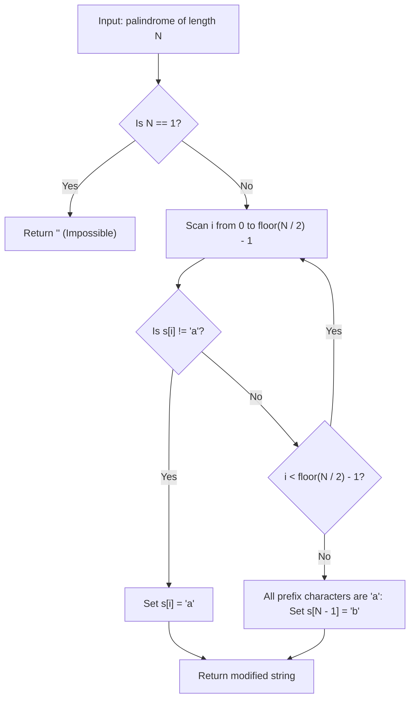

# Guided Example: Break a Palindrome

We trace the greedy lexicographic minimization algorithm for breaking palindromic symmetry on a representative string instance:

- **Input:** `palindrome = "abccba"`
- **Required Output:** `"aaccba"`

This instance demonstrates identifying the earliest non-`'a'` character in the prefix half, replacing it with `'a'` to guarantee both symmetry breaking and lexicographic reduction, and understanding why the center character of odd-length strings must never be altered.

---

## 1. Instance & Teaching Goal

We are given a palindromic string of lowercase English letters. We must replace exactly one character with any lowercase English letter such that:
1. The resulting string is *not* a palindrome.
2. The resulting string is the *lexicographically smallest* possible among all valid modifications.
3. If no modification can produce a non-palindrome (which occurs only for $N = 1$), return the empty string `""`.

For `palindrome = "abccba"` of length $N = 6$:
- Prefix half indices: $i \in [0, 2]$, corresponding to characters `['a', 'b', 'c']`.
- Index $0$ is already `'a'` (the lexicographically smallest character).
- Index $1$ is `'b'`. Changing `'b'` to `'a'` yields `"aaccba"`.
- Because $s[1] = \text{'a'}$ and $s[4] = \text{'b'}$, the string is no longer symmetric.
- Any alternative edit at index $2$ (changing `'c'` to `'a'`) yields `"abacba"`, which is lexicographically larger than `"aaccba"` because `'a' < 'b'` at index $1$.

```
String:         a    b    c    c    b    a
Index:          0    1    2    3    4    5
Prefix Half:   [a    b    c]

First non-'a' in prefix: index 1 ('b')
Greedy Edit: Change 'b' to 'a'

Resulting:      a    a    c    c    b    a
Comparison:    s[1] = 'a'  !=  s[4] = 'b'  --> Palindrome Broken!
Output: "aaccba"
```

A brute-force approach testing all $25N$ possible single-letter substitutions requires checking palindromic symmetry $\mathcal{O}(N)$ times, yielding $\mathcal{O}(N^2)$ time. A greedy forward scan finds the unique optimal edit in $\mathcal{O}(N)$ time.

---

## 2. Conceptual Foundation & Invariants

Let $N = \text{len}(s)$.

### The Lexicographical Hierarchy
To minimize a string lexicographically:
1. Prioritize editing the earliest possible index from the left.
2. Replace that character with the smallest possible letter, namely `'a'`.
3. If a character is already `'a'`, changing it would strictly increase its ASCII value, so we pass it.

### The Half-String Boundary Rule
We restrict our search for a non-`'a'` character strictly to the first half:
$$
i \in [0, \; \lfloor N / 2 \rfloor - 1]
$$
- **Odd Length Center Invariant:** If $N$ is odd, the middle element $s[\lfloor N / 2 \rfloor]$ can never break the palindrome if all other characters remain symmetric. Changing the center character of a palindrome where all non-center characters are `'a'` (e.g. `"aba"`) to any character leaves the outer symmetric pairs identical, preserving palindromic symmetry.
- **Fallback Rule:** If every character in the first half is already `'a'` (e.g. `"aa"` or `"aabaa"`), every valid substitution of an `'a'` with another letter increases the string's value. To make the increase as small as possible, we must modify the lowest-priority position: the very last character $s[N - 1] \leftarrow \text{'b'}$.

| Case Condition | Optimal Action | Symmetry Guarantee | Lexicographic Rationale |
|---|---|---|---|
| $N = 1$ | Return `""` | Impossible to break | Any 1-char string is a palindrome |
| First non-`'a'` at $i < \lfloor N / 2 \rfloor$ | Set $s[i] \leftarrow \text{'a'}$ | $s[i] = \text{'a'} \ne s[N - 1 - i]$ | Earlies possible decrease |
| All prefix characters are `'a'` | Set $s[N - 1] \leftarrow \text{'b'}$ | $s[0] = \text{'a'} \ne s[N - 1] = \text{'b'}$ | Smallest possible increase at last index |

> **Non-Palindrome Soundness Invariant.** Because the original string is a palindrome, $s[i] = s[N - 1 - i]$. Changing $s[i]$ to `'a'` (where $s[i] \ne \text{'a'}$) creates an immediate mismatch with $s[N - 1 - i]$ (which remains $\ne \text{'a'}$), mathematically guaranteeing the result is not a palindrome.



---

## 3. Step-by-Step Worked Execution

We trace `palindrome = "abccba"` with $N = 6$:
- Half-length: $\lfloor 6 / 2 \rfloor = 3$.
- Search range: indices $i \in \{0, 1, 2\}$.

### Inspection $i = 0$
- Character: $s[0] = \text{'a'}$.
- Since it is already `'a'`, changing it to any other character would increase its value ($'a' \to 'b'$).
- Leave unchanged and proceed.

### Inspection $i = 1$
- Character: $s[1] = \text{'b'}$.
- This is the first non-`'a'` character in the first half ($'b' \ne 'a'$).
- Replace $s[1]$ with `'a'`:
  $$
  s[1] \leftarrow \text{'a'}
  $$
- Modified string: `"aaccba"`.

### Symmetry Verification
- Check endpoints:
  - $s[0] = \text{'a'}, \; s[5] = \text{'a'}$ (match)
  - $s[1] = \text{'a'}, \; s[4] = \text{'b'}$ (mismatch!)
- Mismatch confirms `"aaccba"` is not a palindrome.
- Terminate scan and return `"aaccba"`.

---

## 4. Complete Execution Trace

| Candidate Edit | Modified String | Is Palindrome? | Lexicographic Rank vs Original | Valid Candidate? |
|---|---|---|---|---|
| Change $s[0] \to \text{'b'}$ | `"bbccba"` | No | Larger (`"bb..." > "ab..."`) | Suboptimal |
| **Change $s[1] \to \text{'a'}$** | `"aaccba"` | **No** | **Smaller (`"aa..." < "ab..."`)** | **Optimal** |
| Change $s[2] \to \text{'a'}$ | `"abacba"` | No | Smaller (`"aba..." < "abc..."`) | Suboptimal vs `"aaccba"` |
| Change $s[3] \to \text{'a'}$ | `"abcaba"` | No | Smaller | Suboptimal vs `"aaccba"` |
| Change $s[4] \to \text{'a'}$ | `"abccaa"` | No | Smaller | Suboptimal vs `"aaccba"` |

---

## 5. Algorithmic Correctness

**Soundness.** Replacing a non-`'a'` character at index $i < \lfloor N / 2 \rfloor$ with `'a'` creates an asymmetry because its mirror index $N - 1 - i$ retains its original value $s[N - 1 - i] = s[i] \ne \text{'a'}$. Thus, the modified string cannot be a palindrome. Because the edit turns $s[i]$ into `'a'`, it is strictly lexicographically smaller than the original string.

**Completeness.** Any valid modification that makes the string smaller must change some character to a smaller character. Since `'a'` is the smallest character, the earliest character that can be reduced is the first non-`'a'` character. If no such character exists in the first half, reducing any character is impossible, so increasing the last character to `'b'` is the unique minimal-increase fallback.

---

## 6. Traps This Instance Exposes

- **Modifying the center of odd-length strings:** In `"aba"`, modifying the middle character from `'b'` to `'a'` yields `"aaa"`, which remains a palindrome. The search range must stop strictly before index $\lfloor N / 2 \rfloor$.
- **Single-character edge case:** For $N = 1$ (e.g. `"a"`), any single-character replacement produces another 1-character string (e.g. `"b"`), which is still trivially a palindrome. Returning `""` is mandatory.
- **Handling all-`'a'` strings:** For `"aaaa"`, no non-`'a'` character exists in the first half. Changing the last character to `'b'` (`"aaab"`) is the only way to break the palindrome with the minimal lexicographic penalty.

---

## 7. Complexity Derivation

- **Time Complexity:** $\mathcal{O}(N)$, where $N$ is the length of `palindrome`. Scanning the first $\lfloor N / 2 \rfloor$ characters takes at most $N / 2$ iterations, and modifying a single character takes $\mathcal{O}(1)$ time.
- **Auxiliary Space Complexity:** $\mathcal{O}(N)$ to store the character array during modification.
