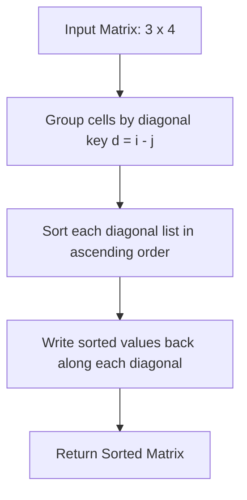

# Guided Example: Sort the Matrix Diagonally

We trace the diagonal invariant grouping, localized sorting, and matrix re-insertion algorithm on a representative rectangular matrix:

- **Input:** `mat = [[3, 3, 1, 1], [2, 2, 1, 2], [1, 1, 1, 2]]`
- **Required Output:** `[[1, 1, 1, 1], [1, 2, 2, 2], [1, 2, 3, 3]]`

This instance demonstrates identifying the diagonal coordinate invariant $d = i - j$, partitioning matrix entries into independent diagonal collections, sorting each collection in ascending order, and writing values back in-place.

---

## 1. Instance & Teaching Goal

A matrix diagonal consists of cells starting at the topmost row or leftmost column and proceeding downward-rightward. That is, from cell $(i, j)$, the diagonal continues to $(i + 1, j + 1), (i + 2, j + 2), \dots$ until reaching the matrix boundary. We must sort each diagonal in ascending order.

For an $m \times n$ matrix with $m = 3$ and $n = 4$:
- Original Matrix:
  $$
  \begin{bmatrix}
  3 & 3 & 1 & 1 \\
  2 & 2 & 1 & 2 \\
  1 & 1 & 1 & 2
  \end{bmatrix}
  $$
- The main diagonal starting at $(0, 0)$ contains:
  $$
  (0, 0) = 3, \quad (1, 1) = 2, \quad (2, 2) = 1
  $$
  Sorting this diagonal produces $[1, 2, 3]$.
- The super-diagonal starting at $(0, 1)$ contains:
  $$
  (0, 1) = 3, \quad (1, 2) = 1, \quad (2, 3) = 2
  $$
  Sorting this diagonal produces $[1, 2, 3]$.

```
Matrix Coordinate Mapping (i, j):
        c=0     c=1     c=2     c=3
r=0   (0,0)=3 (0,1)=3 (0,2)=1 (0,3)=1
r=1   (1,0)=2 (1,1)=2 (1,2)=1 (1,3)=2
r=2   (2,0)=1 (2,1)=1 (2,2)=1 (2,3)=2

Diagonals Identified by Key d = i - j:
  d = -3: [1]                --> [1]
  d = -2: [1, 2]             --> [1, 2]
  d = -1: [3, 1, 2]          --> [1, 2, 3]
  d =  0: [3, 2, 1]          --> [1, 2, 3]
  d = +1: [2, 1]             --> [1, 2]
  d = +2: [1]                --> [1]

Sorted Matrix:
  [ 1, 1, 1, 1 ]
  [ 1, 2, 2, 2 ]
  [ 1, 2, 3, 3 ]
```

Attempting to swap elements across different diagonals is invalid, as entries are constrained to remain on their original diagonal lines. Identifying the invariant index difference $i - j$ decomposes the 2D sorting problem into $m + n - 1$ independent 1D sorting tasks.

---

## 2. Conceptual Foundation & Invariants

Let $(i, j)$ be any cell in the $m \times n$ matrix. Moving one step along a diagonal changes coordinates to $(i + 1, j + 1)$.

### The Diagonal Constant Invariant
The difference between row and column indices is invariant along any diagonal:
$$
(i + 1) - (j + 1) = i - j = d
$$
Each distinct value of $d \in [-(n - 1), \; m - 1]$ uniquely identifies a diagonal line.

To avoid negative array indices in implementation, an offset $m$ maps $d$ to a non-negative bucket:
$$
\text{bucket\_id}(i, j) = m - i + j \in [1, \; m + n - 1]
$$

### Algorithm Pipeline
1. **Bucketing:** Iterate through all $(i, j)$, appending $\text{mat}[i][j]$ into bucket $B[m - i + j]$.
2. **Sorting:** Sort each non-empty bucket $B[k]$ in non-decreasing order.
3. **Re-insertion:** Traverse $(i, j)$ in row-major order, popping the next smallest element from $B[m - i + j]$ into $\text{mat}[i][j]$.

| Diagonal Key $d = i - j$ | Offset Key $m - i + j$ | Cells on Diagonal | Raw Values | Sorted Values |
|---|---|---|---|---|
| $-3$ | $3 - 0 + 3 = 6$ | $\{(0, 3)\}$ | `[1]` | `[1]` |
| $-2$ | $3 - 0 + 2 = 5$ | $\{(0, 2), (1, 3)\}$ | `[1, 2]` | `[1, 2]` |
| $-1$ | $3 - 0 + 1 = 4$ | $\{(0, 1), (1, 2), (2, 3)\}$ | `[3, 1, 2]` | `[1, 2, 3]` |
| $0$ | $3 - 0 + 0 = 3$ | $\{(0, 0), (1, 1), (2, 2)\}$ | `[3, 2, 1]` | `[1, 2, 3]` |
| $1$ | $3 - 1 + 0 = 2$ | $\{(1, 0), (2, 1)\}$ | `[2, 1]` | `[1, 2]` |
| $2$ | $3 - 2 + 0 = 1$ | $\{(2, 0)\}$ | `[1]` | `[1]` |

> **Orthogonal Partition Invariant.** The sets of cells $\{C_d\}$ corresponding to distinct difference keys $d = i - j$ form a disjoint partition of the matrix: $\bigcup C_d = \{0..m-1\} \times \{0..n-1\}$ with $C_a \cap C_b = \emptyset$ for $a \ne b$. Sorting within each bucket preserves independence across all other diagonals.



---

## 3. Step-by-Step Worked Execution

We trace the re-insertion into `mat` for our $3 \times 4$ instance:

### Step 1: Diagonal Collection & Sorting
- $d = 0$ (cells $(0,0), (1,1), (2,2)$): Values $[3, 2, 1] \implies$ Sorted: $[1, 2, 3]$.
- $d = -1$ (cells $(0,1), (1,2), (2,3)$): Values $[3, 1, 2] \implies$ Sorted: $[1, 2, 3]$.
- $d = 1$ (cells $(1,0), (2,1)$): Values $[2, 1] \implies$ Sorted: $[1, 2]$.
- $d = -2$ (cells $(0,2), (1,3)$): Values $[1, 2] \implies$ Sorted: $[1, 2]$.
- $d = -3$ (cell $(0,3)$): Value $[1] \implies$ Sorted: $[1]$.
- $d = 2$ (cell $(2,0)$): Value $[1] \implies$ Sorted: $[1]$.

### Step 2: Re-writing Cells Row by Row
- **Row 0:**
  - $(0, 0)$ ($d = 0$): First sorted element of $d=0 \implies 1$.
  - $(0, 1)$ ($d = -1$): First sorted element of $d=-1 \implies 1$.
  - $(0, 2)$ ($d = -2$): First sorted element of $d=-2 \implies 1$.
  - $(0, 3)$ ($d = -3$): First sorted element of $d=-3 \implies 1$.
  - Row 0 becomes: `[1, 1, 1, 1]`.
- **Row 1:**
  - $(1, 0)$ ($d = 1$): First sorted element of $d=1 \implies 1$.
  - $(1, 1)$ ($d = 0$): Second sorted element of $d=0 \implies 2$.
  - $(1, 2)$ ($d = -1$): Second sorted element of $d=-1 \implies 2$.
  - $(1, 3)$ ($d = -2$): Second sorted element of $d=-2 \implies 2$.
  - Row 1 becomes: `[1, 2, 2, 2]`.
- **Row 2:**
  - $(2, 0)$ ($d = 2$): First sorted element of $d=2 \implies 1$.
  - $(2, 1)$ ($d = 1$): Second sorted element of $d=1 \implies 2$.
  - $(2, 2)$ ($d = 0$): Third sorted element of $d=0 \implies 3$.
  - $(2, 3)$ ($d = -1$): Third sorted element of $d=-1 \implies 3$.
  - Row 2 becomes: `[1, 2, 3, 3]`.

---

## 4. Complete Execution Trace

| Cell $(i, j)$ | Original Value | Diagonal Key $d = i - j$ | Sorted Diagonal Sequence | Assigned Value | Updated Matrix Row |
|---|---|---|---|---|---|
| $(0, 0)$ | $3$ | $0$ | $[1, 2, 3]$ | $1$ | `[1, ...]`, Row 0 |
| $(0, 1)$ | $3$ | $-1$ | $[1, 2, 3]$ | $1$ | `[1, 1, ...]`, Row 0 |
| $(0, 2)$ | $1$ | $-2$ | $[1, 2]$ | $1$ | `[1, 1, 1, ...]`, Row 0 |
| $(0, 3)$ | $1$ | $-3$ | $[1]$ | $1$ | `[1, 1, 1, 1]`, Row 0 complete |
| $(1, 0)$ | $2$ | $1$ | $[1, 2]$ | $1$ | `[1, ...]`, Row 1 |
| $(1, 1)$ | $2$ | $0$ | $[1, 2, 3]$ | $2$ | `[1, 2, ...]`, Row 1 |
| $(1, 2)$ | $1$ | $-1$ | $[1, 2, 3]$ | $2$ | `[1, 2, 2, ...]`, Row 1 |
| $(1, 3)$ | $2$ | $-2$ | $[1, 2]$ | $2$ | `[1, 2, 2, 2]`, Row 1 complete |
| $(2, 0)$ | $1$ | $2$ | $[1]$ | $1$ | `[1, ...]`, Row 2 |
| $(2, 1)$ | $1$ | $1$ | $[1, 2]$ | $2$ | `[1, 2, ...]`, Row 2 |
| $(2, 2)$ | $1$ | $0$ | $[1, 2, 3]$ | $3$ | `[1, 2, 3, ...]`, Row 2 |
| $(2, 3)$ | $2$ | $-1$ | $[1, 2, 3]$ | $3$ | `[1, 2, 3, 3]`, Row 2 complete |

---

## 5. Algorithmic Correctness

**Soundness.** For any cell $(i, j)$, its diagonal successors $(i + k, j + k)$ share the invariant $i - j$. Because sorting occurs strictly within elements sharing identical $i - j$, no values are ever shifted off their legal diagonal paths. Re-writing elements in topological coordinate order ($i$ increasing) guarantees each diagonal is strictly non-decreasing.

**Completeness.** Every cell $(i, j) \in [0, m-1] \times [0, n-1]$ is mapped to its unique diagonal key, collected, sorted, and restored. The total count of entries extracted and written matches $m \cdot n$ exactly.

---

## 6. Traps This Instance Exposes

- **Anti-diagonal confusion:** The anti-diagonal invariant is $i + j = \text{constant}$. Using $i + j$ instead of $i - j$ sorts top-right to bottom-left diagonals, which contradicts the problem specification.
- **Negative index out-of-bounds:** The difference $i - j$ ranges from $-(n - 1)$ to $m - 1$. Offsetting with $+ m$ or using hash map keys avoids negative index exceptions in array-based bucketing.
- **Queue/Stack orientation:** When writing sorted values back, if popping from the end of a list, the bucket must either be sorted in descending order (so `pop()` yields ascending values) or read via an advancing pointer from index $0$.

---

## 7. Complexity Derivation

- **Time Complexity:** $\mathcal{O}(m \cdot n \log(\min(m, n)))$. There are $m \cdot n$ total elements partitioned across $m + n - 1$ diagonals. The maximum length of any diagonal is $\min(m, n)$. Sorting each diagonal of length $L_k$ takes $\mathcal{O}(L_k \log L_k)$, summing to $\mathcal{O}(m \cdot n \log(\min(m, n)))$ overall.
- **Auxiliary Space Complexity:** $\mathcal{O}(m \cdot n)$ to store the bucketed diagonal collections during sorting.
