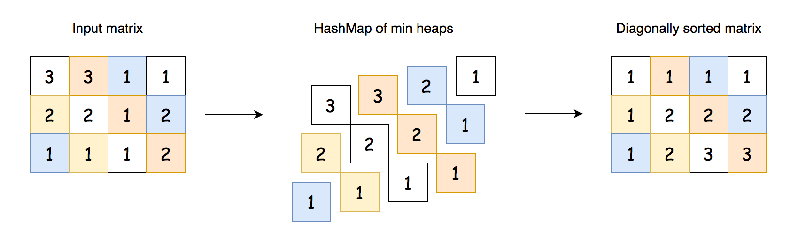
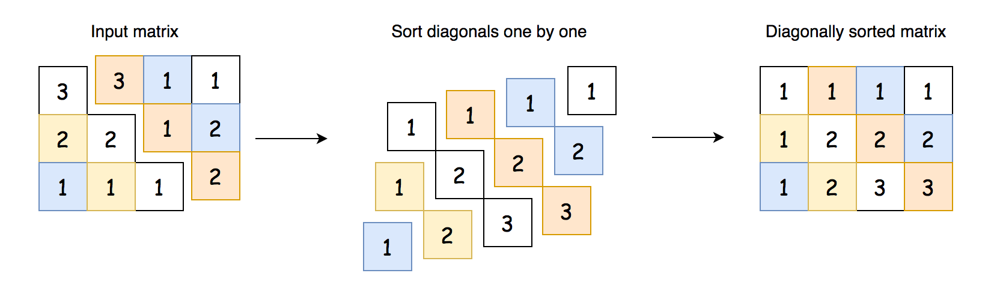

[TOC]

## Video Solution

<div>
  <div class="video-container">
    <iframe src="https://player.vimeo.com/video/503255206?texttrack=en" width="640" height="360" frameborder="0" allow="autoplay; fullscreen" allowfullscreen></iframe>
  </div>
</div>

</br>

## Solution Article

---

### Approach 1: Hash Table of Heaps

The most straightforward idea is to create a **hash table of heaps** to store the diagonals. This way, the diagonals are automatically sorted, and one has nothing to do but push these sorted diagonals back into the matrix.


*Fig 1. Approach 1: HashMap of Heaps.*

**Implementation**

```python
class Solution:
    def diagonalSort(self, mat: List[List[int]]) -> List[List[int]]:
        # Store the matrix dimensions
        m = len(mat)
        n = len(mat[0])

        # Hash Map to store the diagonals. We will use a list
        # for now, but then heapify each list before taking them out.
        diagonals = defaultdict(list)

        # Insert values into the Hash Map.
        for row in range(m):
            for col in range(n):
                # Observing that on each diagonal, the differences between the row and column indices
                # of each element is the same.
                # Hence we can use row - col as the key to collect elements on the same diagonal.
                diagonals[row - col].append(mat[row][col])

        # Heapify each list in the Hash Map.
        for diagonal in diagonals.values():
            heapq.heapify(diagonal)

        # Take values back out of the Hash Map.
        for row in range(m):
            for col in range(n):
                value = heapq.heappop(diagonals[row - col])
                mat[row][col] = value

        return mat
```

**Complexity Analysis**

Let $M$ be the number of rows, and $N$ be the number of columns.

* Time complexity: $\mathcal{O}\Big(N \times M \times \log \big(\min(N, M)\big)\Big)$.

    We perform $N \times M$ operations in two nested loops. At each iteration, we push an element into a heap that contains the current diagonal. The longest diagonal contains $\min(N, M)$ element, and so pushing an element to a heap has a cost of $\mathcal{O}\Big(\log\big(\min(N, M)\big)\Big)$. Multiplying these together, we get a time complexity of $\mathcal{O}\Big(N \times M \times \log \big(\min(N, M)\big)\Big)$

* Space complexity: $\mathcal{O}(M \times N)$.

    The `diagonals` Hash Map has to store each element in the input matrix.

<br />

---

### Approach 2: Sort Diagonals One by One Using Heap

To optimize the space, we could sort diagonals one by one. That would decrease the space complexity from $\mathcal{O}(N \times M)$ down to $\mathcal{O}(\min(N, M))$.


*Fig 2. Approach 2: Sort Diagonals One by One Using Heap.*

**Implementation**

```python
class Solution:
    def diagonalSort(self, mat: List[List[int]]) -> List[List[int]]:

        # Store the matrix dimensions.
        m = len(mat)
        n = len(mat[0])

        # Helper function to sort a single diagonal at row, col
        def sortDiagonal(row, col):
            # Like before, we'll put all of the values into a list
            # before we heapify it.
            diagonal = []
            diagonal_length = min(m - row, n - col)

            # Put values in this diagonal into the list.
            for i in range(diagonal_length):
                diagonal.append(mat[row + i][col + i])

            # Heapify this diagonal.
            heapq.heapify(diagonal)

            # Put values in this diagonal back into matrix.
            for i in range(diagonal_length):
                mat[row + i][col + i] = heapq.heappop(diagonal)

        # Sort each diagonal that starts on a row.
        for row in range(m):
            sortDiagonal(row, 0)

        # Sort each diagonal that starts on a col.
        # Note that we've already sorted the one starting
        # at col = 0; this is the same as the one starting
        # at row = 0.
        for col in range(1, n):
            sortDiagonal(0, col)

        return mat
```

**Complexity Analysis**

Let $M$ be the number of rows, and $N$ be the number of columns.

* Time complexity: $\mathcal{O}\Big(N \times M \times \log \big(\min(N, M)\big)\Big)$.

    We perform $N \times M$ operations in two nested loops. At each iteration, we push an element into a heap that contains the current diagonal. The longest diagonal contains $\min(N, M)$ element, and so pushing an element to a heap has a cost of $\mathcal{O}\Big(\log\big(\min(N, M)\big)\Big)$. Multiplying these together, we get a time complexity of $\mathcal{O}\Big(N \times M \times \log \big(\min(N, M)\big)\Big)$

* Space complexity: $\mathcal{O}(\min(N, M))$.

    The space is used by the heap with diagonal elements, and the longest diagonal contains $\min(N, M)$ elements.

<br />

---

### Approach 3: Sort Diagonals One by One Using Counting Sort

**Intuition**

Instead of using a heap, we could put each diagonal into a list and then sort it using built-in sorting functions. This would achieve the same time and space complexity as the previous approach.

But can we do better on the time complexity? Yes, we can! Instead of using heaps or built-in sort, we could implement a [counting sort](https://en.wikipedia.org/wiki/Counting_sort). Recall that counting sort runs in $\mathcal{O}(A + B)$ time, where $A$ is the number of items to be sorted, and $B$ is the difference between the smallest and largest element.


*Fig 3. Approach 3: Sort Diagonals One by One Using Sort.*

> **Interview Tip**: A somewhat popular follow-up question for "sorting" problems goes something like this. Assume that the maximum value in the data to be sorted is `x`, where `x` is small compared to the *number* of elements to be sorted. Assuming that the number of values to be sorted is $n$, can you come up with a solution that runs in $O(x \cdot n)$ time, as opposed to $O(n \log n)$ time?
>
> The solution to this is to use counting sort. It is important to practice implementing counting sort so that you can confidently tackle this common follow-up question.

```python
class Solution:
    def diagonalSort(self, mat: List[List[int]]) -> List[List[int]]:
        m = len(mat)
        n = len(mat[0])

        # Helper function to sort a single diagonal at row, col
        def sortDiagonal(row, col):
            diagonal = []
            diagonal_length = min(m - row, n - col)

            # Put values in this diagonal into the list.
            for i in range(diagonal_length):
                diagonal.append(mat[row + i][col + i])

            # Sort the diagonal using our counting sort function.
            diagonal = countingSort(diagonal)

            # Put values in this diagonal back into matrix.
            for i in range(diagonal_length):
                mat[row + i][col + i] = heapq.heappop(diagonal)

        # Helper function to peform a counting sort on a single
        # list of nums.
        def countingSort(nums):
            # The problem constraints allow us to assume that
            # 1 <= mat[i][j] <= 100.
            # You should, however, confirm with the interviewer
            # that it is OK to hardcode values like this.
            minimum = 1 # You could also use: min(nums)
            maximum = 100 # You could also use: max(nums)

            # We can use a counter to do the counting for us.
            counts = Counter(nums)

            # And now we need to flatten the list of counts into
            # a sorted list.
            sorted_nums = []
            for i in range(minimum, maximum + 1):
                sorted_nums.extend([i] * counts[i])
            return sorted_nums

        # Same as previous approach, we're iterating through
        # each diagonal.
        for row in range(m):
            sortDiagonal(row, 0)

        for col in range(1, n):
            sortDiagonal(0, col)

        return mat
```

**Complexity Analysis**

Let $M$ be the number of rows, $N$ the number of columns, and $V$ the range of values in the matrix.

The time complexity is dependent on whether we're treating $V$ as a variable or a constant. In the code above, we treated it as a constant; we simply set the minimum and maximum for the range to $min = 0$ and $max = 100$, which would give a fixed-size range of $V = 100$. Alternatively, if we'd done $min = min value in diagonal$ and $max = max value in diagonal$, then this would make it a variable.

* Time complexity (Treating $V$ as a variable): $\mathcal{O}\big((V \times M) + (V \times N) + (M \times N)\big)$.

    The best way of analyzing the time complexity for this approach is to summarise all of the steps as follows.

- Each of the $M \times N$ elements is getting taken out of the matrix *once*.
- Each of the $M \times N$ elements is getting returned to the matrix *once*.
- Each of the $M \times N$ elements is getting inserted into an array (direct access) *once*.
- Each of the $M \times N$ elements is getting removed from an array *once*.
    The total cost for these $4$ operations is $\mathcal{O}(4 \times M \times N) = \mathcal{O}(M \times N)$.

    We're not quite done though, we also need to consider the cost of creating and traversing the `counts` arrays.

- There are a total of $M + N - 1$ diagonals, and for each diagonal, an array of length $V$ is created.
- Each of the $M + N - 1$ arrays of length $V$ are traversed once.
    The total cost for these $2$ operations is $\mathcal{O}(2 \times V \times (M + N - 1))$. Dropping the constants, we
    get $\mathcal{O}\big(V \times (M + N)\big)$ and expanding the brackets gives $\mathcal{O}\big((V \times M) + (V \times N)\big)$.

    Combining the two parts, we get a final result of $\mathcal{O}\big((V \times M) + (V \times N) + (M \times N)\big)$.

* Time complexity (Treating $V$ as a constant): $\mathcal{O}(N \times M)$.

    Each of the $M \times N$ values in the matrix is being put into a bucket of a fixed-size array. Putting a value has a cost of $O(1)$, as does iterating over the buckets. Therefore, we're only left with the cost of iterating the matrix.

* Space complexity: $\mathcal{O}\big(\min(N, M)\big)$.

    We use additional space for the current diagonal we're processing. The maximum possible diagonal size is $\min(N, M)$.

</br>

> **Further Thoughts: A slippery slope for arbitrary constants**
>
> The "constant range" way of implementing and analyzing counting sort is popular, but not without its issues. If, for example, the range was the size of a 32-bit integer, then the constant would be over 4 billion - and would no doubt lead to a `TLE` if you tried to run it here on LeetCode! Also, it leads to another compelling question: Why is it OK to treat the range as a constant, but not the array length? We could easily write some code that hardcodes the maximum array size, and then simply skip all out-of-bounds indexes. This, technically, would allow us to iterate an array, up to a size big enough to solve the problem, in $O(1)$ time. And why stop there? By hardcoding high enough values, we could, in theory, solve every problem on LeetCode in $O(1)$ time. This all seems pretty silly, so the moral of the story is: we need to be very careful about hardcoding *any* problem constraints.
>
> In an interview, you should be careful to explain and justify whether or not you're treating the number range as a constant.